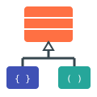
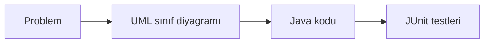

<p align="center">
    <h1 align="center">Nesneye Yönelik Programlama</h1>
    <p align="center">Java ile nesneye yönelik programlama dersinin materyalleri.</p>
</p>

<p align="center">
  
</p>

## Hızlı Bağlantılar

| Kaynak | Bağlantı |
|---|---|
| Ders materyalleri | [GitHub Pages sitesi](https://aligunesgit.github.io/NesneyeYonelikProgramlama/) |
| Ders platformu (ödevler, teslim tarihleri) | Atlas-OIS |
| İletişim ve duyurular | Atlas-OIS |
| SSS | [SSS sayfası](https://aligunesgit.github.io/NesneyeYonelikProgramlama/pages/faq/) |

## ℹ️ Ders bilgileri { #ders-bilgileri }

* Dersin sorumlusu
    * Dr. Öğr. Üyesi <a href="https://www.atlas.edu.tr/akademik-kadro/ali-gunes" target="_blank" rel="noopener noreferrer">Ali Güneş</a>, ali.gunes@atlas.edu.tr
* Ders kodu ve AKTS: _ders bilgi paketine göre güncellenecek_
* Süre: 14 hafta (12 içerik haftası + 2 proje sprinti)
* Değerlendirme: ara sınav, final ve proje
* Ön koşul: Java temelleri (değişkenler, kontrol yapıları, döngüler, metotlar, diziler)

## ❔ Öğrenme hedefleri

**Dersin genel amacı**

Bu ders, Java temellerini bilen öğrencilere yazılımı **birbiriyle iş birliği yapan nesneler** olarak
tasarlamayı öğretir. Amaç yalnızca `class`, `extends`, `interface` gibi anahtar kelimeleri öğrenmek
değil; değişen gereksinimlere dayanıklı, okunabilir ve test edilebilir kod yazma alışkanlığı kazanmaktır.

Ders sonunda öğrenci:

* Sınıf ve nesne kavramlarını açıklar, durumu ve davranışı olan sınıflar yazar
* Kapsülleme ile nesnelerin iç durumunu korur, değişmez nesneler tasarlar
* Nesneler arası ilişkileri UML sınıf diyagramıyla modeller ve koda dönüştürür
* Kalıtım, çok biçimlilik, soyut sınıflar ve arayüzleri doğru yerde kullanır
* Hata durumlarını istisnalarla yönetir
* Koleksiyonları, generics'i, lambda ifadelerini ve Stream API'yi kullanır
* SOLID ilkelerine ve temel tasarım kalıplarına göre tasarım kararları verir
* Yazdığı sınıfları JUnit 5 ile test eder

## 🔥 Nereden başlamalı?

Materyali ham markdown olarak okumak yerine **[GitHub Pages sitesi](https://aligunesgit.github.io/NesneyeYonelikProgramlama/)** üzerinden takip etmenizi
öneririz. Aynı içerik orada gezinme, arama ve diyagramlarla birlikte gösterilir.

İlk olarak [Giriş sayfasını](https://aligunesgit.github.io/NesneyeYonelikProgramlama/pages/before/) okuyun ve kurulumları yapın. Ardından
[Zaman Planı](https://aligunesgit.github.io/NesneyeYonelikProgramlama/pages/timeplan/) sayfasını hafta hafta takip edin.

## 📂 Dersin düzeni

Her modülde aynı alan iki biçimde ele alınır:



| Hafta | Modül | Konu |
|------|--------|-------|
| 1  | [M1](m1_oop_giris/README.md) | Nesneye Yönelik Programlamaya Giriş |
| 2  | [M2](m2_siniflar_nesneler/README.md) | Sınıflar ve Nesneler |
| 3  | [M3](m3_kapsulleme/README.md) | Kapsülleme |
| 4  | [M4](m4_iliskiler_uml/README.md) | Nesneler Arası İlişkiler ve UML |
| 5  | [M5](m5_kalitim/README.md) | Kalıtım |
| 6  | [M6](m6_cok_bicimlilik/README.md) | Çok Biçimlilik |
| 7  | [M7](m7_soyut_arayuz/README.md) | Soyut Sınıflar ve Arayüzler |
| 8  | [Sprint A](sprint_a_proje/README.md) | Proje Sprinti A (ara sınav haftası) |
| 9 | [M8](m8_istisnalar/README.md) | İstisna Yönetimi |
| 10 | [M9](m9_koleksiyonlar_generics/README.md) | Koleksiyonlar ve Generics |
| 11 | [M10](m10_lambda_stream/README.md) | Lambda İfadeleri ve Stream API |
| 12 | [M11](m11_tasarim_ilkeleri/README.md) | Tasarım İlkeleri |
| 13 | [M12](m12_tasarim_kaliplari/README.md) | Tasarım Kalıpları |
| 14 | [Sprint B](sprint_b_final_proje/README.md) | Proje Sprinti B (final) |

## 💻 Kurulum

```bash
git clone https://github.com/aligunesgit/NesneyeYonelikProgramlama.git
cd NesneyeYonelikProgramlama
mvn test
```

Araçların tam listesi için [Giriş sayfasındaki kurulum bölümüne](pages/before.md) bakın.

## Ders kitapları

_Eklenecek._

## 📓 Kaynaklar

* [Dev.java: Learn Java](https://dev.java/learn/). Oracle'ın resmî Java öğrenme kaynakları.
* [The Java Tutorials: Object-Oriented Programming Concepts](https://docs.oracle.com/javase/tutorial/java/concepts/).
* [JUnit 5 User Guide](https://junit.org/junit5/docs/current/user-guide/).
* [Mermaid: Class diagrams](https://mermaid.js.org/syntax/classDiagram.html). UML sınıf diyagramlarını metinden çizmek için.
