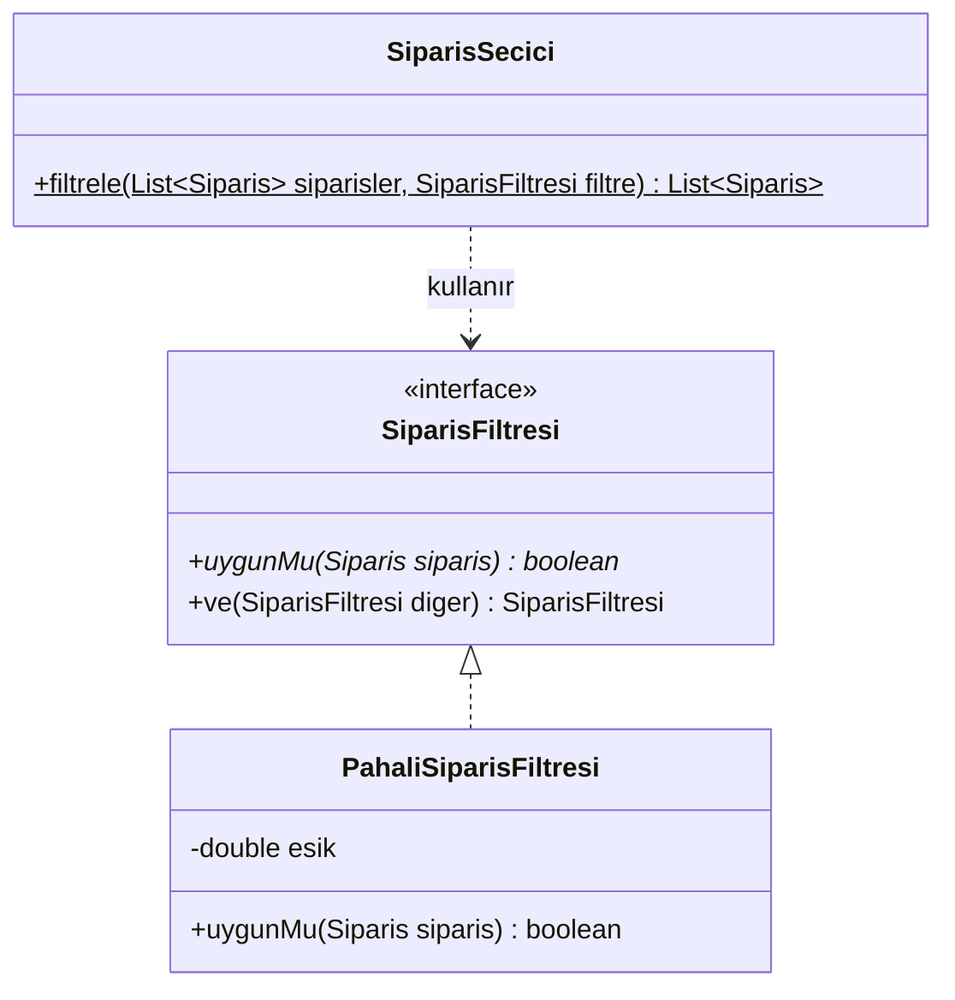
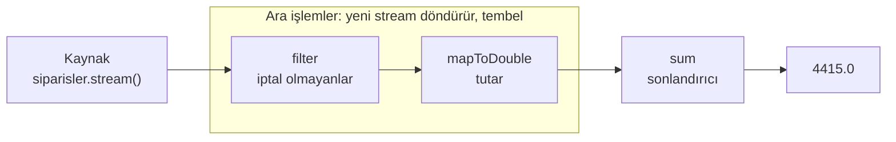
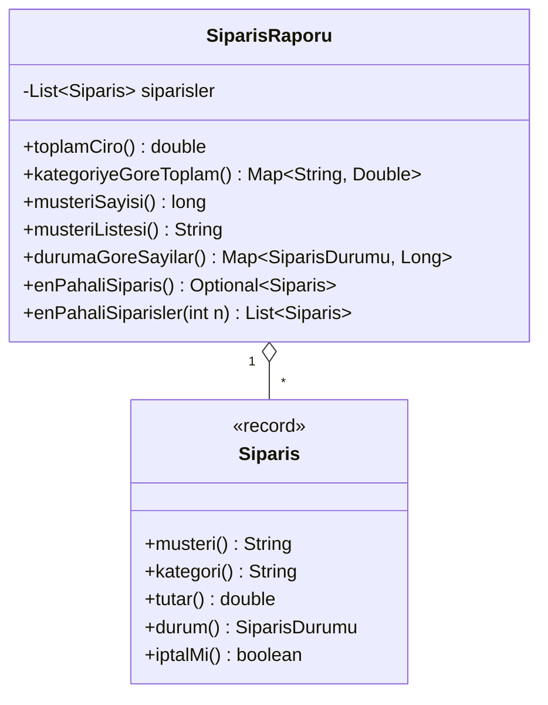

# λ M10 - Lambda İfadeleri ve Stream API

<p align="center"><em>Hafta 11</em></p>

## ❔ Öğrenme hedefleri

Bu modülün sonunda öğrenci:

* Davranışı bir metoda parametre olarak geçirir; ayrı sınıf, anonim sınıf ve lambda yazımlarını karşılaştırır
* Fonksiyonel arayüzü tanımlar, kendi fonksiyonel arayüzünü yazar ve `java.util.function` arayüzlerini kullanır
* Lambda ifadesi ve metot referansı yazar, etkin final değişken kuralını açıklar
* Koleksiyon işlemlerini Stream API ile (filter, map, sorted, collect) ifade eder
* Boş olabilecek sonuçları `Optional` ile güvenli biçimde ele alır

---

## 1. Davranışı parametre olarak geçmek { #1-davranis-parametre }

Bir e-ticaret sitesinin siparişlerini raporlayacağız. Her sipariş bir `record` (M7) olarak tutuluyor:

```java
public enum SiparisDurumu { BEKLIYOR, KARGODA, TESLIM_EDILDI, IPTAL }

public record Siparis(String musteri, String kategori, double tutar, SiparisDurumu durum) {
    public boolean iptalMi() { return durum == SiparisDurumu.IPTAL; }
}
```

Yönetim önce "1000 TL üzeri siparişleri", sonra "kitap siparişlerini", sonra "iptal edilenleri" istiyor.
Her istek için yeni bir metot yazarsak (`pahalilariSec`, `kitaplariSec`, `iptalleriSec`...) aynı
döngüyü tekrar tekrar kopyalarız. Değişen tek şey `if` içindeki **koşuldur**. Çözüm: koşulu bir
nesneye koyup metoda parametre olarak vermek. Böylece metot yalnızca döngüyü bilir, koşulu çağıran
kod belirler.



```java
public static List<Siparis> filtrele(List<Siparis> siparisler, SiparisFiltresi filtre) {
    List<Siparis> sonuc = new ArrayList<>();
    for (Siparis siparis : siparisler) {
        if (filtre.uygunMu(siparis)) {   // koşulu filtre nesnesi söylüyor
            sonuc.add(siparis);
        }
    }
    return sonuc;
}
```

Aynı filtreyi üç farklı yolla verebiliriz. Kod her adımda kısalır ama **anlam aynı kalır**:

=== "1. Ayrı sınıf"

    ```java
    public class PahaliSiparisFiltresi implements SiparisFiltresi {
        private final double esik;
        public PahaliSiparisFiltresi(double esik) { this.esik = esik; }

        @Override
        public boolean uygunMu(Siparis siparis) {
            return siparis.tutar() >= esik;
        }
    }

    SiparisSecici.filtrele(siparisler, new PahaliSiparisFiltresi(1000));
    ```

=== "2. Anonim sınıf"

    ```java
    SiparisSecici.filtrele(siparisler, new SiparisFiltresi() {
        @Override
        public boolean uygunMu(Siparis siparis) {
            return siparis.tutar() >= 1000;
        }
    });
    ```

=== "3. Lambda"

    ```java
    SiparisSecici.filtrele(siparisler, s -> s.tutar() >= 1000);
    ```

Ayrı sınıf, filtre birçok yerde kullanılacaksa ya da kendi durumu ve testleri olacaksa hâlâ en iyi
seçimdir. Tek yerde kullanılan kısa bir koşul için lambda en okunaklı olanıdır.

### 1.1 M9'daki Comparator'ı lambdaya çevirmek

M9'da sıralama için `Comparator`'ı anonim sınıfla yazmıştık. `Comparator` da tek soyut metodu
(`compare`) olan bir arayüz olduğu için aynı dönüşüm burada da geçerlidir:

```java
// M9: anonim sınıf
siparisler.sort(new Comparator<Siparis>() {
    @Override
    public int compare(Siparis a, Siparis b) {
        return Double.compare(a.tutar(), b.tutar());
    }
});

// M10: lambda
siparisler.sort((a, b) -> Double.compare(a.tutar(), b.tutar()));

// M10: hazır yardımcı metot ve metot referansı (§4)
siparisler.sort(Comparator.comparingDouble(Siparis::tutar));
```

## 2. Fonksiyonel arayüzler { #2-fonksiyonel-arayuzler }

**Fonksiyonel arayüz** (functional interface), **tam olarak bir soyut metodu** olan arayüzdür.
`default` ve `static` metotları (M7) bu sayıma girmez. Lambda ifadesi yalnızca fonksiyonel arayüz
türünde bir yere yazılabilir; derleyici lambdayı o tek soyut metodun gövdesi olarak kabul eder.

```java
@FunctionalInterface                                           // (1)!
public interface SiparisFiltresi {

    boolean uygunMu(Siparis siparis);                          // (2)!

    default SiparisFiltresi ve(SiparisFiltresi diger) {        // (3)!
        return siparis -> this.uygunMu(siparis) && diger.uygunMu(siparis);
    }
}
```

1. İsteğe bağlıdır ama önerilir: arayüze yanlışlıkla ikinci bir soyut metot eklenirse derleyici hata
   verir (`SiparisFiltresi is not a functional interface`).
2. Tek soyut metot. Lambdanın parametresi `Siparis`, dönüş türü `boolean` olmak zorundadır.
3. `default` metot soyut sayılmaz. Kendisi de bir lambda döndürür:
   `kitap.ve(iptalDegil)` iki koşulu birleştiren yeni bir filtredir.

Her küçük iş için kendi arayüzümüzü yazmamız gerekmez. `java.util.function` paketinde en sık
ihtiyaç duyulan şekiller hazır bulunur:

| Arayüz | Soyut metot | Anlamı | Örnek |
|---|---|---|---|
| `Predicate<T>` | `boolean test(T t)` | Koşul | `Predicate<Siparis> p = s -> s.tutar() > 1000;` |
| `Function<T, R>` | `R apply(T t)` | Dönüştürme | `Function<Siparis, String> f = s -> s.musteri();` |
| `Consumer<T>` | `void accept(T t)` | Tüketme (yan etki) | `Consumer<Siparis> c = s -> System.out.println(s);` |
| `Supplier<T>` | `T get()` | Üretme | `Supplier<List<String>> s = () -> new ArrayList<>();` |
| `UnaryOperator<T>` | `T apply(T t)` | Aynı türe dönüştürme | `UnaryOperator<Urun> zam = u -> u.zamli(0.10);` |
| `BinaryOperator<T>` | `T apply(T a, T b)` | İki değeri birleştirme | `BinaryOperator<Double> topla = (a, b) -> a + b;` |

Bu arayüzlerin de `default` metotları vardır: `Predicate` için `and`, `or`, `negate`; `Function` için
`andThen` ve `compose`. `SiparisFiltresi` yazmak yerine `Predicate<Siparis>` da kullanabilirdik;
kendi arayüzümüzün tek avantajı, adının alanımızı anlatmasıdır.

```java
@Test
@DisplayName("Predicate: and, negate ile birleştirme")
void predicateBirlestirme() {
    Predicate<Siparis> pahali = s -> s.tutar() > 1000;
    Predicate<Siparis> iptal = Siparis::iptalMi;

    assertTrue(pahali.and(iptal).test(telefon));   // 2500 TL ve iptal
    assertFalse(pahali.test(kitap));               // 120 TL
    assertTrue(pahali.negate().test(kitap));
}
```

## 3. Lambda ifadeleri { #3-lambda }

**Lambda ifadesi** (lambda expression), adı olmayan kısa bir metottur: parametre listesi, `->` oku
ve gövde. Parametre türleri çoğunlukla hedef arayüzden çıkarılır (type inference).

| Biçim | Örnek | Ne zaman? |
|---|---|---|
| Tek parametre, parantezsiz | `s -> s.tutar() > 1000` | En yaygın biçim |
| Parametresiz | `() -> new ArrayList<>()` | `Supplier`, `Runnable` |
| Birden çok parametre | `(a, b) -> a + b` | `BinaryOperator`, `Comparator` |
| Türleri açık yazılmış | `(Siparis s) -> s.musteri()` | Okunabilirlik gerekiyorsa |
| Blok gövde | `s -> { double k = s.tutar() * 0.2; return k > 100; }` | Birden çok deyim; `return` zorunlu |

### 3.1 Etkin final değişkenleri yakalamak

Lambda, tanımlandığı metodun yerel değişkenlerini kullanabilir (capture). Koşul: değişken **final**
ya da **etkin final** (effectively final) olmalıdır; yani ilk atamadan sonra hiç değiştirilmemelidir.

```java
double esik = 500;                                  // bir kez atandı: etkin final
Predicate<Siparis> esikUstu = s -> s.tutar() > esik; // derlenir

int sayac = 0;
siparisler.forEach(s -> sayac++);   // DERLENMEZ: local variables referenced from a
                                    // lambda expression must be final or effectively final
```

Kural rastgele değildir: lambda daha sonra, hatta başka bir iş parçacığında (thread) çalışabilir.
Değişkenin değeri kopyalanarak yakalanır; değişmesine izin verilse lambda eski mi yeni mi değeri
göreceğini bilemezdi.

!!! tip "Sayaç gerekiyorsa"

    Önce stream'in kendi işlemlerine bakın: `count()`, `sum()` genellikle yeterlidir. Gerçekten
    değişen bir değer gerekiyorsa (testlerde çağrı saymak gibi) `AtomicInteger` gibi bir **nesne**
    yakalanır; değişken aynı nesneyi gösterdiği için etkin final kalır, değişen nesnenin içidir.

## 4. Metot referansları { #4-metot-referanslari }

Lambda yalnızca var olan bir metodu çağırıyorsa, onun yerine **metot referansı** (method reference)
yazılabilir: `s -> s.musteri()` yerine `Siparis::musteri`. Dört türü vardır:

| Tür | Söz dizimi | Örnek | Eşdeğer lambda |
|---|---|---|---|
| Static metot | `Sinif::staticMetot` | `Math::abs` | `x -> Math.abs(x)` |
| Belirli olmayan nesnenin örnek metodu | `Sinif::ornekMetot` | `String::length` | `s -> s.length()` |
| Belirli bir nesnenin örnek metodu | `nesne::ornekMetot` | `System.out::println` | `x -> System.out.println(x)` |
| Kurucu | `Sinif::new` | `Urun::new` | `(ad, fiyat) -> new Urun(ad, fiyat)` |

İkinci satırdaki fark önemlidir: `String::length` yazıldığında hangi `String` nesnesi üzerinde
çağrılacağı henüz belli değildir; nesne lambdanın **ilk parametresi** olur. Üçüncü satırda ise nesne
(`System.out`) baştan bellidir. Kurucu referansının türü parametre sayısına göre değişir:
`ArrayList::new` bir `Supplier` olabilir, iki parametreli `Urun::new` ise bir `BiFunction<String,
Double, Urun>` olur.

### 4.1 Comparator zincirleri

`Comparator` arayüzünün static ve `default` metotları, metot referanslarıyla birlikte sıralamayı
cümle gibi okunur hâle getirir:

```java
Comparator<Siparis> tutaraGore = Comparator.comparingDouble(Siparis::tutar);
Comparator<Siparis> pahalidanUcuza = tutaraGore.reversed();

Comparator<Siparis> kategoriSonraTutar = Comparator
        .comparing(Siparis::kategori)                                  // (1)!
        .thenComparing(Comparator.comparingDouble(Siparis::tutar).reversed()); // (2)!
```

1. Önce kategori adına göre alfabetik (A-Z).
2. Kategori aynıysa tutara göre **azalan**. `reversed()` burada yalnızca iç karşılaştırıcıya uygulanıyor.

!!! warning "`reversed()` zincirin tamamını çevirir"

    `Comparator.comparing(Siparis::kategori).thenComparing(Siparis::tutar).reversed()` yazarsanız
    **her iki** ölçüt de ters döner: kategoriler Z-A sıralanır. Yalnızca ikinci ölçütü çevirmek için
    `reversed()`'ı yukarıdaki gibi iç karşılaştırıcıya yazın.

## 5. Stream API { #5-stream }

Şimdiye kadar raporları `for` döngüleriyle yazdık. **Stream API**, aynı işi "nasıl yapılacağını"
değil "ne istendiğini" söyleyerek ifade etmemizi sağlar. Bir stream bir veri kaynağından gelen
elemanların **boru hattıdır** (pipeline): kaynak, sıfır ya da daha çok ara işlem ve tek bir
sonlandırıcı işlem.



| Aşama | İşlem | Ne yapar? |
|---|---|---|
| Kaynak | `liste.stream()` | Koleksiyondan stream oluşturur; koleksiyonu değiştirmez |
| Ara | `filter(Predicate)` | Koşula uyanları geçirir |
| Ara | `map(Function)` | Her elemanı dönüştürür (`Siparis` → `String`) |
| Ara | `mapToDouble(...)` | `DoubleStream`'e dönüştürür; `sum`, `average` sunar |
| Ara | `sorted()` / `sorted(Comparator)` | Sıralar |
| Ara | `distinct()` | Tekrarları atar (`equals` ile) |
| Ara | `limit(n)` | İlk `n` elemanla sınırlar |
| Sonlandırıcı | `count()`, `sum()` | Sayı üretir |
| Sonlandırıcı | `collect(...)`, `toList()` | Koleksiyon ya da `Map` üretir |
| Sonlandırıcı | `findFirst()`, `max(...)` | `Optional` üretir (§6) |

`SiparisRaporu` sınıfı tüm raporları stream ile yazar:



```java
public double toplamCiro() {
    return siparisler.stream()
            .filter(s -> !s.iptalMi())
            .mapToDouble(Siparis::tutar)                        // (1)!
            .sum();
}

public Map<String, Double> kategoriyeGoreToplam() {
    return siparisler.stream()
            .filter(s -> !s.iptalMi())
            .collect(Collectors.groupingBy(Siparis::kategori,   // (2)!
                    Collectors.summingDouble(Siparis::tutar)));
}

public long musteriSayisi() {
    return siparisler.stream().map(Siparis::musteri).distinct().count();
}

public String musteriListesi() {
    return siparisler.stream()
            .map(Siparis::musteri).distinct().sorted()
            .collect(Collectors.joining(", "));                 // (3)!
}

public Map<SiparisDurumu, Long> durumaGoreSayilar() {
    return siparisler.stream()
            .collect(Collectors.groupingBy(Siparis::durum, Collectors.counting()));
}

public List<Siparis> enPahaliSiparisler(int n) {
    return siparisler.stream()
            .sorted(Comparator.comparingDouble(Siparis::tutar).reversed())
            .limit(n)
            .toList();                                          // (4)!
}
```

1. `map` bir `Stream<Double>` üretirdi; `mapToDouble` ise kutulama (boxing) yapmadan `DoubleStream`
   üretir ve `sum()` metodunu sunar. Boş stream'in toplamı `0.0`'dır.
2. `groupingBy(anahtar, alt toplayıcı)`: elemanları kategoriye göre gruplar, her grubu
   `summingDouble` ile tek sayıya indirir. Tek argümanlı `groupingBy(Siparis::kategori)` ise
   `Map<String, List<Siparis>>` döndürürdü.
3. `joining(", ")` metinleri araya ayraç koyarak birleştirir: `"Ayşe, Can, Mehmet, Zeynep"`.
4. Java 16'dan beri: `collect(Collectors.toList())` yerine kısaca `toList()`. Fark: `toList()`
   **değiştirilemez** liste döndürür. Tekrarsız sonuç için `collect(Collectors.toSet())` kullanılır.

Testler, beklenen değerleri elle hesaplayarak yazılmıştır (iptal edilen sipariş: Mehmet, Kitap, 90 TL):

```java
@Test
@DisplayName("Kategoriye göre toplamlar doğru hesaplanır")
void kategoriyeGoreToplam() {
    Map<String, Double> toplamlar = rapor.kategoriyeGoreToplam();

    assertEquals(3, toplamlar.size());
    assertEquals(165.0, toplamlar.get("Kitap"), 1e-9);        // 120 + 45 (90 iptal)
    assertEquals(3300.0, toplamlar.get("Elektronik"), 1e-9);  // 2500 + 800
    assertEquals(950.0, toplamlar.get("Giyim"), 1e-9);        // 350 + 600
}
```

### 5.1 Tembel değerlendirme

Ara işlemler **tembeldir** (lazy evaluation): `filter` ya da `map` çağrıldığında hiçbir şey çalışmaz,
yalnızca boru hattı kurulur. İş, sonlandırıcı işlem çağrılınca başlar ve elemanlar hattan **tek tek**
geçer. Bu yüzden `limit` gibi işlemler gereksiz çalışmayı keser:

```java
List<String> ilkPahali = siparisler.stream()
        .filter(s -> { System.out.println("kontrol: " + s.musteri()); return s.tutar() > 1000; })
        .map(Siparis::musteri)
        .limit(1)
        .toList();
```

```text
kontrol: Ayşe
kontrol: Mehmet
```

İlk uygun eleman (Mehmet, 2500 TL) bulununca hat durur; kalan beş sipariş hiç kontrol edilmez.
`FonksiyonelArayuzlerTest.tembelDegerlendirme` testi bunu bir `AtomicInteger` sayacıyla doğrular.
Bir stream **yalnızca bir kez** tüketilebilir; aynı stream'e ikinci sonlandırıcı işlem uygulamak
`IllegalStateException` fırlatır.

### 5.2 Döngü mü, stream mi?

Aynı rapor iki yolla (`SiparisRaporu` içinde ikisi de var):

=== "Döngü"

    ```java
    Map<String, Double> toplamlar = new HashMap<>();
    for (Siparis s : siparisler) {
        if (s.iptalMi()) {
            continue;
        }
        double onceki = toplamlar.getOrDefault(s.kategori(), 0.0);
        toplamlar.put(s.kategori(), onceki + s.tutar());
    }
    return toplamlar;
    ```

=== "Stream"

    ```java
    return siparisler.stream()
            .filter(s -> !s.iptalMi())
            .collect(Collectors.groupingBy(Siparis::kategori,
                    Collectors.summingDouble(Siparis::tutar)));
    ```

`donguVeStreamAyni` testi iki sürümün aynı `Map`'i ürettiğini doğrular. Stream sürümü niyeti
doğrudan söyler ("iptal olmayanları kategoriye göre grupla, tutarları topla"); döngü sürümünde bu
niyeti okuyucu koddan çıkarmak zorundadır.

!!! warning "Ne zaman stream kullanmamalı?"

    * **Yan etkili işlemler:** Stream içinden dışarıdaki bir listeye `add` yapmak, veritabanına yazmak
      ya da değişken güncellemek stream'in amacına aykırıdır. Sonucu `collect`/`toList` ile üretin;
      her elemana yalnızca bir iş yapılacaksa düz `for` ya da `forEach` yeterlidir.
    * **Okunabilirlik:** On satırlık, iç içe `groupingBy` içeren bir hat, düz bir döngüden zor
      okunuyorsa döngüyü seçin. Amaç kısa kod değil, anlaşılır koddur.
    * **Kontrol akışı:** `break`, `continue`, kontrol edilen istisna (checked exception) fırlatma gibi
      ihtiyaçlar lambdanın içinde zahmetlidir.
    * `HashMap` tabanlı `groupingBy` sonucunun **sırası garanti değildir**; testlerde sıraya değil
      içeriğe bakın.

## 6. Optional { #6-optional }

"En pahalı sipariş hangisi?" sorusunun liste boşsa cevabı yoktur. Eskiden böyle durumlarda `null`
döndürülür ve çağıran kod `null` kontrolünü unutunca `NullPointerException` (M8) oluşurdu.
`Optional<T>`, **ya bir değer içeren ya da boş olan** bir kutudur ve "sonuç olmayabilir" bilgisini
metodun dönüş türüne yazar.

```java
public Optional<Siparis> enPahaliSiparis() {
    return siparisler.stream().max(Comparator.comparingDouble(Siparis::tutar));
}

public Optional<Siparis> musterininIlkSiparisi(String musteri) {
    return siparisler.stream().filter(s -> s.musteri().equals(musteri)).findFirst();
}

public double enYuksekTutar() {
    return enPahaliSiparis().map(Siparis::tutar).orElse(0.0);         // (1)!
}

public Siparis siparisBul(String musteri) {
    return musterininIlkSiparisi(musteri)
            .orElseThrow(() -> new NoSuchElementException("Sipariş bulunamadı: " + musteri)); // (2)!
}
```

1. `map` kutu doluysa içindekini dönüştürür, boşsa boş kalır. `orElse` boş kutu için varsayılan değer verir.
2. Değer yoksa bir istisna fırlatmak doğruysa `orElseThrow` kullanılır; istisnayı bir `Supplier` üretir.

| Metot | Kutu doluysa | Kutu boşsa |
|---|---|---|
| `isPresent()` / `isEmpty()` | `true` / `false` | `false` / `true` |
| `orElse(v)` | İçindeki değer | `v` |
| `orElseThrow()` | İçindeki değer | `NoSuchElementException` |
| `ifPresent(Consumer)` | Consumer çalışır | Hiçbir şey olmaz |
| `map(Function)` | Dönüştürülmüş dolu `Optional` | Boş `Optional` |

```java
rapor.enPahaliSiparis().ifPresent(s -> System.out.println("En pahalı: " + s));
```

```java
@Test
@DisplayName("Boş listede raporlar güvenli varsayılan değerler döndürür")
void bosListe() {
    assertEquals(0.0, bosRapor.toplamCiro(), 1e-9);
    assertFalse(bosRapor.enPahaliSiparis().isPresent());
    assertEquals(0.0, bosRapor.enYuksekTutar(), 1e-9);
    assertTrue(bosRapor.kategoriyeGoreToplam().isEmpty());
}
```

!!! note "Optional nerede kullanılır?"

    `Optional` bir **dönüş türü** olarak tasarlanmıştır. Alan (field) ya da metot parametresi olarak
    kullanmayın ve boş bir `Optional` yerine asla `null` döndürmeyin. Koleksiyon döndüren metotlar
    `Optional<List<...>>` yerine boş liste döndürmelidir.

!!! example "Kendinizi deneyin"

    `ortalamaTutar()` metodu, iptal edilmemiş siparişlerin ortalama tutarını döndürsün. Liste boşsa ne
    olmalı? `DoubleStream.average()` metodunun dönüş türüne bakın.

    ??? success "Cevap"

        `average()` bir `OptionalDouble` döndürür, çünkü boş bir kümenin ortalaması tanımsızdır:

        ```java
        public double ortalamaTutar() {
            return siparisler.stream()
                    .filter(s -> !s.iptalMi())
                    .mapToDouble(Siparis::tutar)
                    .average()
                    .orElse(0.0);
        }
        ```

        Örnek veride 4415 / 6 ≈ 735.83 TL. Boş listede `0.0` döner; bunun yerine `OptionalDouble`'ı
        doğrudan döndürüp kararı çağırana bırakmak da savunulabilir bir tasarımdır.

## 7. Alıştırmalar

1. **Çalıştır ve incele.** `mvn -pl m10_lambda_stream/exercise_files test` ile testleri çalıştırın.
   `SiparisUygulamasi`'nı çalıştırıp çıktıdaki kategori sırasının neden sizin listenizdeki sırayla
   aynı olmayabileceğini açıklayın.
2. **Dönüştür.** Aşağıdaki anonim sınıfı önce lambdaya, sonra metot referansına çevirin:
   `new Function<Siparis, String>() { public String apply(Siparis s) { return s.kategori(); } }`.
3. **Yeni rapor.** `SiparisRaporu`'na `Map<String, Long> musteriBasinaSiparisSayisi()` ekleyin
   (`groupingBy` + `counting`). Örnek veride Ayşe, Mehmet ve Zeynep için 2, Can için 1 beklenir. Test
   yazın.
4. **Optional.** `Optional<String> enCokHarcayanMusteri()` metodunu yazın: iptal olmayan siparişleri
   müşteriye göre toplayın, en büyük toplamı bulun. Boş liste için test ekleyin.
5. **Döngüden stream'e.** Müşterilerin adlarını büyük harfle, tekrarsız, alfabetik ve en fazla 3 kişi
   olacak biçimde döndüren metodu önce döngüyle, sonra stream ile yazın. İki sürümü aynı testle
   doğrulayın.
6. **Etkin final.** §3.1'deki `sayac++` örneğini derleyip hata mesajını okuyun. Aynı sonucu stream'in
   kendi işlemleriyle, yan etki kullanmadan elde edin.

---

## Özet

Bir metoda veri yerine **davranış** geçirmek, tekrarlanan döngüleri tek bir genel metotta toplar.
Java'da davranış bir **fonksiyonel arayüz** (tek soyut metotlu arayüz) aracılığıyla taşınır: ayrı bir
sınıf, anonim sınıf, lambda ifadesi ya da metot referansı bu arayüzü gerçekleyebilir. `java.util.function`
paketi `Predicate`, `Function`, `Consumer`, `Supplier`, `UnaryOperator` ve `BinaryOperator` gibi hazır
arayüzler sunar. Lambdalar yalnızca etkin final yerel değişkenleri yakalayabilir. Stream API, koleksiyon
işlemlerini kaynak → ara işlemler → sonlandırıcı işlem hattı olarak ifade eder; ara işlemler tembeldir.
Olmayabilecek sonuçlar `null` yerine `Optional` ile döndürülür. Stream her döngünün yerine geçmez:
yan etkili ya da okunması zorlaşan durumlarda düz döngü daha iyi bir seçimdir. Bir sonraki modülde,
şimdiye kadar öğrendiğimiz araçları iyi tasarım ilkeleriyle (SOLID) bir araya getiriyoruz.

## İleri okuma

* [The Java Tutorials: Lambda Expressions](https://docs.oracle.com/javase/tutorial/java/javaOO/lambdaexpressions.html),
  Oracle. Davranışı parametre olarak geçme örneğini adım adım lambdaya kadar götürür.
* [The Java Tutorials: Aggregate Operations](https://docs.oracle.com/javase/tutorial/collections/streams/index.html),
  Oracle. Boru hattı, tembel değerlendirme ve indirgeme (reduction) işlemleri.
* [Java SE 21 API: `java.util.stream` paket özeti](https://docs.oracle.com/en/java/javase/21/docs/api/java.base/java/util/stream/package-summary.html).
  Stream işlemlerinin özellikleri, yan etkiler ve tembellik üzerine resmî açıklama.
* Joshua Bloch, *Effective Java*, 3. baskı, 2018, 7. bölüm ("Lambdas and Streams"), özellikle
  "Use streams judiciously" ve "Prefer side-effect-free functions in streams" maddeleri.

## Kaynaklar

* [JEP 126: Lambda Expressions & Virtual Extension Methods](https://openjdk.org/jeps/126). Lambda
  ifadelerinin ve `default` metotların Java 8'e eklenmesi.
* [JLS 21 §9.8 Functional Interfaces](https://docs.oracle.com/javase/specs/jls/se21/html/jls-9.html#jls-9.8)
  ve [§15.27 Lambda Expressions](https://docs.oracle.com/javase/specs/jls/se21/html/jls-15.html#jls-15.27).
  §2–3'teki tanımların kaynağı.
* [JLS 21 §4.12.4 final Variables](https://docs.oracle.com/javase/specs/jls/se21/html/jls-4.html#jls-4.12.4).
  §3.1'deki "etkin final" tanımının kaynağı.
* [The Java Tutorials: Method References](https://docs.oracle.com/javase/tutorial/java/javaOO/methodreferences.html).
  §4'teki dört tür tablosunun kaynağı.
* [Java SE 21 API: `java.util.function`](https://docs.oracle.com/en/java/javase/21/docs/api/java.base/java/util/function/package-summary.html),
  [`Comparator`](https://docs.oracle.com/en/java/javase/21/docs/api/java.base/java/util/Comparator.html),
  [`Collectors`](https://docs.oracle.com/en/java/javase/21/docs/api/java.base/java/util/stream/Collectors.html),
  [`Stream`](https://docs.oracle.com/en/java/javase/21/docs/api/java.base/java/util/stream/Stream.html)
  ve [`Optional`](https://docs.oracle.com/en/java/javase/21/docs/api/java.base/java/util/Optional.html).
  §2, §4.1, §5 ve §6'daki metot imzalarının kaynağı (`Stream.toList()` Java 16 notu dahil).
* Joshua Bloch, *Effective Java*, 3. baskı, Addison-Wesley, 2018: Madde 42 "Prefer lambdas to
  anonymous classes", Madde 43 "Prefer method references to lambdas", Madde 44 "Favor the use of
  standard functional interfaces", Madde 55 "Return optionals judiciously". §1, §2, §4 ve §6'daki
  önerilerin kaynağı.
* Cay S. Horstmann, *Core Java, Volume I: Fundamentals*, 12. baskı, Pearson, 2022, 6. bölüm
  ("Interfaces, Lambda Expressions, and Inner Classes"); *Core Java, Volume II: Advanced Features*,
  12. baskı, 2022, 1. bölüm ("Streams").
