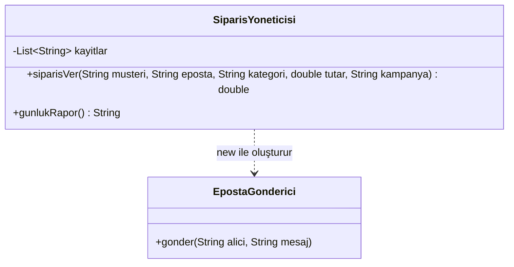
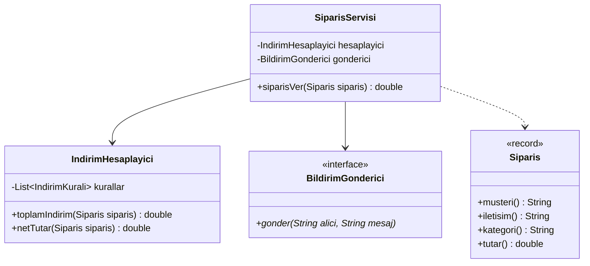
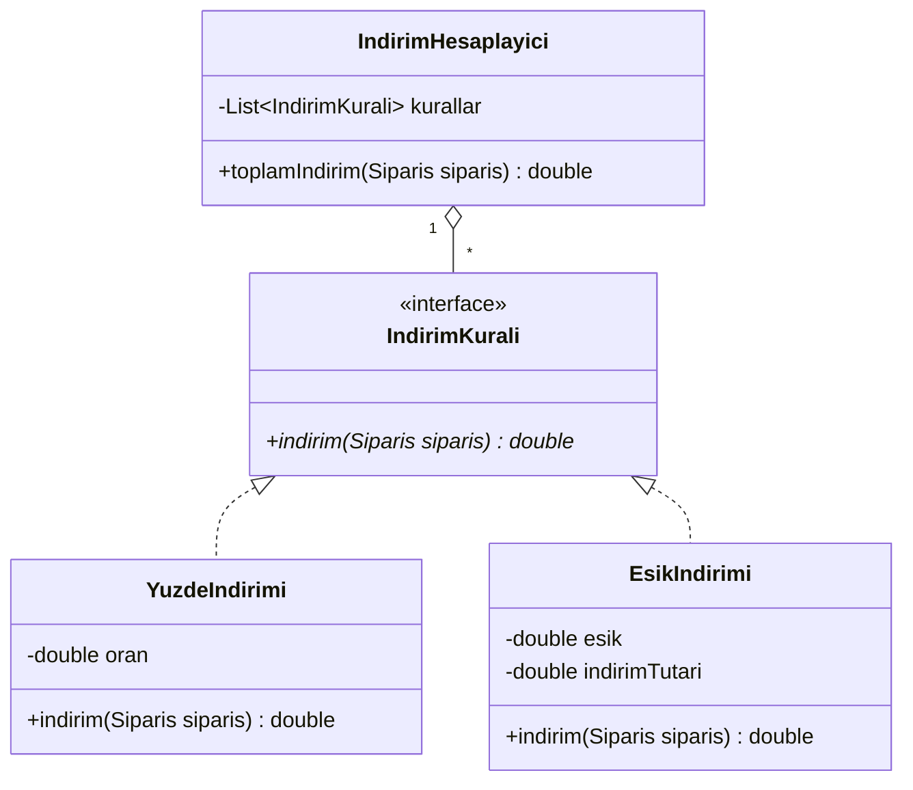
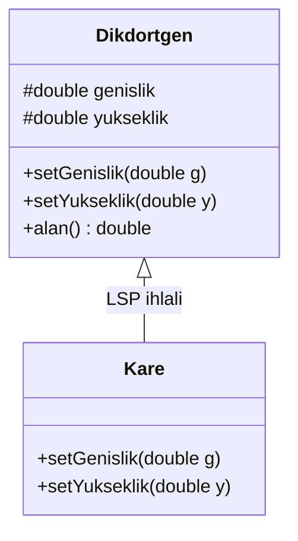
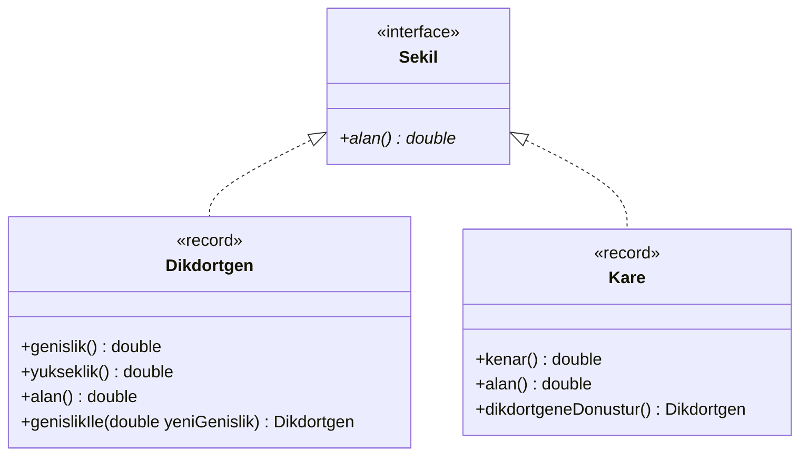
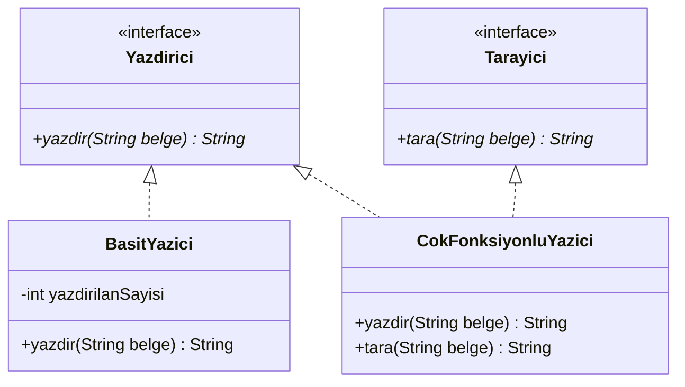
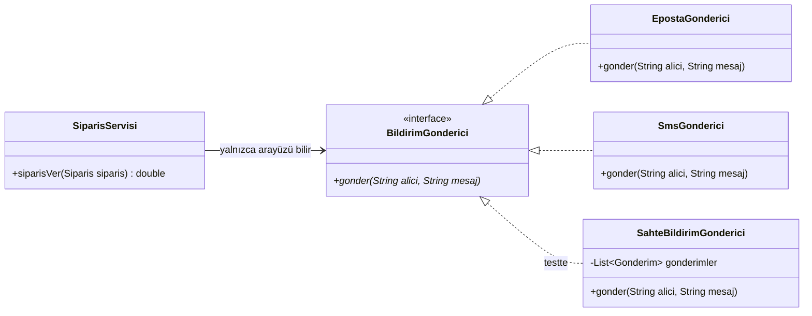
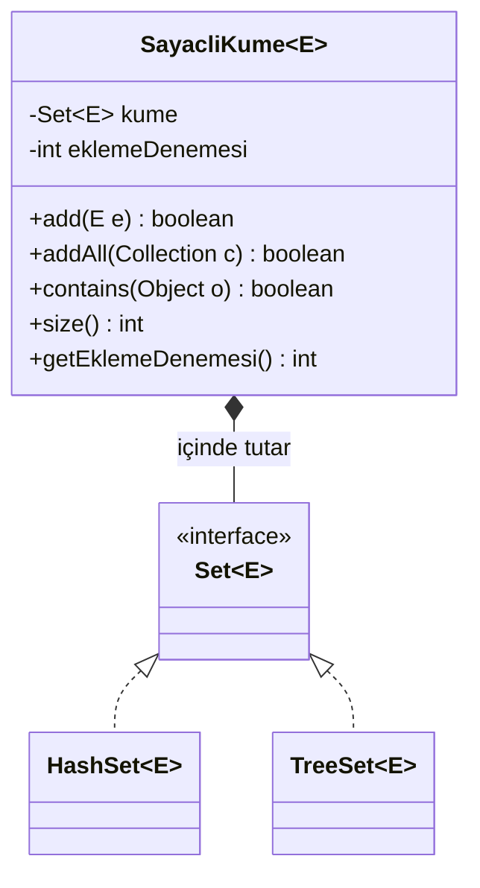

# 📐 M11 - Tasarım İlkeleri

<p align="center"><em>Hafta 12</em></p>

## ❔ Öğrenme hedefleri

Bu modülün sonunda öğrenci:

* Bağlılık (coupling) ve uyum (cohesion) kavramlarıyla bir tasarımın değişim maliyetini değerlendirir
* SOLID ilkelerini tanımlar ve her birini ihlal eden ve düzelten kod örnekleriyle açıklar
* Bir tasarımdaki ilke ihlallerini bulup adım adım yeniden düzenler (refactoring)
* Bağımlılıkları arayüzlerle gevşetir, kurucu ile bağımlılık enjeksiyonu yapar ve sahte nesnelerle test yazar
* Kalıtım yerine bileşimi ne zaman seçeceğine karar verir ve ilkelerin aşırıya kaçırılmasının sakıncalarını tanır

---

## 1. İyi tasarım neden önemli? { #1-iyi-tasarim }

M1'de söylediğimiz gibi, gerçek yazılımda asıl zorluk kodu yazmak değil **değiştirmektir**. Bir
özellik ilk kez yazılırken harcanan emek, o kodun yıllar içinde okunması, düzeltilmesi ve
genişletilmesi için harcanan emeğin yanında küçük kalır. İyi tasarımın ölçüsü bu yüzden basittir:
**bir değişiklik kaç yere dokunmayı gerektiriyor?**

İki kavram bu soruyu cevaplamaya yardım eder:

| Kavram | Anlamı | İstenen |
|---|---|---|
| **Bağlılık** (coupling) | Bir sınıfın başka sınıfların ayrıntılarına ne kadar bağımlı olduğu | **Düşük**: biri değişince diğeri etkilenmesin |
| **Uyum** (cohesion) | Bir sınıfın içindeki parçaların aynı amaca ne kadar hizmet ettiği | **Yüksek**: sınıf tek bir işi iyi yapsın |

Bir e-ticaret sitesinde zamanla büyümüş, "her şeyi yapan" şu sınıfa bakalım:

```java
public class SiparisYoneticisi {

    private final List<String> kayitlar = new ArrayList<>();

    public double siparisVer(String musteri, String eposta, String kategori,
                             double tutar, String kampanya) {
        // 1) İndirim kuralları
        double indirim = 0;
        if (kampanya.equals("YUZDE10")) {
            indirim = tutar * 0.10;
        } else if (kampanya.equals("ESIK1000") && tutar >= 1000) {
            indirim = 100;
        }
        double net = tutar - indirim;
        // 2) Kayıt
        kayitlar.add(musteri + ";" + kategori + ";" + net);
        // 3) Bildirim
        EpostaGonderici gonderici = new EpostaGonderici();      // somut sınıfı kendisi oluşturuyor
        gonderici.gonder(eposta, "Sayın " + musteri + ", ödenecek tutar: " + net);
        return net;
    }

    public String gunlukRapor() {
        // kayitlar listesini metin tablo olarak biçimlendirir...
    }
}
```



Kod çalışıyor. Ama şu istekleri düşünün: pazarlama yeni bir kampanya istiyor; bilgi işlem e-posta
yerine SMS göndermek istiyor; muhasebe raporun biçimini değiştirmek istiyor. Üç farklı ekibin üç
farklı isteği **aynı sınıfı** değiştiriyor. Daha kötüsü, `siparisVer` metodunu test etmek isteyen
biri gerçek bir e-posta göndermeden bunu yapamaz. Uyum düşük, bağlılık yüksek.

Bu modülde bu sınıfı **SOLID** ilkeleriyle adım adım yeniden düzenleyeceğiz. SOLID, Robert C.
Martin'in 1990'ların sonundan itibaren derleyip yaygınlaştırdığı beş ilkenin baş harflerinden
oluşur (kısaltmayı sonradan Michael Feathers önermiştir):

| Harf | İlke | Tek cümlelik özet |
|---|---|---|
| **S** | Tek sorumluluk (Single Responsibility) | Bir sınıfın değişmek için tek bir nedeni olmalı |
| **O** | Açık/kapalı (Open/Closed) | Yeni davranış eklemek için mevcut kodu değiştirmek gerekmemeli |
| **L** | Liskov yerine geçme (Liskov Substitution) | Alt tür, üst türün beklendiği her yerde sorunsuz çalışmalı |
| **I** | Arayüz ayrımı (Interface Segregation) | Hiçbir sınıf kullanmadığı metotlara bağımlı olmaya zorlanmamalı |
| **D** | Bağımlılığın tersine çevrilmesi (Dependency Inversion) | Üst seviye kod ayrıntılara değil soyutlamalara bağımlı olmalı |

## 2. Tek sorumluluk ilkesi (SRP) { #2-srp }

> A class should have only one reason to change. (Bir sınıfın değişmek için yalnızca bir nedeni
> olmalıdır.) — Robert C. Martin, 2002

"Tek sorumluluk" genellikle "tek iş yapmak" diye yanlış anlaşılır. Martin'in kastettiği, sınıfın
**tek bir değişim kaynağına** hizmet etmesidir. *Clean Architecture* (2017) kitabında ilkeyi şöyle
keskinleştirir: bir modül yalnızca **bir aktöre** (değişiklik isteyen kişi ya da ekip) karşı sorumlu
olmalıdır. `SiparisYoneticisi` üç aktöre (pazarlama, bilgi işlem, muhasebe) hizmet ediyor.

Düzeltme: her değişim nedeni kendi sınıfına taşınır. `SiparisServisi` yalnızca iş akışını yönetir:



| Değişim nedeni | Önce | Sonra |
|---|---|---|
| Kampanya kuralları (pazarlama) | `SiparisYoneticisi` | `IndirimKurali` gerçeklemeleri (§3) |
| Bildirim kanalı (bilgi işlem) | `SiparisYoneticisi` | `BildirimGonderici` gerçeklemeleri (§6) |
| Sipariş akışı (ürün ekibi) | `SiparisYoneticisi` | `SiparisServisi` |
| Rapor biçimi (muhasebe) | `SiparisYoneticisi` | Ayrı bir rapor sınıfı (Alıştırma 1) |

**Test edilebilirliğe etkisi:** `IndirimHesaplayici` artık e-postadan, kayıttan ve rapordan
bağımsızdır; tek bir satırla oluşturulup test edilir. Beş parametreli `siparisVer` yerine anlamlı
bir `Siparis` record'u (M7) geçirilir.

```java
@Test
@DisplayName("Kuralların indirimleri toplanır")
void kurallarToplanir() {
    IndirimHesaplayici hesaplayici = new IndirimHesaplayici(
            List.of(new YuzdeIndirimi(0.10), new EsikIndirimi(1000, 100)));

    // 1200 * 0.10 = 120, eşik aşıldı: +100
    assertEquals(220.0, hesaplayici.toplamIndirim(telefon), 1e-9);
    assertEquals(980.0, hesaplayici.netTutar(telefon), 1e-9);
}
```

## 3. Açık/kapalı ilkesi (OCP) { #3-ocp }

> Software entities should be open for extension, but closed for modification. (Yazılım birimleri
> genişletmeye açık, değiştirmeye kapalı olmalıdır.) — Bertrand Meyer, 1988; Robert C. Martin

Eski koddaki `if (kampanya.equals("YUZDE10")) ... else if ...` zinciri, her yeni kampanyada
**mevcut metodun açılıp değiştirilmesini** gerektirir. Her değişiklik, çalışan eski kampanyaları
bozma riski taşır ve tüm testlerin yeniden gözden geçirilmesini ister.

Düzeltme: değişen şeyi (kural) bir arayüzün arkasına alıp çok biçimlilikten (M6) yararlanmak.
`IndirimHesaplayici` hangi kuralların var olduğunu bilmez; yalnızca `IndirimKurali` arayüzünü bilir.



```java
@FunctionalInterface
public interface IndirimKurali {
    double indirim(Siparis siparis);
}

public class IndirimHesaplayici {

    private final List<IndirimKurali> kurallar;

    public IndirimHesaplayici(List<IndirimKurali> kurallar) {
        this.kurallar = List.copyOf(kurallar);
    }

    public double toplamIndirim(Siparis siparis) {
        double toplam = kurallar.stream()
                .mapToDouble(kural -> kural.indirim(siparis))  // (1)!
                .sum();
        return Math.min(toplam, siparis.tutar());              // (2)!
    }
}
```

1. Her kural kendi `indirim` metodunu çalıştırır (dinamik bağlama, M6). Burada `if` ya da `switch` yok.
2. Toplam indirim sipariş tutarını aşamaz; net tutar hiçbir zaman negatif olmaz. Bu kural tek bir yerde durur.

Pazarlama "kitaplarda ek yüzde 5" kampanyası istediğinde hiçbir mevcut sınıf değişmez. `IndirimKurali`
fonksiyonel bir arayüz olduğu için yeni kural bir lambda (M10) bile olabilir:

```java
@Test
@DisplayName("OCP: yeni kural mevcut sınıflara dokunmadan eklenir")
void yeniKuralEklemek() {
    IndirimKurali kitapKampanyasi =
            s -> s.kategori().equals("Kitap") ? s.tutar() * 0.05 : 0.0;
    IndirimHesaplayici hesaplayici = new IndirimHesaplayici(
            List.of(new YuzdeIndirimi(0.10), new EsikIndirimi(1000, 100), kitapKampanyasi));

    assertEquals(170.0, hesaplayici.netTutar(kitap), 1e-9);    // 200 - (20 + 10)
    assertEquals(980.0, hesaplayici.netTutar(telefon), 1e-9);  // elektronik etkilenmedi
}
```

**Test edilebilirliğe etkisi:** her kural kendi başına test edilir (`EsikIndirimi` için "tam eşik"
sınır durumu gibi). Yeni kural eklemek eski testleri bozamaz, çünkü eski kod değişmedi.

!!! note "Kapalılık mutlak değildir"

    Hiçbir tasarım her değişikliğe kapalı olamaz. OCP, **sık değişmesini beklediğiniz** eksende
    (burada: kampanya türleri) kodu genişletilebilir yapmanızı söyler. Hangi eksenin değişeceğini
    önceden bilemiyorsanız §8'deki uyarıya bakın.

## 4. Liskov yerine geçme ilkesi (LSP) { #4-lsp }

> Let φ(x) be a property provable about objects x of type T. Then φ(y) should be true for objects y
> of type S where S is a subtype of T. — Barbara Liskov, Jeannette Wing, 1994

Gündelik dille: **üst türle çalışan kod, alt türden bir nesne aldığında da doğru çalışmalıdır.**
M5'te kalıtımı "is-a" (bir ... türüdür) ilişkisi olarak kurmuştuk. LSP, bu ilişkinin yalnızca
kavramsal değil **davranışsal** olarak da doğru olmasını ister. Klasik örnek: matematikte her kare bir
dikdörtgendir; peki `Kare extends Dikdortgen` doğru mu?

```java
public class Dikdortgen {
    protected double genislik, yukseklik;
    public void setGenislik(double g) { genislik = g; }
    public void setYukseklik(double y) { yukseklik = y; }
    public double alan() { return genislik * yukseklik; }
}

public class Kare extends Dikdortgen {
    @Override public void setGenislik(double g) { genislik = g; yukseklik = g; }  // kare kalsın diye
    @Override public void setYukseklik(double y) { genislik = y; yukseklik = y; }
}

// Dikdortgen bekleyen istemci kod:
static void boyutla(Dikdortgen d) {
    d.setGenislik(5);
    d.setYukseklik(4);
    assert d.alan() == 20;   // Dikdortgen için doğru, Kare için alan 16!
}
```



`Dikdortgen`'in sözleşmesi "genişliği değiştirmek yüksekliği etkilemez" der. `Kare` bu sözleşmeyi
bozar; `boyutla` metodu her yeni alt sınıf için `instanceof Kare` kontrolü eklemek zorunda kalır ki bu
da OCP'yi ihlal eder. Sorun, kalıtımın "değiştirilebilir dikdörtgen" davranışı üzerine kurulmasıdır.

Düzeltme: iki sınıf birbirinden türemez; ikisi de ortak ve doğru olan soyutlamayı (`Sekil`)
gerçekler. Değiştirilemez `record`'lar (M7) kullanıldığında "genişliği değiştir" işlemi yeni bir
nesne döndürür ve sözleşme kendiliğinden korunur:



```java
public sealed interface Sekil permits Dikdortgen, Kare {
    double alan();
}

public record Dikdortgen(double genislik, double yukseklik) implements Sekil {
    public double alan() { return genislik * yukseklik; }
    public Dikdortgen genislikIle(double yeniGenislik) {
        return new Dikdortgen(yeniGenislik, yukseklik);
    }
}

public record Kare(double kenar) implements Sekil {
    public double alan() { return kenar * kenar; }
}
```

**Test edilebilirliğe etkisi:** üst tür için yazılan bir test, her alt tür için de geçmelidir. LSP
ihlali genellikle tam da bu noktada, "üst sınıf testleri alt sınıfta başarısız oluyor" diye ortaya
çıkar. Düzeltilmiş tasarımda `SekilTest` her şekli yalnızca `Sekil` arayüzü üzerinden kullanabilir.

!!! tip "LSP'nin işaretleri"

    Alt sınıfta `UnsupportedOperationException` fırlatan bir override, üst sınıfın kuralını gevşeten
    ya da sıkılaştıran bir metot, istemci kodda `instanceof` ile alt türe göre dallanma: bunların
    hepsi kalıtım ilişkisinin davranışsal olarak yanlış olduğunun ipuçlarıdır. JDK'daki
    `List.of(...)` bile `add` çağrıldığında `UnsupportedOperationException` fırlatır; `List`
    arayüzünün belgesi bu işlemleri "isteğe bağlı" (optional) diye işaretleyerek sözleşmeyi baştan
    gevşetmiştir.

## 5. Arayüz ayrımı ilkesi (ISP) { #5-isp }

> Clients should not be forced to depend upon interfaces that they do not use. (İstemciler
> kullanmadıkları arayüzlere bağımlı olmaya zorlanmamalıdır.) — Robert C. Martin, 2002

Martin bu ilkeyi, Xerox'un yazıcı sistemi için yaptığı bir danışmanlıkta karşılaştığı ve sistemdeki
her işin bağımlı olduğu dev bir sınıf üzerinden anlatır. Bizim sürümümüz de bir yazıcı:

```java
public interface Yazici {           // "şişkin" (fat) arayüz
    String yazdir(String belge);
    String tara(String belge);
    void faksGonder(String belge, String numara);
}

public class BasitYazici implements Yazici {
    public String yazdir(String belge) { return "Yazdırıldı: " + belge; }
    public String tara(String belge) { throw new UnsupportedOperationException(); }       // zorla
    public void faksGonder(String b, String n) { throw new UnsupportedOperationException(); }
}
```

`BasitYazici` yapamadığı işleri "yapabilirim" diye ilan etmek zorunda kalıyor; `Yazici` alan her
kod, `tara` çağrısının patlayıp patlamayacağını bilemiyor (bu aynı zamanda bir LSP sorunudur). Ayrıca
`tara` metodunun imzası değişirse, taramayla hiç ilgisi olmayan `BasitYazici` de yeniden derlenmek
zorunda kalır.

Düzeltme: arayüzü **istemcilerin ihtiyaçlarına göre** küçük parçalara bölmek. Bir sınıf ihtiyaç
duyduğu kadarını gerçekler:



```java
/** Yalnızca yazdırmaya ihtiyaç duyan istemci kod: Yazdirici dışında hiçbir şey bilmez. */
private static List<String> hepsiniYazdir(Yazdirici yazdirici, List<String> belgeler) {
    return belgeler.stream().map(yazdirici::yazdir).toList();
}

@Test
@DisplayName("Basit yazıcı tarama yeteneği iddia etmez")
void basitYaziciTarayiciDegil() {
    Object yazici = new BasitYazici();
    assertFalse(yazici instanceof Tarayici);
}
```

**Test edilebilirliğe etkisi:** `hepsiniYazdir` gibi bir metodu test etmek için yalnızca tek
metotlu `Yazdirici`'yı gerçekleyen bir sahte nesne yeterlidir; üç metotlu dev arayüzün tamamını
doldurmak gerekmez. Faks yeteneği gerekirse ayrı bir `FaksGonderici` arayüzü eklenir (Alıştırma 3).

## 6. Bağımlılığın tersine çevrilmesi ilkesi (DIP) { #6-dip }

> High-level modules should not depend on low-level modules. Both should depend on abstractions.
> Abstractions should not depend on details. Details should depend on abstractions.
> — Robert C. Martin, 2002

**Yüksek seviyeli modül** (high-level module), iş kuralını anlatan koddur: "sipariş alınınca indirimi
hesapla, müşteriye haber ver". **Düşük seviyeli modül** ise bir ayrıntıdır: e-postanın hangi
sunucudan, SMS'in hangi sağlayıcıdan gideceği. Eski `SiparisYoneticisi` içinde
`new EpostaGonderici()` yazmak, iş kuralını bir ayrıntıya **zincirler**:



"Tersine çevirme" okların yönündedir. Önce bağımlılık `SiparisYoneticisi → EpostaGonderici`
yönündeydi. Şimdi hem `SiparisServisi` hem `EpostaGonderici` ortadaki `BildirimGonderici`
soyutlamasına bağımlıdır; ayrıntı, üst seviyenin tanımladığı arayüze uyar.

Somut nesneyi kim oluşturacak? Servis kendisi değil: **dışarıdan, kurucu aracılığıyla verilir.** Bu
tekniğe **bağımlılık enjeksiyonu** (dependency injection) denir:

```java
public class SiparisServisi {

    private final IndirimHesaplayici hesaplayici;
    private final BildirimGonderici gonderici;

    public SiparisServisi(IndirimHesaplayici hesaplayici, BildirimGonderici gonderici) { // (1)!
        this.hesaplayici = Objects.requireNonNull(hesaplayici, "hesaplayici");
        this.gonderici = Objects.requireNonNull(gonderici, "gonderici");            // (2)!
    }

    public double siparisVer(Siparis siparis) {
        double net = hesaplayici.netTutar(siparis);
        gonderici.gonder(siparis.iletisim(), mesajOlustur(siparis, net));
        return net;
    }
}

// Uygulamanın başlangıcında nesneler bir kez "bağlanır":
SiparisServisi servis = new SiparisServisi(
        new IndirimHesaplayici(List.of(new YuzdeIndirimi(0.10))),
        new SmsGonderici());                                                         // (3)!
```

1. Kurucu ile enjeksiyon (constructor injection): servisin neye ihtiyacı olduğu imzasından okunur ve
   alanlar `final` olabilir.
2. Eksik bağımlılıkla yarım kalmış bir nesne oluşmasın diye hemen `NullPointerException` (M8).
3. E-postadan SMS'e geçmek için `SiparisServisi`'nin tek satırı değişmez; değişen yalnızca nesneleri
   bağlayan bu satırdır.

**Test edilebilirliğe etkisi:** artık gerçek bir e-posta göndermeden servisi test edebiliriz. Test
için elle yazılmış bir **sahte** (fake) gönderici, kendisine verilen mesajları bir listede saklar:

```java
class SahteBildirimGonderici implements BildirimGonderici {

    record Gonderim(String alici, String mesaj) { }

    private final List<Gonderim> gonderimler = new ArrayList<>();

    @Override
    public void gonder(String alici, String mesaj) {
        gonderimler.add(new Gonderim(alici, mesaj));   // göndermek yerine kaydet
    }

    List<Gonderim> getGonderimler() { return gonderimler; }
}
```

```java
@BeforeEach
void hazirla() {
    sahte = new SahteBildirimGonderici();
    IndirimHesaplayici hesaplayici = new IndirimHesaplayici(
            List.of(new YuzdeIndirimi(0.10), new EsikIndirimi(1000, 100)));
    servis = new SiparisServisi(hesaplayici, sahte);
}

@Test
@DisplayName("Sipariş verilince net tutar döner ve müşteriye tek bildirim gider")
void siparisVerBildirimGonderir() {
    Siparis siparis = new Siparis("Ayşe", "ayse@ornek.com", "Elektronik", 1200);

    double net = servis.siparisVer(siparis);

    assertEquals(980.0, net, 1e-9);
    assertEquals(1, sahte.getGonderimler().size());
    assertEquals("ayse@ornek.com", sahte.getGonderimler().get(0).alici());
}
```

`@BeforeEach` işaretli metot her testten önce çalışır ve her teste temiz bir sahte nesne verir.
`SiparisServisiTest`'te ayrıca gönderici hata verdiğinde istisnanın çağırana ulaştığı, bir lambda
ile yazılmış "hep hata veren" gönderici kullanılarak test edilir.

!!! note "Test ikizleri (test doubles)"

    Gerçek bağımlılığın yerine testte kullanılan nesnelere genel olarak **test ikizi** denir. Gerard
    Meszaros'un sınıflandırmasında gelen çağrıları kaydedip sonradan sorgulatan nesneye tam olarak
    **casus** (spy) denir; gündelik kullanımda buna da "fake" dendiğini sık görürsünüz. Mockito gibi
    kütüphaneler bu nesneleri otomatik üretir. Bu derste ilkeyi görmek için elle yazıyoruz: ortada
    sihir yok, yalnızca aynı arayüzü gerçekleyen bir sınıf var.

## 7. Kalıtım yerine bileşim { #7-bilesim }

> Favor object composition over class inheritance. (Sınıf kalıtımı yerine nesne bileşimini tercih
> edin.) — Gamma, Helm, Johnson, Vlissides, *Design Patterns*, 1994

Kalıtım (M5) güçlüdür ama alt sınıfı üst sınıfın **iç ayrıntılarına** bağlar. Joshua Bloch'un
*Effective Java*'daki örneğini uyarlayalım: bir kümeye kaç kez eleman eklenmeye çalışıldığını saymak
istiyoruz.

```java
public class KalitimliSayacliKume<E> extends HashSet<E> {
    private int eklemeDenemesi;

    @Override public boolean add(E e) {
        eklemeDenemesi++;
        return super.add(e);
    }

    @Override public boolean addAll(Collection<? extends E> c) {
        eklemeDenemesi += c.size();
        return super.addAll(c);          // (1)!
    }
}
```

1. `HashSet.addAll`, kendi içinde her eleman için `add` metodunu çağırır; o da bizim override
   ettiğimiz `add`'dir. Üç elemanlık `addAll` sonunda sayaç **6** olur.

Bu hata, `HashSet`'in belgelenmemiş bir gerçekleme ayrıntısından kaynaklanır; JDK'nın ileriki bir
sürümünde ayrıntı değişirse davranış da değişir. Buna **kırılgan üst sınıf** (fragile base class)
sorunu denir. Bileşimle yazılan sürüm kümeyi genişletmez, **içinde tutar** ve işi ona iletir
(delegation):



```java
public class SayacliKume<E> {
    private final Set<E> kume;
    private int eklemeDenemesi;

    public SayacliKume(Set<E> kume) { this.kume = kume; }

    public boolean addAll(Collection<? extends E> c) {
        eklemeDenemesi += c.size();
        return kume.addAll(c);           // iç kümenin add'i bizim sayacımıza dokunamaz
    }
    // add, contains, size benzer biçimde iletilir
}
```

```java
@Test
@DisplayName("Kalıtımla yazılan küme addAll'da her elemanı iki kez sayar (kırılgan üst sınıf)")
void kalitimIkiKezSayar() {
    KalitimliSayacliKume<String> kume = new KalitimliSayacliKume<>();
    kume.addAll(List.of("elma", "armut", "kiraz"));
    assertEquals(6, kume.getEklemeDenemesi());      // 3 olmalıydı!
}
```

Bileşimin bir kazancı daha var: iç küme kurucuyla verildiği için (§6'daki enjeksiyonun aynısı)
`new SayacliKume<>(new TreeSet<>())` yazarak sıralı bir kümeyi de sayabiliriz. Kalıtımda bu seçim
derleme anında `extends HashSet` ile sabitlenmişti.

| | Kalıtım (`extends`) | Bileşim (alan + iletme) |
|---|---|---|
| İlişki | "bir ... türüdür" (is-a) | "bir ... sahibidir / kullanır" (has-a) |
| Bağlılık | Üst sınıfın iç ayrıntılarına | Yalnızca parçanın genel arayüzüne |
| Değiştirme | Derleme anında sabit | Çalışma anında başka nesne verilebilir |
| Ne zaman? | Gerçek ve davranışsal bir "is-a" varsa (LSP sağlanıyorsa) | Diğer çoğu durumda |

## 8. Ölçülü olmak: ilkeleri aşırıya kaçırmamak { #8-yagni }

İlkeler birer araçtır, hedef değil. Her sınıfa bir arayüz, her `if`'e bir strateji sınıfı eklemek,
tek sınıflık bir problemi on sınıflık bir labirente çevirir. Bu da bağlılığı azaltmaz, yalnızca
kodu okumayı zorlaştırır.

!!! warning "YAGNI: You Aren't Gonna Need It"

    Uç Programlama (Extreme Programming) topluluğundan gelen bu ilke, "ileride gerekebilir" diye
    bugün ihtiyaç olmayan esnekliği eklememeyi söyler. Yalnızca e-posta gönderen ve başka kanal planı
    olmayan bir projede `BildirimGonderici` arayüzü yine de faydalıdır, çünkü **testte** sahte
    nesneye ihtiyacımız var. Ama "belki bir gün güvercinle de göndeririz" diye bir eklenti sistemi
    kurmak gereksizdir. Pratik bir kural: bir soyutlamayı ikinci somut ihtiyaç (ikinci gerçekleme
    ya da test) ortaya çıktığında ekleyin.

## 9. Alıştırmalar

1. **SRP.** `SiparisYoneticisi.gunlukRapor()` metodunun işini üstlenecek bir `RaporOlusturucu`
   sınıfı tasarlayın: siparişlerin listesini alıp metin tablo döndürsün. UML'ini çizin, kodu ve en
   az iki testini yazın. Rapor biçimi değiştiğinde hangi sınıflar derlenmek zorunda kalır?
2. **OCP.** "Aynı müşterinin 3. siparişine yüzde 15 indirim" kuralını ekleyin. Bu kural sipariş
   geçmişini bilmek zorunda; bilgiyi `IndirimKurali` arayüzünü değiştirmeden nasıl verirsiniz?
   (İpucu: kuralın kurucusu.)
3. **ISP.** `FaksGonderici` arayüzünü ve üç yeteneği de olan bir `OfisYazicisi` sınıfını ekleyin.
   `BasitYazici`'nın bu değişiklikten etkilenmediğini gösterin.
4. **LSP.** `SadeceOkunurListe extends ArrayList<String>` sınıfının `add` metodunu
   `UnsupportedOperationException` fırlatacak biçimde override ettiğimizi düşünün. `ArrayList`
   bekleyen hangi istemci kod bozulur? Bileşimle nasıl düzeltirsiniz?
5. **DIP ve test.** `SiparisServisi`'ne sipariş kaydı için bir `SiparisDeposu` arayüzü enjekte edin
   (`kaydet(Siparis)`, `hepsi()`). Bellekte tutan bir gerçekleme ve bir sahte depo ile, "bildirim
   gönderilemezse sipariş kaydedilmemeli" kuralını test edin.
6. **Tartışma.** §8'deki kurala göre hangi arayüzler bu modülün kodunda "erken" sayılabilirdi?
   Gerekçelendirin.

---

## Özet

İyi tasarımın ölçüsü değişim maliyetidir: düşük bağlılık ve yüksek uyum, bir değişikliğin az yere
dokunmasını sağlar. SOLID ilkeleri bu hedefe giden beş somut yol gösterir. **SRP**, her sınıfın tek
bir değişim nedenine hizmet etmesini; **OCP**, yeni davranışın mevcut kodu değiştirmeden arayüz ve
çok biçimlilikle eklenmesini; **LSP**, alt türlerin üst türün sözleşmesine davranışsal olarak da
uymasını; **ISP**, arayüzlerin istemci ihtiyaçlarına göre küçük tutulmasını; **DIP** ise üst seviye
kodun ayrıntılara değil soyutlamalara bağımlı olmasını ister. Kurucu ile bağımlılık enjeksiyonu,
gerçek bağımlılıkların yerine testte elle yazılmış sahte nesneler koymayı mümkün kılar. Kalıtım, alt
sınıfı üst sınıfın iç ayrıntılarına bağladığı için çoğu durumda bileşim daha güvenli bir seçimdir.
İlkeler ölçülü uygulanmalıdır: ihtiyaç olmayan esneklik de bir maliyettir. Bir sonraki modülde bu
ilkelerin tekrar tekrar karşılaşılan problemlere uygulanmış hâllerini, yani tasarım kalıplarını
inceliyoruz.

## İleri okuma

* Robert C. Martin, *Clean Architecture: A Craftsman's Guide to Software Structure and Design*,
  Prentice Hall, 2017, III. kısım ("Design Principles"). SOLID ilkelerinin yazarın güncel anlatımı.
* Eric Freeman, Elisabeth Robson, *Head First Design Patterns*, 2. baskı, O'Reilly, 2020, 1. bölüm.
  Kalıtım yerine bileşim ve "arayüze göre programla" ilkelerine görsel bir giriş.
* [Martin Fowler, "Inversion of Control Containers and the Dependency Injection pattern"](https://martinfowler.com/articles/injection.html),
  2004. Bağımlılık enjeksiyonu teriminin yaygınlaştığı makale; kurucu ile enjeksiyon dahil.
* [Martin Fowler, "Mocks Aren't Stubs"](https://martinfowler.com/articles/mocksArentStubs.html).
  Test ikizlerinin türleri ve sahte nesnelerle test yaklaşımları.

## Kaynaklar

* Robert C. Martin, *Agile Software Development: Principles, Patterns, and Practices*, Prentice Hall,
  2002. §2, §3, §5 ve §6'daki SRP, OCP, ISP ve DIP tanımlarının kaynağı.
* Robert C. Martin, *Clean Architecture*, Prentice Hall, 2017. §2'deki "tek aktör" yorumunun kaynağı.
* Bertrand Meyer, *Object-Oriented Software Construction*, Prentice Hall, 1988. §3'teki açık/kapalı
  ilkesinin ilk ortaya konduğu kitap.
* Barbara H. Liskov, Jeannette M. Wing, "A Behavioral Notion of Subtyping", *ACM Transactions on
  Programming Languages and Systems* 16(6), 1994, s. 1811–1841. §4'teki alt tür tanımının kaynağı.
* Erich Gamma, Richard Helm, Ralph Johnson, John Vlissides, *Design Patterns: Elements of Reusable
  Object-Oriented Software*, Addison-Wesley, 1994, 1. bölüm. §7'deki "kalıtım yerine bileşim"
  ilkesinin kaynağı.
* Joshua Bloch, *Effective Java*, 3. baskı, Addison-Wesley, 2018, Madde 18 "Favor composition over
  inheritance". §7'deki sayan küme örneğinin uyarlandığı kaynak.
* W. P. Stevens, G. J. Myers, L. L. Constantine, "Structured Design", *IBM Systems Journal* 13(2),
  1974, s. 115–139. §1'deki bağlılık ve uyum kavramlarının kaynağı.
* Gerard Meszaros, *xUnit Test Patterns: Refactoring Test Code*, Addison-Wesley, 2007. §6'daki test
  ikizi terimlerinin kaynağı.
* [Martin Fowler, "Yagni"](https://martinfowler.com/bliki/Yagni.html). §8'deki YAGNI ilkesinin kaynağı.
* [Java SE 21 API: `java.util.List`](https://docs.oracle.com/en/java/javase/21/docs/api/java.base/java/util/List.html).
  §4'teki "isteğe bağlı işlem" (optional operation) notunun kaynağı.
