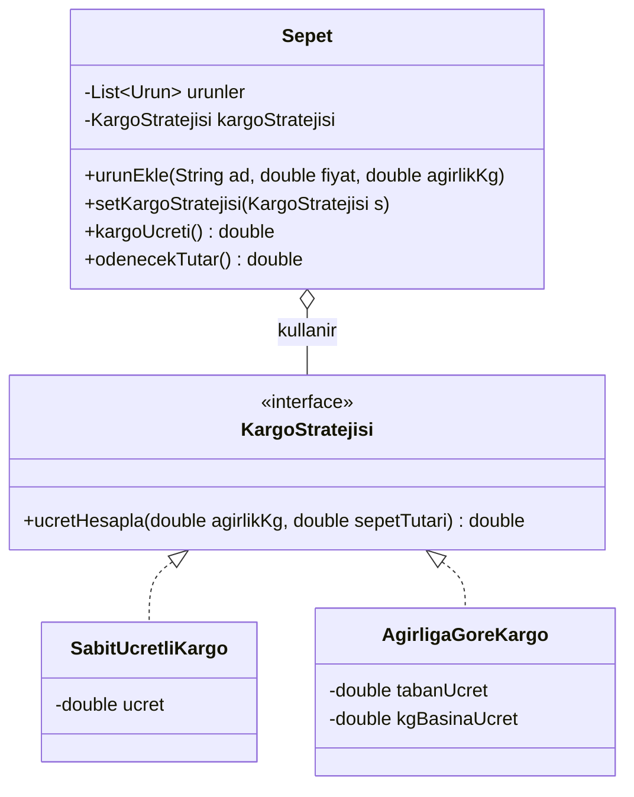
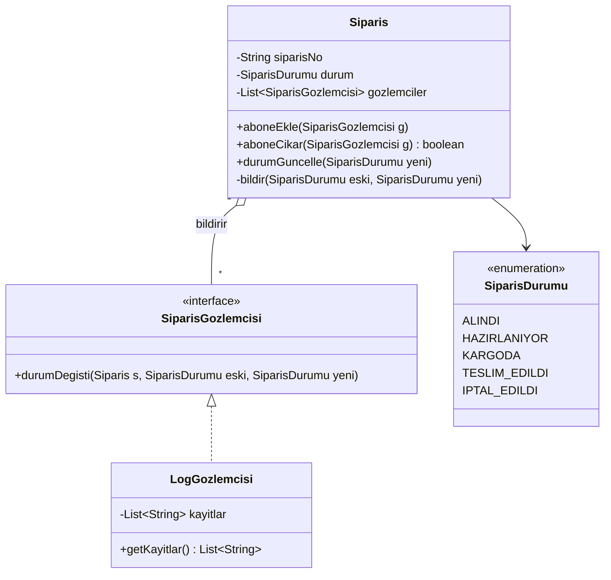
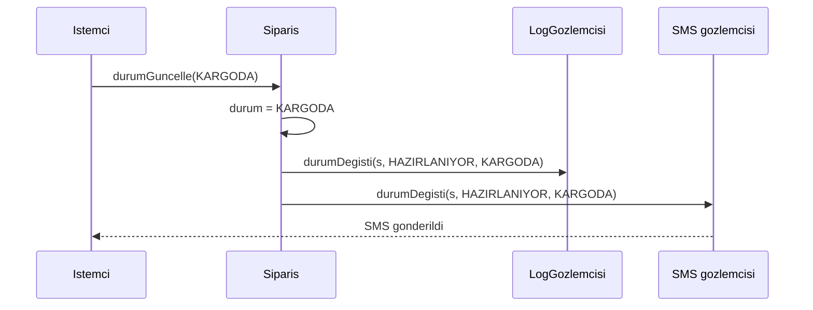
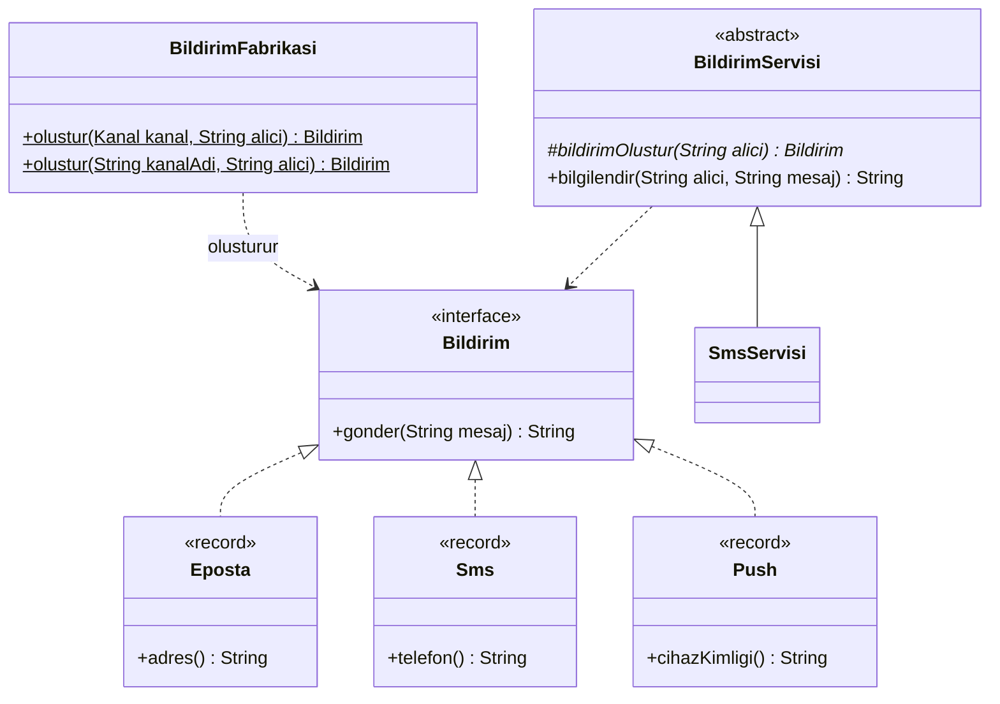
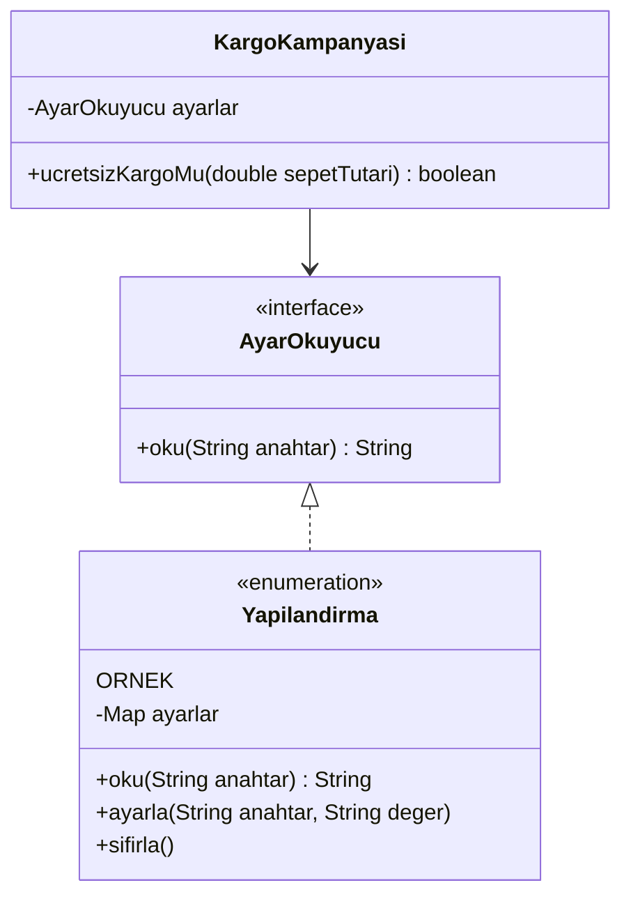
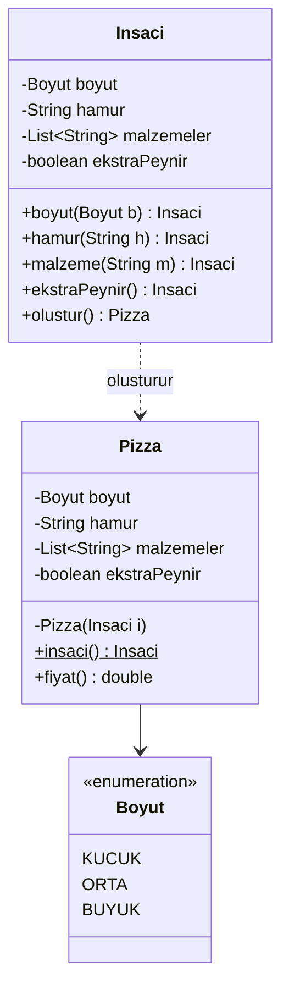

# 🏛️ M12 - Tasarım Kalıpları

<p align="center"><em>Hafta 13</em></p>

## ❔ Öğrenme hedefleri

Bu modülün sonunda öğrenci:

* Tasarım kalıbının ne olduğunu ve ne işe yaradığını açıklar
* Strategy, Observer, Factory, Singleton ve Builder kalıplarını Java'da uygular ve test eder
* Bir probleme uygun kalıbı seçip gerekçelendirir; gereksiz kalıp kullanımını fark eder

---

## 1. Tasarım kalıpları nedir? { #1-kalip-nedir }

M11'de iyi tasarımın ilkelerini gördük: tek sorumluluk, genişlemeye açık/değişikliğe kapalı olma,
soyutlamaya bağımlı olma. İlkeler **neyi** hedeflediğimizi söyler; ama her seferinde sıfırdan "bu
ilkeyi nasıl uygularım?" diye düşünmek yorucudur. Yazılım geliştiriciler yıllar içinde aynı
problemlerle defalarca karşılaştı ve benzer çözümlerde buluştu. Bu çözümlere ad verildi.

**Tasarım kalıbı** (design pattern), **yinelenen bir tasarım problemine verilmiş, adlandırılmış ve
denenmiş bir çözümdür.** Kalıp hazır bir kod parçası ya da kütüphane değildir; bir çözümün
**şablonudur**: hangi sınıfların, hangi sorumluluklarla ve nasıl bir ilişkiyle bir araya geldiğini
anlatır. Aynı kalıp her projede biraz farklı kodla uygulanır.

Kavramı yazılıma taşıyan kitap Erich Gamma, Richard Helm, Ralph Johnson ve John Vlissides'in 1994'te
yayımladığı *Design Patterns: Elements of Reusable Object-Oriented Software*'dır. Dört yazar "Gang of
Four" (GoF, Dörtlü Çete) diye anılır; kitaptaki 23 kalıp bugün hâlâ ortak bir sözlük gibi kullanılır.
"Burada Observer kullanalım" demek, yarım sayfalık bir tasarım açıklamasının yerini tutar.

GoF kalıpları amaçlarına göre üç kategoriye ayırır:

| Kategori | Hangi soruyu yanıtlar? | GoF'taki örnekler | Bu modülde |
|---|---|---|---|
| **Yaratımsal** (creational) | Nesneler nasıl ve kim tarafından oluşturulur? | Abstract Factory, Builder, Factory Method, Prototype, Singleton | Factory Method (§4), Singleton (§5), Builder (§6) |
| **Yapısal** (structural) | Sınıflar ve nesneler daha büyük yapılara nasıl birleştirilir? | Adapter, Bridge, Composite, Decorator, Facade, Flyweight, Proxy | (İleri okuma) |
| **Davranışsal** (behavioral) | Nesneler sorumlulukları nasıl paylaşır ve nasıl haberleşir? | Chain of Responsibility, Command, Iterator, Observer, State, Strategy, Template Method ve diğerleri | Strategy (§2), Observer (§3) |

Her kalıbı aynı düzenle işleyeceğiz: **problem** (kalıpsız kod ve sorunu) → **çözüm** (UML ve
katılımcılar) → **Java kodu** → **ne zaman kullanılır/kullanılmaz** → **Java kütüphanesinden gerçek
örnek**. Örneklerimiz bir çevrimiçi sipariş sisteminden: kargo ücreti, sipariş takibi, bildirimler,
yapılandırma ve pizza siparişi. Her kalıp `nyp.m12` altında kendi alt paketindedir.

!!! tip "Kalıplar ilkelerin uygulamasıdır"

    Bu modüldeki kalıpların neredeyse hepsi M11'deki iki fikre dayanır: **somut sınıfa değil
    arayüze bağımlı ol** ve **değişen kısmı ayır, sabit kalanı koru**. Bir kalıbı ezberlemek yerine
    hangi değişimi yalıttığını sorun.

## 2. Strategy { #2-strategy }

### 2.1 Problem

Bir e-ticaret sepetinde kargo ücreti müşterinin seçimine göre değişiyor: sabit ücretli standart kargo,
ağırlığa göre ücretlendirilen kargo, belli tutarın üstünde ücretsiz kargo. İlk akla gelen çözüm bir
`switch`:

```java
public double kargoUcreti(String tur) {
    return switch (tur) {
        case "SABIT" -> 30;
        case "AGIRLIK" -> 20 + 10 * toplamAgirlik();
        case "KAMPANYA" -> toplamTutar() >= 500 ? 0 : 30;
        default -> throw new IllegalArgumentException(tur);
    };
}
```

Her yeni kargo firması ya da kampanya `Sepet` sınıfını değiştirmeyi gerektirir (OCP ihlali). Sepet
hem ürünleri yönetir hem de tüm kargo tarifelerini bilir (SRP ihlali). Tarifeleri ayrı ayrı test etmek
de zordur; her testte bir sepet kurmak gerekir.

### 2.2 Çözüm

**Strategy** (strateji) kalıbı, birbirinin yerine geçebilen algoritmaları ayrı sınıflara koyar ve
ortak bir arayüzün arkasına saklar. Algoritmayı kullanan nesne (bağlam, context) yalnızca arayüzü
bilir; hangi stratejiyi kullanacağı dışarıdan verilir ve çalışma anında değiştirilebilir.



Katılımcılar: **Strateji** (`KargoStratejisi`), **somut stratejiler** (`SabitUcretliKargo`,
`AgirligaGoreKargo`), **bağlam** (`Sepet`).

### 2.3 Java kodu

```java
@FunctionalInterface
public interface KargoStratejisi {
    double ucretHesapla(double agirlikKg, double sepetTutari);
}

public class AgirligaGoreKargo implements KargoStratejisi {
    private final double tabanUcret;
    private final double kgBasinaUcret;
    // kurucu negatif ücretleri reddeder

    @Override
    public double ucretHesapla(double agirlikKg, double sepetTutari) {
        return tabanUcret + kgBasinaUcret * agirlikKg;
    }
}
```

```java
public class Sepet {
    private final List<Urun> urunler = new ArrayList<>();
    private KargoStratejisi kargoStratejisi;

    public Sepet(KargoStratejisi kargoStratejisi) {           // (1)!
        this.kargoStratejisi = Objects.requireNonNull(kargoStratejisi, "Strateji null olamaz");
    }

    public void setKargoStratejisi(KargoStratejisi kargoStratejisi) {   // (2)!
        this.kargoStratejisi = Objects.requireNonNull(kargoStratejisi, "Strateji null olamaz");
    }

    public double kargoUcreti() {
        return kargoStratejisi.ucretHesapla(toplamAgirlik(), toplamTutar());   // (3)!
    }
}
```

1. Strateji kurucudan verilir: M11'deki **bağımlılık enjeksiyonu** (dependency injection).
2. Müşteri kargo seçimini değiştirince sepet yeniden oluşturulmaz, yalnızca strateji değişir.
3. Sepet hesabı **devreder** (delegation); hangi tarifenin çalıştığını bilmez.

Arayüzün tek soyut metodu olduğu için yeni bir strateji için sınıf yazmak zorunda değiliz; M10'daki
lambda ifadeleri ([M10](../m10_lambda_stream/README.md)) tam olarak bunun için vardır:

```java
sepet.setKargoStratejisi((kg, tutar) -> tutar >= 150 ? 0.0 : 40.0);   // kampanya
```

Testte stratejiyi değiştirip ücretin değiştiğini doğrularız (`SepetTest`):

```java
@Test
@DisplayName("Strateji değişince kargo ücreti de değişir")
void stratejiDegisinceUcretDegisir() {
    // Hazırla: 200 TL, 2.0 kg'lık sepet, başlangıçta sabit 30 TL
    // Çalıştır: 20 + 10 * 2.0 = 40
    sepet.setKargoStratejisi(new AgirligaGoreKargo(20, 10));
    // Doğrula
    assertEquals(40.0, sepet.kargoUcreti(), 1e-9);
    assertEquals(240.0, sepet.odenecekTutar(), 1e-9);
}
```

### 2.4 Ne zaman kullanılır, ne zaman kullanılmaz?

| Kullanın | Kullanmayın |
|---|---|
| Aynı işin birden fazla yolu var ve yenileri eklenecek | Yalnızca iki sabit seçenek var ve değişmesi beklenmiyor: bir `if` yeterli |
| Algoritma çalışma anında seçiliyor | Algoritmalar farklı girdiler istiyor ve ortak bir imzaya sığmıyor |
| Her algoritmayı ayrı test etmek istiyorsunuz | Tek satırlık bir hesap için sınıf hiyerarşisi kurmak kodu büyütür; lambda yeterli |

!!! example "Java'da gerçek örnek: `Comparator`"

    `List.sort(Comparator)` ve `Collections.sort` sıralama algoritmasını sabit tutar; **karşılaştırma
    stratejisini** dışarıdan alır. `urunler.sort(Comparator.comparing(Urun::fiyat))` yazdığınızda
    Strategy kalıbını kullanmış olursunuz. M10'da yazdığınız her `Comparator` bir somut stratejiydi.

## 3. Observer { #3-observer }

### 3.1 Problem

Bir siparişin durumu değiştiğinde (hazırlanıyor, kargoda, teslim edildi) müşteriye e-posta ve SMS
gitmeli, olay loglanmalı. Kalıpsız çözüm şöyle görünür:

```java
public void durumGuncelle(SiparisDurumu yeni) {
    this.durum = yeni;
    epostaServisi.gonder(musteriEposta, "Siparişiniz " + yeni);
    smsServisi.gonder(musteriTelefon, "Siparişiniz " + yeni);
    logServisi.yaz(siparisNo + " -> " + yeni);
    // yarın: muhasebe, depo, mobil bildirim...
}
```

`Siparis` sınıfı her bildirim kanalını tanımak zorunda. Yeni bir ilgili taraf eklemek, sipariş
kodunu değiştirmek demek. Testte gerçek e-posta servisi olmadan siparişi çalıştırmak da imkânsız.

### 3.2 Çözüm

**Observer** (gözlemci) kalıbı, bir nesnenin (özne, subject) durumundaki değişikliği ona **abone**
olmuş nesnelere (gözlemciler) haber vermesini sağlar. Özne gözlemcileri yalnızca ortak bir arayüz
üzerinden tanır; kimin dinlediğini, dinleyince ne yaptığını bilmez. Bu ilişki "yayımla-abone ol"
(publish-subscribe) diye de anılır.



Durum değişikliği anında olanlar:



### 3.3 Java kodu

```java
@FunctionalInterface
public interface SiparisGozlemcisi {
    void durumDegisti(Siparis siparis, SiparisDurumu eski, SiparisDurumu yeni);
}
```

```java
public class Siparis {
    private final String siparisNo;
    private SiparisDurumu durum = SiparisDurumu.ALINDI;
    private final List<SiparisGozlemcisi> gozlemciler = new ArrayList<>();

    public void aboneEkle(SiparisGozlemcisi gozlemci) {
        gozlemciler.add(Objects.requireNonNull(gozlemci));
    }

    public void durumGuncelle(SiparisDurumu yeni) {
        Objects.requireNonNull(yeni);
        if (yeni == durum) {
            return;                                             // (1)!
        }
        if (durum.sonDurumMu()) {
            throw new IllegalStateException(siparisNo + " zaten " + durum + " durumunda");
        }
        SiparisDurumu eski = durum;
        durum = yeni;
        bildir(eski, yeni);
    }

    private void bildir(SiparisDurumu eski, SiparisDurumu yeni) {
        for (SiparisGozlemcisi gozlemci : List.copyOf(gozlemciler)) {   // (2)!
            gozlemci.durumDegisti(this, eski, yeni);
        }
    }
}
```

1. Gerçek bir değişiklik yoksa kimseyi rahatsız etmeyiz.
2. Listenin **kopyası** üzerinde dolaşırız: bir gözlemci bildirim sırasında `aboneCikar` çağırırsa
   `ConcurrentModificationException` (M9) oluşmaz.

Gözlemci işlevsel arayüz olduğu için e-posta ya da SMS gözlemcisi bir lambda olabilir:

```java
Bildirim sms = BildirimFabrikasi.olustur(Kanal.SMS, "05551234567");   // §4
siparis.aboneEkle(log);
siparis.aboneEkle((s, eski, yeni) -> sms.gonder(s.getSiparisNo() + " artık " + yeni));
```

Testte gerçek servis yerine **sahte gözlemci** (fake) kullanırız: aldığı bildirimleri bir listeye
yazan küçük bir sınıf. Böylece "gözlemci bildirim aldı mı?" sorusunu doğrudan sorabiliriz:

```java
static class SahteGozlemci implements SiparisGozlemcisi {
    final List<SiparisDurumu> alinanlar = new ArrayList<>();
    @Override
    public void durumDegisti(Siparis siparis, SiparisDurumu eski, SiparisDurumu yeni) {
        alinanlar.add(yeni);
    }
}

@Test
@DisplayName("Abonelikten çıkan gözlemci bildirim almaz")
void abonelikIptali() {
    Siparis siparis = new Siparis("S-2");
    SahteGozlemci gozlemci = new SahteGozlemci();
    siparis.aboneEkle(gozlemci);

    assertTrue(siparis.aboneCikar(gozlemci));
    siparis.durumGuncelle(SiparisDurumu.KARGODA);

    assertTrue(gozlemci.alinanlar.isEmpty());
}
```

### 3.4 Ne zaman kullanılır, ne zaman kullanılmaz?

| Kullanın | Kullanmayın |
|---|---|
| Bir değişikliğe tepki verecek nesnelerin sayısı ve türü önceden bilinmiyor | Tek bir sabit alıcı var: doğrudan metot çağrısı daha açık |
| Özne ile tepki verenlerin birbirini tanımaması isteniyor | Bildirimlerin sırası ve sonucu kritik (ör. önce ödeme, sonra kargo); gizli bir sıra hataya açıktır |
| Arayüz olayları: düğmeye tıklama, değer değişimi | Gözlemciler yavaşsa ve özne onları bekliyorsa: tüm zincir yavaşlar |

!!! warning "Unutulan abonelikler"

    Özne gözlemcinin referansını tuttuğu için, abonelikten çıkmayan bir gözlemci hiç silinmez.
    Uzun yaşayan öznelerde (ör. uygulama boyunca yaşayan bir olay yöneticisi) bu bellek sızıntısına
    yol açar. Abone olan kod, işi bitince `aboneCikar` çağırmaktan sorumludur.

!!! example "Java'da gerçek örnek: olay dinleyicileri"

    `java.beans.PropertyChangeSupport` bir nesneye gözlemci listesi kazandırır;
    `PropertyChangeListener` gözlemci arayüzüdür ve bir özellik değişince `propertyChange(event)`
    çağrılır. Swing ve JavaFX'teki `addActionListener`, `addListener` gibi tüm "olay dinleyici"
    (event listener) metotları da Observer kalıbıdır.

## 4. Factory Method ve basit fabrika { #4-factory }

### 4.1 Problem

Kullanıcının tercihine göre e-posta, SMS ya da mobil (push) bildirim gönderiyoruz. Tercih bir
yapılandırma dosyasından metin olarak geliyor. `new` çağrıları kodun her yerine dağılırsa:

```java
Bildirim b;
if (tercih.equals("eposta")) {
    b = new Bildirim.Eposta(alici);
} else if (tercih.equals("sms")) {
    b = new Bildirim.Sms(alici);
} else { ... }
```

Bu `if` zinciri bildirim gönderen her sınıfta tekrarlanır. Yeni bir kanal eklendiğinde hepsini bulup
değiştirmek gerekir; birini unutmak kolaydır.

### 4.2 Çözüm

Nesne oluşturma kararını **tek bir yerde** toplarız. Bunun iki yaygın biçimi var:

* **Basit fabrika** (simple factory): Oluşturma kararını veren statik bir metot. GoF'taki 23 kalıptan
  biri değildir, bir programlama deyimidir; ama pratikte en sık gördüğünüz biçim budur.
* **Factory Method** (fabrika metodu, GoF): Üst sınıf bir algoritma tanımlar ve içindeki "nesne
  oluştur" adımını **soyut bir metoda** bırakır. Hangi somut nesnenin oluşacağına alt sınıf karar verir.



### 4.3 Java kodu

Ürünler `sealed` bir arayüzün içinde `record` olarak tanımlandı (M7); her biri kendi kuralını kurucuda
korur (ör. e-posta adresinde `@` olmalı, SMS 160 karakteri aşamaz).

```java
public final class BildirimFabrikasi {

    private BildirimFabrikasi() { }

    public static Bildirim olustur(Kanal kanal, String alici) {
        Objects.requireNonNull(kanal, "Kanal null olamaz");
        return switch (kanal) {                                 // (1)!
            case EPOSTA -> new Bildirim.Eposta(alici);
            case SMS -> new Bildirim.Sms(alici);
            case PUSH -> new Bildirim.Push(alici);
        };
    }

    public static Bildirim olustur(String kanalAdi, String alici) {
        Kanal kanal = Kanal.valueOf(kanalAdi.trim().toUpperCase(Locale.ROOT));   // (2)!
        return olustur(kanal, alici);
    }
}
```

1. `enum` üzerinde `switch` ifadesinde `default` yok: `Kanal`'a yeni bir sabit eklenirse derleyici bu
   satırda hata verir ve fabrikayı güncellemeyi unutamazsınız.
2. `"sms"` gibi bir metin `Kanal.SMS`'e çevrilir; tanınmayan ad için `valueOf`
   `IllegalArgumentException` fırlatır. `Locale.ROOT`, Türkçe yerel ayarda `"i"` harfinin `"İ"`ye
   dönüşmesini önler.

Factory Method biçiminde ise "gönder" algoritması sabittir, değişen yalnızca ürün oluşturma adımıdır:

```java
public abstract class BildirimServisi {

    protected abstract Bildirim bildirimOlustur(String alici);   // fabrika metodu

    public String bilgilendir(String alici, String mesaj) {
        if (mesaj == null || mesaj.isBlank()) {
            throw new IllegalArgumentException("Mesaj boş olamaz");
        }
        Bildirim bildirim = bildirimOlustur(alici);
        return bildirim.gonder(mesaj.strip());
    }
}

public class SmsServisi extends BildirimServisi {
    @Override
    protected Bildirim bildirimOlustur(String alici) {
        return new Bildirim.Sms(alici);
    }
}
```

```java
@Test
@DisplayName("Kanal adı metinden, büyük/küçük harf fark etmeden okunur")
void metindenKanal() {
    Bildirim bildirim = BildirimFabrikasi.olustur(" sms ", "05551234567");

    assertEquals("SMS -> 05551234567: Merhaba", bildirim.gonder("Merhaba"));
}
```

### 4.4 Ne zaman kullanılır, ne zaman kullanılmaz?

| Kullanın | Kullanmayın |
|---|---|
| Hangi sınıfın oluşturulacağı çalışma anında (yapılandırma, kullanıcı seçimi) belli oluyor | Tek bir somut sınıf var ve değişmeyecek: `new` yeterli ve daha açık |
| Oluşturma kuralları (doğrulama, önbellek) tek yerde toplanmalı | Fabrika yalnızca `new`'i sarmalıyorsa ve hiçbir karar vermiyorsa |
| İstemcinin somut sınıfları bilmemesi isteniyor | |

!!! example "Java'da gerçek örnek: statik fabrika metotları"

    `List.of(1, 2, 3)` size bir `List` döndürür, ama hangi sınıfın nesnesi olduğunu söylemez; eleman
    sayısına göre farklı gizli sınıflar kullanılabilir. `Integer.valueOf(42)` her seferinde yeni nesne
    oluşturmak yerine -128 ile 127 arasındaki değerler için önbellekteki nesneyi döndürür. Bloch,
    *Effective Java*'nın ilk maddesinde ("Consider static factory methods instead of constructors")
    bu yaklaşımın avantajlarını sayar: adı olması, her çağrıda yeni nesne üretmek zorunda olmaması ve
    alt tür döndürebilmesi.

## 5. Singleton { #5-singleton }

### 5.1 Problem

Uygulamanın para birimi, kampanya eşiği gibi ayarları bir yapılandırma nesnesinde tutuluyor. Bu
nesneden iki tane olursa biri güncellenip diğeri eski kalabilir. İstediğimiz: **tek bir örnek** ve
ona erişmenin tek bir yolu.

### 5.2 Çözüm

**Singleton** (tekil) kalıbı bir sınıftan yalnızca bir nesne oluşturulmasını garanti eder ve o
nesneye küresel bir erişim noktası sağlar. Klasik biçimi özel (private) kurucu ve statik bir alandır:

```java
public final class KlasikYapilandirma {
    private static final KlasikYapilandirma ORNEK = new KlasikYapilandirma();
    private KlasikYapilandirma() { }
    public static KlasikYapilandirma getOrnek() { return ORNEK; }
}
```

Java'da daha güvenli yol **tek elemanlı `enum`**'dur (Bloch, *Effective Java*, "Enforce the singleton
property with a private constructor or an enum type"). JVM her `enum` sabitinden tam bir nesne
oluşturur; serileştirme ya da yansıma (reflection) ile ikinci bir örnek üretilemez.



### 5.3 Java kodu

```java
public enum Yapilandirma implements AyarOkuyucu {
    ORNEK;                                                  // (1)!

    private final Map<String, String> ayarlar = new HashMap<>();

    Yapilandirma() {
        varsayilanlariYukle();
    }

    @Override
    public String oku(String anahtar) {
        String deger = ayarlar.get(anahtar);
        if (deger == null) {
            throw new IllegalArgumentException("Tanımsız ayar: " + anahtar);
        }
        return deger;
    }

    public void ayarla(String anahtar, String deger) { ayarlar.put(anahtar, deger); }

    public void sifirla() { varsayilanlariYukle(); }       // (2)!
}
```

1. Uygulamanın her yerinden `Yapilandirma.ORNEK` ile aynı nesneye ulaşılır.
2. Bu metot yalnızca testler için var. Varlığı bile bir uyarı işaretidir; aşağıya bakın.

```java
@Test
@DisplayName("Her erişim aynı örneği verir")
void ayniOrnek() {
    assertSame(Yapilandirma.ORNEK, Yapilandirma.valueOf("ORNEK"));
    assertEquals(1, Yapilandirma.values().length);
}
```

### 5.4 Singleton'ın tehlikeleri { #5-4-tehlikeler }

Singleton GoF kalıpları arasında en çok eleştirileni ve en kolay kötüye kullanılanıdır:

* **Küresel durum** (global state). `Yapilandirma.ORNEK.ayarla(...)` çağrısı programın her yerini
  etkiler. Bir hatanın kaynağını bulmak için tüm çağrıları taramak gerekir.
* **Test zorluğu.** Testler aynı örneği paylaşır; bir testin yaptığı değişiklik diğerine sızar.
  `YapilandirmaTest` bu yüzden her testten sonra `@AfterEach` ile `sifirla()` çağırmak zorunda.
* **Gizli bağımlılık.** Bir metodun içinde `Yapilandirma.ORNEK` yazıyorsa, o sınıfın imzasına bakarak
  yapılandırmaya bağımlı olduğunu anlayamazsınız.

Çözüm M11'deki **bağımlılığın tersine çevrilmesi** (DIP, [M11](../m11_tasarim_ilkeleri/README.md)):
sınıflar tekile değil bir arayüze bağımlı olsun, tekil yalnızca en dışta, programın kurulduğu yerde
verilsin:

```java
public class KargoKampanyasi {
    private final AyarOkuyucu ayarlar;

    public KargoKampanyasi(AyarOkuyucu ayarlar) {       // Yapilandirma.ORNEK de, lambda da olur
        this.ayarlar = Objects.requireNonNull(ayarlar);
    }

    public boolean ucretsizKargoMu(double sepetTutari) {
        double esik = Double.parseDouble(ayarlar.oku("kampanya.esik"));
        return sepetTutari >= esik;
    }
}
```

```java
@Test
@DisplayName("Tekile dokunmadan, lambda ile verilen ayarla test edilir")
void lambdaAyarIleTest() {
    KargoKampanyasi kampanya = new KargoKampanyasi(anahtar -> "300");

    assertTrue(kampanya.ucretsizKargoMu(300));     // sınır: eşiğe eşit
    assertFalse(kampanya.ucretsizKargoMu(299.99));
}
```

| Kullanın | Kullanmayın |
|---|---|
| Kaynağın gerçekten tek olması gerekiyor ve durumu (neredeyse) değişmiyor | Yalnızca "her yerden kolay erişim" için; bu küresel değişkenin kılık değiştirmiş hâlidir |
| Tekil, arayüzün arkasında ve kurucu üzerinden veriliyor | Değişebilir durum taşıyor ve birçok sınıf onu doğrudan çağırıyor |

!!! example "Java'da gerçek örnek: `Runtime.getRuntime()`"

    Her Java uygulamasında `java.lang.Runtime` sınıfının tek bir örneği vardır ve
    `Runtime.getRuntime()` ile alınır; `availableProcessors()`, `totalMemory()` gibi çalışma ortamı
    bilgilerini verir. JVM tektir, dolayısıyla onu temsil eden nesnenin de tek olması doğaldır.

## 6. Builder { #6-builder }

### 6.1 Problem

Bir pizzanın boyutu zorunlu; hamuru, malzemeleri ve ekstra peynir isteğe bağlı. Her birleşim için
kurucu yazarsak **teleskop kurucu** (telescoping constructor) problemi doğar:

```java
new Pizza(Boyut.ORTA);
new Pizza(Boyut.ORTA, "ince");
new Pizza(Boyut.ORTA, "ince", List.of("mantar"));
new Pizza(Boyut.ORTA, "ince", List.of("mantar"), true);
```

Son satırdaki `true` ne demek? Kodu okuyan kişi kurucuya bakmadan bilemez. Aynı türden iki parametrenin
yerini karıştırmak (ör. iki `String`) derleyicinin yakalayamayacağı bir hatadır. Alternatif olarak boş
kurucu ve setter'lar kullanırsak nesne bir süre **yarım kurulmuş** olarak dolaşır ve değişmez
(immutable) yapılamaz.

### 6.2 Çözüm

**Builder** (inşacı) kalıbı nesneyi adım adım kuran ayrı bir yardımcı nesne kullanır. Her adımın bir
adı vardır, adımlar zincirlenir ve kuralların kontrolü son adımda (`olustur()`) tek seferde yapılır.
Sonuç, değişmez ve her zaman geçerli bir nesnedir.



### 6.3 Java kodu

`Insaci`, `Pizza`'nın içinde `static` iç sınıf (nested class) olarak durur; böylece `Pizza`'nın
`private` kurucusunu çağırabilir.

```java
public final class Pizza {
    private final Boyut boyut;
    private final String hamur;
    private final List<String> malzemeler;
    private final boolean ekstraPeynir;

    private Pizza(Insaci insaci) {                           // (1)!
        this.boyut = insaci.boyut;
        this.hamur = insaci.hamur;
        this.malzemeler = List.copyOf(insaci.malzemeler);    // (2)!
        this.ekstraPeynir = insaci.ekstraPeynir;
    }

    public static Insaci insaci() { return new Insaci(); }

    public static final class Insaci {
        private Boyut boyut;                      // zorunlu
        private String hamur = "ince";            // isteğe bağlı, varsayılanı var
        private final List<String> malzemeler = new ArrayList<>();
        private boolean ekstraPeynir;

        public Insaci boyut(Boyut boyut) {
            this.boyut = boyut;
            return this;                                     // (3)!
        }
        // hamur(...), malzeme(...), ekstraPeynir() benzer biçimde

        public Pizza olustur() {
            if (boyut == null) {
                throw new IllegalStateException("Boyut seçilmeden pizza oluşturulamaz");
            }
            if (malzemeler.size() > AZAMI_MALZEME) {
                throw new IllegalStateException("En fazla " + AZAMI_MALZEME + " malzeme seçilebilir");
            }
            return new Pizza(this);
        }
    }
}
```

1. Kurucu `private`: bir `Pizza` elde etmenin tek yolu inşacıdır.
2. Listenin değiştirilemez bir kopyası alınır; inşacı sonradan değişse de pizza değişmez.
3. Her adım inşacının kendisini döndürür; bu sayede çağrılar zincirlenir (fluent interface).

```java
Pizza pizza = Pizza.insaci()
        .boyut(Pizza.Boyut.ORTA)
        .malzeme("mantar")
        .malzeme("zeytin")
        .ekstraPeynir()
        .olustur();                     // 200 + 2 * 15 + 20 = 250 TL
```

Her parametrenin adı çağrıda görünür; `true` gibi anlamsız değerler kaybolur. Zorunlu alanın eksik
olduğu durumu test ederiz:

```java
@Test
@DisplayName("Zorunlu alan (boyut) eksikse istisna fırlatılır")
void boyutZorunlu() {
    Pizza.Insaci insaci = Pizza.insaci().malzeme("sucuk");

    assertThrows(IllegalStateException.class, insaci::olustur);
}
```

`IllegalStateException` (M8) seçtik, çünkü sorun tek bir argümanda değil inşacının o anki durumunda.

### 6.4 Ne zaman kullanılır, ne zaman kullanılmaz?

| Kullanın | Kullanmayın |
|---|---|
| Dört-beş ya da daha fazla parametre, çoğu isteğe bağlı | İki-üç zorunlu parametre: düz kurucu ya da `record` yeterli |
| Nesne değişmez olmalı ama adım adım kurulmalı | Tüm alanlar zorunlu ve farklı türlerde: kurucu zaten okunaklı |
| Alanlar arası kurallar (en fazla 5 malzeme) tek yerde kontrol edilmeli | |

!!! example "Java'da gerçek örnek: `StringBuilder` ve `HttpRequest.newBuilder()`"

    `StringBuilder` bir `String`'i adım adım kurar: `new StringBuilder().append("S-").append(1001)
    .toString()`. `java.net.http.HttpRequest.newBuilder()` ise tam bir Builder örneğidir:
    `HttpRequest.newBuilder().uri(URI.create("https://ornek.com")).timeout(Duration.ofSeconds(5))
    .GET().build()`. Bloch, *Effective Java*'da bu kalıbı "Consider a builder when faced with many
    constructor parameters" başlığıyla önerir.

## 7. Kalıpları ne zaman kullanmamalı? { #7-ne-zaman-kullanmamali }

Kalıp öğrenen herkes bir süre her yerde kalıp görür. Bu evreyi kısa tutmak gerekir. Bir kalıp **her
zaman** ek sınıf, ek arayüz ve ek dolaylılık (indirection) getirir. Bu bedel, kalıbın çözdüğü problem
gerçekten varsa ödenmeye değer.

* **Önce problemi bekleyin.** Tek bir kargo tarifesi varken Strategy kurmayın. İkinci tarife
  geldiğinde `if` yazın; üçüncüsü geldiğinde ve değişim yönü belli olduğunda kalıba geçin. Buna
  "ihtiyaç duymadan yapma" (YAGNI, you aren't gonna need it) denir.
* **Dilin sunduğunu kullanın.** Java 8'den sonra tek metotlu Strategy ve Observer için çoğu zaman
  sınıf değil lambda yeterli. Değişmez veri için Builder yerine `record` yeterli olabilir.
* **Adı değil amacı yazın.** `SiparisStrategyFactorySingleton` gibi bir sınıf adı kalıbı değil,
  kafa karışıklığını gösterir. Sınıf adı alan kavramını anlatmalı (`KargoStratejisi`, `Sepet`).
* **Singleton'a özellikle şüpheyle bakın.** Çoğu durumda bağımlılık enjeksiyonu daha test
  edilebilir bir çözümdür ([§5.4](#5-4-tehlikeler)).

Kalıp seçerken problemin **belirtisinden** yola çıkın:

| Koddaki belirti | Aday kalıp |
|---|---|
| Aynı işin farklı yolları için büyüyen bir `switch`/`if` zinciri | Strategy |
| Bir nesne değişince başka nesneleri doğrudan çağırıyor ve bu liste büyüyor | Observer |
| `new SomutSinif(...)` kararı birçok yerde tekrarlanıyor, yapılandırmaya bağlı | Basit fabrika / Factory Method |
| Bir algoritmanın yalnızca "hangi nesneyi oluştur" adımı alt sınıflarda değişiyor | Factory Method |
| Kaynak gerçekten tek olmalı (JVM, donanım, tek yapılandırma dosyası) | Singleton (enum, arayüz arkasında) |
| Kurucu çok parametreli, çağrılarda `true, false, null` dizileri | Builder |

## 8. Alıştırmalar

Kodlar `exercise_files/` altında: kaynaklar `src/main/java/nyp/m12/` (alt paketler `strateji`,
`gozlemci`, `fabrika`, `tekil`, `insaci`), testler `src/test/java/nyp/m12/`. Önce testleri çalıştırın:

```bash
mvn -pl m12_tasarim_kaliplari/exercise_files test
```

1. **Yeni strateji.** `strateji` paketine `KademeliKargo` ekleyin: 0–2 kg 30 TL, 2–10 kg 50 TL,
   10 kg üstü 90 TL. `Sepet` sınıfına dokunmadan çalıştığını gösteren, sınır değerleri (tam 2 kg,
   tam 10 kg) de deneyen testler yazın.
2. **Gözlemci ile kural.** Sipariş `IPTAL_EDILDI` olduğunda iade tutarını hesaplayan bir
   `IadeGozlemcisi` yazın. Yalnızca iptal durumunda tepki verdiğini sahte bir siparişle test edin.
   Gözlemcilerden biri istisna fırlatırsa diğerleri bildirim alıyor mu? Deneyin ve
   `bildir` metodunu bu duruma karşı nasıl sağlamlaştırabileceğinizi tartışın.
3. **Fabrikayı genişletin.** `Kanal`'a `WHATSAPP` sabitini ekleyin ve derleyin. Derleyici hangi
   satırda uyarıyor? Neden `default` dalı olmayan `switch` bu durumda bir avantaj?
4. **Singleton'ı gizleyin.** `Sepet`'e "tutar eşiği aşarsa kargo ücretsiz" kuralını ekleyin, ama
   `Yapilandirma.ORNEK`'i `Sepet` içinde **çağırmadan**. Nasıl bir strateji ve hangi bağımlılık gerekir?

    ??? success "Cevap"

        Kuralı bir strateji olarak yazın ve eşiği kurucudan `AyarOkuyucu` ile alın:
        `KargoStratejisi kampanyali = (kg, tutar) -> kampanya.ucretsizKargoMu(tutar) ? 0 : 30;`
        Burada `kampanya`, `new KargoKampanyasi(Yapilandirma.ORNEK)` ile programın başında kurulur.
        `Sepet` yalnızca `KargoStratejisi`'ni bilir; testte `new KargoKampanyasi(a -> "100")` verilir.

5. **Builder mı, record mı?** `Adres` (il, ilçe, sokak, posta kodu; hepsi zorunlu) ve `Siparis`
   (müşteri zorunlu; kupon, hediye paketi, not, teslim saati isteğe bağlı) için hangisini seçerdiniz?
   Her birini gerekçesiyle bir cümleyle açıklayın ve seçtiğiniz tasarımı kodlayıp test edin.
6. **Kalıbı tanıyın.** Aşağıdaki JDK örneklerinin her biri hangi kalıp? `Collections.sort(liste,
   karsilastirici)`, `LocalDate.of(2024, 5, 1)`, `Stream.builder()`, `PropertyChangeSupport`.

    ??? success "Cevap"

        Strategy (karşılaştırma stratejisi dışarıdan verilir); statik fabrika metodu;
        Builder (`add` ile adım adım, `build` ile sonuç); Observer (dinleyici listesi ve bildirim).

---

## Özet

Tasarım kalıpları, yinelenen tasarım problemlerine verilmiş adlandırılmış çözümlerdir; GoF bunları
yaratımsal, yapısal ve davranışsal olarak üçe ayırır. **Strategy** değişen bir algoritmayı arayüzün
arkasına alır ve çalışma anında değiştirilebilir kılar; Java'da çoğu zaman bir lambdadır.
**Observer** bir nesnedeki değişikliği, onu tanımak zorunda olmadığı abonelere duyurur. **Factory**
nesne oluşturma kararını tek bir yerde toplar; basit fabrika bir statik metottur, Factory Method bu
kararı alt sınıfa bırakır. **Singleton** tek bir örneği garanti eder, ama küresel durum ve test
zorluğu getirdiği için arayüz arkasında ve bağımlılık enjeksiyonuyla kullanılmalıdır. **Builder** çok
parametreli nesneleri okunaklı biçimde ve her zaman geçerli olarak kurar. Hepsinin ortak noktası
M11'deki ilkelerdir: değişeni ayır, arayüze bağımlı ol. Kalıbı problem gerçekten ortaya çıktığında
kullanın. Bir sonraki hafta, Sprint B'de, bu kalıplardan en az ikisini kendi projenizde
gerekçelendirerek uygulayacaksınız.

## İleri okuma

* Eric Freeman, Elisabeth Robson, *Head First Design Patterns*, 2. baskı, O'Reilly, 2020. Strategy
  (1. bölüm), Observer, Factory, Singleton ve daha fazlası; Java örnekleriyle, sezgisel bir anlatım.
* [Dev.java: Learn Java](https://dev.java/learn/). Lambda ifadeleri ve işlevsel arayüzler üzerine
  güncel Oracle sayfaları; Strategy ve Observer'ı lambdayla yazarken yararlı.
* GoF kitabındaki yapısal kalıplar (Adapter, Decorator, Composite, Facade): bu modülde işlemediğimiz
  kategoriye giriş için kitabın 4. bölümü.

## Kaynaklar

* Erich Gamma, Richard Helm, Ralph Johnson, John Vlissides, *Design Patterns: Elements of Reusable
  Object-Oriented Software*, Addison-Wesley, 1994. §1'deki tanım ve kategoriler; Strategy, Observer,
  Factory Method, Singleton ve Builder kalıplarının özgün tanımları.
* Joshua Bloch, *Effective Java*, 3. baskı, Addison-Wesley, 2018. Madde 1 "Consider static factory
  methods instead of constructors" (§4), Madde 2 "Consider a builder when faced with many constructor
  parameters" (§6), Madde 3 "Enforce the singleton property with a private constructor or an enum
  type" (§5), Madde 5 "Prefer dependency injection to hardwiring resources" (§5.4).
* Robert C. Martin, *Agile Software Development: Principles, Patterns, and Practices*, Prentice Hall,
  2002. Kalıpların SOLID ilkeleriyle ilişkisi.
* [Java SE 21 API: `java.util.Comparator`](https://docs.oracle.com/en/java/javase/21/docs/api/java.base/java/util/Comparator.html).
  §2'deki Strategy örneği.
* [Java SE 21 API: `java.beans.PropertyChangeListener`](https://docs.oracle.com/en/java/javase/21/docs/api/java.desktop/java/beans/PropertyChangeListener.html).
  §3'teki Observer örneği.
* [Java SE 21 API: `java.util.List`](https://docs.oracle.com/en/java/javase/21/docs/api/java.base/java/util/List.html)
  (`List.of`) ve [`java.lang.Integer`](https://docs.oracle.com/en/java/javase/21/docs/api/java.base/java/lang/Integer.html)
  (`Integer.valueOf`). §4'teki statik fabrika metotları.
* [Java SE 21 API: `java.lang.Runtime`](https://docs.oracle.com/en/java/javase/21/docs/api/java.base/java/lang/Runtime.html).
  §5'teki Singleton örneği.
* [Java SE 21 API: `java.net.http.HttpRequest`](https://docs.oracle.com/en/java/javase/21/docs/api/java.net.http/java/net/http/HttpRequest.html).
  §6'daki Builder örneği.
* [JEP 409: Sealed Classes](https://openjdk.org/jeps/409) ve [JEP 395: Records](https://openjdk.org/jeps/395).
  §4'teki `sealed` arayüz ve `record` ürünler.
* [Mermaid: Class diagrams](https://mermaid.js.org/syntax/classDiagram.html) ve
  [Sequence diagrams](https://mermaid.js.org/syntax/sequenceDiagram.html). Diyagram sözdizimi.
