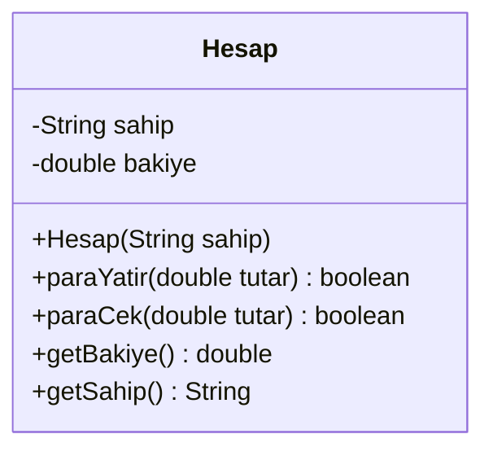
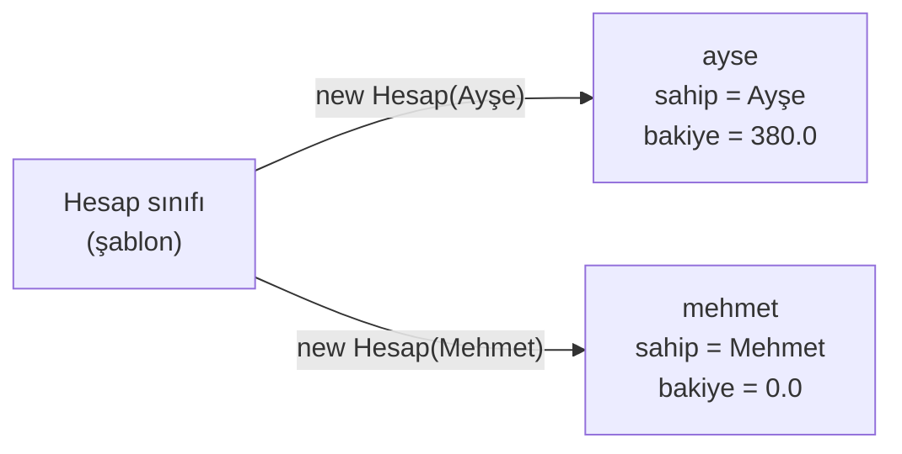

# 💡 M1 - Nesneye Yönelik Programlamaya Giriş

<p align="center"><em>Hafta 1</em></p>

## ❔ Öğrenme hedefleri

Bu modülün sonunda öğrenci:

* Prosedürel ve nesne yönelimli yaklaşımı aynı problem üzerinden karşılaştırır
* Sınıf, nesne, durum (state) ve davranış (behavior) kavramlarını tanımlar ve örneklendirir
* Nesneye yönelik programlamanın dört temel ilkesini adlarıyla tanır
* Bir Maven projesinin klasör yapısını açıklar, projeyi derleyip çalıştırır
* JUnit 5 ile ilk birim testlerini (unit test) yazar ve çalıştırır

---

## 1. Neden nesneye yönelik programlama?

Programlamaya giriş derslerinde yazdığımız programlar genellikle kısadır: birkaç değişken, birkaç
metot, bir `main`. Böyle programları baştan sona okuyup aklınızda tutabilirsiniz. Gerçek yazılımlar ise
yüz binlerce satırdan oluşur, yıllarca yaşar ve onlarca kişi tarafından değiştirilir. Bu ölçekte asıl
zorluk kodu yazmak değil, **değiştirmektir**: bir yeri düzelttiğinizde başka bir yerin bozulmaması
gerekir.

Nesneye yönelik programlama (object-oriented programming, OOP), bu karmaşıklığı yönetmek için geliştirilmiş
bir düşünme biçimidir. Temel fikri şudur: programı, **birbirine mesaj gönderen nesneler** olarak
kurmak. Her nesne kendi verisinden sorumludur ve o veriyi yalnızca kendi metotlarıyla değiştirir.

Fikrin kökü 1960'lara dayanır. Norveçli Ole-Johan Dahl ve Kristen Nygaard, gemi ve trafik gibi gerçek
sistemleri benzetmek (simulate) için geliştirdikleri **Simula 67** dilinde sınıf ve nesne kavramlarını
ilk kez kullandı. "Nesneye yönelik" terimi ise 1970'lerde Alan Kay ve Xerox PARC'taki ekibinin
geliştirdiği **Smalltalk** diliyle yaygınlaştı. Java (1995), C++ ve C# bu çizginin bugün en çok
kullanılan temsilcileridir.

!!! tip "OOP bir dil özelliği değil, bir tasarım yaklaşımıdır"

    Java'da `class` yazmak programınızı kendiliğinden nesne yönelimli yapmaz. Tüm kodu tek bir sınıfın
    `static` metotlarına yığmak, Java'da prosedürel program yazmaktır. Bu ders boyunca asıl
    öğreneceğimiz şey anahtar kelimeler değil, **sorumlulukları nesnelere doğru dağıtmaktır**.

## 2. Aynı problem, iki yaklaşım { #2-iki-yaklasim }

Basit bir banka sistemi yazalım. Her hesabın bir sahibi ve bir bakiyesi var. Hesaba para yatırılabilir
ve bakiye yeterliyse para çekilebilir. Kural: **bakiye hiçbir zaman negatif olamaz.**

### 2.1 Prosedürel çözüm

Prosedürel (procedural) yaklaşımda veri ve onu işleyen fonksiyonlar ayrı yerlerde durur. Hesapları iki
paralel dizide tutalım: `sahipler[i]` ve `bakiyeler[i]` aynı hesaba aittir.

```java
public final class ProsedurelBanka {

    public static boolean paraCek(double[] bakiyeler, int hesapNo, double tutar) {
        if (tutar <= 0 || tutar > bakiyeler[hesapNo]) {
            return false;
        }
        bakiyeler[hesapNo] = bakiyeler[hesapNo] - tutar;
        return true;
    }
    // paraYatir benzer biçimde yazılır
}
```

```java
String[] sahipler = {"Ayşe", "Mehmet"};
double[] bakiyeler = {0, 0};
ProsedurelBanka.paraYatir(bakiyeler, 0, 500);
ProsedurelBanka.paraCek(bakiyeler, 0, 120);
```

Bu kod çalışır. Ama program büyüdükçe üç sorun ortaya çıkar:

1. **Kural korunmuyor.** "Bakiye negatif olamaz" kuralı yalnızca `paraCek` içinde yazılı. Diziye
   erişebilen herhangi bir kod `bakiyeler[0] = -500;` yazarak kuralı atlayabilir. Derleyici bunu
   engellemez.
2. **Veri dağınık.** Hesaba bir "IBAN" alanı eklemek istersek üçüncü bir paralel dizi açmamız ve tüm
   ekleme/silme kodlarında üç diziyi birlikte güncellememiz gerekir. Birini unutursak diziler kayar ve
   Ayşe'nin bakiyesi Mehmet'e görünür.
3. **Anlam kayboluyor.** `paraCek(bakiyeler, 0, 120)` çağrısındaki `0`'ın "Ayşe'nin hesabı" olduğunu
   kodu okuyan kişinin hatırlaması gerekir.

### 2.2 Nesne yönelimli çözüm

Nesne yönelimli yaklaşımda bir hesabın verisini ve işlemlerini tek bir **sınıfta** toplarız:

```java
public class Hesap {

    private final String sahip;   // (1)!
    private double bakiye;

    public Hesap(String sahip) {  // (2)!
        this.sahip = sahip;
        this.bakiye = 0;
    }

    public boolean paraCek(double tutar) {
        if (tutar <= 0 || tutar > bakiye) {
            return false;
        }
        bakiye = bakiye - tutar;
        return true;
    }

    public double getBakiye() {   // (3)!
        return bakiye;
    }
    // paraYatir ve getSahip benzer biçimde yazılır
}
```

1. `private`: bu alana yalnızca `Hesap` sınıfının kendi metotları erişebilir. Kapsüllemeyi M3'te
   ayrıntılı işleyeceğiz.
2. **Kurucu** (constructor): `new Hesap("Ayşe")` yazıldığında çalışır ve yeni nesnenin başlangıç
   durumunu kurar (M2).
3. Bakiyeyi dışarıya **okunabilir** olarak açıyoruz, ama doğrudan değiştirilebilir değil.

```java
Hesap ayse = new Hesap("Ayşe");
ayse.paraYatir(500);
ayse.paraCek(120);
System.out.println(ayse.getBakiye());   // 380.0
```

Şimdi aynı üç soruna bakalım:

| Sorun | Prosedürel | Nesne yönelimli |
|---|---|---|
| Kural korunuyor mu? | Hayır, diziye erişen herkes bakiyeyi değiştirebilir | Evet, `bakiye` `private`; tek yol `paraCek` ve `paraYatir` |
| Yeni alan eklemek | Yeni paralel dizi ve tüm kodda güncelleme | Sınıfa bir alan eklenir, veri tek yerde durur |
| Okunabilirlik | `paraCek(bakiyeler, 0, 120)` | `ayse.paraCek(120)` |

`ayse.bakiye = -500;` yazmayı denerseniz program **derlenmez**: `bakiye has private access in Hesap`.
Kuralı artık derleyici koruyor.

!!! note "Prosedürel yaklaşım yanlış değildir"

    Küçük betikler, tek seferlik hesaplamalar ya da matematiksel fonksiyonlar için prosedürel stil
    genellikle daha sade ve yeterlidir. Java'nın `Math.sqrt` metodu da bir nesneye ait değildir. OOP'nin
    değeri, **uzun yaşayan, çok kişinin değiştirdiği ve kuralları olan** sistemlerde ortaya çıkar.

## 3. Sınıf, nesne, durum, davranış { #3-sinif-ve-nesne }

**Sınıf** (class), benzer nesnelerin ortak yapısını tanımlayan bir şablondur. **Nesne** (object) ise
bu şablondan üretilmiş somut bir örnektir (instance). Sık kullanılan bir benzetme: sınıf bir kurabiye
kalıbı, nesneler o kalıpla kesilmiş kurabiyelerdir. Kalıp bir tanedir; kurabiyelerin her biri ayrıdır
ve birini ısırmak diğerlerini etkilemez.

Her nesnenin üç özelliği vardır:

| Kavram | Anlamı | `Hesap` örneğinde |
|---|---|---|
| **Durum** (state) | Nesnenin o anki verisi; alanlarının (field) değerleri | `sahip = "Ayşe"`, `bakiye = 380.0` |
| **Davranış** (behavior) | Nesnenin yapabildikleri; metotları | `paraYatir`, `paraCek`, `getBakiye` |
| **Kimlik** (identity) | Durumu aynı olsa bile her nesnenin ayrı olması | Bakiyesi 0 olan iki farklı hesap yine iki ayrı nesnedir |

Aşağıdaki UML sınıf diyagramı `Hesap` sınıfını gösterir. Üst bölmede sınıfın adı, ortada alanlar,
altta metotlar yer alır. `-` işareti `private`, `+` işareti `public` demektir. UML'yi M4'te
ayrıntılı işleyeceğiz; şimdilik okumayı öğrenmek yeterli.



Tek bir sınıftan istediğimiz kadar nesne üretebiliriz. Her nesnenin kendi durumu vardır:



!!! example "Kendinizi deneyin"

    Bir **kütüphane** uygulaması için `Kitap` sınıfı tasarlayacaksınız. Bu sınıfın durumu ve davranışı
    ne olabilir? Hangi kural(lar) nesnenin kendisi tarafından korunmalı?

    ??? success "Cevap"

        **Durum:** ISBN, başlık, yazar, ödünçte olup olmadığı. **Davranış:** `oduncVer()`,
        `iadeAl()`, `oduncteMi()`. **Kural:** Ödünçteki bir kitap tekrar ödünç verilemez; bu kontrol
        `oduncVer()` metodunun içinde yapılmalıdır, çağıran kodun hatırlamasına bırakılmamalıdır.
        Burada kimlik de önemlidir: aynı başlıktan iki kopya, aynı ISBN'e sahip olsa bile iki ayrı
        nesnedir ve biri ödünçteyken diğeri rafta olabilir.

## 4. Dört temel ilkeye ilk bakış

Nesneye yönelik programlama genellikle dört ilkeyle özetlenir. Bu dönem her birini ayrı modüllerde
ayrıntılı işleyeceğiz; şimdilik yalnızca adlarını ve ana fikirlerini tanıyalım:

| İlke | Ana fikir | Banka örneğinde | Modül |
|---|---|---|---|
| **Kapsülleme** (encapsulation) | Nesnenin verisini gizle, yalnızca kontrollü metotlarla eriştir | `bakiye` `private`, değişiklik yalnızca `paraCek`/`paraYatir` ile | M3 |
| **Soyutlama** (abstraction) | Kullanana yalnızca "ne yaptığını" göster, "nasıl yaptığını" gizle | Hesabı kullanan kod, bakiyenin nasıl saklandığını bilmez | M3, M7 |
| **Kalıtım** (inheritance) | Ortak yapıyı bir üst sınıfta topla, alt sınıflarda genişlet | `VadeliHesap` ve `VadesizHesap`, `Hesap`'tan türer | M5 |
| **Çok biçimlilik** (polymorphism) | Aynı mesaj, nesnenin türüne göre farklı davranış üretir | `faizHesapla()` her hesap türünde farklı çalışır | M6 |

## 5. Maven proje yapısı { #5-maven }

Bu derste tüm Java kodları **Maven** projeleri olarak düzenlenmiştir. Maven, Java projelerini derleyen,
dış kütüphaneleri (bağımlılıkları) indiren ve testleri çalıştıran bir derleme aracıdır (build tool).
Her Maven projesi aynı klasör düzenini izler; böylece herhangi bir Java projesini açtığınızda kodun ve
testlerin nerede olduğunu hemen bilirsiniz.

Bu modülün alıştırma projesi şöyle düzenlenmiştir:

```text
m1_oop_giris/exercise_files/
├── pom.xml                              ← projenin tarifi (adı, Java sürümü, bağımlılıklar)
└── src/
    ├── main/java/nyp/m1/                ← uygulama kodu
    │   ├── Hesap.java
    │   ├── BankaUygulamasi.java         ← main metodu burada
    │   └── prosedurel/
    │       └── ProsedurelBanka.java
    └── test/java/nyp/m1/                ← test kodu (aynı paket yapısı)
        ├── HesapTest.java
        └── prosedurel/
            └── ProsedurelBankaTest.java
```

* **`pom.xml`** (Project Object Model): Projenin kimliğini ve ayarlarını tutar. Bu repoda her modülün
  `pom.xml` dosyası kısa tutulmuştur; Java sürümü (21) ve JUnit 5 bağımlılığı gibi ortak ayarlar
  repo kökündeki **üst** `pom.xml` dosyasından miras alınır.
* **`src/main/java`**: Uygulama kodu. Klasörler paket (package) adına karşılık gelir:
  `nyp/m1/Hesap.java` dosyası `package nyp.m1;` satırıyla başlar.
* **`src/test/java`**: Testler. Test sınıfları, test ettikleri sınıfla **aynı pakette** durur.
* **`target/`**: Maven'in ürettiği derlenmiş dosyalar. Kendiliğinden oluşur; git'e eklenmez.

En sık kullanacağınız Maven komutları:

| Komut | Ne yapar? |
|---|---|
| `mvn compile` | `src/main/java` altındaki kodu derler |
| `mvn test` | Kodu ve testleri derler, tüm testleri çalıştırır |
| `mvn clean` | `target/` klasörünü siler (temiz bir derleme için) |

Repo kökünde `mvn test` yazarsanız tüm modüllerin testleri çalışır. Yalnızca bu modülün testlerini
çalıştırmak için:

```bash
mvn -pl m1_oop_giris/exercise_files test
```

Programı çalıştırmanın en kolay yolu IntelliJ IDEA'da `BankaUygulamasi.java` dosyasını açıp `main`
metodunun yanındaki yeşil ▶ düğmesine basmaktır. Komut satırından çalıştırmak isterseniz:

```bash
mvn -pl m1_oop_giris/exercise_files compile
java -cp m1_oop_giris/exercise_files/target/classes nyp.m1.BankaUygulamasi
```

```text
[Prosedürel] Ayşe: 380.0
[Nesne]      Ayşe: 380.0
[Nesne]      Mehmet: 0.0
```

## 6. JUnit 5 ile ilk test { #6-junit }

Bir sınıfın doğru çalıştığından nasıl emin oluruz? `main` metodunda birkaç `println` yazıp çıktıya
göz gezdirmek, program büyüdükçe işe yaramaz. Her değişiklikten sonra her şeyi elle kontrol
edemeyiz. Bunun yerine **birim testleri** (unit tests) yazarız: bir sınıfı küçük senaryolarla
çalıştırıp sonucun beklenenle aynı olduğunu **otomatik olarak** doğrulayan kodlar.

Java'da en yaygın test kütüphanesi **JUnit**'tir. Bu derste JUnit 5 kullanıyoruz:

```java
package nyp.m1;

import static org.junit.jupiter.api.Assertions.assertEquals;
import static org.junit.jupiter.api.Assertions.assertFalse;
import static org.junit.jupiter.api.Assertions.assertTrue;

import org.junit.jupiter.api.DisplayName;
import org.junit.jupiter.api.Test;

class HesapTest {

    @Test                                              // (1)!
    @DisplayName("Para yatırınca bakiye artar")        // (2)!
    void paraYatirBakiyeyiArtirir() {
        // Hazırla
        Hesap hesap = new Hesap("Ayşe");
        // Çalıştır
        boolean sonuc = hesap.paraYatir(500);
        // Doğrula
        assertTrue(sonuc);                             // (3)!
        assertEquals(500.0, hesap.getBakiye());        // (4)!
    }

    @Test
    @DisplayName("Bakiyeden fazla para çekilemez, bakiye değişmez")
    void bakiyedenFazlaCekilemez() {
        Hesap hesap = new Hesap("Ayşe");
        hesap.paraYatir(100);

        assertFalse(hesap.paraCek(150));
        assertEquals(100.0, hesap.getBakiye());
    }
}
```

1. `@Test` işaretli her metot ayrı bir testtir. JUnit bu metotları bulur ve her biri için **yeni** bir
   `HesapTest` nesnesi oluşturarak çalıştırır; testler birbirini etkilemez.
2. Test raporunda metot adı yerine görünecek okunaklı açıklama. İsteğe bağlıdır.
3. `assertTrue(x)`: `x` doğru değilse test başarısız olur.
4. `assertEquals(beklenen, gerçek)`: İlk argüman **beklenen** değer, ikincisi **gerçek** değerdir.
   Sırayı karıştırırsanız test yine çalışır, ama hata mesajı yanıltıcı olur.

Her test aynı üç adımı izler: **Hazırla** (arrange), **Çalıştır** (act), **Doğrula** (assert). İyi
bir test yalnızca "normal" durumu değil, **sınır durumlarını** da dener: tüm bakiyeyi çekmek, sıfır
tutar yatırmak, bakiyeden bir kuruş fazla çekmek. `HesapTest.java` dosyasında bu durumların hepsi var.

```bash
mvn -pl m1_oop_giris/exercise_files test
```

```text
[INFO] Tests run: 10, Failures: 0, Errors: 0, Skipped: 0
[INFO] BUILD SUCCESS
```

Bir testi bilerek bozun: örneğin `Hesap.paraCek` içindeki `tutar > bakiye` koşulunu
`tutar > bakiye + 1000` yapın ve testleri tekrar çalıştırın. Maven hangi testin, hangi satırda,
hangi değeri beklerken hangisini bulduğunu raporlar:

```text
[ERROR] HesapTest.bakiyedenFazlaCekilemez:59 expected: <false> but was: <true>
```

!!! warning "Parayı `double` ile tutmak"

    Bu modülde örneği sade tutmak için bakiyeyi `double` olarak tuttuk. Gerçek finansal yazılımlarda
    bu **yapılmaz**: `0.1 + 0.2` işleminin sonucu `double` ile tam olarak `0.3` değildir. Para için
    `java.math.BigDecimal` ya da kuruş cinsinden `long` kullanılır. Testlerimizde bu yüzden `500`,
    `120` gibi tam değerler seçtik.

## 7. Alıştırmalar

1. **Çalıştır ve incele.** Repoyu indirin, `mvn -pl m1_oop_giris/exercise_files test` komutuyla
   testleri çalıştırın. `BankaUygulamasi`'nı IntelliJ'de çalıştırıp çıktıyı [§5](#5-maven)'tekiyle
   karşılaştırın.
2. **Derleyiciyi deneyin.** `BankaUygulamasi.main` içine `ayse.bakiye = -500;` satırını ekleyin.
   Derleyicinin verdiği hata mesajını not edin ve bu mesajın [§2](#2-iki-yaklasim)'deki hangi sorunu
   çözdüğünü bir cümleyle açıklayın. Sonra satırı silin.
3. **Yeni davranış.** `Hesap` sınıfına `boolean paraGonder(Hesap alici, double tutar)` metodunu ekleyin:
   bakiye yeterliyse tutarı bu hesaptan çekip alıcıya yatırsın. Yetersizse iki hesap da değişmesin.
   `HesapTest`'e en az üç test ekleyin (başarılı gönderim, yetersiz bakiye, sıfır tutar).
4. **Prosedürel sürüm.** Aynı `paraGonder` işlemini `ProsedurelBanka` için yazın. İki sürümü
   karşılaştırın: hangisinde hata yapmak daha kolay? Neden?
5. **Nesne tasarlayın.** Bir **otopark** uygulaması için `Arac` sınıfının durumunu, davranışını ve
   koruması gereken kuralları yazın. UML sınıf diyagramını Mermaid ile çizin (kod yazmanız gerekmez).

---

## Özet

Nesneye yönelik programlama, programı kendi verisinden sorumlu nesnelerin iş birliği olarak kurar.
Prosedürel yaklaşımda veri ve onu işleyen fonksiyonlar ayrı durur; kurallar kolayca atlanabilir ve veri
dağılır. Nesne yönelimli yaklaşımda ise bir sınıf, durumu (alanlar) ve davranışı (metotlar) bir araya
getirir ve kurallarını kendisi korur. Sınıf bir şablon, nesne o şablonun somut bir örneğidir. Bu dönem
kapsülleme, soyutlama, kalıtım ve çok biçimlilik ilkelerini sırayla işleyeceğiz. Kodlarımızı Maven
projeleri olarak düzenleyecek ve her sınıfı JUnit 5 testleriyle doğrulayacağız. Bir sonraki modülde
sınıfların yapı taşlarına, yani alanlara, metotlara, kuruculara ve nesnelerin bellekteki yerine
yakından bakıyoruz.

## İleri okuma

* [The Java Tutorials: Object-Oriented Programming Concepts](https://docs.oracle.com/javase/tutorial/java/concepts/),
  Oracle. Nesne, sınıf, kalıtım, arayüz ve paket kavramlarına kısa ve resmî bir giriş.
* [Dev.java: Learn Java](https://dev.java/learn/). Oracle'ın güncel Java öğrenme sayfaları.
* [Maven in 5 Minutes](https://maven.apache.org/guides/getting-started/maven-in-five-minutes.html),
  Apache Maven. Maven proje yapısına ve temel komutlara hızlı bir giriş.

## Kaynaklar

* Ole-Johan Dahl, Kristen Nygaard, "SIMULA: an ALGOL-based simulation language", *Communications of
  the ACM* 9(9), 1966, s. 671–678. §1'deki Simula tarihçesinin kaynağı.
* Alan C. Kay, "The Early History of Smalltalk", *ACM SIGPLAN Notices* 28(3), 1993, s. 69–95. §1'deki
  "nesneye yönelik" teriminin ve Smalltalk'un kaynağı.
* Cay S. Horstmann, *Core Java, Volume I: Fundamentals*, 12. baskı, Pearson, 2022, 4. bölüm
  ("Objects and Classes"). §2–3'teki sınıf/nesne anlatımının dayandığı ders kitabı.
* [JUnit 5 User Guide](https://junit.org/junit5/docs/current/user-guide/). §6'daki `@Test`,
  `@DisplayName` ve `Assertions` kullanımının kaynağı.
* [Java SE 21 API: `java.math.BigDecimal`](https://docs.oracle.com/en/java/javase/21/docs/api/java.base/java/math/BigDecimal.html).
  §6'daki para uyarısının kaynağı.
