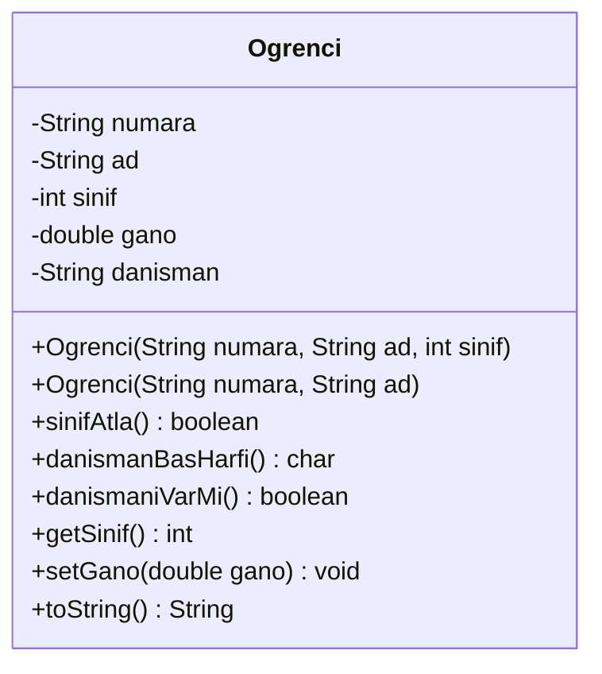
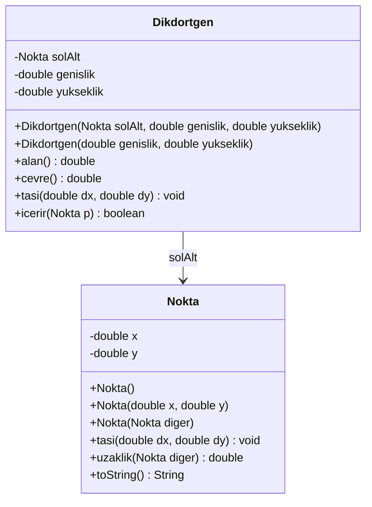
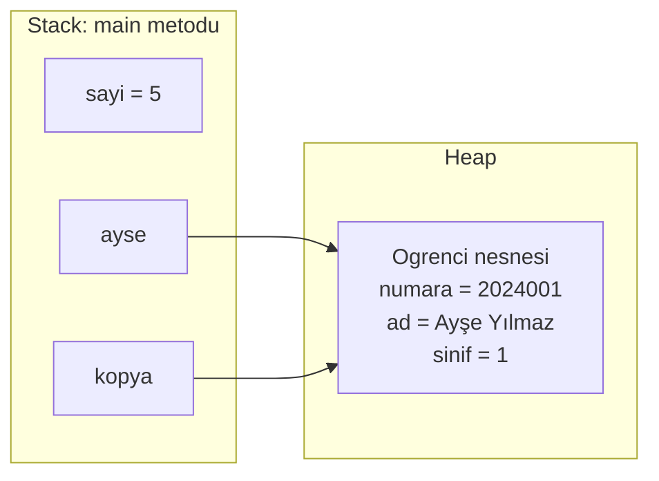
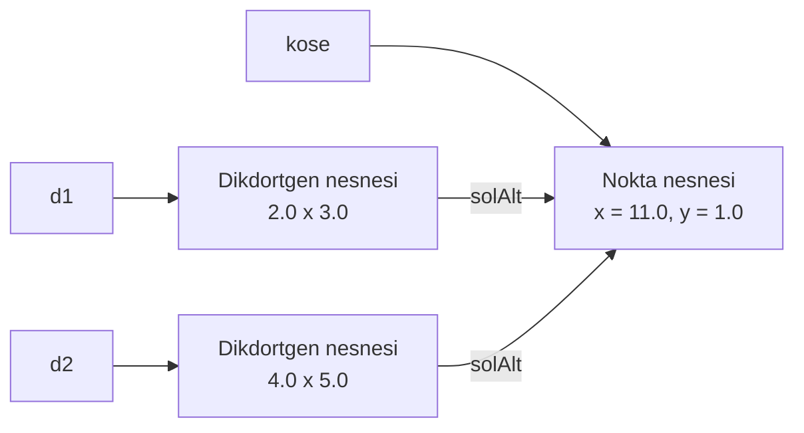

# 🧱 M2 - Sınıflar ve Nesneler

<p align="center"><em>Hafta 2</em></p>

## ❔ Öğrenme hedefleri

Bu modülün sonunda öğrenci:

* Alanları, metotları ve kurucuları olan bir sınıf yazar
* Aşırı yüklenmiş kurucular tanımlar ve `this(...)` ile kurucuları birbirine zincirler
* `new` ile nesne oluşturup metot çağırır, `toString()` ile nesneyi okunaklı yazdırır
* Referans ile ilkel değer arasındaki farkı stack/heap diyagramıyla açıklar
* `this` anahtar kelimesini doğru kullanır, `null` ve `NullPointerException` ile başa çıkar

---

## 1. Sınıf tanımı: alanlar ve metotlar { #1-sinif-tanimi }

M1'de `Hesap` sınıfıyla bir sınıfın durumu ve davranışı bir araya getirdiğini gördük. Bu modülde bir
sınıfın parçalarına tek tek bakacağız. Örnek alanımız bir üniversite: öğrenciler, dersler ve kampüs
haritasındaki noktalar.

Bir öğrenci bilgi sisteminde her öğrencinin numarası, adı, sınıfı ve genel not ortalaması (GANO) vardır.
Öğrenci bir üst sınıfa geçebilir; bir danışmanı olabilir ya da henüz atanmamış olabilir.



Java'da bir sınıfın gövdesinde üç tür üye görürüz:

```java
public class Ogrenci {

    private String numara;                       // (1)!
    private String ad;
    private int sinif;
    private double gano;
    private String danisman;

    public Ogrenci(String numara, String ad, int sinif) {   // (2)!
        this.numara = numara;
        this.ad = ad;
        this.sinif = sinif;
    }

    public boolean sinifAtla() {                 // (3)!
        if (sinif >= 4) {
            return false;
        }
        sinif = sinif + 1;
        return true;
    }
    // diğer kurucu, getter'lar ve toString aşağıda
}
```

1. **Alan** (field, örnek değişkeni / instance variable): her nesnenin kendine ait bir kopyası vardır.
   Ayşe'nin `sinif` alanı ile Mehmet'in `sinif` alanı ayrı bellek hücreleridir.
2. **Kurucu** (constructor): sınıfla aynı adı taşır, dönüş tipi yoktur. `new` ile nesne oluşturulurken
   bir kez çalışır ve alanlara başlangıç değerlerini verir.
3. **Metot** (method): nesnenin davranışı. `static` olmadığı için bir nesne üzerinden çağrılır
   (`ayse.sinifAtla()`) ve o nesnenin alanlarını kullanır.

Metotlar içinde tanımlanan değişkenler (**yerel değişken**, local variable) ile alanlar arasında önemli
bir fark vardır: yerel değişkene değer atamadan kullanırsanız derleyici hata verir, alanlar ise
atanmasalar bile **varsayılan değerle** başlar:

| Alan tipi | Varsayılan değer |
|---|---|
| `int`, `long`, `short`, `byte` | `0` |
| `double`, `float` | `0.0` |
| `boolean` | `false` |
| `char` | `'\u0000'` (boş karakter) |
| Her türlü nesne referansı (`String`, `Ogrenci`, diziler...) | `null` |

`Ogrenci` kurucusu `gano` ve `danisman` alanlarına dokunmuyor; bu yüzden yeni bir öğrencinin GANO'su
`0.0`, danışmanı `null` olur. Testte:

```java
@Test
@DisplayName("Atanmamış alanlar varsayılan değerlerini alır: double 0.0, String null")
void atanmamisAlanlarVarsayilanDegerde() {
    Ogrenci ogrenci = new Ogrenci("2024001", "Ayşe Yılmaz");

    assertEquals(0.0, ogrenci.getGano(), 1e-9);   // double karşılaştırırken tolerans
    assertNull(ogrenci.getDanisman());
    assertFalse(ogrenci.danismaniVarMi());
}
```

!!! tip "Varsayılan değere güvenmek mi, açıkça yazmak mı?"

    `private int kayitliSayisi;` ile `private int kayitliSayisi = 0;` aynı sonucu verir. Sıfır anlamlı
    bir başlangıç değeriyse (sayaç gibi) varsayılana güvenmek yaygındır. Ama `null` çoğu zaman
    "henüz bilmiyorum" anlamına gelir ve [§6](#6-null)'da göreceğimiz gibi sorun çıkarabilir.

## 2. Kurucular ve aşırı yükleme { #2-kurucular }

### 2.1 Varsayılan kurucu

Bir sınıfa **hiç** kurucu yazmazsanız derleyici sizin yerinize parametresiz, gövdesi boş bir kurucu
ekler: **varsayılan kurucu** (default constructor).

```java
public class Sayac {

    private int deger;          // varsayılan değer 0

    public void artir() {
        deger = deger + 1;
    }

    public int getDeger() {
        return deger;
    }
}
```

`Sayac` sınıfında kurucu yok, ama `new Sayac()` derlenir ve sayaç `0`'dan başlar. Dikkat: sınıfa tek bir
kurucu bile yazdığınız anda derleyici varsayılan kurucuyu **eklemez**. `Ogrenci` sınıfında
`new Ogrenci()` yazarsanız derleme hatası alırsınız, çünkü parametresiz bir kurucu tanımlamadık.

### 2.2 Aşırı yüklenmiş kurucular ve `this(...)`

Bir sınıfın birden fazla kurucusu olabilir; yeter ki parametre listeleri farklı olsun. Buna **aşırı
yükleme** (overloading) denir; aynı kural metotlar için de geçerlidir. Kampüs haritasındaki bir nokta
için üç farklı başlangıç senaryosu düşünelim: başlangıç noktası, verilen koordinatlar ya da başka bir
noktanın kopyası.



Üç kurucuda da aynı atamaları tekrar yazmak yerine, asıl işi tek bir kurucuya yaptırıp diğerlerinden
onu çağırırız. Buna **kurucu zincirleme** (constructor chaining) denir:

```java
public class Nokta {

    private double x;
    private double y;

    public Nokta() {
        this(0, 0);                    // (1)!
    }

    public Nokta(double x, double y) { // (2)!
        this.x = x;
        this.y = y;
    }

    public Nokta(Nokta diger) {
        this(diger.x, diger.y);        // (3)!
    }
}
```

1. `this(...)` aynı sınıfın **başka bir kurucusunu** çağırır. Kurucunun **ilk satırı** olmak
   zorundadır; öncesine başka bir ifade yazarsanız derlenmez.
2. Asıl işi yapan kurucu. Doğrulama gibi kurallar eklenecekse (M3) tek bir yere eklenir.
3. **Kopya kurucu** (copy constructor): verilen noktayla aynı koordinatlarda ama ondan **bağımsız** yeni
   bir nesne. `diger.x` yazabiliyoruz, çünkü `private` erişim nesneye değil **sınıfa** göredir.

`Ogrenci`'de de aynı fikir: yeni kayıt olan öğrenci 1. sınıftadır.

```java
public Ogrenci(String numara, String ad) {
    this(numara, ad, 1);
}
```

Java hangi kurucunun çalışacağına argümanların sayısına ve tiplerine bakarak **derleme zamanında**
karar verir: `new Nokta()` birinciyi, `new Nokta(3, 4)` ikinciyi, `new Nokta(p)` üçüncüyü seçer.

## 3. `this` anahtar kelimesi { #3-this }

Bir metot ya da kurucunun içinde `this`, **o anda üzerinde çalışılan nesneye** referanstır.
`ayse.sinifAtla()` çağrısında `this`, `ayse`'nin gösterdiği nesnedir.

En sık kullanıldığı yer, parametre adının alan adıyla aynı olduğu durumdur. Aşağıdaki kurucu derlenir,
ama hatalıdır:

```java
public Ogrenci(String numara, String ad, int sinif) {
    numara = numara;   // parametreyi kendisine atar; alan null kalır
    ad = ad;
    sinif = sinif;
}
```

Parametre, aynı adlı alanı **gölgeler** (shadowing): kurucunun içinde `numara` yazdığınızda Java
parametreyi anlar. `this.numara` ise "bu nesnenin `numara` alanı" demektir ve belirsizliği ortadan kaldırır.

| Kullanım | Anlamı | Örnek |
|---|---|---|
| `this.alan` | Bu nesnenin alanı (gölgelenmeyi çözer) | `this.ad = ad;` |
| `this(...)` | Aynı sınıfın başka bir kurucusu (yalnızca kurucunun ilk satırında) | `this(numara, ad, 1);` |
| `this` (tek başına) | Bu nesnenin kendisi; başka bir metoda argüman olarak verilebilir | `ders.kayitEt(this);` |

!!! warning "Gölgelenme hatasını derleyici yakalamaz"

    `numara = numara;` geçerli Java'dır; program çalışır ama öğrencinin numarası `null` kalır. Hatayı
    ancak bir test ya da çok sonra bir `NullPointerException` ortaya çıkarır. IntelliJ bu satırı gri
    renkte gösterip "Variable is assigned to itself" uyarısı verir; uyarıları görmezden gelmeyin.

## 4. Nesne oluşturma ve `new` { #4-new }

`Ogrenci ayse = new Ogrenci("2024001", "Ayşe Yılmaz");` satırında üç ayrı iş olur:

1. `Ogrenci ayse` bir **referans değişkeni** tanımlar. Bu değişken nesnenin kendisi değildir; nesnenin
   bellekteki yerini gösteren bir değer tutar.
2. `new Ogrenci(...)` bellekte (heap'te) yeni bir nesne için yer ayırır, alanları varsayılan değerlerle
   doldurur ve kurucuyu çalıştırır.
3. `=` yeni nesnenin referansını `ayse` değişkenine atar.

### 4.1 `toString()`: nesneyi okunaklı yazdırmak

`System.out.println(ayse)` yazdığımızda Java nesnenin `toString()` metodunu çağırır. Biz yazmazsak Java'nın
hazır sürümü `nyp.m2.Ogrenci@1b6d3586` gibi, sınıf adı ve bir sayıdan oluşan, işe yaramaz bir metin
üretir. Kendi sürümümüzü yazalım:

```java
@Override                                  // (1)!
public String toString() {
    return numara + " " + ad + " (" + sinif + ". sınıf)";
}
```

1. `@Override`, "bu metot Java'nın hazır `toString()` metodunun yerine geçiyor" demektir. Neden
   böyle olduğunu kalıtımla birlikte M5'te göreceğiz; şimdilik her `toString()` üstüne yazın.

```java
System.out.println(ayse);                  // 2024001 Ayşe Yılmaz (1. sınıf)
String mesaj = "Öğrenci: " + ayse;         // + ile birleştirmede de toString() çağrılır
```

`toString()` hata ayıklamada (debugging) büyük kolaylık sağlar: IntelliJ'nin hata ayıklayıcısı ve JUnit
hata mesajları da nesneleri bu metotla gösterir.

### 4.2 `==` ve `equals`: ilk tanışma

İki referansı `==` ile karşılaştırmak, **aynı nesneyi gösterip göstermediklerini** sorar; içeriklerine
bakmaz. İçerik karşılaştırması için `equals` metodu vardır:

```java
String a = new String("Ayşe");
String b = new String("Ayşe");
System.out.println(a == b);        // false: iki ayrı nesne
System.out.println(a.equals(b));   // true: aynı karakterler
```

`String` sınıfı `equals` metodunu içeriğe bakacak biçimde tanımlar. Bizim `Nokta` sınıfımız ise
tanımlamıyor; bu yüzden `new Nokta(2, 3).equals(new Nokta(2, 3))` **false** döndürür, yani `==` gibi
davranır. Kendi sınıflarımızda `equals` yazmayı M5'te öğreneceğiz. O zamana kadar kural basit:
**`String` karşılaştırırken her zaman `equals` kullanın.**

## 5. Referans ve değer; stack ve heap { #5-referans-deger }

### 5.1 İlkel tipler ve referans tipleri

Java'da iki tür tip vardır. **İlkel tipler** (primitive types: `int`, `double`, `boolean`, `char`...)
değişkenin içinde değerin kendisini tutar. **Referans tipleri** (sınıflar, diziler, `String`) ise
değişkende yalnızca nesneye giden bir referans tutar; nesnenin kendisi heap'tedir.

Bellek kabaca iki bölgeye ayrılır. **Stack**, çalışan metotların yerel değişkenlerini tutar; metot
bitince bu değişkenler silinir. **Heap**, `new` ile oluşturulan nesnelerin yaşadığı yerdir; bir nesneyi
gösteren hiçbir referans kalmayınca çöp toplayıcı (garbage collector) onu kendiliğinden temizler.

```java
int sayi = 5;
Ogrenci ayse = new Ogrenci("2024001", "Ayşe Yılmaz");
Ogrenci kopya = ayse;          // nesne kopyalanmaz, referans kopyalanır
```



`sayi` kutusunun içinde `5` değeri durur. `ayse` ve `kopya` kutularının içinde ise nesne değil, **aynı**
nesneye giden birer ok vardır. Bu duruma **aliasing** (takma ad) denir: bir nesnenin iki adı olur.
`kopya.sinifAtla()` çağrısından sonra `ayse.getSinif()` de `2` döndürür, çünkü ortada tek bir öğrenci vardır.

JUnit'te iki referansın aynı nesneyi gösterip göstermediğini `assertSame` ve `assertNotSame` ile test
ederiz (bunlar `==` ile karşılaştırır; `assertEquals` ise `equals` kullanır):

```java
@Test
@DisplayName("Atama nesneyi kopyalamaz: iki referans aynı nesneyi gösterir")
void atamaAliasingOlusturur() {
    // Hazırla
    Ogrenci ayse = new Ogrenci("2024001", "Ayşe Yılmaz");
    Ogrenci kopya = ayse;
    // Çalıştır
    kopya.sinifAtla();
    // Doğrula
    assertSame(ayse, kopya);
    assertEquals(2, ayse.getSinif());
}
```

### 5.2 Nesnenin içinde referans: paylaşılan köşe

Aliasing bazen fark edilmeden oluşur. `Dikdortgen` kurucusu kendisine verilen `Nokta` referansını
olduğu gibi saklıyor:

```java
Nokta kose = new Nokta(1, 1);
Dikdortgen d1 = new Dikdortgen(kose, 2, 3);
Dikdortgen d2 = new Dikdortgen(kose, 4, 5);
d1.tasi(10, 0);
System.out.println(d2);   // Dikdortgen[solAlt=(11.0, 1.0), 4.0x5.0]
```



Yalnızca `d1`'i taşıdık, ama `d2` de taşındı: iki dikdörtgen aynı köşe nesnesini paylaşıyor. Bir çözüm,
kopya kurucuyla her dikdörtgene kendi noktasını vermektir: `new Dikdortgen(new Nokta(kose), 2, 3)`.
Daha sağlam çözüm, kopyayı dikdörtgenin **kendisinin** almasıdır; buna savunmacı kopya denir ve M3'te
işleyeceğiz. `DikdortgenTest` iki durumu da test eder (`assertSame` ve `assertNotSame`).

### 5.3 Metoda nesne geçirmek: Java her zaman değerle geçirir

Java'da metot parametreleri **her zaman değerle** (pass by value) geçirilir: metot, argümanın bir
**kopyasını** alır. İlkel tipte kopyalanan şey değerin kendisi, referans tipte ise **referansın**
kopyasıdır. Referansın kopyası da aynı nesneyi gösterdiği için metot nesneyi değiştirebilir; ama
parametreye yeni bir nesne atamak çağıranı etkilemez.

```java
public static void artir(int sayi)       { sayi = sayi + 1; }       // (1)!
public static void artir(Sayac sayac)    { sayac.artir(); }          // (2)!
public static void yeniSayacAta(Sayac sayac) {
    sayac = new Sayac();                                             // (3)!
    sayac.artir();
}
```

1. `sayi` çağıranın değişkeninin kopyasıdır. Metot bitince kopya silinir; çağıranın değeri `5` kalır.
2. `sayac` çağıranın referansının kopyasıdır ve **aynı** `Sayac` nesnesini gösterir. Nesne değişir.
3. Kopya referans artık başka bir nesneyi gösteriyor. Çağıranın referansı hâlâ eski nesnede; eski
   sayaç `0`'da kalır.

| Çağrı | Metoda giden | Çağıranın gördüğü etki |
|---|---|---|
| `artir(sayi)` | `5` değerinin kopyası | Yok |
| `artir(sayac)` | Referansın kopyası (aynı nesne) | Nesne değişti |
| `yeniSayacAta(sayac)` | Referansın kopyası, sonra yeni nesneye yönlendirildi | Yok |
| `takasEt(a, b)` | İki referansın kopyası | Yok: Java'da iki referansı takas eden metot yazılamaz |

!!! note "Java nesneleri referansla mı geçirir?"

    Referansla geçirme (pass by reference, ör. C++'taki `int&`), metodun çağıranın **değişkenini**
    değiştirebilmesi demektir. Java'da bu mümkün değildir: `yeniSayacAta` ve `takasEt` çağıranın
    değişkenlerine dokunamaz. Doğru ifade şudur: **Java referansları değerle geçirir.**

## 6. `null` ve `NullPointerException` { #6-null }

`null`, "bu referans hiçbir nesneyi göstermiyor" demektir. Bir referans `null` iken onun üzerinden alan
okumaya ya da metot çağırmaya çalışırsanız program **`NullPointerException`** (NPE) hatasıyla durur.
Java'da en sık karşılaşılan çalışma zamanı hatasıdır.

```java
public char danismanBasHarfi() {
    return danisman.charAt(0);     // danisman null ise NPE
}
```

```java
Ogrenci ayse = new Ogrenci("2024001", "Ayşe Yılmaz");
ayse.danismanBasHarfi();
```

```text
Exception in thread "main" java.lang.NullPointerException: Cannot invoke "String.charAt(int)"
because "this.danisman" is null
```

Java 14'ten beri NPE mesajları hangi ifadenin `null` olduğunu açıkça söyler (JEP 358); mesajı mutlaka
okuyun. NPE'den korunmanın en basit yolu, kullanmadan önce kontrol etmektir:

```java
if (ayse.danismaniVarMi()) {           // danisman != null
    System.out.println(ayse.danismanBasHarfi());
}
```

Bir hatanın fırlatıldığını JUnit'te `assertThrows` ile test ederiz:

```java
@Test
@DisplayName("Danışmanı null olan öğrencide danismanBasHarfi NullPointerException fırlatır")
void danismanYoksaNullPointerException() {
    Ogrenci ogrenci = new Ogrenci("2024001", "Ayşe Yılmaz");

    assertThrows(NullPointerException.class, () -> ogrenci.danismanBasHarfi());   // (1)!
}
```

1. `() -> ...` bir **lambda ifadesidir** (M10). Şimdilik "şu kodu çalıştır" diye okuyun: `assertThrows`
   bu kodu çalıştırır ve belirtilen türde bir hata fırlatılmazsa testi başarısız sayar. Hataları
   (istisnaları) M8'de ayrıntılı işleyeceğiz.

!!! example "Kendinizi deneyin"

    `Ders` sınıfının `kayitEt(Ogrenci ogrenci)` metodu ilk iş olarak `ogrenci == null` kontrolü yapıyor.
    Bu kontrolü silersek `ders.kayitEt(null)` çağrısı ne yapar? Kayıt yapılır mı, program çöker mi?

    ??? success "Cevap"

        Program çökmez ve `null` diziye **kaydedilir**: `kayitliMi(null)` yalnızca `==` karşılaştırması
        yaptığı için NPE oluşmaz, `kayitlilar[0] = null` ataması da geçerlidir. Kayıtlı sayısı 1 olur ama
        ortada öğrenci yoktur. Hata, çok sonra `ders.getOgrenci(0).getAd()` çağrıldığında NPE olarak
        ortaya çıkar; hatanın **kaynağından uzakta**. Bu yüzden `null`'u girişte reddetmek, sonra
        yakalamaya çalışmaktan daha iyidir. M3'te bu fikri "sınıf değişmezi" adıyla genelleştireceğiz.

## 7. Alıştırmalar

Bu modülün alıştırmaları `exercise_files/` klasöründeki Maven projesindedir: kaynak kod
`src/main/java/nyp/m2/`, testler `src/test/java/nyp/m2/` altında.

```bash
mvn -pl m2_siniflar_nesneler/exercise_files test
```

1. **Çalıştır ve incele.** Testleri çalıştırın, sonra `NesneUygulamasi`'nı çalıştırıp her satırın
   çıktısını [§5](#5-referans-deger)'teki diyagramlarla eşleştirin.
2. **Gölgelenme hatası.** `Nokta(double x, double y)` kurucusundaki `this.` öneklerini silin ve testleri
   çalıştırın. Hangi testler, hangi mesajla başarısız oluyor? Neden derleyici uyarmadı?
3. **Yeni kurucu.** `Ders` sınıfına yalnızca kodu alan `Ders(String kod)` kurucusunu ekleyin; ders adı
   `"Adsız ders"` olsun. Yeni kurucuyu `this(...)` ile yazın ve `DersTest`'e bir test ekleyin.
4. **Kare mi?** `Dikdortgen` sınıfına `boolean kareMi()` metodu ekleyin. Kenarlar `double` olduğundan
   karşılaştırmayı küçük bir toleransla yapın. En az iki test yazın.
5. **Stack/heap çizin.** Aşağıdaki kod çalıştıktan sonra belleğin durumunu Mermaid `flowchart` ile
   çizin. Kaç `Nokta` nesnesi var? Hangi referanslar aynı nesneyi gösteriyor?

    ```java
    Nokta a = new Nokta(1, 2);
    Nokta b = a;
    Nokta c = new Nokta(b);
    b.tasi(1, 1);
    a = null;
    ```

    ??? success "Cevap"

        İki `Nokta` nesnesi var. Birinci nesne `(2.0, 3.0)`: yalnızca `b` onu gösteriyor (`a` artık
        `null`). İkinci nesne `(1.0, 2.0)`: kopya kurucuyla, taşımadan **önce** oluşturulduğu için eski
        koordinatları taşır ve yalnızca `c` onu gösterir. `a = null;` nesneyi silmez; yalnızca `a`'nın
        oku kalkar.

---

## Özet

Bir sınıf alanlardan, kuruculardan ve metotlardan oluşur. Alanlar atanmasalar bile varsayılan değerle
(`0`, `false`, `null`) başlar; yerel değişkenler ise başlamaz. Hiç kurucu yazılmazsa derleyici varsayılan
kurucuyu ekler; birden fazla kurucu aşırı yüklenebilir ve `this(...)` ile tek bir kurucuya zincirlenebilir.
`this`, üzerinde çalışılan nesnedir ve alan/parametre gölgelenmesini çözer. `new` nesneyi heap'te
oluşturur; değişken yalnızca ona bir referans tutar. Referans atamak nesneyi kopyalamaz, aynı nesneye
ikinci bir ad verir (aliasing). Java parametreleri her zaman değerle geçirir; nesnelerde kopyalanan şey
referanstır. `==` kimliği, `equals` içeriği karşılaştırır. `null` bir referans üzerinden işlem yapmak
`NullPointerException` fırlatır. Bir sonraki modülde nesnenin iç durumunu dışarıya karşı korumayı,
yani kapsüllemeyi işliyoruz.

## İleri okuma

* [The Java Tutorials: Classes and Objects](https://docs.oracle.com/javase/tutorial/java/javaOO/index.html),
  Oracle. Sınıf tanımı, kurucular, `this` ve nesne oluşturma üzerine resmî eğitim.
* [The Java Tutorials: Passing Information to a Method or a Constructor](https://docs.oracle.com/javase/tutorial/java/javaOO/arguments.html),
  Oracle. Değerle geçirmenin ilkel ve referans tiplerdeki etkisi.
* [Dev.java: Learn Java](https://dev.java/learn/). Oracle'ın güncel Java öğrenme sayfaları.

## Kaynaklar

* Cay S. Horstmann, *Core Java, Volume I: Fundamentals*, 12. baskı, Pearson, 2022, 4. bölüm
  ("Objects and Classes"). §1–5'teki alan, kurucu, `this` ve değerle geçirme anlatımının dayandığı
  ders kitabı.
* [The Java Language Specification, Java SE 21 Edition](https://docs.oracle.com/javase/specs/jls/se21/html/index.html),
  §4.12.5 (değişkenlerin başlangıç değerleri), §8.8 (kurucular, varsayılan kurucu ve `this(...)`).
  §1–2'deki tablo ve kuralların kaynağı.
* [JEP 358: Helpful NullPointerExceptions](https://openjdk.org/jeps/358). §6'daki ayrıntılı NPE
  mesajlarının kaynağı.
* [Java SE 21 API: `java.lang.Object`](https://docs.oracle.com/en/java/javase/21/docs/api/java.base/java/lang/Object.html).
  §4'teki `toString()` ve `equals` metotlarının varsayılan davranışı.
* [JUnit 5 User Guide](https://junit.org/junit5/docs/current/user-guide/). `assertSame`,
  `assertNotSame` ve `assertThrows` kullanımı.
