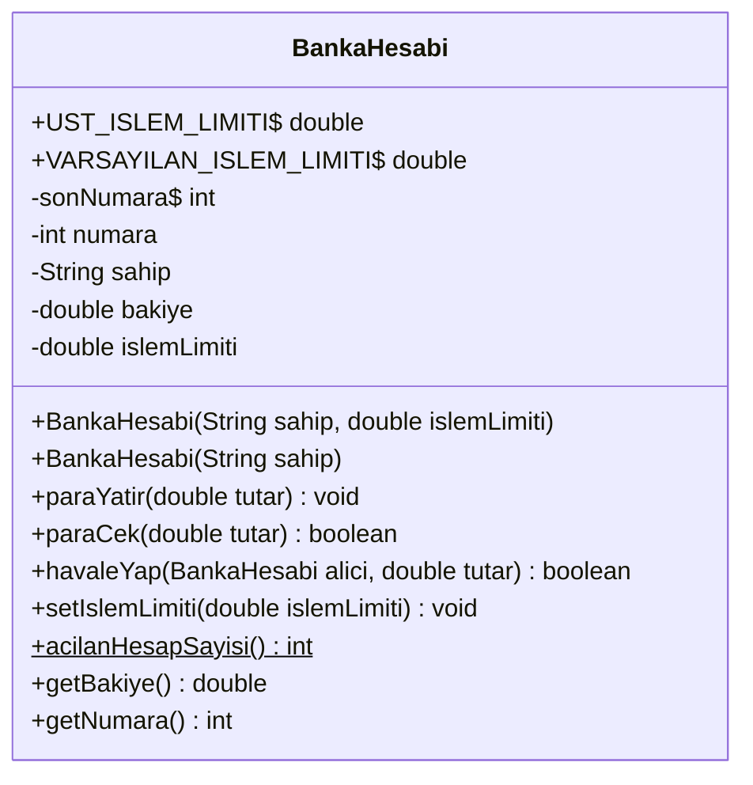
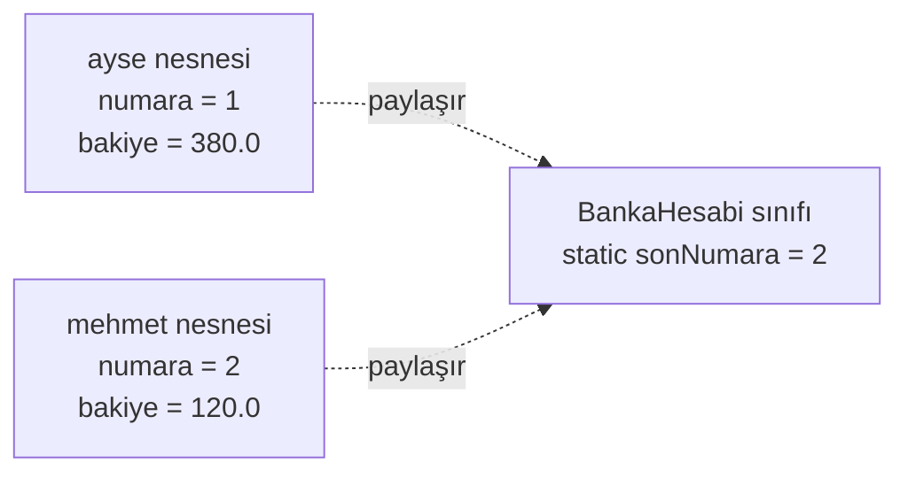
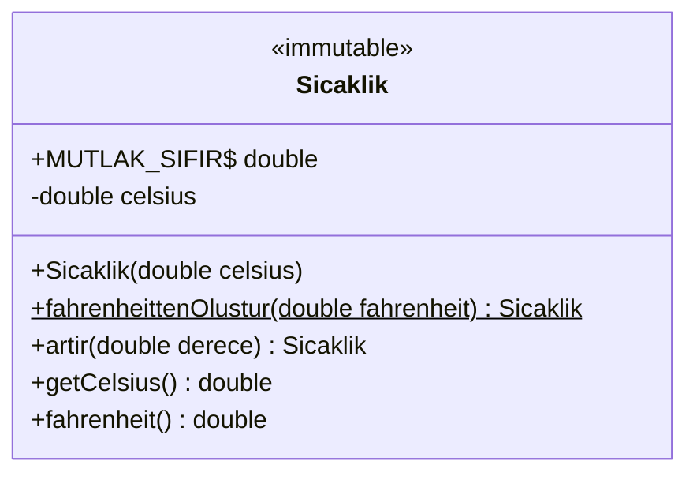

# 🔒 M3 - Kapsülleme

<p align="center"><em>Hafta 3</em></p>

## ❔ Öğrenme hedefleri

Bu modülün sonunda öğrenci:

* Erişim belirleyicilerle bir sınıfın iç durumunu korur
* Sınıf değişmezini (class invariant) tanımlar; geçerlilik kontrolü yapan kurucu ve setter yazar
* Geçersiz argümanda `IllegalArgumentException` fırlatır ve bunu `assertThrows` ile test eder
* `static` ve `final` üyeleri doğru yerde kullanır
* Değişmez (immutable) bir sınıf ve `record` tasarlar; dizi alanlarında savunmacı kopya kullanır

---

## 1. Kapsülleme neden gerekli? { #1-neden }

M1'deki prosedürel bankaya geri dönelim. Bakiyeler paralel bir dizideydi ve "bakiye negatif olamaz"
kuralı yalnızca `paraCek` fonksiyonunda yazılıydı. Diziye erişen herhangi bir kod
`bakiyeler[0] = -500;` yazarak kuralı atlayabiliyordu.

Veriyi bir sınıfa taşımak tek başına bu sorunu çözmez. Alanları `public` olan bir sınıf, paralel diziden
pek farklı değildir:

```java
public class AcikHesap {
    public String sahip;
    public double bakiye;     // herkes her değeri yazabilir
}

AcikHesap hesap = new AcikHesap();
hesap.bakiye = -500;          // derlenir; kural yine çiğnendi
```

**Kapsülleme** (encapsulation), bir nesnenin verisini dışarıya kapatıp yalnızca kontrollü metotlarla
erişilmesine izin vermektir. Böylece nesnenin kuralları tek bir yerde, sınıfın içinde yazılır ve
**derleyici** tarafından korunur. İlişkili fikir **bilgi gizleme** (information hiding): sınıfı kullanan
kod, verinin içeride nasıl saklandığını bilmek zorunda kalmamalıdır. Bakiyeyi yarın `double` yerine
kuruş cinsinden `long` olarak saklamaya karar verirsek yalnızca sınıfın içi değişmeli, onu kullanan
yüzlerce satır değil.

## 2. Erişim belirleyiciler { #2-erisim }

Java'da her sınıf üyesinin (alan, metot, kurucu) kimlerin erişebileceğini belirleyen bir **erişim
belirleyicisi** (access modifier) vardır:

| Belirleyici | Aynı sınıf | Aynı paket | Başka paketteki alt sınıf | Her yer | UML |
|---|:---:|:---:|:---:|:---:|:---:|
| `private` | ✓ | ✗ | ✗ | ✗ | `-` |
| (yazılmaz) paket erişimi | ✓ | ✓ | ✗ | ✗ | `~` |
| `protected` | ✓ | ✓ | ✓ | ✗ | `#` |
| `public` | ✓ | ✓ | ✓ | ✓ | `+` |

* **`private`**: yalnızca sınıfın kendi kodu erişir. Alanlar için varsayılan tercihiniz bu olmalı.
* **Paket erişimi** (package-private): hiçbir şey yazmazsanız üye aynı paketteki (`nyp.m3`) sınıflara
  açıktır. Birlikte çalışan birkaç sınıfın birbirine yardımcı üyelerini paylaşması için kullanılır.
* **`protected`**: paket erişimine ek olarak alt sınıflara da açılır. Kalıtımla birlikte M5'te işleyeceğiz.
* **`public`**: sınıfın dış dünyaya verdiği sözdür; bir kez `public` yaptığınız üyeyi, onu kullanan
  kodu bozmadan kaldıramazsınız.

!!! tip "Genel kural: olabildiğince kapalı"

    Her üyeyi olabilecek en kısıtlı erişimle başlatın; yalnızca gerçekten gerektiğinde açın. Alanlar
    neredeyse her zaman `private` olur; istisnası `public static final` sabitlerdir (§4).

!!! note "`private` nesneye değil, sınıfa göredir"

    Bir `BankaHesabi` metodu, **başka** bir `BankaHesabi` nesnesinin `private` alanına erişebilir.
    M2'deki `Nokta(Nokta diger)` kopya kurucusu da `diger.x` yazabiliyordu. Koruma, sınıfın dışındaki
    koda karşıdır.

## 3. Getter, setter ve sınıf değişmezleri { #3-getter-setter }

### 3.1 Sınıf değişmezi

**Sınıf değişmezi** (class invariant), bir nesne için her zaman doğru olması gereken koşuldur. Nesne
oluşturulduğu anda doğru olmalı ve her `public` metot bittiğinde hâlâ doğru kalmalıdır. M1'deki
`Hesap`'ı bu gözle geliştirelim. `BankaHesabi` sınıfının değişmezleri:

1. Sahip adı `null` ya da boş olamaz.
2. Bakiye hiçbir zaman negatif olamaz.
3. İşlem limiti `0`'dan büyük ve `UST_ISLEM_LIMITI` (100.000) değerinden küçük ya da ona eşittir.



Diyagramda altı çizili gösterilen (Mermaid'de `$` ile yazılan) üyeler `static`'tir (§4). Dikkat edin:
`setBakiye` yok. Bakiye yalnızca `paraYatir`, `paraCek` ve `havaleYap` ile değişir.

### 3.2 Geçerlilik kontrolü ve `IllegalArgumentException`

Birisi limiti `-5` yapmaya çalışırsa ne yapmalıyız? M1'de `false` döndürüyorduk. Ama `false`'u kontrol
etmeyi unutan çağıran, hiçbir şey olmamış gibi devam eder. Geçersiz bir argüman çoğunlukla **çağıranın
hatasıdır** ve sessizce geçiştirilmemelidir. Java'da bunun standart yolu bir **istisna** (exception)
fırlatmaktır: metot o noktada durur ve hata çağırana iletilir. Hatalı argümanlar için JDK'nın hazır
sınıfı `IllegalArgumentException`'dır. İstisnaları M8'de ayrıntılı işleyeceğiz; bu modülde yalnızca
fırlatmayı ve test etmeyi öğreniyoruz.

```java
public void setIslemLimiti(double islemLimiti) {
    this.islemLimiti = gecerliLimit(islemLimiti);          // (1)!
}

private static double gecerliLimit(double limit) {         // (2)!
    if (limit <= 0 || limit > UST_ISLEM_LIMITI) {
        throw new IllegalArgumentException(                 // (3)!
                "İşlem limiti 0 ile " + UST_ISLEM_LIMITI + " arasında olmalı: " + limit);
    }
    return limit;
}
```

1. Önce doğrula, sonra ata. Doğrulama başarısız olursa atama satırına hiç gelinmez; eski limit
   korunur ve nesne geçerli durumda kalır.
2. Kurucu da aynı metodu kullanır. Kural tek yerde yazılır; kurucu ile setter arasında fark oluşmaz.
3. `throw new ...` bir istisna nesnesi oluşturup fırlatır. Mesaja geçersiz değeri de yazın; hatayı
   ayıklayan kişi (çoğu zaman siz) teşekkür eder.

Kurucu da değişmezin ilk bekçisidir; geçersiz bir nesnenin hiç oluşmamasını sağlar:

```java
public BankaHesabi(String sahip, double islemLimiti) {
    if (sahip == null || sahip.isBlank()) {
        throw new IllegalArgumentException("Hesap sahibi boş olamaz");
    }
    this.sahip = sahip;
    this.islemLimiti = gecerliLimit(islemLimiti);
    sonNumara = sonNumara + 1;
    this.numara = sonNumara;
}
```

JUnit'te bir istisnanın fırlatıldığını `assertThrows` ile doğrularız. `assertThrows` fırlatılan istisnayı
döndürür; böylece mesajını da kontrol edebiliriz:

```java
@Test
@DisplayName("Setter geçersiz limiti reddeder ve eski limit korunur (sınıf değişmezi)")
void setterGecersizLimitiReddeder() {
    BankaHesabi hesap = new BankaHesabi("Ayşe", 5_000);

    assertThrows(IllegalArgumentException.class, () -> hesap.setIslemLimiti(0));   // (1)!
    assertThrows(IllegalArgumentException.class,
            () -> hesap.setIslemLimiti(BankaHesabi.UST_ISLEM_LIMITI + 1));
    assertEquals(5_000.0, hesap.getIslemLimiti(), 1e-9);

    hesap.setIslemLimiti(BankaHesabi.UST_ISLEM_LIMITI);   // sınır değeri geçerli
    assertEquals(BankaHesabi.UST_ISLEM_LIMITI, hesap.getIslemLimiti(), 1e-9);
}
```

1. `() -> ...` bir lambda ifadesidir (M10); "bu kodu çalıştır" diye okuyun. İstisna fırlatılmazsa ya
   da başka türde bir istisna fırlatılırsa test başarısız olur.

### 3.3 İstisna mı, `false` mu?

`paraCek` iki farklı başarısızlığı iki farklı biçimde bildiriyor:

| Durum | Kimin hatası? | `BankaHesabi`'nin tepkisi |
|---|---|---|
| `paraCek(-50)` | Çağıranın: negatif tutar anlamsız | `IllegalArgumentException` |
| `paraCek(1000)`, bakiye 300 | Kimsenin: olağan bir iş durumu | `false` döner, bakiye değişmez |

Yetersiz bakiye bir programlama hatası değildir; ATM ekranında "Bakiyeniz yetersiz" yazar ve hayat
devam eder. Negatif tutar ise programda bir yerde hata olduğunu gösterir ve hemen ortaya çıkmalıdır.

### 3.4 "Her alana getter/setter" tuzağı: Tell, Don't Ask

IDE'ler tek tıkla her alana getter ve setter üretebilir. Bunu alışkanlık hâline getirmek kapsüllemeyi
sessizce geri alır. `setBakiye` olan bir hesapta havale kodu şöyle yazılır:

```java
// KÖTÜ: kural çağıranın elinde
if (ayse.getBakiye() >= tutar) {
    ayse.setBakiye(ayse.getBakiye() - tutar);
    mehmet.setBakiye(mehmet.getBakiye() + tutar);
}
```

Kural ("bakiye yeterli mi?") yine sınıfın dışında ve her havale yapılan yerde tekrar yazılmak zorunda.
Birisi kontrolü unutursa bakiye negatife düşer; M1'deki paralel diziye geri döndük. Çözüm, nesneye ne
yapacağını **söylemek**, verisini isteyip kararı dışarıda vermemektir: **Tell, Don't Ask** (söyle, sorma).

```java
// İYİ: kural nesnenin içinde
ayse.havaleYap(mehmet, tutar);
```

```java
public boolean havaleYap(BankaHesabi alici, double tutar) {
    if (alici == null || alici == this) {
        throw new IllegalArgumentException("Geçersiz alıcı hesap");
    }
    if (!paraCek(tutar)) {
        return false;          // çekilemediyse alıcıya hiçbir şey yatırılmaz
    }
    alici.paraYatir(tutar);
    return true;
}
```

!!! tip "Getter ya da setter yazmadan önce sorun"

    *Bu alanı dışarıdan kim, neden değiştirmek istiyor?* Cevap bir iş kuralıysa (para çekmek, sınıf
    atlamak) bunun için anlamlı adı olan bir metot yazın. Bir setter ancak alanın dışarıdan serbestçe
    ama **geçerli** değerlerle ayarlanması gerçekten gerekiyorsa (işlem limiti gibi) ve doğrulama
    yapıyorsa yerindedir. Getter'lar daha zararsızdır, ama onlar da iç yapıyı dışarı sızdırabilir (§5.3).

## 4. `static` alanlar ve metotlar { #4-static }

Her hesabın benzersiz bir numarası olsun: ilk açılan 1, ikincisi 2... Bu sayacı nereye koyacağız?
Her nesnenin kendi `sonNumara` alanı olursa her hesap 1 numarayı alır. Sayaç **sınıfa** ait olmalı,
tüm nesneler onu paylaşmalıdır. `static` anahtar kelimesi tam olarak bunu söyler:

```java
private static int sonNumara = 0;   // tek kopya, sınıfa ait
private final int numara;           // her nesnede ayrı
```



`static` bir metot da nesneye değil sınıfa aittir ve sınıf adıyla çağrılır:
`BankaHesabi.acilanHesapSayisi()`. Bir nesnesi olmadığı için `static` metodun içinde `this` yoktur;
`bakiye` gibi örnek alanlarına doğrudan erişemez.

| | Örnek (instance) üyesi | `static` üye |
|---|---|---|
| Kime ait? | Her nesneye ayrı | Sınıfa, tek kopya |
| Nasıl erişilir? | `ayse.getBakiye()` | `BankaHesabi.acilanHesapSayisi()` |
| `this` kullanılabilir mi? | Evet | Hayır |
| Tipik kullanım | Nesnenin durumu ve davranışı | Sayaçlar, sabitler, yardımcı metotlar, fabrika metotları |

**Sabitler** `static final` olarak tanımlanır ve adları `UPPER_SNAKE_CASE` ile yazılır:
`public static final double UST_ISLEM_LIMITI = 100_000;`. Değişmedikleri için `public` olmaları
kapsüllemeyi bozmaz.

### 4.1 Yardımcı sınıf

`Math.sqrt(2)` yazarken bir `Math` nesnesi oluşturmayız; `Math` yalnızca `static` metotlardan oluşan bir
**yardımcı sınıftır** (utility class). Kendi yardımcı sınıfımızı yazalım:

```java
public final class Istatistik {            // (1)!

    private Istatistik() {                 // (2)!
    }

    public static double ortalama(int[] dizi) {
        bosOlmamali(dizi);
        long toplam = 0;
        for (int deger : dizi) {
            toplam = toplam + deger;
        }
        return (double) toplam / dizi.length;
    }
    // enBuyuk, enKucuk benzer
}
```

1. `final` sınıftan alt sınıf türetilemez (M5).
2. `private` kurucu: `new Istatistik()` yazılamaz. Durumu olmayan bir sınıfın nesnesini oluşturmak
   anlamsızdır; bunu derleyiciye de söylüyoruz.

!!! warning "`static`'i her derde deva sanmayın"

    Her şeyi `static` yapmak, M1'de bıraktığımız prosedürel stile geri dönmektir. `static` değiştirilebilir
    alanlar (bizim `sonNumara` gibi) tüm programın paylaştığı bir durumdur ve test etmeyi zorlaştırır:
    `BankaHesabiTest`'te numaraların tam değerini değil, **ardışık** olduklarını test etmemizin
    nedeni bu. Kullanımı sayaç ve sabit gibi gerçekten sınıf düzeyindeki bilgilerle sınırlı tutun.

## 5. `final` ve değişmez nesneler { #5-final-degismez }

### 5.1 `final` alanlar

`final` bir alana yalnızca **bir kez** değer atanabilir; bunu da en geç kurucu bitmeden yapmak
gerekir. `BankaHesabi`'nin `numara` ve `sahip` alanları `final`: hesap açıldıktan sonra numarası ve
sahibi değişmez. Derleyici bunu garanti eder; yanlışlıkla `numara = 0;` yazarsanız kod derlenmez.

### 5.2 Değişmez sınıf

**Değişmez** (immutable) bir nesnenin durumu oluşturulduktan sonra **hiç** değişmez. Değişmez nesneler
aliasing sorunu yaşamaz (M2 §5): iki referans aynı nesneyi gösterse bile kimse onu değiştiremeyeceği
için paylaşmak güvenlidir. Hep kullandığınız `String` değişmezdir:

```java
String ad = "ayşe";
ad.toUpperCase();              // ad değişmez; sonuç kullanılmadan atıldı
String buyuk = ad.toUpperCase();
System.out.println(ad + " " + buyuk);   // ayşe AYŞE
```

Bir sınıfı değişmez yapmanın tarifi: (1) sınıfı `final` yap, (2) tüm alanları `private final` yap,
(3) setter yazma, (4) "değiştiren" her metot **yeni bir nesne döndürsün**, (5) değiştirilebilir alanlar
varsa savunmacı kopya kullan (§5.3).



```java
public final class Sicaklik {

    public static final double MUTLAK_SIFIR = -273.15;

    private final double celsius;

    public Sicaklik(double celsius) {
        if (celsius < MUTLAK_SIFIR) {
            throw new IllegalArgumentException("Mutlak sıfırın altında sıcaklık olamaz: " + celsius);
        }
        this.celsius = celsius;
    }

    public static Sicaklik fahrenheittenOlustur(double fahrenheit) {   // (1)!
        return new Sicaklik((fahrenheit - 32) * 5 / 9);
    }

    public Sicaklik artir(double derece) {
        return new Sicaklik(celsius + derece);                           // (2)!
    }
}
```

1. **Static fabrika metodu** (static factory method): kurucuya anlamlı bir ad verir.
   `new Sicaklik(98.6)` Celsius mu Fahrenheit mi belli değildir; `fahrenheittenOlustur(98.6)` bellidir.
2. Yeni nesne kurucudan geçtiği için doğrulama atlanamaz: `new Sicaklik(-270).artir(-10)` istisna fırlatır.

```java
@Test
@DisplayName("artir yeni nesne döndürür, asıl nesne değişmez")
void artirYeniNesneDondurur() {
    // Hazırla
    Sicaklik sabah = new Sicaklik(12.5);
    // Çalıştır
    Sicaklik ogle = sabah.artir(8);
    // Doğrula
    assertNotSame(sabah, ogle);
    assertEquals(12.5, sabah.getCelsius(), 1e-9);
    assertEquals(20.5, ogle.getCelsius(), 1e-9);
}
```

### 5.3 Savunmacı kopya { #53-savunmaci-kopya }

`final` bir alan **referansı** sabitler, gösterdiği nesneyi değil. `private final int[] notlar;` alanına
başka bir dizi atanamaz, ama dizinin elemanları değiştirilebilir. Kurucu dışarıdan gelen diziyi olduğu
gibi saklarsa, onu veren kod da elinde bir referans tutar (M2'deki paylaşılan köşe sorunu):

```java
int[] dizi = {70, 85, 90};
SinavNotlari notlar = new SinavNotlari("BLM102", dizi);
dizi[0] = -500;     // kopya almasaydık, "not 0-100 aralığında" değişmezi dışarıdan bozulurdu
```

Çözüm **savunmacı kopya** (defensive copy): dışarıdan gelen değiştirilebilir nesnenin kopyasını sakla,
dışarıya da kopyasını ver.

```java
public SinavNotlari(String dersKodu, int[] notlar) {
    int[] kopya = notlar.clone();          // (1)!
    if (kopya.length == 0) {
        throw new IllegalArgumentException("En az bir not olmalı");
    }
    for (int not : kopya) {
        if (not < 0 || not > 100) {
            throw new IllegalArgumentException("Not 0-100 aralığında olmalı: " + not);
        }
    }
    this.dersKodu = dersKodu;
    this.notlar = kopya;
}

public int[] getNotlar() {
    return notlar.clone();                 // (2)!
}
```

1. Önce kopyala, sonra **kopyayı** doğrula. Tersini yaparsak doğrulama ile kopyalama arasında dizi
   değiştirilebilir (bu, eşzamanlı programlarda gerçek bir güvenlik açığıdır).
2. Getter da kopya döndürür; yoksa `getNotlar()[0] = -500;` ile değişmez yine bozulurdu.

`SinavNotlariTest`, iki kapıyı da test eder: kurucuya verilen diziyi ve getter'ın döndürdüğü diziyi
değiştirmek nesneyi etkilemez. Listelerde de aynı ilke geçerlidir; `List.copyOf` gibi araçları M9'da
göreceğiz.

## 6. `record` { #6-record }

`Sicaklik` gibi değişmez veri sınıfları çok yaygındır ve yazması uzundur: `private final` alanlar,
kurucu, getter'lar, `toString`, `equals`... Java 16'dan beri (JEP 395) bunun kısa yolu **record**'dur.
M1'de parayı `double` ile tutmanın sakıncasını görmüştük; kuruş cinsinden `long` tutan bir `Para` yazalım:

```java
public record Para(long kurus, String paraBirimi) {        // (1)!

    public Para {                                            // (2)!
        if (kurus < 0) {
            throw new IllegalArgumentException("Tutar negatif olamaz: " + kurus);
        }
        if (paraBirimi == null || paraBirimi.length() != 3) {
            throw new IllegalArgumentException("Para birimi üç harfli bir kod olmalı: " + paraBirimi);
        }
        paraBirimi = paraBirimi.toUpperCase(Locale.ROOT);    // (3)!
    }

    public static Para tl(long lira, int kurus) {
        if (kurus < 0 || kurus > 99) {
            throw new IllegalArgumentException("Kuruş 0-99 aralığında olmalı: " + kurus);
        }
        return new Para(lira * 100 + kurus, "TRY");
    }

    public Para topla(Para diger) {
        ayniBirimOlmali(diger);
        return new Para(kurus + diger.kurus, paraBirimi);   // yeni nesne
    }
    // cikar, bicimli ve ayniBirimOlmali benzer
}
```

1. Başlıktaki bileşenler (components) `kurus` ve `paraBirimi`, derleyiciye şunları ürettirir:
   `private final` alanlar, tüm alanları alan kurucu, `kurus()` ve `paraBirimi()` erişimcileri
   (`get` öneki yok), içeriğe bakan `equals`/`hashCode` ve `Para[kurus=1250, paraBirimi=TRY]` biçiminde
   `toString`.
2. **Kompakt kurucu** (compact constructor): parantez ve parametre listesi yazılmaz. Gövde, parametreler
   alanlara atanmadan **önce** çalışır; doğrulama için idealdir.
3. Kompakt kurucuda parametreye yeni değer atayabilirsiniz; alana atanacak olan budur (normalleştirme).
   `Locale.ROOT` neden? Türkçe yerel ayarda `"i".toUpperCase()` sonucu `"İ"` olur; para birimi kodları
   gibi dilden bağımsız metinlerde bu sürpriz istenmez.

| Record'da | Durum |
|---|---|
| Alanlar | Otomatik `private final`; başlık dışında örnek alanı eklenemez |
| Sınıf | Otomatik `final`; başka bir sınıftan türetilemez |
| `equals` | İçeriğe bakar: `Para.tl(12, 50).equals(new Para(1250, "TRY"))` true (ayrıntısı M5) |
| Eklenebilenler | Metotlar, `static` alanlar ve metotlar, ek kurucular (`this(...)` ile ana kurucuya zincirlenir) |

```java
@Test
@DisplayName("Record equals içeriğe bakar; farklı nesneler eşit olabilir")
void equalsIcerigeBakar() {
    Para a = Para.tl(12, 50);
    Para b = new Para(1250, "TRY");

    assertNotSame(a, b);   // iki ayrı nesne
    assertEquals(a, b);    // ama içerikleri eşit
}
```

!!! warning "Record sığ (shallow) değişmezdir"

    Bir record bileşeni dizi ya da değiştirilebilir bir nesneyse, record yalnızca referansı sabitler.
    `record Notlar(int[] degerler)` içindeki dizinin elemanları değiştirilebilir. Gerekirse kompakt
    kurucuda savunmacı kopya alın ve erişimciyi kendiniz yazıp kopya döndürün (§5.3).

!!! example "Kendinizi deneyin"

    `Sicaklik` sınıfını bir record olarak yeniden yazın. Hangi satırlar kaybolur, hangileri kalır?

    ??? success "Cevap"

        ```java
        public record Sicaklik(double celsius) {
            public static final double MUTLAK_SIFIR = -273.15;

            public Sicaklik {
                if (celsius < MUTLAK_SIFIR) {
                    throw new IllegalArgumentException("Mutlak sıfırın altında sıcaklık olamaz: " + celsius);
                }
            }

            public static Sicaklik fahrenheittenOlustur(double fahrenheit) {
                return new Sicaklik((fahrenheit - 32) * 5 / 9);
            }

            public Sicaklik artir(double derece) {
                return new Sicaklik(celsius + derece);
            }
        }
        ```

        `private final` alan, atama yapan kurucu gövdesi ve `getCelsius()` kaybolur (yerine `celsius()`
        gelir). Doğrulama, fabrika metodu ve `artir` kalır. Kazanç olarak içeriğe bakan `equals`
        gelir: `new Sicaklik(20).equals(new Sicaklik(20))` artık true.

## 7. Alıştırmalar

Bu modülün alıştırmaları `exercise_files/` klasöründeki Maven projesindedir: kaynak kod
`src/main/java/nyp/m3/`, testler `src/test/java/nyp/m3/` altında.

```bash
mvn -pl m3_kapsulleme/exercise_files test
```

1. **Derleyiciyi deneyin.** `KapsullemeUygulamasi.main` içine `ayse.bakiye = -500;` ve
   `new Istatistik();` satırlarını ekleyin. Derleyici mesajlarını not edip satırları silin.
2. **NaN deliği.** `hesap.paraYatir(Double.NaN)` çağrısı ne yapar? `NaN <= 0` ifadesinin değerini
   araştırın. `BankaHesabi`'nin değişmezleri korunuyor mu? Sorunu gösteren bir test yazıp
   `paraYatir` ve `paraCek`'i düzeltin.

    ??? success "İpucu"

        `NaN` ile yapılan her karşılaştırma `false` verir; bu yüzden `tutar <= 0` kontrolü `NaN`'ı
        geçirir ve bakiye `NaN` olur. `if (!(tutar > 0))` ya da `Double.isNaN(tutar)` kontrolü ekleyin.

3. **Değişmez tarih.** `year`, `month`, `day` yerine Türkçe adlı alanları olan değişmez bir `Tarih`
   record'u yazın: ay 1-12, gün 1-31 aralığında olsun (ayların gün sayısını şimdilik yok sayabilirsiniz).
   `ertesiGun()` metodu yeni bir `Tarih` döndürsün. En az dört test yazın; ayın son gününü unutmayın.
4. **Savunmacı kopya testi.** `SinavNotlari`'nın kurucusundaki `.clone()` çağrısını kaldırın ve
   testleri çalıştırın. Hangi test başarısız oluyor? Sonra getter'dakini kaldırıp aynı soruyu sorun.
5. **M2'ye dönüş.** M2'deki `Dikdortgen` sınıfının paylaşılan köşe sorununu savunmacı kopyayla
   düzeltin. `Nokta` değişmez olsaydı bu kopyaya gerek kalır mıydı? Neden?

---

## Özet

Kapsülleme, nesnenin verisini `private` alanlarda saklayıp yalnızca kontrollü metotlarla erişilmesine
izin vermektir; böylece sınıf, değişmezlerini derleyicinin yardımıyla kendisi korur. Java'da dört erişim
düzeyi vardır: `private`, paket erişimi, `protected` ve `public`; varsayılan tercih en kapalısı olmalıdır.
Kurucular ve setter'lar gelen değeri doğrular ve geçersiz argümanda `IllegalArgumentException` fırlatır;
olağan iş durumları ise dönüş değeriyle bildirilir. Her alana otomatik getter/setter yazmak kapsüllemeyi
geri alır; nesneye ne yapacağını söyleyin (Tell, Don't Ask). `static` üyeler sınıfa aittir ve sayaç, sabit,
yardımcı metot gibi sınıf düzeyindeki bilgiler içindir. `final` bir alana bir kez atama yapılır; değişmez
bir sınıfın "değiştiren" metotları yeni nesne döndürür. Değiştirilebilir alanlar savunmacı kopyayla
korunur. `record`, değişmez veri sınıflarını kısaca yazmanın yoludur ve kompakt kurucusu doğrulama için
idealdir. Bir sonraki modülde nesneler arası ilişkileri ve UML'yi işliyoruz.

## İleri okuma

* [The Java Tutorials: Controlling Access to Members of a Class](https://docs.oracle.com/javase/tutorial/java/javaOO/accesscontrol.html),
  Oracle. Erişim belirleyiciler tablosunun resmî kaynağı.
* [The Java Tutorials: Understanding Class Members](https://docs.oracle.com/javase/tutorial/java/javaOO/classvars.html),
  Oracle. `static` alanlar, metotlar ve sabitler.
* [The Java Tutorials: A Strategy for Defining Immutable Objects](https://docs.oracle.com/javase/tutorial/essential/concurrency/imstrat.html),
  Oracle. Değişmez sınıf tarifinin ayrıntılı hâli.
* Martin Fowler, [TellDontAsk](https://martinfowler.com/bliki/TellDontAsk.html). "Tell, Don't Ask"
  ilkesine kısa bir giriş.

## Kaynaklar

* Joshua Bloch, *Effective Java*, 3. baskı, Addison-Wesley, 2018. Madde 4 ("Enforce noninstantiability
  with a private constructor"), Madde 15 ("Minimize the accessibility of classes and members"),
  Madde 16 ("In public classes, use accessor methods, not public fields"), Madde 17 ("Minimize
  mutability"), Madde 50 ("Make defensive copies when needed"). §2, §4.1, §5'in dayandığı kaynak.
* Cay S. Horstmann, *Core Java, Volume I: Fundamentals*, 12. baskı, Pearson, 2022, 4. bölüm
  ("Objects and Classes"). Kapsülleme, `static`, `final` ve record anlatımı.
* [JEP 395: Records](https://openjdk.org/jeps/395). §6'daki record kuralları ve kompakt kurucunun kaynağı.
* [Java SE 21 API: `java.lang.Record`](https://docs.oracle.com/en/java/javase/21/docs/api/java.base/java/lang/Record.html)
  ve [`java.lang.IllegalArgumentException`](https://docs.oracle.com/en/java/javase/21/docs/api/java.base/java/lang/IllegalArgumentException.html).
* [The Java Language Specification, Java SE 21 Edition](https://docs.oracle.com/javase/specs/jls/se21/html/index.html),
  §6.6 (erişim denetimi), §8.3.1.2 (`final` alanlar), §8.10 (record sınıfları).
* [JUnit 5 User Guide](https://junit.org/junit5/docs/current/user-guide/). `assertThrows` kullanımı.
