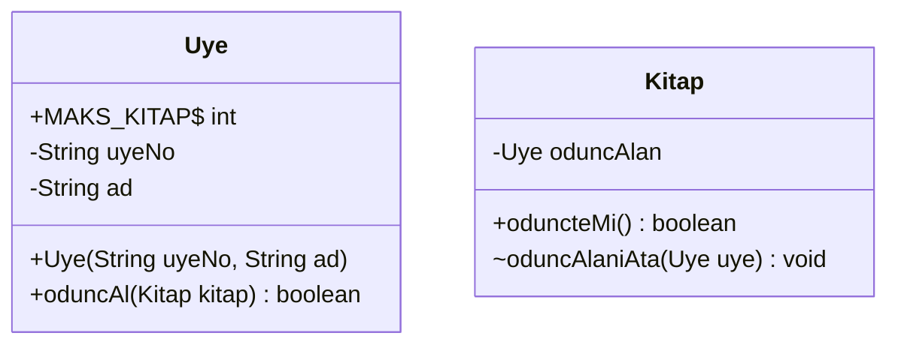
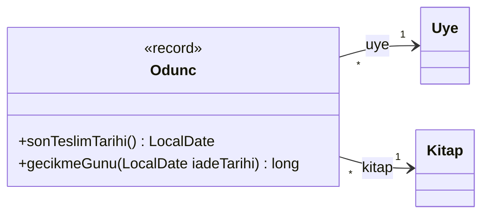
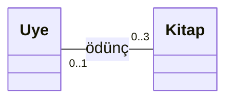
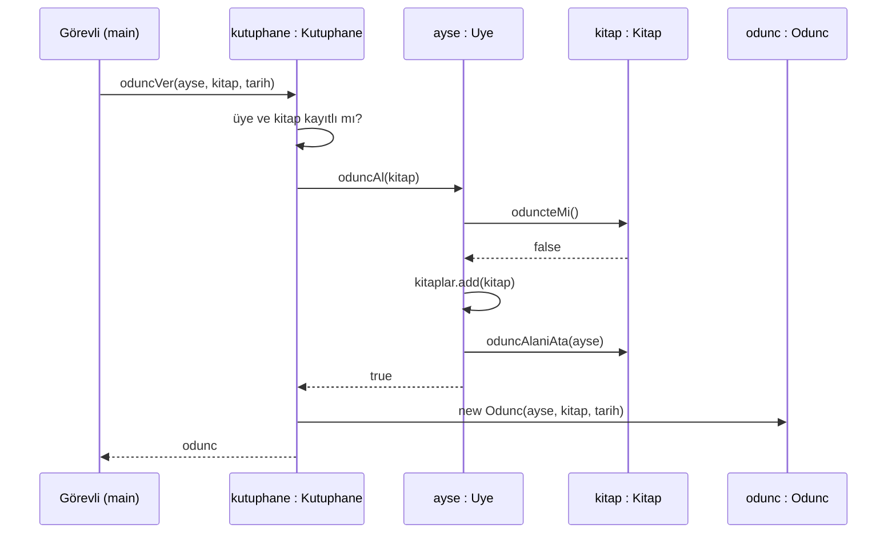
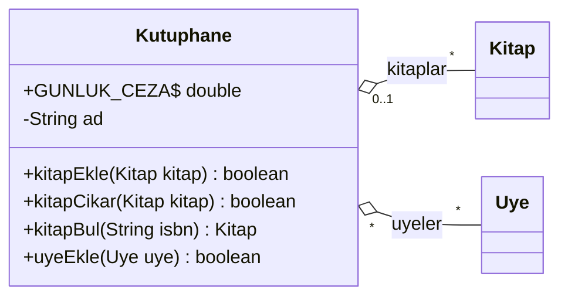
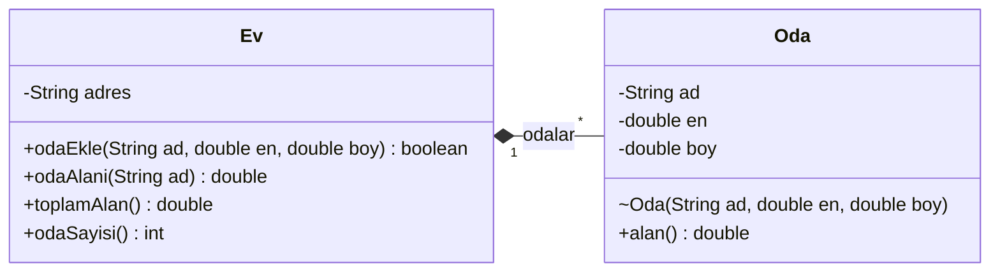
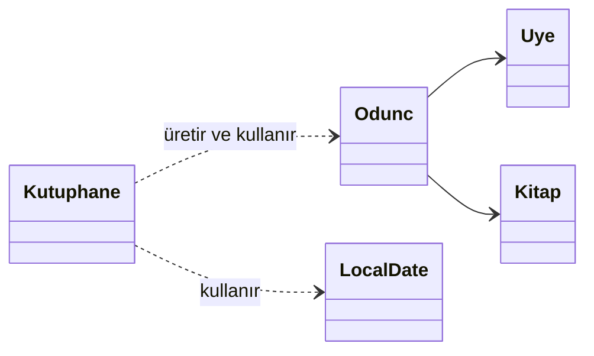
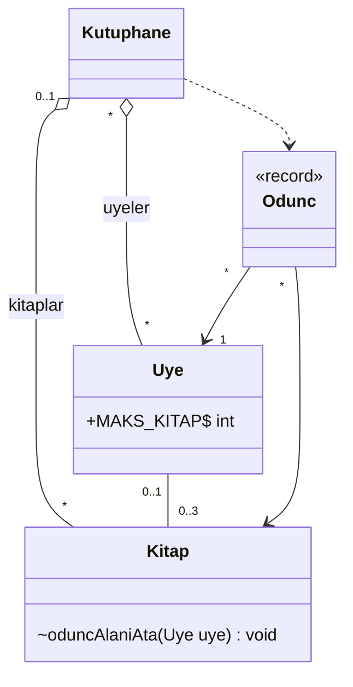

# 🔗 M4 - Nesneler Arası İlişkiler ve UML

<p align="center"><em>Hafta 4</em></p>

## ❔ Öğrenme hedefleri

Bu modülün sonunda öğrenci:

* UML sınıf diyagramını okumak ve çizmek
* İlişkilendirme, toplama, bileşim ve bağımlılığı ayırt etmek
* Bir diyagramı Java koduna, Java kodunu diyagrama dönüştürmek

---

## 1. UML sınıf diyagramı { #1-uml }

Şimdiye kadar sınıfları tek tek tasarladık: bir `Hesap`, bir `Ogrenci`. Gerçek bir programda ise asıl
iş sınıfların **birlikte** çalışmasıyla yapılır. Bir kütüphane yazılımında kitaplar, üyeler ve ödünç
kayıtları birbirini tanır, birbirine mesaj gönderir. Bu ilişkileri koda dökmeden önce bir kâğıt üzerinde
konuşabilmek için ortak bir dile ihtiyaç duyarız. O dil **UML**'dir (Unified Modeling Language).

UML, OMG (Object Management Group) tarafından standartlaştırılmış bir görsel modelleme dilidir; güncel
sürümü UML 2.5.1'dir (2017). Standart, on dört diyagram türü tanımlar. Bu derste en çok ikisini
kullanacağız: yapıyı gösteren **sınıf diyagramı** (class diagram) ve zaman içindeki mesajlaşmayı
gösteren **sıralama diyagramı** (sequence diagram). Martin Fowler'ın *UML Distilled* kitabındaki
tavsiyeye uyarak UML'yi bir "eskiz dili" gibi kullanacağız: her ayrıntıyı değil, konuşmak istediğimiz
şeyi çizeceğiz.

### 1.1 Bölmeler ve görünürlük

Bir sınıf dikdörtgen bir kutuyla çizilir. Kutunun üç bölmesi (compartment) vardır: üstte **ad**, ortada
**nitelikler** (attributes, Java'da alanlar), altta **işlemler** (operations, Java'da metotlar). Alt iki
bölme boş bırakılabilir ya da hiç çizilmeyebilir.



Her üyenin önündeki simge görünürlüğü (visibility) gösterir. M3'teki erişim belirleyicilerin UML
karşılıkları şunlardır:

| UML simgesi | Anlamı | Java karşılığı |
|---|---|---|
| `+` | public | `public` |
| `-` | private | `private` |
| `#` | protected | `protected` (M5'te göreceğiz) |
| `~` | package | belirleyici yazılmaz (paket içi, package-private) |

UML standardında tip, adın **arkasına** iki nokta ile yazılır: `- bakiye : double`,
`+ paraCek(tutar : double) : boolean`. Bu derste diyagramları Mermaid ile çizdiğimiz için Java'ya yakın
`-double bakiye` yazımını kullanıyoruz; ikisi de aynı bilgiyi taşır. Birkaç gösterim daha:

| Gösterim | UML standardında | Mermaid'de | Örnek |
|---|---|---|---|
| `static` üye | Altı çizili | Sonuna `$` | `+MAKS_KITAP$ int` |
| Soyut (abstract) sınıf | Adı *italik* ya da `{abstract}` | `<<abstract>>` | `class Sekil { <<abstract>> }` (M7) |
| Soyut metot | *İtalik* | Sonuna `*` | `+alan()* double` |
| Sabit (`final`) alan | `{readOnly}` | Özel gösterimi yok; adı BÜYÜK_HARF yazılır | `MAKS_KITAP` |

!!! tip "Diyagramı nerede çizeceğim?"

    Bu sitedeki diyagramlar metin olarak yazılan **Mermaid** koduyla çizilir; GitHub ve IntelliJ de
    Mermaid'i gösterir. Fareyle çizmeyi tercih ederseniz ücretsiz **draw.io** (diagrams.net) aracının
    "UML" şekil kütüphanesini kullanabilirsiniz. Araç isteğe bağlıdır; ödevlerde önemli olan diyagramın
    doğru olmasıdır, hangi araçla çizildiği değil.

### 1.2 İlişki okları: genel bakış

Sınıflar arasındaki çizgiler ilişkinin türünü söyler. Bu modülün geri kalanı bu tabloyu açmaktan ibaret:

| İlişki | UML çizimi | Mermaid | Günlük dilde |
|---|---|---|---|
| İlişkilendirme (association) | Düz çizgi (yönlüyse ok) | `A --> B`, `A -- B` | "A, B'yi tanır" |
| Toplama (aggregation) | Bütün tarafında içi boş elmas | `A o-- B` | "A'nın B'leri var, B tek başına da yaşar" |
| Bileşim (composition) | Bütün tarafında içi dolu elmas | `A *-- B` | "B, A'nın parçasıdır, A'sız var olmaz" |
| Bağımlılık (dependency) | Kesikli ok | `A ..> B` | "A, B'yi bir an için kullanır" |
| Kalıtım (generalization) | İçi boş üçgen uçlu ok | M5'te | "B bir A'dır" |

## 2. İlişkilendirme (association) ve çokluk { #2-iliskilendirme }

**İlişkilendirme**, bir sınıfın nesnelerinin başka bir sınıfın nesnelerini **kalıcı olarak tanıması**
demektir. Java'da bunun karşılığı basittir: bir sınıfın **alanı** (field), diğer sınıfın tipindedir.

### 2.1 Tek yönlü ilişkilendirme

Kütüphanede her ödünç işleminin bir kaydı olsun: hangi üye, hangi kitabı, hangi tarihte aldı. Bu kaydı
M3'te öğrendiğimiz bir `record` ile tutalım:

```java
public record Odunc(Uye uye, Kitap kitap, LocalDate alisTarihi) {   // (1)!

    public static final int SURE_GUN = 14;

    public LocalDate sonTeslimTarihi() {
        return alisTarihi.plusDays(SURE_GUN);
    }
    // gecikmeGunu(LocalDate) ve null kontrolleri exercise_files'ta
}
```

1. `Odunc` bir `Uye` ve bir `Kitap` alanı taşıyor: kayıt üyesini ve kitabını **tanıyor**. Tersi doğru
   değil; `Uye` sınıfında `Odunc` tipinde bir alan yok. Bu yüzden ilişki **tek yönlüdür** (unidirectional).
   `LocalDate`, JDK'nın tarih sınıfıdır (`java.time`); `plusDays(14)` tarihe 14 gün ekler.



Okun yönü "kim kimi tanıyor" sorusunun cevabıdır: `Odunc`'tan `Uye`'ye bakılabilir, `Uye`'den
`Odunc`'a bakılamaz. Okun ucundaki `uye` etiketi, ilişkinin o uçtaki **rol adıdır** ve Java'da genellikle
alanın adı olur.

### 2.2 Çokluk (multiplicity)

Çizginin iki ucundaki sayılar **çokluktur**: karşı taraftaki bir nesneye bu taraftan kaç nesne
bağlanabilir? Yukarıdaki diyagram şöyle okunur: "Her ödünç kaydının **tam bir** üyesi vardır; bir üyenin
**sıfır ya da daha çok** ödünç kaydı olabilir."

| Çokluk | Anlamı | Java'da tipik karşılığı |
|---|---|---|
| `1` | Tam olarak bir | `null` olamayan bir alan (kurucuda kontrol edilir) |
| `0..1` | Hiç ya da bir | `null` olabilen bir alan |
| `*` (ya da `0..*`) | Sıfır ya da daha çok | Dizi ya da liste alanı |
| `1..*` | En az bir | Liste alanı + "boş olamaz" kuralı |
| `0..3` | Sıfır ile üç arası | Liste alanı + üst sınır kontrolü |

Çokluk yalnızca bir çizim ayrıntısı değildir; **korunması gereken bir kuraldır**. `0..3` yazdıysanız
dördüncü kitabı reddeden kodu da yazmanız gerekir.

### 2.3 Çift yönlü ilişkilendirme ve tutarlılık { #2-3-cift-yonlu }

Kütüphane görevlisi iki soru sorar: "Ayşe'nin elinde hangi kitaplar var?" ve "Simyacı şu anda kimde?"
İkisini de hızlı cevaplamak için ilişkiyi **çift yönlü** (bidirectional) kurarız: üye kitaplarını,
kitap da onu ödünç alan üyeyi tanır.



"Bir kitap en fazla bir üyededir; bir üyenin elinde en fazla üç kitap olur." Java'da iki tarafın da
alanı vardır. Üye tarafında birden çok kitap tutmak için `java.util.ArrayList` kullanıyoruz.

!!! note "`ArrayList` şimdilik bir kutu"

    `ArrayList<Kitap>`, boyu kendiliğinden büyüyen bir dizi gibi düşünülebilir. Bu modülde yalnızca
    `add` (ekle), `get(i)` (i. elemanı al), `size()` (eleman sayısı), `remove` (çıkar),
    `contains` (içinde mi?) ve for-each döngüsünü kullanıyoruz. `<Kitap>` yazımının (generics) ve
    koleksiyonların ayrıntısı M9'da.

Çift yönlü ilişkinin tehlikesi şudur: iki alan birbirinin **aynası** olmak zorundadır. Üyenin listesine
kitabı ekleyip kitabın `oduncAlan` alanını güncellemeyi unutursak, sistem aynı anda iki farklı şey
söyler: "Ayşe'de Simyacı var" ve "Simyacı rafta". Bir başka üye rafta sandığı kitabı da alır. Çözüm,
iki tarafı **tek bir metotta, birlikte** güncellemektir:

```java
public class Uye {

    public static final int MAKS_KITAP = 3;
    private final ArrayList<Kitap> kitaplar = new ArrayList<>();
    // uyeNo, ad, kurucu ve getter'lar exercise_files'ta

    public boolean oduncAl(Kitap kitap) {
        if (kitap == null) {
            throw new IllegalArgumentException("Kitap null olamaz");
        }
        if (kitap.oduncteMi() || kitaplar.size() >= MAKS_KITAP) {   // (1)!
            return false;
        }
        kitaplar.add(kitap);        // bu taraf: üye kitabı biliyor
        kitap.oduncAlaniAta(this);  // (2)!
        return true;
    }
}
```

1. İki kural birden: kitap başkasındaysa ya da üyenin `0..3` sınırı dolduysa işlem yapılmaz.
2. Karşı taraf. `Kitap.oduncAlaniAta` **paket içi** (`~`) tanımlı: yalnızca aynı paketteki `Uye`
   çağırabilir. Başka paketteki bir kod kitabın sahibini tek taraflı değiştiremez; bağlantıyı kurmanın
   tek yolu `oduncAl`'dır. `iadeEt` metodu da aynı biçimde iki tarafı birlikte koparır.

Tutarlılık kuralını bir testle sabitleyelim:

```java
@Test
@DisplayName("oduncAl ilişkinin iki tarafını da günceller")
void oduncAlIkiTarafiGunceller() {
    // Hazırla
    Uye ayse = new Uye("U-001", "Ayşe");
    Kitap kitap = new Kitap("111", "Simyacı");
    // Çalıştır
    boolean sonuc = ayse.oduncAl(kitap);
    // Doğrula
    assertTrue(sonuc);
    assertTrue(ayse.elindeMi(kitap));       // üye -> kitap
    assertSame(ayse, kitap.getOduncAlan()); // kitap -> üye
    assertEquals(1, ayse.oduncKitapSayisi());
}
```

`assertSame(a, b)`, iki referansın **aynı nesneyi** gösterdiğini doğrular (M2'deki `==` karşılaştırması).

!!! warning "Çift yönlü ilişki pahalıdır"

    Her çift yönlü ilişki, "iki tarafı birlikte güncelle" yükümlülüğü getirir. Bir yön yeterliyse tek
    yönlü kurun. Fowler da *UML Distilled*'da çift yönlü ilişkilerin tutarlı tutulmasının ek iş
    olduğunu vurgular.

### 2.4 Sıralama diyagramı: ödünç alma akışı { #2-4-siralama }

Sınıf diyagramı "kim kimi tanıyor" sorusunu cevaplar, ama "ne zaman, hangi sırayla" sorusunu
cevaplamaz. Bunun için **sıralama diyagramı** (sequence diagram) kullanılır. Dikey çizgiler nesnelerin
yaşam çizgisi (lifeline), yatay oklar mesajlar (metot çağrıları), kesikli oklar dönüş değerleridir.
Aşağıdaki akış `KutuphaneUygulamasi.main`'de çalışır:



Diyagram tutarlılık kuralını görünür kılar: `Kitap` nesnesinin durumunu **yalnızca `Uye`** değiştiriyor;
`Kutuphane` ve `main` kitabın alanına dokunmuyor.

## 3. Toplama (aggregation) { #3-toplama }

Bir kütüphanenin kitapları vardır. Ama kitaplar kütüphaneden **önce** de vardır: yayınevinden gelir,
bağışlanır, başka bir şubeye devredilir. Kütüphane kapansa kitaplar yok olmaz, başka bir kütüphaneye
gider. Bu "bütün-parça" ilişkisinde parça bütünden bağımsız yaşar; buna **toplama** (aggregation) denir.



Java'da toplamayı ele veren iz, **parçanın dışarıda yaratılıp içeri verilmesidir**:

```java
public class Kutuphane {

    private final ArrayList<Kitap> kitaplar = new ArrayList<>();

    public boolean kitapEkle(Kitap kitap) {         // (1)!
        if (kitap == null) {
            throw new IllegalArgumentException("Kitap null olamaz");
        }
        if (kitapBul(kitap.getIsbn()) != null) {
            return false;
        }
        kitaplar.add(kitap);
        return true;
    }

    public boolean kitapCikar(Kitap kitap) {        // (2)!
        if (kitap == null || kitap.oduncteMi()) {
            return false;
        }
        return kitaplar.remove(kitap);
    }
}
```

1. Kitap parametre olarak geliyor; onu `new` ile yaratan `Kutuphane` değil, çağıran kod.
2. Parça bütünden ayrılabiliyor. `remove`, eleman listedeyse çıkarıp `true`, değilse `false` döndürür.

Toplamanın asıl testi şu sorudur: **parça başka bir bütüne geçebilir mi?** `KutuphaneTest`'teki
`kitapBaskaKutuphaneyeGecebilir` testi tam bunu yapar: kitabı `merkez`'den çıkarır, `sube`'ye ekler ve
`assertSame` ile şubedeki kitabın **aynı nesne** olduğunu doğrular.

!!! note "Toplama tartışmalı bir gösterimdir"

    UML 2.5.1 standardı, "paylaşılan" (shared) toplamanın kesin anlamının uygulama alanına ve
    modelleyene göre değiştiğini açıkça söyler. Fowler da *UML Distilled*'da toplamanın anlamının
    belirsiz olduğunu belirtir ve kendi diyagramlarında kullanmamayı önerir. Pratikte birçok ekip
    toplama yerine düz ilişkilendirme çizer. Bu derste toplamayı, bileşimle **karşıtlığını** görmek için
    kullanıyoruz: aradaki fark elmasın dolu ya da boş olmasından çok, parçanın yaşam süresidir.

## 4. Bileşim (composition) { #4-bilesim }

Bir evin odaları vardır. Ama bir oda evden bağımsız var olamaz: "Kadıköy'deki evin salonunu alıp
Çankaya'daki eve taşıyalım" cümlesi anlamsızdır. Ev yıkılırsa odaları da yok olur. Parçanın bütünle
birlikte doğup öldüğü bu daha güçlü bütün-parça ilişkisine **bileşim** (composition) denir. UML'de
bütün tarafında **içi dolu** elmasla çizilir. Bir parça aynı anda en fazla **bir** bütüne ait olabilir;
bu yüzden bütün tarafının çokluğu her zaman `1` (ya da `0..1`) olur.



Java'da bir nesneyi "öldüren" bir komut yoktur; bir nesneye hiçbir referans kalmadığında çöp toplayıcı
(garbage collector) onu bellekten kendiliğinden temizler. Bu yüzden Java'da bileşim **iki kuralla**
kurulur:

1. **Parçayı bütün yaratır.** Dışarıdan hazır bir `Oda` almak yerine, `Ev` odayı kendi içinde `new`
   ile oluşturur.
2. **Parça dışarı sızdırılmaz.** `Ev`, oda listesini dışarı vermez. Böylece odaya giden tek referans
   evin içindedir; eve erişim kalmayınca odalara da kalmaz ve ikisi birlikte temizlenir.

`Oda`'nın kurucusu `~Oda(...)` olarak çizildi: önünde `public` yok, yani **paket içi**. `nyp.m4.ev`
paketinin dışında `new Oda(...)` yazmak derleme hatası verir: `Oda(String,double,double) is not public
in Oda; cannot be accessed from outside package`. Odaları yalnızca aynı paketteki `Ev` yaratabilir.

```java
public class Ev {

    private final String adres;
    private final ArrayList<Oda> odalar = new ArrayList<>();

    public boolean odaEkle(String ad, double en, double boy) {   // (1)!
        if (odaBul(ad) != null) {
            return false;
        }
        odalar.add(new Oda(ad, en, boy));   // parçayı bütün yaratıyor
        return true;
    }

    public double toplamAlan() {                                  // (2)!
        double toplam = 0;
        for (Oda oda : odalar) {
            toplam += oda.alan();
        }
        return toplam;
    }
    // odaAlani, odaSayisi ve private odaBul exercise_files'ta
}
```

1. Parametreler bir `Oda` değil, oda **bilgileri**. Karşılaştırın: toplamada `kitapEkle(Kitap kitap)`
   hazır nesneyi alıyordu.
2. Dışarıya odaların kendisi değil, onlardan hesaplanan **bilgiler** veriliyor.

`EvTest`, iki odalı bir evin (5×4 ve 3,5×4) toplam alanının 34 m² olduğunu, aynı adlı ikinci odanın
eklenmediğini ve boyutu sıfır olan odanın reddedildiğini doğrular.

!!! warning "Getter ile bileşimi bozmak"

    `Ev`'e `public ArrayList<Oda> getOdalar() { return odalar; }` eklediğiniz anda bileşim fiilen biter:
    dışarıdaki kod listenin referansını alır, odaları başka yerde saklayabilir ya da listeye müdahale
    edebilir. Bu, M3'teki kapsülleme sızıntısının aynısıdır. Bileşimde parçaları dışarı vermeniz
    gerekiyorsa değişmez (immutable) parçalar ya da kopyalar verin.

## 5. Bağımlılık (dependency) { #5-bagimlilik }

En zayıf ilişki **bağımlılıktır**: bir sınıf başka bir sınıfı **kısa süreliğine** kullanır ama onu bir
alanda saklamaz. Tipik biçimleri: metot parametresi, dönüş tipi, yerel değişken ya da bir `static`
metot çağrısı. UML'de kesikli okla çizilir.

`Kutuphane` ödünç kayıtlarını üretir ve iade sırasında geri alır, ama hiçbir `Odunc`'u alanında tutmaz:

```java
public Odunc oduncVer(Uye uye, Kitap kitap, LocalDate tarih) {   // (1)!
    // üye ve kitap bu kütüphanede kayıtlı mı? (contains ile kontrol, exercise_files'ta)
    if (!uye.oduncAl(kitap)) {
        throw new IllegalArgumentException("Kitap ödünç verilemez: " + kitap.getBaslik());
    }
    return new Odunc(uye, kitap, tarih);
}

public double iadeAl(Odunc odunc, LocalDate iadeTarihi) {        // (2)!
    odunc.uye().iadeEt(odunc.kitap());
    return odunc.gecikmeGunu(iadeTarihi) * GUNLUK_CEZA;
}
```

1. `Odunc` yalnızca **dönüş tipi** olarak geçiyor. Kaydı saklamak çağıranın işi (üyeye verilen fiş).
2. `Odunc` yalnızca **parametre**. Metot bitince kütüphanenin kayıtla bağı kalmaz.



Bağımlılık zayıf olsa da önemsiz değildir: `Odunc`'un metot imzası değişirse `Kutuphane` de değişmek
zorunda kalır. Tasarımda bağımlılıkları az ve bilinçli tutmayı M11'de (tasarım ilkeleri) konuşacağız.

## 6. Diyagramdan koda, koddan diyagrama { #6-donusum }

### 6.1 Dört ilişkiyi ayırt etmek

İki sınıf arasında hangi ilişkiyi çizeceğinize karar verirken şu soruları sırayla sorun:

| Soru | İlişkilendirme | Toplama | Bileşim | Bağımlılık |
|---|---|---|---|---|
| A, B'yi bir **alanda** tutuyor mu? | Evet | Evet | Evet | Hayır (parametre / yerel değişken) |
| Aralarında bir bütün-parça ilişkisi var mı? | Hayır | Evet | Evet | Hayır |
| B'yi kim **yaratır**? | Dışarıdaki kod | Dışarıdaki kod | Bütün (A) | Önemsiz |
| Parça başka bir bütüne **geçebilir mi**? | - | Evet | Hayır | - |
| Bütün silinince parça ne olur? | - | Yaşamaya devam eder | Birlikte yok olur | - |
| Örnek | `Odunc --> Uye` | `Kutuphane o-- Kitap` | `Ev *-- Oda` | `Kutuphane ..> Odunc` |

!!! example "Kendinizi deneyin"

    Şu çiftler için ilişki türünü seçin: (a) `Otomobil` ve `Motor` (motor fabrikada takılır, araç
    hurdaya çıkınca motoru başka araca takılabilir); (b) `Siparis` ve `SiparisSatiri`;
    (c) `FaturaYazici.yazdir(Fatura f)`; (d) `Takim` ve `Oyuncu`.

    ??? success "Cevap"

        (a) Motor başka araca geçebildiği için **toplama**. Motorlar hiç sökülmüyorsa bileşim de
        savunulabilir; cevap alanın kurallarına bağlıdır. (b) Sipariş satırı siparişsiz anlamsızdır ve
        başka siparişe taşınmaz: **bileşim**. (c) `Fatura` yalnızca parametre: **bağımlılık**.
        (d) Oyuncu transfer olabilir, takım dağılınca oyuncu yaşamaya devam eder: **toplama**.

### 6.2 Diyagramdan koda

Aşağıdaki diyagram bu modülün kütüphane paketinin tamamıdır. Her UML öğesinin Java'daki karşılığı
tablodadır; `exercise_files/src/main/java/nyp/m4/kutuphane/` altındaki kodu bu tabloyla birlikte okuyun.



| Diyagramda | Java'da |
|---|---|
| `Kutuphane o-- "*" Kitap : kitaplar` | `private final ArrayList<Kitap> kitaplar` + `kitapEkle(Kitap)` |
| `Uye "0..1" -- "0..3" Kitap` | `Uye`'de `ArrayList<Kitap> kitaplar` + `MAKS_KITAP = 3`; `Kitap`'ta `Uye oduncAlan` (null olabilir) |
| `Odunc --> "1" Uye` | `record Odunc(Uye uye, ...)`, kurucuda `null` kontrolü |
| `Kutuphane ..> Odunc` | `Odunc` yalnızca dönüş tipi ve parametre, alan yok |
| `~oduncAlaniAta` | Erişim belirleyicisi yazılmamış metot |
| `+MAKS_KITAP$ int` | `public static final int MAKS_KITAP` |

### 6.3 Koddan diyagrama

Tersi yönde çalışalım. Aşağıdaki iki sınıf `nyp.m4.okul` paketinde:

```java
public class Ogrenci {
    private final String numara;
    private final String ad;
    // kurucu ve getter'lar
}

public class Ders {
    private final String kod;
    private final int kontenjan;
    private final ArrayList<Ogrenci> ogrenciler = new ArrayList<>();

    public boolean kaydet(Ogrenci ogrenci) {
        // null ise IllegalArgumentException
        if (ogrenciler.size() >= kontenjan || kayitliMi(ogrenci)) {
            return false;
        }
        ogrenciler.add(ogrenci);
        return true;
    }

    public boolean kayitliMi(Ogrenci ogrenci) { /* for-each ile arar */ }
    public int ogrenciSayisi() { return ogrenciler.size(); }
}
```

Adım adım: (1) `Ders`'in `Ogrenci` tipinde bir **liste alanı** var, demek ki bağımlılık değil, bir ilişki
ve çokluk `*`; üst sınır `kontenjan` olduğu için not düşülebilir. (2) `Ogrenci`'de `Ders` alanı yok:
ilişki **tek yönlü**. (3) Öğrenci dışarıda yaratılıp `kaydet` ile veriliyor ve aynı öğrenci başka bir
derse de kaydedilebiliyor: bileşim değil, **toplama**. (4) Bir öğrenci kaç derse kayıtlı olabilir?
Koddan bir sınır çıkmıyor: `*`.

??? success "Cevap: diyagram"

    ```mermaid
    classDiagram
        direction LR
        class Ders {
            -String kod
            -int kontenjan
            +kaydet(Ogrenci ogrenci) boolean
            +kayitliMi(Ogrenci ogrenci) boolean
            +ogrenciSayisi() int
        }
        class Ogrenci {
            -String numara
            -String ad
        }
        Ders "*" o--> "0..*" Ogrenci : ogrenciler
    ```

    Mermaid'de `o-->` hem boş elması hem de yönü (tek yönlü gezinme) gösterir. `DersTest`'teki
    `ogrenciIkiDerseKayitliOlabilir` testi, toplamanın "parça birden çok bütünde olabilir" özelliğini
    doğrular.

!!! note "Testlerde `() -> ...` yazımı"

    `assertThrows(IllegalArgumentException.class, () -> new Ders("BIL203", 0))` satırındaki
    `() -> ...` bir **lambda ifadesidir** (M10). Şimdilik "JUnit bu kodu çalıştırsın ve belirtilen
    istisnanın fırlatıldığını doğrulasın" diye okuyun.

## 7. Alıştırmalar

1. **Çalıştır ve incele.** `mvn -pl m4_iliskiler_uml/exercise_files test` ile testleri çalıştırın.
   `KutuphaneUygulamasi`'nı çalıştırıp çıktıyı [§2.4](#2-4-siralama)'teki sıralama diyagramıyla adım
   adım eşleştirin.
2. **Tutarlılığı bozun.** `Uye.oduncAl` içindeki `kitap.oduncAlaniAta(this);` satırını yorum satırı
   yapın. Hangi testler kırılıyor? Kırılan her testin hangi tutarsızlığı yakaladığını bir cümleyle
   yazın. Sonra satırı geri alın.
3. **Bileşimi sızdırın.** `Ev`'e `getOdalar()` ekleyip listeyi olduğu gibi döndürün. Bir test yazarak
   dışarıdaki kodun evin oda sayısını `odaEkle` çağırmadan değiştirebildiğini gösterin. Ardından
   metodu, evin durumunu bozmayacak biçimde düzeltin ya da kaldırın ([§4](#4-bilesim)).
4. **Çift yönlü yapın.** `Ogrenci`'nin kayıtlı olduğu dersleri de bilmesini isteyin. `Ders.kaydet`'i
   iki tarafı birlikte güncelleyecek biçimde değiştirin ve [§2.3](#2-3-cift-yonlu)'teki gibi bir
   tutarlılık testi yazın. Diyagramı da güncelleyin.
5. **Koddan diyagrama.** Bir **otopark** için şu sınıfları yazın ve diyagramını çizin: `Otopark`
   (katlarını kendisi oluşturur), `Kat` (sabit sayıda `Yer` içerir), `Arac` (plakası var, otoparka girer
   ve çıkar), `UcretHesaplayici` (`ucret(Arac arac, int dakika)` metodu olan). Her ilişki için
   [§6.1](#6-donusum)'deki tablodan hangi sorunun cevabıyla karar verdiğinizi yazın.

---

## Özet

Sınıflar tek başına değil, birbirini tanıyarak çalışır. UML sınıf diyagramı bu yapıyı kutular ve
çizgilerle gösterir: kutunun bölmeleri ad, nitelik ve işlemleri; `+ - # ~` simgeleri görünürlüğü;
çizgiler ise ilişkinin türünü ve çokluğunu anlatır. **İlişkilendirme**, bir sınıfın diğerini bir alanda
tuttuğu kalıcı bağlantıdır; çift yönlü kurulduğunda iki tarafı tek bir metotta birlikte güncellemek
gerekir. **Toplama**, parçanın bütünden bağımsız yaşadığı ve başka bütüne geçebildiği bütün-parça
ilişkisidir. **Bileşim**de ise parça bütünle birlikte doğar ve ölür; Java'da bunu parçayı bütünün içinde
yaratıp dışarı sızdırmayarak sağlarız. **Bağımlılık**, bir sınıfın diğerini yalnızca parametre ya da yerel
değişken olarak kullandığı en zayıf ilişkidir. Sıralama diyagramı da bu yapının zaman içinde nasıl
mesajlaştığını gösterir. Bir sonraki modülde en güçlü ilişkiye, "bir türüdür" diyen **kalıtıma**
geçiyoruz: [M5 - Kalıtım](../m5_kalitim/README.md).

## İleri okuma

* [Mermaid: Class diagrams](https://mermaid.js.org/syntax/classDiagram.html) ve
  [Sequence diagrams](https://mermaid.js.org/syntax/sequenceDiagram.html). Bu modüldeki diyagramların
  sözdizimi; kendi diyagramlarınızı çizerken başvuru kaynağı.
* [draw.io](https://www.drawio.com/). Tarayıcıda ya da masaüstünde çalışan ücretsiz çizim aracı; UML
  şekil kütüphanesi vardır.
* Martin Fowler, *UML Distilled*, 3. baskı, 3. bölüm ("Class Diagrams: The Essentials"). Kısa ve
  pratik; UML'yi eskiz dili olarak kullanmanın savunusu.

## Kaynaklar

* Object Management Group, [*Unified Modeling Language (UML), Version 2.5.1*](https://www.omg.org/spec/UML/2.5.1),
  2017. §1'deki gösterimlerin ve §3–4'teki toplama/bileşim (AggregationKind: shared, composite)
  tanımlarının kaynağı.
* Martin Fowler, *UML Distilled: A Brief Guide to the Standard Object Modeling Language*, 3. baskı,
  Addison-Wesley, 2003; 3. bölüm (sınıf diyagramları), 4. bölüm (sıralama diyagramları), 5. bölüm
  (toplama ve bileşim). §1–4'ün dayandığı kitap.
* Cay S. Horstmann, *Core Java, Volume I: Fundamentals*, 12. baskı, Pearson, 2022, 4. bölüm
  ("Objects and Classes"). Sınıflar arası ilişkilerin (bağımlılık, toplama, kalıtım) Java açısından
  anlatımı.
* [Java SE 21 API: `java.util.ArrayList`](https://docs.oracle.com/en/java/javase/21/docs/api/java.base/java/util/ArrayList.html)
  ve [`java.time.LocalDate`](https://docs.oracle.com/en/java/javase/21/docs/api/java.base/java/time/LocalDate.html).
  Örneklerde kullanılan JDK sınıfları.
* [The Java Tutorials: Controlling Access to Members of a Class](https://docs.oracle.com/javase/tutorial/java/javaOO/accesscontrol.html),
  Oracle. §1 ve §4'teki paket içi erişimin kaynağı.
