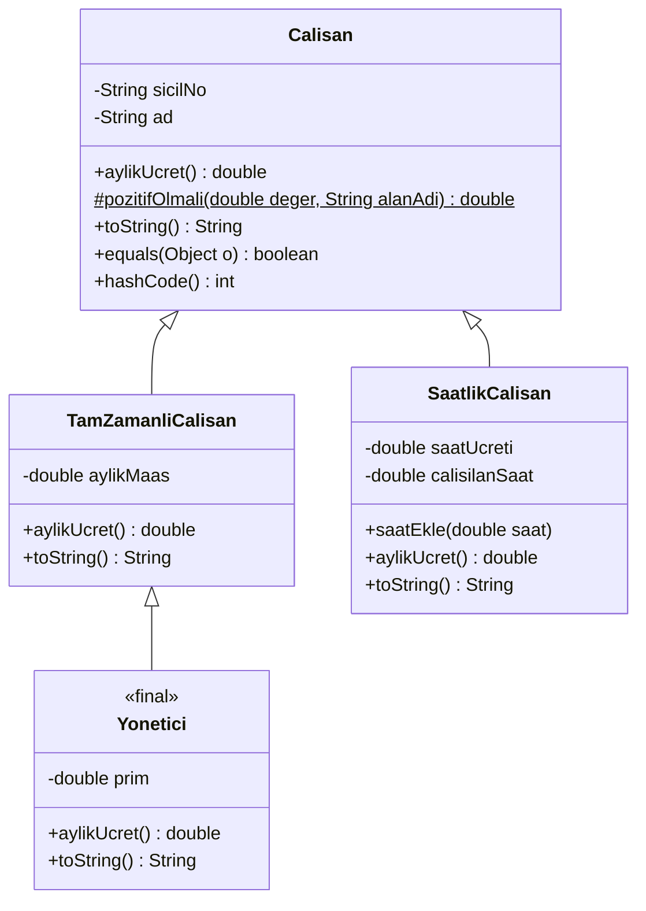
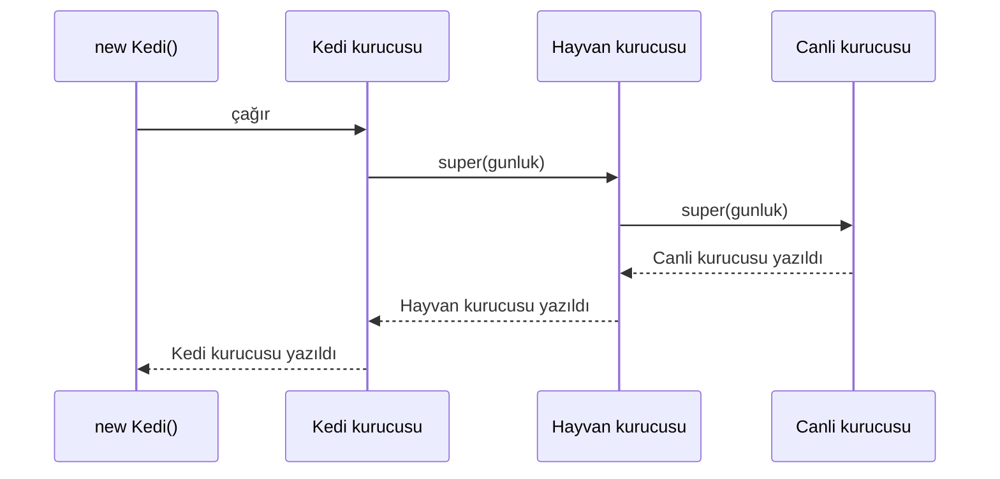
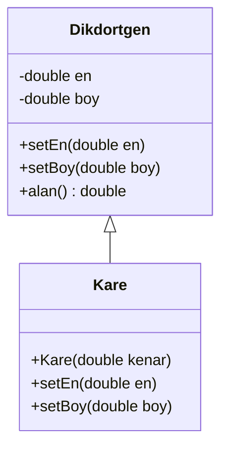

# 🧬 M5 - Kalıtım

<p align="center"><em>Hafta 5</em></p>

extends, super, metot ezme, protected, Object sınıfı: toString, equals, hashCode.

## ❔ Öğrenme hedefleri

Bu modülün sonunda öğrenci:

* "Bir tür" (is-a) ile "sahiptir" (has-a) ilişkisini ayırt eder, doğru olanı seçer
* Bir üst sınıftan alt sınıf türetir ve UML'de kalıtım okuyla gösterir
* `super(...)` ile üst sınıfın kurucusunu çağırır, kurucuların çalışma sırasını açıklar
* Metotları `@Override` ile ezer, `super.metot()` ile üst sınıfın davranışını genişletir
* `protected` erişimin ne sağladığını ve neden idareli kullanılması gerektiğini açıklar
* `toString`, `equals` ve `hashCode` metotlarını sözleşmelerine uygun biçimde ezer
* `final` sınıf ve metotların amacını açıklar, kalıtımın uygun olmadığı durumları fark eder

---

## 1. Kalıtım ve "bir tür" ilişkisi { #1-bir-tur }

Bir şirketin bordro programını yazıyoruz. Şirkette iki tür çalışan var: sabit aylık maaşlı **tam
zamanlı** çalışanlar ve çalıştığı saat kadar ücret alan **saatlik** çalışanlar. İkisinin de bir sicil
numarası ve adı var, ikisi de ekranda `S-001 Ayşe` biçiminde görünmeli ve iki kayıt aynı sicile
sahipse aynı kişi sayılmalı. Farklı olan tek şey ücretin hesaplanma biçimi.

İki ayrı sınıf yazıp ortak alanları ve metotları kopyalayabiliriz. Ama o zaman sicil doğrulaması, `toString`
ve eşitlik kuralı iki yerde yaşar; birini düzeltip diğerini unuttuğumuzda iki çalışan türü farklı
davranmaya başlar. **Kalıtım** (inheritance), ortak yapıyı bir **üst sınıfta** (superclass) bir kez yazıp
**alt sınıfların** (subclass) onu devralmasını ve yalnızca farklı olanı eklemesini sağlar.



UML'de kalıtım, alt sınıftan üst sınıfa doğru **içi boş üçgen uçlu** bir okla çizilir (UML adı:
generalization). Mermaid'de `Ust <|-- Alt` yazılır. Alt sınıfta yalnızca **yeni** ya da **ezilen**
üyeler gösterilir; `getSicilNo()` gibi devralınanlar tekrar yazılmaz. `#` simgesi `protected` demektir
([§4](#4-protected)).

### 1.1 "Bir tür" mü, "sahiptir" mi?

M4'te sınıflar arasındaki ilişkilendirme, toplama ve bileşimi gördük: bir `Ev` odalara **sahiptir**
(has-a). Kalıtım ise bambaşka bir cümle kurar: bir `SaatlikCalisan` bir `Calisan`'**dır** (is-a).
Hangisini seçeceğinize karar vermenin en basit yolu cümleyi yüksek sesle kurmaktır:

| Cümle | Doğru mu? | İlişki | UML çizimi |
|---|---|---|---|
| "Yönetici bir çalışandır." | Evet | Kalıtım (is-a) | İçi boş üçgen uçlu ok |
| "Ev bir odadır." | Hayır | — | — |
| "Ev odalara sahiptir." | Evet | Bileşim (has-a, M4) | İçi dolu elmas: `Ev *-- Oda` |
| "Çalışan bir departmandır." | Hayır | — | — |
| "Departmanın çalışanları vardır." | Evet | Toplama (has-a, M4) | İçi boş elmas: `Departman o-- Calisan` |

!!! tip "Kural: bir tür cümlesi her bağlamda doğru olmalı"

    Alt sınıfın nesnesi, üst sınıfın nesnesinin beklendiği **her yerde** kullanılabilmelidir. Yalnızca
    kodu yeniden kullanmak için kalıtım kurmayın. "Kodunu kullanmak istiyorum" ihtiyacının cevabı
    çoğu zaman bileşimdir: o sınıfın bir nesnesini alan olarak tutarsınız ([§6](#6-sinirlar)).

!!! example "Kendinizi deneyin"

    Aşağıdaki çiftlerin her biri için kalıtım mı, "sahiptir" mi, yoksa hiçbiri mi uygun?
    (a) `Otomobil` ve `Arac`, (b) `Otomobil` ve `Motor`, (c) `Ogrenci` ve `Kisi`,
    (d) `Kutuphane` ve `Kitap`.

    ??? success "Cevap"

        (a) Kalıtım: otomobil bir araçtır. (b) Bileşim: otomobilin bir motoru vardır. (c) Kalıtım
        olabilir, ama kişi zamanla öğrenci, mezun, çalışan oluyorsa bu rolü `Kisi`'nin bir alanı
        olarak modellemek daha esnektir; nesnenin sınıfı sonradan değişmez. (d) Toplama (M4).

## 2. extends ve super { #2-extends-super }

### 2.1 Alt sınıf yazmak

Java'da kalıtım `extends` (genişletir) anahtar kelimesiyle kurulur:

```java
public class TamZamanliCalisan extends Calisan {       // (1)!

    private final double aylikMaas;                     // (2)!

    public TamZamanliCalisan(String sicilNo, String ad, double aylikMaas) {
        super(sicilNo, ad);                             // (3)!
        this.aylikMaas = pozitifOlmali(aylikMaas, "Aylık maaş");
    }

    @Override
    public double aylikUcret() {                        // (4)!
        return aylikMaas;
    }
}
```

1. `TamZamanliCalisan`, `Calisan`'ın tüm `public` ve `protected` üyelerini devralır:
   `getSicilNo()`, `getAd()`, `toString()`, `equals()`, `hashCode()` ve `pozitifOlmali(...)`.
2. Alt sınıf kendi alanlarını ekler. `Calisan`'ın `private` alanları (`sicilNo`, `ad`) nesnenin içinde
   **vardır** ama alt sınıf onlara doğrudan erişemez; getter'ları kullanır. Kapsülleme (M3) kalıtımla
   birlikte de geçerlidir.
3. Üst sınıfın kurucusunu çağırır. Kurucular **devralınmaz**; her alt sınıf kendi kurucusunu yazar ve
   üst sınıfın hangi kurucusunun çalışacağını `super(...)` ile seçer.
4. Üst sınıftaki metodun yerine geçen yeni gövde: metot **ezme** ([§3](#3-ezme)).

### 2.2 Kurucu zinciri { #2-2-kurucu-zinciri }

Bir alt sınıf nesnesi, içinde üst sınıfın parçasını da taşır. Bu parçanın **önce** kurulması gerekir:
`TamZamanliCalisan` kurucusu çalışırken sicil numarası çoktan doğrulanmış olmalıdır. Java bunu şu
kurallarla güvenceye alır:

1. Her kurucunun **ilk satırı** ya `super(...)` ya da aynı sınıfın başka bir kurucusunu çağıran
   `this(...)` olmalıdır. Java 21'de başka bir satırı `super(...)`'ın önüne yazmak derleme hatasıdır:
   `call to super must be first statement in constructor`.
2. İlk satıra hiçbir şey yazmazsanız derleyici oraya kendisi **`super();`** (parametresiz) ekler.
3. Üst sınıfın parametresiz kurucusu yoksa bu örtük çağrı derlenmez. `Calisan`'ın tek kurucusu iki
   parametre aldığı için `super(sicilNo, ad)` yazmayı unutan bir alt sınıf şu hatayı alır:
   `constructor Calisan in class Calisan cannot be applied to given types`.

Çağrı sırasını görmek için `nyp.m5.zincir.KurucuZinciri` içinde üç katmanlı küçük bir hiyerarşi var.
Her kurucu gövdesine girdiğinde bir günlüğe (`StringBuilder`) satır ekliyor:

```java
public static class Canli {                         // örtük super(): önce Object
    public Canli(StringBuilder gunluk) { gunluk.append("Canli kurucusu\n"); }
}

public static class Hayvan extends Canli {
    public Hayvan(StringBuilder gunluk) {
        super(gunluk);                              // önce Canli
        gunluk.append("Hayvan kurucusu\n");
    }
}

public static class Kedi extends Hayvan {
    public Kedi(StringBuilder gunluk) {
        super(gunluk);                              // önce Hayvan
        gunluk.append("Kedi kurucusu\n");
    }
}
```

`new Kedi(gunluk)` yazıldığında çağrılar **aşağıdan yukarıya** yapılır, gövdeler **yukarıdan
aşağıya** tamamlanır:



```text
Canli kurucusu
Hayvan kurucusu
Kedi kurucusu
```

`KurucuZinciriTest` bu sırayı günlük metni üzerinden doğrular: `new Kedi(gunluk)` sonrası metin
tam olarak `"Canli kurucusu\nHayvan kurucusu\nKedi kurucusu\n"` olmalıdır.

!!! note "Java 25 ve esnek kurucu gövdeleri"

    Java 25'te [JEP 513](https://openjdk.org/jeps/513) ile `super(...)`'dan önce alanlara dokunmayan
    bazı ifadeler yazmak serbest bırakıldı. Bu derste Java 21 kullanıyoruz; sıra ise değişmez: üst
    sınıfın parçası, alt sınıfın alanlarından **önce** kurulur.

### 2.3 Tekli kalıtım ve `Object`

Java'da her sınıfın **tam olarak bir** üst sınıfı vardır. `extends` yazmazsanız üst sınıf
`java.lang.Object` olur; yani `Calisan` aslında `Calisan extends Object`'tir ve her Java nesnesi
sonunda bir `Object`'tir. `class A extends B, C` yazılamaz.

Çoklu kalıtım (multiple inheritance) olan dillerde iki üst sınıf aynı metodu farklı tanımladığında
belirsizlik doğar (elmas problemi, diamond problem); Java bunu sınıflar için dışarıda bırakır. Bir
sınıfın birden çok türe ait olması gerektiğinde **arayüzler** (interface) kullanılır (M7).

## 3. Metot ezme ve `@Override` { #3-ezme }

### 3.1 Ezme kuralları

Alt sınıf, üst sınıftan devraldığı bir örnek metodunu **aynı imzayla** yeniden tanımlayarak onun yerine
geçebilir. Buna **ezme** (overriding) denir. `SaatlikCalisan`, `Calisan`'ın `0.0` döndüren genel
`aylikUcret()` metodunu kendi kuralıyla ezer:

```java
public class SaatlikCalisan extends Calisan {

    @Override                                            // (1)!
    public double aylikUcret() {
        if (calisilanSaat <= NORMAL_SAAT) {
            return calisilanSaat * saatUcreti;
        }
        double fazlaMesai = calisilanSaat - NORMAL_SAAT;
        return NORMAL_SAAT * saatUcreti + fazlaMesai * saatUcreti * FAZLA_MESAI_CARPANI;
    }
    // alanlar, sabitler (NORMAL_SAAT = 160, FAZLA_MESAI_CARPANI = 1.5), kurucu ve saatEkle(...)
}
```

1. `@Override` bir **açıklamadır** (annotation): derleyiciye "bu metot bir üst türdeki metodu
   eziyor" der. Derleyici bunu denetler.

| Kural | Açıklama |
|---|---|
| Aynı ad ve parametre listesi | `aylikUcret()` ↔ `aylikUcret()`. Parametre türü farklıysa ezme değil **aşırı yüklemedir** (overloading, M6) |
| Dönüş türü aynı ya da alt türü | `double` ↔ `double`. Nesne döndüren metotlarda alt tür döndürmek serbesttir |
| Erişim daraltılamaz | `public` bir metot alt sınıfta `private` ya da `protected` yapılamaz |
| `private`, `static` ve `final` metotlar ezilmez | `private` görünmez, `static` gizlenir (M6), `final` yasaktır ([§3.3](#3-3-final)) |

`@Override` isteğe bağlıdır, ama neden **her zaman** yazılması gerektiğini bir yazım hatası gösterir.
`aylikUcret` yerine yanlışlıkla `aylikucret` (küçük c) yazıp üstüne `@Override` koyduğumuzu düşünelim:

```text
error: aylikucret() in SaatlikCalisan does not override or implement a method from a supertype
```

`@Override` olmasaydı bu kod **sessizce derlenirdi**: `SaatlikCalisan`'a yeni ve ilgisiz bir metot
eklenmiş olur, `aylikUcret()` çağrıları üst sınıfın `0.0` döndüren sürümüne gider ve maaşlar sıfır
çıkar. Hata derleme yerine bordro gününde bulunur.

`SaatlikCalisanTest` ezilmiş metodu sınır durumlarıyla dener: hiç saat yokken `0`, tam 160 saatte
fazla mesai yok (`32000`), 170 saatte `160 × 200 + 10 × 200 × 1,5 = 35000`.

### 3.2 `super.metot()` ile genişletme { #3-2-super-metot }

Bazen üst sınıfın davranışını tamamen değiştirmek değil, **üstüne eklemek** isteriz. Yönetici, tam
zamanlı bir çalışanın maaşını alır, üstüne aylık prim eklenir. Maaş hesabını kopyalamak yerine üst
sınıfın metodunu `super.` ile çağırırız:

```java
public final class Yonetici extends TamZamanliCalisan {

    private final double prim;

    public Yonetici(String sicilNo, String ad, double aylikMaas, double prim) {
        super(sicilNo, ad, aylikMaas);
        this.prim = pozitifOlmali(prim, "Prim");
    }

    @Override
    public double aylikUcret() {
        return super.aylikUcret() + prim;          // (1)!
    }

    @Override
    public String toString() {
        return super.toString() + " [yönetici]";   // (2)!
    }
}
```

1. `super.aylikUcret()`, bir üstteki sınıfın (`TamZamanliCalisan`) sürümünü çalıştırır. Yarın tam
   zamanlı maaşa kıdem eki eklenirse yönetici maaşı da kendiliğinden güncellenir.
2. Zincir birden çok kat sürebilir: `TamZamanliCalisan.toString()` de `super.toString()` çağırıp
   `" (tam zamanlı)"` ekler. `super.super.toString()` diye bir yazım yoktur; her sınıf yalnızca bir
   üstünü çağırabilir.

`YoneticiTest` iki katlı zinciri doğrular: `"S-003 Zeynep (tam zamanlı) [yönetici]"` ve `75000.0`.

`super.` yazmayı unutup `return aylikUcret() + prim;` yazarsanız metot **kendisini** çağırır, bu da
sonsuz özyinelemeye (recursion) ve `StackOverflowError`'a yol açar.

!!! note "Değişkenin türü üst sınıf olsa bile"

    `Calisan c = new Yonetici("S-003", "Zeynep", 60000, 15000);` yazıp `c.aylikUcret()` çağırırsanız
    sonuç `75000.0` olur: çalışan, nesnenin gerçek sınıfındaki (`Yonetici`) sürümdür. Bunun nasıl ve
    neden çalıştığı, yani **dinamik bağlama**, M6'nın konusu.

### 3.3 `final` metot ve `final` sınıf { #3-3-final }

`final` kelimesini M3'te alanlar için gördük: değer bir kez atanır. Metot ve sınıflarda anlamı
"bundan sonrası kapalı" olur:

| Bildirim | Anlamı | Örnek | Denerseniz |
|---|---|---|---|
| `final` metot | Alt sınıflar bu metodu ezemez | `Calisan.equals`, `Calisan.hashCode` | `overridden method is final` |
| `final` sınıf | Bu sınıftan alt sınıf türetilemez | `Yonetici`, JDK'da `String` | `cannot inherit from final Yonetici` |

`Calisan`, eşitlik kuralını ("aynı sicil, aynı kişi") `final` yaparak sabitler; hiçbir alt sınıf bu
kuralı değiştiremez. Neden önemli olduğunu [§5.1](#5-1-equals)'de göreceğiz. `Yonetici` ise zincirin
son halkası olarak tasarlandı. JDK'da `String` de `final`'dır: değişmez bir sınıfın (M3) alt sınıfı
değiştirilebilir davranış ekleyerek bu güvenceyi bozabilirdi.

!!! tip "Kalıtım için tasarlayın ya da yasaklayın"

    Joshua Bloch'un *Effective Java*'daki önerisi: bir sınıfı kalıtım için bilerek tasarlamadıysanız
    (hangi metotların ezilebileceğini, birbirini nasıl çağırdığını belgelemediyseniz) onu `final`
    yapın. Sonradan `final`'ı kaldırmak kolaydır; yanlış kullanılan bir kalıtımı geri almak zordur.

## 4. `protected` erişim { #4-protected }

M3'te dört erişim düzeyini gördük. Kalıtımla birlikte `protected` anlam kazanır:

| Belirleyici | Aynı sınıf | Aynı paket | Başka paketteki alt sınıf | Herkes | UML |
|---|:---:|:---:|:---:|:---:|:---:|
| `private` | ✓ | ✗ | ✗ | ✗ | `-` |
| (paket erişimi) | ✓ | ✓ | ✗ | ✗ | `~` |
| `protected` | ✓ | ✓ | ✓ | ✗ | `#` |
| `public` | ✓ | ✓ | ✓ | ✓ | `+` |

`protected` üye, alt sınıflara **başka pakette olsalar bile** açılır. Java'da buna ek olarak aynı
paketteki **tüm** sınıflara da açıktır; yani `protected`, paket erişiminden daha geniştir. Bu çoğu
öğrenciyi şaşırtır.

`Calisan`'da `protected` olan tek üye, alt sınıf kurucularının maaş, saat ücreti ve prim doğrularken
kullandığı `protected static double pozitifOlmali(double deger, String alanAdi)` yardımcısıdır;
sınıfın dışındaki kodun ona ihtiyacı yoktur.

### 4.1 Neden idareli kullanmalı?

İlk bakışta alanları `protected` yapmak pratik görünür: alt sınıf `aylikMaas`'a doğrudan erişir,
getter yazmaya gerek kalmaz. Ama bunun bedeli ağırdır:

```java
// KÖTÜ SÜRÜM
public class TamZamanliCalisan extends Calisan {
    protected double aylikMaas;   // alt sınıflara açık
}

public class Stajyer extends TamZamanliCalisan {
    public void indirimYap() {
        aylikMaas = -500;         // derlenir! Sınıf değişmezi (M3) çöktü.
    }
}
```

`TamZamanliCalisan` kurucusu maaşın pozitif olduğunu özenle denetlemişti; `protected` alan bu denetimi
atlamanın yasal bir yolunu, sizin hiç görmediğiniz alt sınıflara da açtı. Üstelik alan artık bir iç
ayrıntı değil, tüm alt sınıflarla yapılmış bir sözleşmedir: adını ya da türünü değiştiremezsiniz.

!!! tip "Alanlar `private`, yardım gerekiyorsa `protected` metot"

    Alanlarınızı kalıtımda da `private` tutun. Alt sınıfların gerçekten ihtiyaç duyduğu bir işlem
    varsa onu, kuralları koruyan küçük bir `protected` metot olarak açın (`pozitifOlmali` gibi).
    `private` → `protected` → `public` sırasıyla, ihtiyaç olduğu kadar açın.

## 5. `Object` sınıfı: `toString`, `equals`, `hashCode` { #5-object }

Her sınıf `Object`'ten türediği için `Object`'in metotlarını devralır. Bunlardan üçü, kendi
sınıflarımızda neredeyse her zaman ezmemiz gereken metotlardır:

| Metot | `Object`'teki varsayılan davranış | Neden ezeriz? |
|---|---|---|
| `toString()` | `sinifAdi@onaltilikHash`, ör. `nyp.m5.Calisan@1b6d3586` | Okunur çıktı, hata ayıklama, test mesajları |
| `equals(Object)` | `==` ile aynı: yalnızca **aynı nesne** ise `true` | İçerik eşitliği: "aynı sicil, aynı kişi" |
| `hashCode()` | Nesneye özgü bir sayı (genelde farklı nesnelerde farklı) | `equals` ile tutarlı olmalı, yoksa `HashSet`/`HashMap` bozulur |

M2'de `toString()` üstüne `@Override` yazmıştık; artık nedenini biliyoruz: `Object`'ten devralınan
metodu eziyoruz. Zincir hâlinde genişletmeyi [§3.2](#3-2-super-metot)'de gördük; şimdi `equals` ve
`hashCode`'a geçelim.

### 5.1 equals sözleşmesi { #5-1-equals }

M2'de `new Nokta(2, 3).equals(new Nokta(2, 3))` ifadesinin `false` döndüğünü görmüştük: `Object`'in
`equals`'ı içeriğe bakmaz. `Calisan` bunu "sicil numarası aynıysa eşittir" kuralıyla ezer:

```java
@Override
public final boolean equals(Object o) {          // (1)!
    if (this == o) {                             // (2)!
        return true;
    }
    if (!(o instanceof Calisan diger)) {         // (3)!
        return false;
    }
    return sicilNo.equals(diger.sicilNo);        // (4)!
}
```

1. Parametre türü **`Object`** olmalıdır. `equals(Calisan o)` yazmak ezme değil aşırı yükleme olur ve
   `HashSet` gibi JDK sınıfları bu metodu hiç çağırmaz. `@Override` burada da hatayı yakalar:
   `equals(Calisan) in ... does not override or implement a method from a supertype`.
2. Aynı nesneyse hızlı çıkış.
3. `o` bir `Calisan` değilse (ya da `null` ise) eşit değildir. `instanceof Calisan diger` yazımı,
   kontrolle birlikte dönüştürmeyi de yapar (instanceof ile desen eşleme, M6). `null instanceof ...`
   her zaman `false`'tur; ayrıca `null` kontrolü gerekmez.
4. Eşitliğe karar veren alan: sicil numarası. Ad ya da maaş değişse de kişi aynıdır.

`Object.equals` belgesi, her `equals`'ın uyması gereken beş kuralı sayar. `CalisanTest`'te her biri için
ayrı bir test var:

| Kural | Anlamı | Test |
|---|---|---|
| Yansıma (reflexive) | `x.equals(x)` her zaman `true` | `equalsYansimali` |
| Simetri (symmetric) | `x.equals(y)` ise `y.equals(x)`; tam zamanlı ve saatlik iki kayıt arasında da | `equalsSimetrik` |
| Geçişlilik (transitive) | `x.equals(y)` ve `y.equals(z)` ise `x.equals(z)` | `equalsGecisli` |
| Tutarlılık (consistent) | Nesneler değişmedikçe sonuç hep aynı | `equalsTutarli` |
| `null` | `x.equals(null)` her zaman `false`, istisna yok | `equalsNullIcinFalse` |


**Kalıtım simetriyi nasıl bozar?** `equals` `final` olmasaydı, `SaatlikCalisan` onu "sicil **ve** saat
ücreti aynıysa eşit" diye ezebilirdi. O zaman bir `TamZamanliCalisan` `x` ile bir `SaatlikCalisan`
`y` için `x.equals(y)` `true` (yalnızca sicile bakar), `y.equals(x)` ise `false` olurdu (`x` bir
`SaatlikCalisan` değildir). `Set`'e ekleme sırası sonucu değiştirir; bulunması çok zor hatalar çıkar.
`Calisan` bu yüzden eşitliği tek yerde tanımlar ve `final` ile kilitler. Diğer yaygın seçenek,
`instanceof` yerine `getClass() != o.getClass()` karşılaştırmaktır; o zaman farklı alt sınıfların
nesneleri hiç eşit olmaz. Hangisinin doğru olduğu alana bağlıdır: bizim bordroda aynı sicil her
zaman aynı kişidir.

### 5.2 hashCode sözleşmesi { #5-2-hashcode }

`hashCode()`, bir nesneyi bir tamsayıya özetler. `HashSet` ve `HashMap` (M9) nesneleri bu sayıya göre
"kovalara" dağıtır; bir nesneyi ararken önce doğru kovaya gider, sonra yalnızca o kovadaki nesnelerle
`equals` çağırır. Bu yüzden sözleşme şudur:

* `a.equals(b)` `true` ise `a.hashCode() == b.hashCode()` **olmak zorundadır**.
* Tersi gerekmez: eşit olmayan iki nesnenin hash değeri tesadüfen aynı olabilir (çakışma, collision);
  bu yalnızca performansı etkiler.
* Nesne değişmedikçe `hashCode()` aynı değeri döndürmelidir.

`Calisan`, `equals`'ta kullandığı alanın aynısını kullanır:

```java
@Override
public final int hashCode() {
    return Objects.hash(sicilNo);   // equals'taki alanlar, burada da
}
```

`equals`'ı ezip `hashCode`'u unutursak ne olur? `CalisanTest` içinde bilerek hatalı bir
`HashCodeUnutan` sınıfı var. İki nesne `equals`'a göre eşit, ama `Object`'in hashCode'u farklı sayılar
ürettiği için küme onları farklı kovalara koyar ve hiç karşılaştırmaz:

```java
@Test
@DisplayName("hashCode ezilmezse HashSet eşit nesneleri ayrı sayar")
void hashCodeUnutulursaHashSetBozulur() {
    HashCodeUnutan a = new HashCodeUnutan("S-001");
    HashCodeUnutan b = new HashCodeUnutan("S-001");
    Set<HashCodeUnutan> kume = new HashSet<>();

    kume.add(a);
    kume.add(b);

    assertEquals(a, b);                  // equals'a göre eşitler...
    assertEquals(2, kume.size());        // ...ama küme iki ayrı eleman görüyor
}
```

`Calisan` ile aynı deneme doğru sonucu verir: ikinci `add` `false` döner ve kümede bir kayıt kalır
(`hashSetTekrariEngeller`). Koleksiyonları ve `Set`/`Map` arayüzlerini M9'da ayrıntılı işleyeceğiz;
şimdilik kural yeterli: **`equals`'ı ezen, `hashCode`'u da ezer.**

!!! warning "Değişen alanları hash'e katmayın"

    `hashCode` değişebilen bir alana (ör. `calisilanSaat`) dayanırsa, nesne kümeye eklendikten sonra
    alan değiştiğinde nesne "yanlış kovada" kalır ve `contains` onu bulamaz. `Calisan`'da eşitlik ve
    hash, `final` olan `sicilNo`'ya dayanır; bu yüzden `saatEkle` çağrıları eşitliği etkilemez
    (`equalsTutarli` testi).

## 6. Kalıtımın sınırları { #6-sinirlar }

Kalıtım güçlüdür, ama alt sınıfı üst sınıfa en sıkı biçimde bağlayan ilişkidir. Alt sınıf, üst
sınıfın yalnızca **ne yaptığına** değil, çoğu zaman **nasıl yaptığına** da bağımlı hâle gelir.

### 6.1 Kırılgan temel sınıf { #6-1-kirilgan }

Bir kümeye şimdiye kadar kaç eleman eklenmeye çalışıldığını saymak istiyoruz ve JDK'nın `HashSet`'inden
türetiyoruz (bu örnek Bloch'un *Effective Java*'sından uyarlanmıştır). `HashSet<String>` ve
`Collection<? extends String>` gibi generic türleri M9'da işleyeceğiz; burada yalnızca hangi metodun
hangisini çağırdığına odaklanın:

```java
public class SayanKume extends HashSet<String> {
    private int eklemeSayisi = 0;

    @Override
    public boolean add(String s) {
        eklemeSayisi++;
        return super.add(s);
    }

    @Override
    public boolean addAll(Collection<? extends String> c) {
        eklemeSayisi += c.size();
        return super.addAll(c);
    }
}
```

`addAll(List.of("a", "b", "c"))` çağrısından sonra sayaç **6** gösterir. Çünkü `HashSet`'in
`addAll`'u (üst sınıfı `AbstractCollection`'dan devraldığı hâliyle) her eleman için `add`'i çağırır ve
bu çağrılar bizim ezdiğimiz `add`'e gelir. Üst sınıfın bir sonraki sürümünde bu ayrıntı değişirse,
alt sınıfın davranışı da tek satırına dokunulmadan değişir. Bu duruma **kırılgan temel sınıf**
(fragile base class) problemi denir.

Çözüm çoğu zaman kalıtım yerine **bileşimdir** (M4): `SayanKume` bir `HashSet` **olmak** yerine bir
`HashSet`'e **sahip olur** ve işi ona devreder (delegation). O zaman yalnızca `HashSet`'in `public`
sözleşmesine bağlı kalır. Bu fikir "kalıtım yerine bileşimi tercih edin" (favor composition over
inheritance) ilkesi olarak bilinir; M12'deki birçok tasarım kalıbı bunun üzerine kuruludur.

!!! warning "Kurucuda ezilebilir metot çağırmayın"

    `Dikdortgen` kurucusu alanları `setEn`/`setBoy` ile değil, doğrudan atar. Neden? Kurucu zinciri
    ([§2.2](#2-2-kurucu-zinciri)) üst sınıfın kurucusunu alt sınıfın alanları kurulmadan **önce**
    çalıştırır. Üst sınıfın kurucusu ezilebilir bir metodu çağırırsa, çalışan alt sınıfın sürümü olur
    ve o sürüm henüz ilk değerini almamış alanları görür. Kurucularda yalnızca `private`, `static` ya
    da `final` metotları çağırın.

### 6.2 Kare bir dikdörtgen midir? { #6-2-kare }

Matematikte her kare bir dikdörtgendir. O hâlde `Kare extends Dikdortgen` doğal görünür:



Karenin kenarları eşit kalmalı; bu yüzden `Kare` iki setter'ı da iki kenarı birden değiştirecek
biçimde ezer:

```java
public class Kare extends Dikdortgen {

    public Kare(double kenar) { super(kenar, kenar); }

    @Override
    public void setEn(double en) {
        super.setEn(en);
        super.setBoy(en);    // kare kalmak için boy da değişir
    }
    // setBoy simetrik biçimde yazılır
}
```

Kare kendi başına doğru davranıyor. Sorun, bir `Dikdortgen` bekleyen kodun ona bir `Kare` verildiğinde
ortaya çıkar. Dikdörtgen kullanan her kodun makul bir varsayımı vardır: **eni değiştirmek boyu
değiştirmez.**

```java
private static double eniBesYapVeAlanHesapla(Dikdortgen d) {
    d.setEn(5);
    return d.alan();   // istemcinin beklentisi: 5 x eski boy
}

@Test
@DisplayName("Dikdörtgen bekleyen kod kareyle beklenmedik sonuç alır")
void kareDikdortgenVarsayiminiBozar() {
    double dikdortgenIle = eniBesYapVeAlanHesapla(new Dikdortgen(2, 2));
    double kareIle = eniBesYapVeAlanHesapla(new Kare(2));

    assertEquals(10.0, dikdortgenIle, 1e-9);   // 5 x 2: beklenen
    assertEquals(25.0, kareIle, 1e-9);         // 5 x 5: istemci şaşırır
}
```

Kod derleniyor, hiçbir istisna yok, ama sonuç yanlış. "Kare bir dikdörtgendir" cümlesi **geometride**
doğru; **değiştirilebilir bir dikdörtgenin davranışı** açısından ise yanlış. Kalıtımın ölçütü
nesnelerin ne olduğu değil, **nasıl davrandığıdır**: alt sınıf, üst sınıfın verdiği sözleri tutmalıdır.
Bu fikrin adı **Liskov yerine geçme ilkesidir** (Liskov substitution principle) ve M11'de ayrıntılı
işlenecek. Olası çıkış yolları: dikdörtgeni değişmez yapmak (setter yok, M3), ya da `Kare` ile
`Dikdortgen`'i birbirinden türetmeyip ortak bir `Sekil` üst türünün iki kardeşi yapmak (M7).

### 6.3 Ne zaman kalıtım?

| Soru | "Evet" ise |
|---|---|
| "B bir A'dır" cümlesi her bağlamda doğru mu? | Kalıtım aday olabilir |
| B, A'nın beklendiği her yerde A gibi davranabilir mi? | Kalıtım uygun |
| Yalnızca A'nın kodunu yeniden kullanmak mı istiyorum? | Bileşim (has-a) |
| Nesnenin "türü" zamanla değişebilir mi (öğrenci → mezun)? | Alan/rol olarak modelle |
| A başka birinin sınıfı ve kalıtım için belgelenmemiş mi? | Bileşim; A'yı sarmala |

## 7. Alıştırmalar

Kaynak kod `exercise_files/src/main/java/nyp/m5/`, testler `src/test/java/nyp/m5/` altında:

```bash
mvn -pl m5_kalitim/exercise_files test
```

1. **Çalıştır ve incele.** `CalisanUygulamasi`'nı çalıştırın. Çıktının ilk üç satırını
   [§2.2](#2-2-kurucu-zinciri)'deki diyagramla, "Kayıt sayısı" satırını [§5.2](#5-2-hashcode) ile,
   son satırı [§6.2](#6-2-kare) ile açıklayın.
2. **Derleyiciyi deneyin.** Sırayla şunları yapıp her birinin derleme hatasını not edin, sonra geri
   alın: (a) `TamZamanliCalisan` kurucusundaki `super(sicilNo, ad);` satırını silin; (b)
   `SaatlikCalisan.aylikUcret` adını `aylikucret` yapın; (c) `class Stajyer extends Yonetici {}` yazın.
3. **Yeni alt sınıf.** `Stajyer extends Calisan` yazın: sabit aylık burs alır, ama burs 20.000 TL'yi
   geçemez. `toString()` çıktısı `"S-010 Can (stajyer)"` olsun. `StajyerTest` ile en az dört test
   yazın (normal burs, üst sınır, sınırın bir kuruş üstü, geçersiz sicil).
4. **super ile genişletme.** `SaatlikCalisan`'dan türeyen `VardiyaCalisani` yazın: gece vardiyasında
   çalışılan her saat için ücrete saat başı 50 TL ek gelsin. Ücret hesabını **kopyalamadan**
   `super.aylikUcret()` ile yazın ve testini ekleyin.
5. **Sözleşmeyi bozun.** `CalisanTest`'e bakarak `equals`'ı `final` olmayan bir `Urun` sınıfı
   (barkod) ve onu "barkod ve fiyat" ile ezen `IndirimliUrun` alt sınıfı yazın. Simetrinin bozulduğunu
   gösteren bir test yazın. Sonra sorunu nasıl düzelttiğinizi bir cümleyle açıklayın.

---

## Özet

Kalıtım "bir tür" (is-a) ilişkisini kurar; "sahiptir" (has-a) ise M4'teki bileşim ve toplamadır ve
hangisinin uygun olduğunu cümleyi kurarak sınarız. Alt sınıf üst sınıfın `public` ve `protected`
üyelerini devralır, kendi alanlarını ekler ve metotlarını ezer. Java'da her sınıfın tek üst sınıfı
vardır ve zincirin tepesinde `Object` durur. Kurucular devralınmaz; her kurucu ilk satırda
`super(...)` çağırır, bu yüzden nesneler üstten alta doğru kurulur. `@Override` imza hatalarını
derleme zamanında yakalar, `super.metot()` üst davranışı kopyalamadan genişletir. Alanlar kalıtımda
da `private` kalmalı; `protected` yalnızca gerekli yardımcı metotlar içindir. `equals` beş kurallık
sözleşmesine uymalı, `equals`'ı ezen `hashCode`'u da aynı alanlarla ezmelidir; yoksa `HashSet` eşit
nesneleri ayrı sayar. `final` ezmeyi ve türetmeyi kapatır. Kalıtım alt sınıfı üst sınıfın iç
ayrıntılarına bağlar ve `Kare extends Dikdortgen`'de olduğu gibi davranış sözlerini bozabilir; o
zaman bileşim daha iyi bir seçimdir. Bir sonraki modülde ezmenin asıl getirisini, yani üst tür
referansıyla yapılan çağrının nesnenin gerçek türüne göre davranmasını göreceğiz:
[M6 - Çok Biçimlilik](../m6_cok_bicimlilik/README.md).

## İleri okuma

* [The Java Tutorials: Inheritance](https://docs.oracle.com/javase/tutorial/java/IandI/subclasses.html),
  Oracle. Alt sınıfların neyi devraldığına ve `super` kullanımına kısa, resmî bir giriş.
* [The Java Tutorials: Object as a Superclass](https://docs.oracle.com/javase/tutorial/java/IandI/objectclass.html),
  Oracle. `Object`'in `toString`, `equals`, `hashCode` ve diğer metotlarına genel bakış.
* [Dev.java: Learn Java](https://dev.java/learn/). Oracle'ın güncel öğrenme sayfalarında kalıtım ve
  `Object` metotları bölümleri.

## Kaynaklar

* [JLS 21](https://docs.oracle.com/javase/specs/jls/se21/html/index.html), §8.1.4 (Superclasses and
  Subclasses), §8.8.7 (Constructor Body), §8.4.8 (Inheritance, Overriding, and Hiding), §8.1.1.2
  (final Classes), §8.4.3.3 (final Methods), §6.6.2 (Details on protected Access), §9.6.4.4
  (@Override). §2–4'teki kuralların kaynağı.
* [Java SE 21 API: `java.lang.Object`](https://docs.oracle.com/en/java/javase/21/docs/api/java.base/java/lang/Object.html).
  §5'teki varsayılan `toString` biçiminin ve `equals`/`hashCode` sözleşmelerinin kaynağı.
* [Java SE 21 API: `java.util.Objects`](https://docs.oracle.com/en/java/javase/21/docs/api/java.base/java/util/Objects.html)
  ve [`java.util.HashSet`](https://docs.oracle.com/en/java/javase/21/docs/api/java.base/java/util/HashSet.html).
  `Objects.hash` ve §5.2'deki küme örneği.
* [The Java Tutorials: Using the Keyword super](https://docs.oracle.com/javase/tutorial/java/IandI/super.html)
  ve [Writing Final Classes and Methods](https://docs.oracle.com/javase/tutorial/java/IandI/final.html),
  Oracle. §2.2, §3.2 ve §3.3'ün kaynağı.
* [JEP 513: Flexible Constructor Bodies](https://openjdk.org/jeps/513). §2.2'deki Java 25 notunun
  kaynağı.
* Joshua Bloch, *Effective Java*, 3. baskı, Addison-Wesley, 2018: Madde 10 ("Obey the general contract
  when overriding equals"), Madde 11 ("Always override hashCode when you override equals"), Madde 12
  ("Always override toString"), Madde 18 ("Favor composition over inheritance"), Madde 19 ("Design
  and document for inheritance or else prohibit it"). §3.3, §5 ve §6.1'in kaynağı; `SayanKume`
  örneği Madde 18'deki `InstrumentedHashSet`'ten uyarlanmıştır.
* Barbara H. Liskov, Jeannette M. Wing, "A Behavioral Notion of Subtyping", *ACM Transactions on
  Programming Languages and Systems* 16(6), 1994, s. 1811–1841. §6.2'deki ilkenin kaynağı.
* Cay S. Horstmann, *Core Java, Volume I: Fundamentals*, 12. baskı, Pearson, 2022, 5. bölüm
  ("Inheritance"). Modülün genel anlatımının dayandığı ders kitabı.
