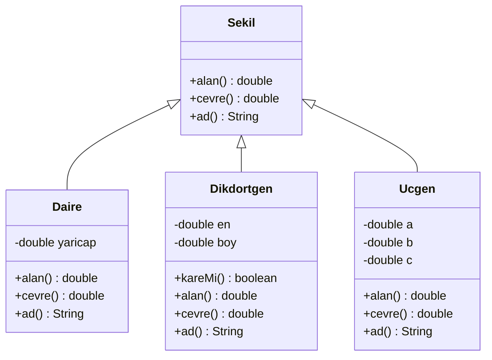
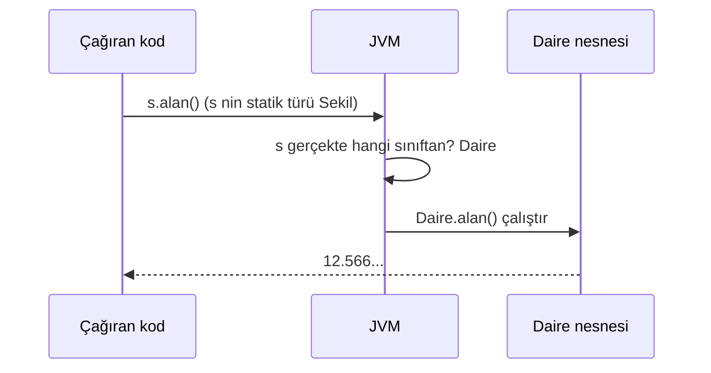
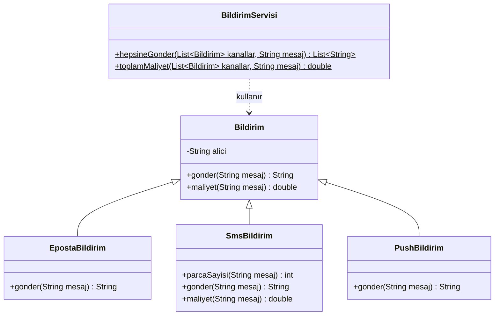

# 🎭 M6 - Çok Biçimlilik

<p align="center"><em>Hafta 6</em></p>

Dinamik bağlama, yukarı/aşağı tür dönüşümü, instanceof ile desen eşleme, aşırı yükleme ve ezme.

## ❔ Öğrenme hedefleri

Bu modülün sonunda öğrenci:

* Aynı çağrının farklı nesnelerde farklı davrandığını açıklamak
* Üst tür referansıyla alt tür nesneleri kullanmak
* `if-instanceof` zincirleri yerine çok biçimli çağrı kullanan kod yazmak
* Güvenli aşağı tür dönüşümü için instanceof desen eşlemeyi kullanmak
* Aşırı yükleme (overloading) ile ezmeyi (overriding) ayırt etmek

---

## 1. Çok biçimlilik nedir? { #1-cok-bicimlilik }

M5'te kalıtımla bir üst sınıfın davranışını alt sınıflarda **ezmeyi** (override) öğrendik. Bu
modülde ezmenin asıl getirisini göreceğiz: bir değişkenin türü üst sınıf olduğu hâlde, o değişken
üzerinden yapılan çağrının **nesnenin gerçek türüne göre** farklı davranması.

Çok biçimlilik (polymorphism, Yunanca "çok biçim"), aynı mesajın farklı nesnelerde farklı davranış
üretmesidir. Bir çizim programı düşünün: ekranda daireler, dikdörtgenler ve üçgenler var. Kullanıcı
"toplam boyalı alanı göster" dediğinde program her şekle aynı soruyu sorar: "Alanın ne?" Daire
`πr²`, dikdörtgen `en × boy`, üçgen Heron formülüyle cevap verir. Soruyu soran kodun hangi şeklin
hangi formülü kullandığını bilmesi gerekmez.



```java
public class Sekil {

    public double alan() {        // (1)!
        return 0;
    }

    public String ad() {
        return "Şekil";
    }
    // cevre() ve toString() benzer biçimde yazılır
}

public class Daire extends Sekil {

    private final double yaricap;

    public Daire(double yaricap) {
        this.yaricap = yaricap;
    }

    @Override
    public double alan() {        // (2)!
        return Math.PI * yaricap * yaricap;
    }

    @Override
    public String ad() {
        return "Daire";
    }
}
```

1. "Genel bir şekil"in alanı anlamsızdır; şimdilik 0 döndürüyoruz. M7'de `Sekil`'i **soyut**
   (abstract) sınıf yaparak bu yapay gövdeden kurtulacağız.
2. `Daire`, üst sınıfın `alan()` metodunu ezer. `@Override` derleyiciye "bu bir ezmedir" der; imzayı
   yanlış yazarsanız derleme hatası alırsınız (M5).

Çok biçimliliğin kapısı şu satırdır:

```java
Sekil s = new Daire(2);   // üst tür referansı, alt tür nesnesi
System.out.println(s.ad());     // Daire
System.out.println(s.alan());   // 12.566370614359172
```

Kalıtım bir **"bir-tür"** (is-a) ilişkisi kurduğu için her `Daire` aynı zamanda bir `Sekil`'dir; bu
yüzden `Sekil` türünde bir değişken bir `Daire` nesnesini gösterebilir. Tersi doğru değildir: her
şekil bir daire değildir.

## 2. Dinamik bağlama { #2-dinamik-baglama }

`Sekil s = new Daire(2);` satırında iki ayrı tür vardır:

| | Derleme zamanı türü (statik tür) | Çalışma zamanı türü (dinamik tür) |
|---|---|---|
| Nedir? | Değişkenin **bildirildiği** tür | Değişkenin gösterdiği **nesnenin** türü |
| `Sekil s = new Daire(2)` için | `Sekil` | `Daire` |
| Kim bilir? | Derleyici (`javac`) | JVM, program çalışırken |
| Neyi belirler? | Hangi metotları **çağırabileceğinizi** | Ezilmiş metotlardan **hangisinin çalışacağını** |
| Değişebilir mi? | Hayır, bildirimde sabitlenir | Evet, `s = new Ucgen(3, 4, 5);` ile |

Derleyici `s.alan()` çağrısını kontrol ederken yalnızca `Sekil` sınıfına bakar: "`Sekil`'in `alan()`
metodu var mı?" Varsa çağrı derlenir. Hangi `alan()` gövdesinin çalışacağına ise program çalışırken,
nesnenin gerçek türüne bakılarak karar verilir. Buna **dinamik bağlama** (dynamic binding, dynamic
dispatch) denir.



Aynı değişken farklı anlarda farklı nesneleri gösterebilir, aynı satır farklı metotları çalıştırır:

```java
Sekil s = new Daire(1);
System.out.println(s.ad());   // Daire
s = new Ucgen(3, 4, 5);
System.out.println(s.ad());   // Üçgen
```

!!! note "`toString()` içindeki çağrı da çok biçimlidir"

    `Sekil.toString()` metodu `ad() + " (alan = " + alan() + ")"` döndürür. Bu metot yalnızca
    `Sekil`'de yazılı olduğu hâlde, `new Dikdortgen(2, 3).toString()` sonucu
    `"Dikdörtgen (alan = 6.0)"` olur. Üst sınıfın metodu içinden yapılan `ad()` ve `alan()`
    çağrıları da gerçek nesnenin metotlarına bağlanır. M7'deki **şablon metot** fikri tam olarak
    buna dayanır.

### 2.1 Heterojen listede toplam alan { #2-1-heterojen }

Farklı şekilleri tek bir listede tutalım. Nesne listeleri için `List` kullanıyoruz; ayrıntısı M9'da,
şimdilik `List.of(...)` ile liste oluşturmak ve `for` ile gezmek yeterli.

İlk akla gelen çözüm, her şeklin türünü sorup alanı dışarıda hesaplamaktır:

```java
// KÖTÜ SÜRÜM
public static double toplamAlanInstanceofIle(List<Sekil> sekiller) {
    double toplam = 0;
    for (Sekil s : sekiller) {
        if (s instanceof Daire) {
            Daire d = (Daire) s;
            toplam += Math.PI * d.getYaricap() * d.getYaricap();
        } else if (s instanceof Dikdortgen) {
            Dikdortgen r = (Dikdortgen) s;
            toplam += r.getEn() * r.getBoy();
        }
        // Ucgen unutuldu! Derleyici uyarmaz.
    }
    return toplam;
}
```

Bu kodun üç sorunu var: alan formülleri şekil sınıflarından dışarı sızmış (kapsülleme bozulmuş),
her yeni şekil türünde bu metodun değişmesi gerekiyor ve bir türü unuttuğunuzda (burada `Ucgen`)
program hata vermeden **yanlış** sonuç üretiyor. Çok biçimli sürüm ise tek satırdır:

```java
// İYİ SÜRÜM
public static double toplamAlan(List<Sekil> sekiller) {
    double toplam = 0;
    for (Sekil s : sekiller) {
        toplam += s.alan();          // hangi alan()? JVM karar verir
    }
    return toplam;
}
```

Yarın `Besgen` sınıfı eklendiğinde `toplamAlan` hiç değişmez; yeni sınıfın `alan()` metodunu ezmesi
yeterlidir. Testler iki sürümün farkını açıkça gösterir:

```java
@Test
@DisplayName("instanceof zinciri üçgeni unuttuğu için yanlış sonuç verir")
void instanceofZinciriEksik() {
    // Hazırla: daire(1) + dikdörtgen(2x3) + üçgen(3-4-5)
    // Çalıştır
    double kotu = SekilHesaplayici.toplamAlanInstanceofIle(sekiller);
    // Doğrula
    assertEquals(Math.PI + 6, kotu, 1e-9);
    assertNotEquals(SekilHesaplayici.toplamAlan(sekiller), kotu, 1e-9);
}
```

!!! tip "Tür sorma, nesneye sor"

    Kodunuzda `if (x instanceof A) ... else if (x instanceof B) ...` zinciri görüyorsanız durun ve
    sorun: "Bu davranış o sınıfların kendi metodu olabilir mi?" Çoğu zaman cevap evettir. Bu ilke
    "Tell, don't ask" (sorma, söyle) olarak da bilinir.

### 2.2 İkinci örnek: bildirim kanalları

Bir e-ticaret sitesi, "Siparişiniz kargoya verildi" mesajını kullanıcının seçtiği kanallardan
göndermek istiyor. Her kanalın gönderme biçimi ve maliyeti farklı: e-posta ücretsiz, SMS her 160
karakterlik parça için 0,25 TL, anlık (push) bildirim 50 karakterden uzun mesajı kesiyor.



`BildirimServisi` yalnızca `Bildirim` türünü tanır. Hangi kanalların var olduğunu bilmez:

```java
public static double toplamMaliyet(List<Bildirim> kanallar, String mesaj) {
    double toplam = 0;
    for (Bildirim b : kanallar) {
        toplam += b.maliyet(mesaj);
    }
    return toplam;
}
```

200 karakterlik bir mesaj e-posta, SMS ve push kanallarından gönderilirse maliyet
`0 + 2 × 0,25 + 0 = 0,50` TL olur (`BildirimTest.toplamMaliyet`). WhatsApp kanalı eklemek için yeni bir
alt sınıf yazmak yeterlidir; servis sınıfı değişmez. Bu, M11'de göreceğimiz **açık/kapalı ilkesinin**
(open/closed principle) ilk örneğidir.

## 3. Yukarı ve aşağı tür dönüşümü { #3-tur-donusumu }

**Yukarı tür dönüşümü** (upcasting): alt tür bir nesneyi üst tür bir referansa atamak. Her zaman
güvenlidir, bu yüzden **örtüktür** (implicit); yazmanız gereken bir şey yoktur.

```java
Dikdortgen r = new Dikdortgen(4, 4);
Sekil s = r;               // yukarı dönüşüm, örtük
s.alan();                  // derlenir: Sekil'de alan() var
s.kareMi();                // DERLEME HATASI: Sekil'de kareMi() yok
```

Nesne hâlâ bir `Dikdortgen`'dir ama statik tür `Sekil` olduğu için derleyici yalnızca `Sekil`'in
metotlarına izin verir. `kareMi()` gibi alt sınıfa özgü bir metodu çağırmak için **aşağı tür
dönüşümü** (downcasting) gerekir. Bu dönüşüm her zaman güvenli olmadığı için **açıktır** (explicit):

```java
Dikdortgen r2 = (Dikdortgen) s;   // aşağı dönüşüm, açık
r2.kareMi();                      // true
```

Dönüşüm yalnızca derleyiciye verilen bir **sözdür**: "Bu nesnenin gerçekte `Dikdortgen` olduğundan
eminim." Söz tutmazsa JVM çalışma zamanında `ClassCastException` fırlatır:

```java
Sekil s = new Daire(1);
Dikdortgen r = (Dikdortgen) s;    // derlenir, ama çalışırken ClassCastException
```

```java
@Test
@DisplayName("Yanlış aşağı dönüşüm ClassCastException fırlatır")
void yanlisAsagiDonusum() {
    Sekil s = new Daire(1);

    assertThrows(ClassCastException.class, () -> {   // (1)!
        Dikdortgen r = (Dikdortgen) s;
        r.kareMi();
    });
}
```

1. `assertThrows`, verilen kod bloğunun belirtilen türde bir istisna (exception) fırlatmasını
   bekler. `() -> { ... }` yazımı bir **lambda** ifadesidir (M10); şimdilik "çalıştırılacak kod
   bloğu" olarak okuyun. İstisnaları M8'de ayrıntılı işleyeceğiz.

| | Yukarı dönüşüm | Aşağı dönüşüm |
|---|---|---|
| Yön | Alt tür → üst tür | Üst tür → alt tür |
| Yazım | Örtük: `Sekil s = r;` | Açık: `(Dikdortgen) s` |
| Güvenli mi? | Her zaman | Yalnızca nesne gerçekten o türdense |
| Hata | Olmaz | Çalışma zamanında `ClassCastException` |
| İlişkisiz türler | — | `(String) sekil` derleme hatasıdır |

!!! warning "Dönüşüm nesneyi değiştirmez"

    `(Dikdortgen) s` yazmak yeni bir nesne üretmez ve bir daireyi dikdörtgene çevirmez. Yalnızca
    aynı nesneye **farklı türde bir referansla** bakarsınız. Nesnenin sınıfı `new` anında belirlenir
    ve bir daha değişmez.

## 4. instanceof ve desen eşleme { #4-instanceof }

`ClassCastException` riskini önlemek için dönüşümden önce `instanceof` ile tür kontrol edilir.
Java 16'dan önce bu, türü iki kez yazmayı gerektiriyordu:

```java
if (s instanceof Dikdortgen) {         // 1. kontrol
    Dikdortgen r = (Dikdortgen) s;     // 2. dönüşüm (tekrar)
    System.out.println(r.kareMi());
}
```

**instanceof ile desen eşleme** (pattern matching for instanceof, JEP 394) kontrolü ve dönüşümü tek
adımda yapar:

```java
public static int kareSayisi(List<Sekil> sekiller) {
    int sayac = 0;
    for (Sekil s : sekiller) {
        if (s instanceof Dikdortgen r && r.kareMi()) {   // (1)!
            sayac++;
        }
    }
    return sayac;
}
```

1. `Dikdortgen r` bir **tür desenidir** (type pattern). `s` gerçekten bir `Dikdortgen` ise `r`
   değişkeni oluşturulur ve `s`'nin dönüştürülmüş hâline bağlanır. `&&`'nin sağ tarafı yalnızca
   eşleşme başarılıysa çalıştığı için `r` orada kullanılabilir. `||` ile kullanılamaz, çünkü
   eşleşme başarısız olduğunda `r` tanımsız kalır.

!!! tip "Desen eşleme bir kaçış kapısıdır, varsayılan yol değil"

    `instanceof` desenleri, alt sınıfa **gerçekten özgü** bir davranışa ihtiyaç duyduğunuzda
    (`kareMi()` gibi) kullanılır. Tüm alt türlerin ortak bir davranışı varsa (alan, çevre) o
    davranış üst sınıfta bir metot olmalı ve çok biçimli çağrılmalıdır ([§2.1](#2-1-heterojen)).

## 5. Aşırı yükleme ve ezme { #5-asiri-yukleme-ezme }

İki kavramın adları benzer, ama çalışma biçimleri tamamen farklıdır:

| | Aşırı yükleme (overloading) | Ezme (overriding) |
|---|---|---|
| Tanım | Aynı adlı, **farklı parametreli** metotlar | Alt sınıfta, üst sınıfla **aynı imzalı** metot |
| Nerede? | Genellikle aynı sınıfta | Üst sınıf ve alt sınıfta |
| Seçim ne zaman? | **Derleme zamanı** | **Çalışma zamanı** |
| Seçime ne karar verir? | Argümanların **statik** türü | Nesnenin **dinamik** türü |
| Örnek | `Math.max(int, int)`, `Math.max(double, double)` | `Daire.alan()`, `Ucgen.alan()` |
| `@Override` | Kullanılmaz | Kullanılmalı |

### 5.1 Klasik tuzak { #5-1-tuzak }

Aşağıdaki sınıfta aynı adlı iki metot var:

```java
public final class SekilTanitici {

    public static String tanit(Sekil s) {
        return "Bir şekil";
    }

    public static String tanit(Daire d) {
        return "Bir daire";
    }
}
```

```java
Sekil s = new Daire(2);
System.out.println(SekilTanitici.tanit(s));   // ?
```

!!! example "Kendinizi deneyin"

    Yukarıdaki kod ne yazdırır? Cevabı açmadan önce [§2](#2-dinamik-baglama)'deki tabloya bakın.

    ??? success "Cevap"

        `Bir şekil` yazdırır. Aşırı yüklenmiş metotlardan hangisinin çağrılacağına **derleyici**
        karar verir ve derleyici yalnızca `s`'nin statik türünü (`Sekil`) bilir. Nesnenin gerçekte
        daire olması bu seçimi etkilemez. `tanit(new Daire(2))` ya da `Daire d = ...; tanit(d)`
        yazarsanız statik tür `Daire` olur ve `Bir daire` yazdırılır. Buna karşılık `s.ad()`
        ezilmiş bir metot olduğu için çalışma zamanında seçilir ve `Daire` döner.

`SekilTaniticiTest` bu davranışı iki yönden doğrular: statik türü `Sekil` olan referansla
`"Bir şekil"`, statik türü `Daire` olanla `"Bir daire"`.

Joshua Bloch, *Effective Java*'da bu tuzağı ayrıntılı işler ve önerisi nettir: aynı sayıda
parametre alan, parametre türleri birbirinin alt/üst türü olan aşırı yüklemelerden kaçının. Farklı
davranış gerekiyorsa metotlara farklı adlar verin (`tanitSekil`, `tanitDaire`) ya da davranışı
sınıfların kendisine taşıyıp ezin.

### 5.2 Alanlar ve static metotlar çok biçimli değildir

Dinamik bağlama yalnızca **örnek metotları** (instance methods) için geçerlidir. Alt sınıfta üst
sınıftakiyle aynı adlı bir alan ya da `static` metot tanımlarsanız, bu bir ezme değil
**gizlemedir** (hiding) ve seçim yine statik türe göre yapılır:

```java
class Ust {
    String etiket = "Üst";
    static String tur() { return "Üst"; }
}

class Alt extends Ust {
    String etiket = "Alt";                 // Ust.etiket'i gizler
    static String tur() { return "Alt"; }  // Ust.tur()'u gizler
}

Ust u = new Alt();
System.out.println(u.etiket);   // Üst  (alan: statik tür)
System.out.println(u.tur());    // Üst  (static: statik tür; IDE uyarı verir)
```

!!! warning "Gizleme hataya davetiyedir"

    Alan gizleme neredeyse her zaman bir tasarım hatasıdır. Alanlarınızı `private` tuttuğunuzda
    (M3) bu sorun zaten ortaya çıkmaz. `static` metotları her zaman sınıf adıyla çağırın
    (`Alt.tur()`), nesne referansıyla değil.

## 6. switch ile desen eşleme { #6-switch }

Java 21 ile `switch` da tür desenleri kabul eder (JEP 441). Aynı `switch` içinde tür desenleri,
`when` ile **koruma koşulları** (guard) ve `case null` birlikte kullanılabilir:

```java
public static String tarif(Sekil s) {
    return switch (s) {
        case null -> "şekil yok";
        case Daire d -> "yarıçapı " + d.getYaricap() + " olan daire";
        case Dikdortgen r when r.kareMi() -> "kenarı " + r.getEn() + " olan kare";   // (1)!
        case Dikdortgen r -> r.getEn() + " x " + r.getBoy() + " dikdörtgen";
        default -> s.ad();                                                           // (2)!
    };
}
```

1. Koruma koşullu durum, koşulsuz `case Dikdortgen r`'den **önce** gelmelidir; aksi hâlde derleyici
   "bu durum hiçbir zaman eşleşmez" (dominated) hatası verir.
2. `Sekil`'in başka alt türleri de olabileceği için (`Ucgen`, yarın `Besgen`) derleyici `default`
   ister. M7'de `sealed` hiyerarşilerle `default`'a gerek kalmayan **eksiksiz** (exhaustive)
   `switch` yazacağız.

`tarif(new Dikdortgen(4, 4))` sonucu `"kenarı 4.0 olan kare"`, `tarif(new Ucgen(3, 4, 5))` sonucu
`"Üçgen"` olur (`SekilHesaplayiciTest.tarif`). Unutmayın: bu `switch` da bir tür sorgusudur. Ortak
davranışlar için yine çok biçimli metotları tercih edin; desenli `switch`, türe özgü veriye erişmek
gerektiğinde işe yarar.

## 7. Alıştırmalar

Kaynak kod `exercise_files/src/main/java/nyp/m6/`, testler `src/test/java/nyp/m6/` altında:

```bash
mvn -pl m6_cok_bicimlilik/exercise_files test
```

1. **Çalıştır ve incele.** `CokBicimlilikUygulamasi`'nı çalıştırın. "Toplam (instanceof)" ile
   "Toplam (çok biçimli)" satırları neden farklı? Farkın tam olarak üçgenin alanı (6,0) olduğunu
   doğrulayın.
2. **Yeni şekil.** `Kare extends Dikdortgen` sınıfını yazın (`new Kare(3)`); `ad()` metodu `"Kare"`
   döndürsün. `SekilHesaplayici.toplamAlan` metodunu **değiştirmeden** kareleri de doğru topladığını
   gösteren bir test yazın. `toplamAlanInstanceofIle` kareyi sayar mı? Neden?
3. **Yeni kanal.** `WhatsappBildirim` sınıfını ekleyin: mesaj başına sabit 0,10 TL. `BildirimServisi`'ne
   dokunmadan `toplamMaliyet`'in yeni kanalı da hesaba kattığını test edin.
4. **Tuzağı bozun.** `SekilTanitici.tanit(Sekil)` metodunu, `Daire` alt türü için de `"Bir daire"`
   döndürecek biçimde **tek metotla** yeniden yazın (ipucu: instanceof deseni ya da `s.ad()`).
   Hangisi daha iyi bir tasarım? Bir cümleyle savunun.
5. **Tahmin et, sonra çalıştır.** Aşağıdaki kodun çıktısını önce kâğıda yazın, sonra çalıştırın:
   ```java
   Sekil[] dizi = { new Daire(1), new Dikdortgen(1, 1), new Sekil() };
   for (Sekil s : dizi) {
       System.out.println(s.ad() + " " + SekilTanitici.tanit(s) + " " + (s instanceof Dikdortgen));
   }
   ```

---

## Özet

Çok biçimlilik, üst tür referansı üzerinden yapılan bir çağrının nesnenin gerçek türüne göre farklı
davranmasıdır. Her değişkenin bir statik (derleme zamanı) türü, gösterdiği nesnenin de bir dinamik
(çalışma zamanı) türü vardır. Derleyici statik türe bakarak hangi metotların çağrılabileceğini
denetler; JVM ise dinamik türe bakarak ezilmiş metotlardan hangisinin çalışacağını seçer (dinamik
bağlama). Bu sayede heterojen listeler üzerinde `if-instanceof` zincirleri yerine tek bir çok biçimli
çağrı yazılır ve yeni alt türler mevcut kodu değiştirmeden eklenir. Yukarı dönüşüm örtük ve
güvenlidir; aşağı dönüşüm açıktır ve yanlışsa `ClassCastException` fırlatır. `instanceof` ve
`switch` desen eşleme, kontrolü ve dönüşümü güvenle tek adımda yapar. Aşırı yükleme derleme
zamanında statik türe göre, ezme çalışma zamanında dinamik türe göre seçilir; alanlar ve `static`
metotlar çok biçimli değildir. Bir sonraki modülde `Sekil`'deki yapay `return 0` gövdesinden soyut
sınıflarla kurtulacak, arayüzler, `sealed` hiyerarşiler ve `enum` ile tanışacağız.

## İleri okuma

* [The Java Tutorials: Polymorphism](https://docs.oracle.com/javase/tutorial/java/IandI/polymorphism.html),
  Oracle. Dinamik bağlamaya kısa ve resmî bir giriş.
* [The Java Tutorials: Overriding and Hiding Methods](https://docs.oracle.com/javase/tutorial/java/IandI/override.html)
  ve [Hiding Fields](https://docs.oracle.com/javase/tutorial/java/IandI/hidevariables.html), Oracle.
  §5.2'deki gizleme kurallarının ayrıntısı.
* [JEP 441: Pattern Matching for switch](https://openjdk.org/jeps/441). Desenli `switch`'in
  tasarım gerekçeleri, koruma koşulları ve `null` işleme.

## Kaynaklar

* [JLS 21](https://docs.oracle.com/javase/specs/jls/se21/html/index.html), §8.4.8 (Inheritance,
  Overriding, and Hiding), §15.12.2 ve §15.12.4 (metot çağrısının derleme zamanı ve çalışma zamanı
  adımları), §5.5 (Casting Contexts), §15.20.2 (The instanceof Operator). §2, §3 ve §5'teki
  kuralların kaynağı.
* [JEP 394: Pattern Matching for instanceof](https://openjdk.org/jeps/394). §4'ün kaynağı.
* [JEP 441: Pattern Matching for switch](https://openjdk.org/jeps/441). §6'nın kaynağı.
* [Java SE 21 API: `java.lang.ClassCastException`](https://docs.oracle.com/en/java/javase/21/docs/api/java.base/java/lang/ClassCastException.html).
  §3'ün kaynağı.
* Joshua Bloch, *Effective Java*, 3. baskı, Addison-Wesley, 2018, Madde 52 ("Use overloading
  judiciously"). §5.1'deki aşırı yükleme tuzağının kaynağı.
* Cay S. Horstmann, *Core Java, Volume I: Fundamentals*, 12. baskı, Pearson, 2022, 5. bölüm
  ("Inheritance"). Çok biçimlilik, dinamik bağlama ve tür dönüşümü anlatımının dayandığı ders kitabı.
* [JUnit 5 User Guide](https://junit.org/junit5/docs/current/user-guide/). `assertThrows`
  kullanımının kaynağı.
