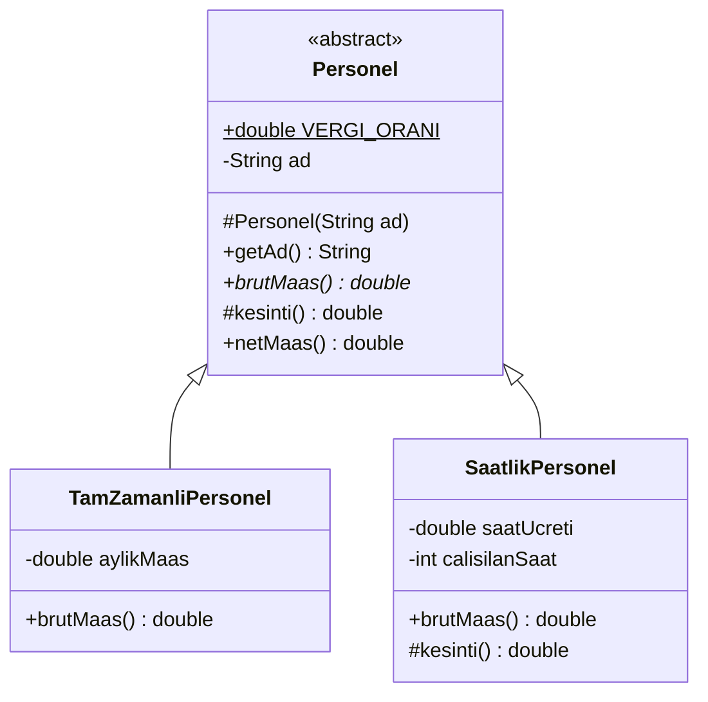
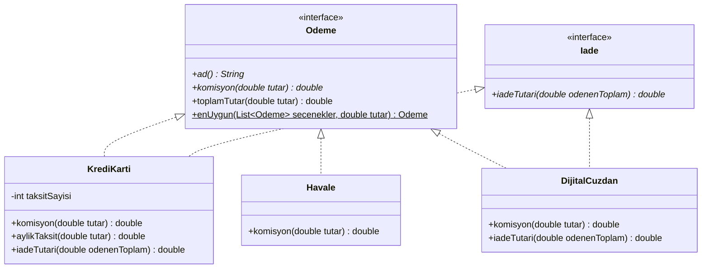
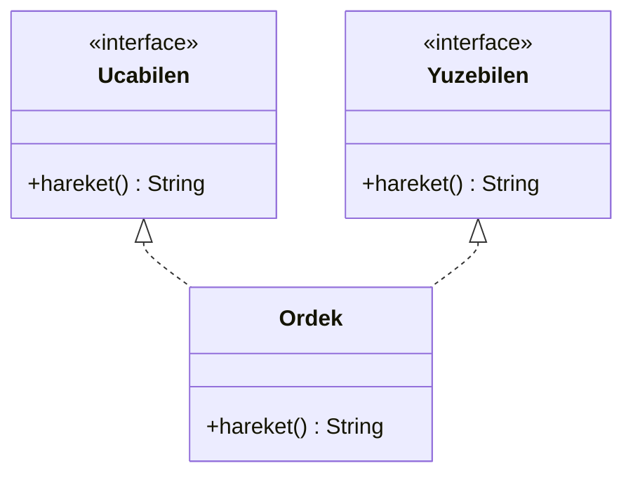
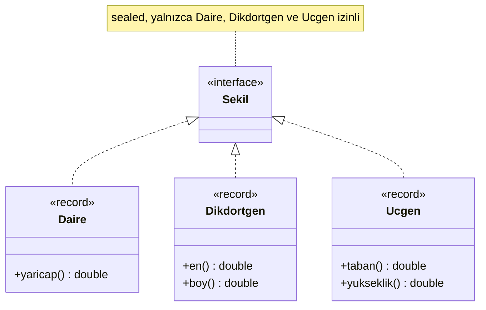
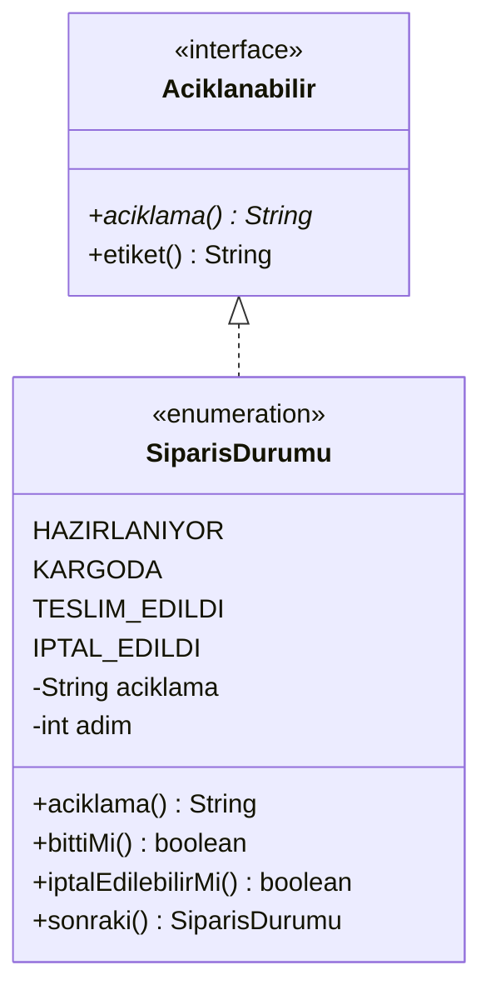

# 🧩 M7 - Soyut Sınıflar ve Arayüzler

<p align="center"><em>Hafta 7</em></p>

abstract, interface, default metotlar, sealed sınıflar ve enum.

## ❔ Öğrenme hedefleri

Bu modülün sonunda öğrenci:

* Soyut sınıf ile arayüz arasındaki farkı açıklamak ve uygun olanı seçmek
* Soyut metotlarla ortak bir iskeleti alt sınıflara tamamlatmak (şablon metot fikri)
* Birden çok arayüzü uygulayan sınıflar yazmak
* `default` metot çakışmalarını `X.super.m()` ile çözmek
* sealed hiyerarşiler ve enum ile sınırlı tür kümeleri tanımlamak

---

## 1. Soyut sınıflar ve soyut metotlar { #1-soyut-siniflar }

M6'daki `Sekil` sınıfını hatırlayın: `alan()` metodu `return 0;` döndürüyordu, çünkü "genel bir
şekil"in alanı yoktur. Bu yapay gövde iki soruna yol açar: `new Sekil()` yazılabilir (anlamsız bir
nesne) ve yeni bir alt sınıf `alan()` metodunu ezmeyi unutursa derleyici uyarmaz, alan sessizce 0
çıkar.

Bir şirketin bordro sistemini düşünelim. Tam zamanlı personelin sabit aylık maaşı var, saatlik
personelin maaşı çalıştığı saate göre hesaplanıyor. **Net maaşın** hesabı ise herkes için aynı:
brüt maaştan kesinti düşülür. Ortak kısmı bir üst sınıfta toplamak istiyoruz, ama "genel bir
personelin brüt maaşı" diye bir şey yok.

Çözüm **soyut sınıftır** (abstract class): `abstract` ile işaretlenmiş, doğrudan örneklenemeyen
(instantiate) bir sınıf. İçinde gövdesiz **soyut metotlar** (abstract methods) bulunabilir; soyut
olmayan her alt sınıf bu metotları yazmak **zorundadır**.



UML'de soyut sınıf `<<abstract>>` ile (ya da adı italik yazılarak), soyut metot `*` ile gösterilir;
`#` işareti `protected` demektir.

```java
public abstract class Personel {                  // (1)!

    public static final double VERGI_ORANI = 0.15;

    private final String ad;

    protected Personel(String ad) {               // (2)!
        this.ad = ad;
    }

    public abstract double brutMaas();            // (3)!

    protected double kesinti() {                  // (4)!
        return brutMaas() * VERGI_ORANI;
    }

    public final double netMaas() {               // (5)!
        return brutMaas() - kesinti();
    }
    // getAd() ...
}
```

1. `abstract class`: `new Personel("Ali")` yazılırsa derleyici
   `Personel is abstract; cannot be instantiated` hatası verir.
2. Soyut sınıfların da kurucusu olabilir; alt sınıflar `super(ad)` ile çağırır. Dışarıdan
   çağrılamayacağı için `protected` yapmak niyeti açıkça gösterir.
3. Gövdesiz soyut metot: "Her personelin bir brüt maaşı vardır, ama nasıl hesaplandığını alt
   sınıf bilir." Bir alt sınıf bu metodu yazmazsa kendisi de `abstract` olmak zorundadır.
4. Soyut sınıf **kısmi uygulama** (partial implementation) sunabilir: varsayılan kesinti burada
   yazılı, alt sınıflar isterse ezer.
5. `final`: alt sınıflar bu metodu ezemez. Algoritmanın iskeleti sabit, değişen adımlar alt
   sınıflarda.

`netMaas()` metodu, M6'da gördüğümüz "üst sınıftaki metot içinden yapılan çağrı da çok biçimlidir"
kuralını bilinçli olarak kullanır. İskeleti üst sınıfta sabitleyip bazı adımları alt sınıflara
bırakan bu yapıya **şablon metot** (Template Method) kalıbı denir; M12'de ayrıntılı işleyeceğiz.
`SaatlikPersonel`, brüt maaşı 10.000 TL'nin altındaysa `kesinti()` metodunu ezip 0 döndürür. Böyle
isteğe bağlı ezilen adımlara **kanca** (hook) metot denir.

```java
@Test
@DisplayName("Saatlik: 160 saati aşan saatler 1,5 kat ödenir")
void saatlikFazlaMesai() {
    // Hazırla
    Personel p = new SaatlikPersonel("Mehmet", 100, 170);
    // Çalıştır ve Doğrula: 160 x 100 + 10 x 150 = 17.500 brüt
    assertEquals(160 * 100 + 10 * 150.0, p.brutMaas(), 1e-9);
    assertEquals(17_500 * 0.85, p.netMaas(), 1e-9);
}
```

`PersonelTest`'te tam 10.000 TL brüt gibi **sınır** durumlar da vardır: `62,5 × 160 = 10.000`
olduğunda koşul `< 10.000` sağlanmadığı için kesinti uygulanır.

## 2. Arayüzler { #2-arayuzler }

Bir e-ticaret sitesi kredi kartı, havale ve dijital cüzdanla ödeme kabul ediyor. Sepet ekranı her
yöntem için "komisyon" ve "ödenecek toplam" göstermeli. Bu üç yöntemin ortak bir **durumu** yok
(kartın taksit sayısı var, havalenin yok), ortak bir **yetenekleri** var: "bir tutar için komisyon
hesaplayabilmek".

**Arayüz** (interface), bir türün "ne yapabildiğini" söyleyen bir **sözleşmedir** (contract).
Metot imzalarını bildirir, ama (aşağıda göreceğimiz `default` ve `static` metotlar dışında) nasıl
yapılacağını söylemez. Bir sınıf `implements` ile sözleşmeye imza atar ve tüm soyut metotları
yazmayı taahhüt eder.



Kesikli ok (`<|..`) **gerçeklemeyi** (realization) gösterir: sınıf, arayüzün sözleşmesini yerine
getirir.

```java
public interface Odeme {

    String ad();                                  // (1)!

    double komisyon(double tutar);

    default double toplamTutar(double tutar) {    // (2)!
        if (tutar <= 0) {
            throw new IllegalArgumentException("Tutar pozitif olmalı: " + tutar);
        }
        return tutar + komisyon(tutar);
    }
}
```

1. Arayüz metotları kendiliğinden `public abstract`'tır; bu anahtar kelimeleri yazmayız.
   Arayüzde tanımlanan alanlar da kendiliğinden `public static final` (sabit) olur.
2. `default` metot: gövdesi olan arayüz metodu (§3). `komisyon(...)` çağrısı çok biçimlidir.

```java
public class Havale implements Odeme {

    public static final double SABIT_UCRET = 5.0;
    public static final double UCRETSIZ_ESIK = 1000.0;

    @Override
    public String ad() {
        return "Havale";
    }

    @Override
    public double komisyon(double tutar) {
        return tutar >= UCRETSIZ_ESIK ? 0 : SABIT_UCRET;
    }
}
```

Üç yöntemin kuralları:

| Yöntem | Komisyon | 200 TL için | 2000 TL için |
|---|---|---|---|
| `KrediKarti(1)` | %2,5, her ek taksit +%1 | 5,00 | 50,00 |
| `Havale` | 5 TL, 1000 TL ve üzeri ücretsiz | 5,00 | 0,00 |
| `DijitalCuzdan` | %1,5, en az 1 TL | 3,00 | 30,00 |

### 2.1 Birden çok arayüz

Java'da bir sınıf yalnızca **bir** sınıftan türeyebilir (`extends`), ama **istediği kadar** arayüzü
uygulayabilir. Kredi kartı ve dijital cüzdan iade de destekliyor, havale desteklemiyor. İadeyi
`Odeme`'ye eklemek havaleyi anlamsız bir metot yazmaya zorlardı; bunun yerine ayrı, küçük bir
arayüz tanımlarız:

```java
public class KrediKarti implements Odeme, Iade {
    // ...
    @Override
    public double iadeTutari(double odenenToplam) {
        return odenenToplam;               // kartta komisyon dahil tamamı iade
    }
}
```

Bir `KrediKarti` nesnesi artık hem `Odeme` hem `Iade` türündendir; hangi referansla bakarsanız o
arayüzün metotlarını görürsünüz:

```java
@Test
@DisplayName("Birden çok arayüz: iade kuralları türe göre değişir")
void iade() {
    Iade kart = new KrediKarti(3);
    Iade cuzdan = new DijitalCuzdan();

    assertEquals(1045.0, kart.iadeTutari(1045), 1e-9);
    assertEquals(1014.0, cuzdan.iadeTutari(1015), 1e-9);   // 1 TL iade ücreti
    assertTrue(kart instanceof Odeme);
}
```

!!! tip "Küçük arayüzler"

    Bir arayüz ne kadar küçükse o kadar çok sınıf onu anlamlı biçimde uygulayabilir. Uygulayıcıları
    kullanmadıkları metotları yazmaya zorlamamak, M11'de göreceğimiz **arayüz ayrımı ilkesinin**
    (interface segregation principle) özüdür.

## 3. default ve static arayüz metotları { #3-default-static }

Java 8'den önce arayüzlerde yalnızca soyut metotlar vardı. `Odeme` arayüzüne yeni bir metot eklemek,
onu uygulayan **tüm** sınıfları bozardı. **`default` metotlar** bu sorunu çözer: gövdeleriyle birlikte
gelir, uygulayıcılar olduğu gibi kullanır ya da ezer. `toplamTutar` böyle bir metottur; üç sınıfın
hiçbiri onu yazmadı, ama üçü de kullanabiliyor.

**`static` arayüz metotları** ise arayüze ait yardımcı metotlardır ve arayüz adıyla çağrılır:

```java
static Odeme enUygun(List<Odeme> secenekler, double tutar) {
    Odeme enIyi = null;
    for (Odeme o : secenekler) {
        if (enIyi == null || o.komisyon(tutar) < enIyi.komisyon(tutar)) {
            enIyi = o;
        }
    }
    return enIyi;
}
```

```java
Odeme.enUygun(List.of(kart, havale, cuzdan), 200);    // cuzdan  (5 / 5 / 3)
Odeme.enUygun(List.of(kart, havale, cuzdan), 2000);   // havale  (50 / 0 / 30)
```

### 3.1 Elmas çakışması { #3-1-elmas }

Birden çok arayüz uygulamak, `default` metotlarla birlikte bir soruyu gündeme getirir: iki arayüz
**aynı imzalı** iki `default` metot getirirse sınıf hangisini alır?



Java tahmin yürütmez; sınıf metodu ezmezse derleme hatası verir:

```text
error: types Ucabilen and Yuzebilen are incompatible;
  class Ordek inherits unrelated defaults for hareket() from types Ucabilen and Yuzebilen
```

Çözüm, metodu ezmek ve gerekirse istenen arayüzün sürümünü `X.super.m()` ile çağırmaktır:

```java
public class Ordek implements Ucabilen, Yuzebilen {

    @Override
    public String hareket() {
        return Ucabilen.super.hareket() + " ve " + Yuzebilen.super.hareket();   // (1)!
    }
}
```

1. `Ucabilen.super.hareket()`: "`Ucabilen` arayüzündeki `default` sürümü çalıştır." Yalnızca
   doğrudan uygulanan arayüzler için yazılabilir. Sonuç: `"uçar ve yüzer"`.

!!! note "Çakışma kuralları kısaca"

    (1) Sınıfta (ya da üst sınıflarında) yazılmış bir metot her zaman `default` metoda üstün gelir.
    (2) Bir arayüz diğerinden türüyorsa, daha özel olanın `default` metodu kazanır. (3) Bunlar
    çakışmayı çözmüyorsa sınıf metodu kendisi ezmek zorundadır.

## 4. Soyut sınıf mı, arayüz mü? { #4-karsilastirma }

| | Soyut sınıf | Arayüz |
|---|---|---|
| Anahtar kelime | `abstract class`, `extends` | `interface`, `implements` |
| Bir sınıf kaç tane alabilir? | **Bir** | **Birden çok** |
| Örnek alanları (durum) | Olabilir (`private String ad`) | Olamaz; yalnızca `public static final` sabitler |
| Kurucu | Olabilir | Olamaz |
| Metot gövdeleri | Her türlü metot | Yalnızca `default`, `static` ve `private` metotlar |
| Erişim belirleyiciler | Hepsi (`protected` dahil) | Metotlar `public` (yardımcılar `private` olabilir) |
| İlişki | "bir-tür" (is-a): *Saatlik personel bir personeldir* | "yapabilir" (can-do): *Kredi kartı ödeme alabilir* |
| Tipik kullanım | Yakın akraba sınıfların ortak kodu | İlgisiz sınıfların ortak yeteneği |

**Karar rehberi:**

1. Varsayılan tercihiniz **arayüz** olsun. Arayüzler daha esnektir: bir sınıf, üst sınıfı ne olursa
   olsun, bir arayüzü sonradan uygulayabilir.
2. Alt türlerin **ortak durumu** (alanları) ve bu durumu kullanan **ortak kodu** varsa soyut sınıf
   düşünün (`Personel`'in `ad` alanı ve `netMaas` iskeleti gibi).
3. İkisini birlikte kullanmak da yaygındır: sözleşme bir arayüzde, ortak kodun bir kısmı onu uygulayan
   bir soyut sınıfta durur. Java kütüphanesindeki `List` arayüzü ve `AbstractList` soyut sınıfı
   bu yapıdadır (M9).

Java kütüphanesi arayüzlerle doludur. Bu dönem karşılaşacaklarınızdan bazıları:

| Arayüz | Sözleşme | Nerede? |
|---|---|---|
| `Comparable<T>` | `int compareTo(T o)`: nesneler kendi aralarında sıralanabilir | M9 |
| `Runnable` | `void run()`: çalıştırılabilir bir iş | M10 (lambda) |
| `AutoCloseable` | `void close()`: işi bitince kapatılması gereken kaynak | M8 (`try`-with-resources) |
| `List<E>` | Sıralı eleman topluluğu (`add`, `get`, `size`) | M9 |

## 5. sealed sınıflar ve arayüzler { #5-sealed }

M6'da desenli `switch` yazarken `default` durumunu eklemek zorunda kaldık, çünkü derleyici
`Sekil`'in başka hangi alt türleri olduğunu bilemiyordu. Oysa bazı hiyerarşiler bilerek
**kapalıdır**: bizim çizim programımızda yalnızca daire, dikdörtgen ve üçgen var ve başka bir
modülün kendi şeklini eklemesini istemiyoruz.

**Mühürlü** (sealed) sınıf ve arayüzler (JEP 409) hangi türlerin kendilerinden türeyebileceğini
`permits` ile listeler:



```java
public sealed interface Sekil permits Daire, Dikdortgen, Ucgen {   // (1)!
}

public record Daire(double yaricap) implements Sekil { }            // (2)!
public record Dikdortgen(double en, double boy) implements Sekil { }
public record Ucgen(double taban, double yukseklik) implements Sekil { }
```

1. Listede olmayan bir sınıf `Sekil`'i uygulamaya çalışırsa derleme hatası alınır:
   `class is not allowed to extend sealed class: Sekil (as it is not listed in its 'permits' clause)`.
2. `record` (JEP 395), değişmez veri taşıyan sınıfları kısaca yazmanın yoludur. `record Daire(double
   yaricap)` satırı `private final` bir alan, kurucu, `yaricap()` erişim metodu ve `equals`,
   `hashCode`, `toString` üretir. Record'lar kendiliğinden `final`'dır.

İzin verilen her alt tür `final`, `sealed` ya da `non-sealed` olmak zorundadır. `final` hiyerarşiyi
orada kapatır, `sealed` kendi izinli listesiyle devam ettirir, `non-sealed` ise o daldan itibaren
yeniden herkese açar.

### 5.1 Eksiksiz switch { #5-1-eksiksiz }

Derleyici `Sekil`'in tüm alt türlerini bildiği için `switch` ifadesinde `default` gerekmez:

```java
public static double alan(Sekil s) {
    return switch (s) {
        case Daire d -> Math.PI * d.yaricap() * d.yaricap();
        case Dikdortgen r -> r.en() * r.boy();
        case Ucgen u -> u.taban() * u.yukseklik() / 2;
    };                                                     // (1)!
}
```

1. `default` yok. Bir gün `Besgen` eklenip `permits` listesine yazılırsa derleyici bu satırı
   **hata** olarak işaretler: `the switch expression does not cover all possible input values`.
   `default` kullansaydık yeni tür sessizce `default` koluna düşerdi. Eksiksizlik (exhaustiveness)
   denetimi, M6'daki "Ucgen unutuldu" hatasını derleme zamanında yakalar.

Record'larla birlikte **kayıt desenleri** (record patterns, JEP 440) de kullanılabilir. Desen,
record'u bileşenlerine ayırır:

```java
public static String tarif(Sekil s) {
    return switch (s) {
        case Daire(double r) when r == 0 -> "nokta";
        case Daire(double r) -> "daire, r = " + r;
        case Dikdortgen(double en, double boy) when en == boy -> "kare, kenar = " + en;
        case Dikdortgen(double en, double boy) -> "dikdörtgen, " + en + " x " + boy;
        case Ucgen u -> "üçgen";
    };
}
```

!!! example "Kendinizi deneyin"

    `SekilIslemleri.alan` ile M6'daki `Sekil.alan()` ezmesini karşılaştırın. Yeni bir **şekil**
    eklemek hangisinde kolay? Yeni bir **işlem** (örneğin `cevre`) eklemek hangisinde kolay?

    ??? success "Cevap"

        M6'daki çok biçimli tasarımda yeni şekil eklemek kolaydır (yeni bir alt sınıf yazılır, mevcut
        kod değişmez), ama yeni işlem eklemek tüm şekil sınıflarını değiştirmeyi gerektirir. Sealed +
        `switch` tasarımında ise tam tersi: yeni işlem tek bir yeni metottur, yeni şekil ise tüm
        `switch`'leri değiştirir. Neyse ki derleyici eksik `switch`'leri tek tek gösterir. Tür kümesi
        sabit, işlemler sık değişiyorsa sealed tercih edilir; tersiyse çok biçimli metotlar.

## 6. enum { #6-enum }

Haftanın günleri, sipariş durumları, kart tipleri gibi **sabit ve sonlu** değer kümelerini `int`
sabitlerle (`final int PAZARTESI = 1;`) tutmak hataya açıktır: `gun = 42` derlenir. **`enum`**, bu
kümeyi kendi türü olarak tanımlar; derleyici yalnızca listelenen değerlere izin verir.

```java
public enum Gun {
    PAZARTESI, SALI, CARSAMBA, PERSEMBE, CUMA, CUMARTESI, PAZAR;

    public int calismaSaati() {
        return switch (this) {                     // (1)!
            case PAZARTESI, SALI, CARSAMBA, PERSEMBE, CUMA -> 9;
            case CUMARTESI -> 5;
            case PAZAR -> 0;
        };
    }

    public static int haftalikCalismaSaati() {
        int toplam = 0;
        for (Gun g : values()) {                   // (2)!
            toplam += g.calismaSaati();
        }
        return toplam;                             // 5 x 9 + 5 + 0 = 50
    }
}
```

1. Enum üzerindeki `switch` ifadesi de eksiksizdir: tüm sabitler karşılanmışsa `default` gerekmez.
2. `values()`, tüm sabitleri tanımlandıkları sırayla bir dizi olarak döndürür. `valueOf("SALI")`
   metni sabite çevirir; `ordinal()` sabitin sırasını (0'dan başlayarak) verir.

Enum'lar aslında sınıftır: her sabit, o sınıfın tek bir nesnesidir. Bu yüzden alanları, kurucusu ve
metotları olabilir, arayüz de uygulayabilir:



```java
public enum SiparisDurumu implements Aciklanabilir {
    HAZIRLANIYOR("Hazırlanıyor", 1),               // (1)!
    KARGODA("Kargoda", 2),
    TESLIM_EDILDI("Teslim edildi", 3),
    IPTAL_EDILDI("İptal edildi", 0);

    private final String aciklama;
    private final int adim;

    SiparisDurumu(String aciklama, int adim) {     // (2)!
        this.aciklama = aciklama;
        this.adim = adim;
    }

    @Override
    public String aciklama() {
        return aciklama;
    }

    public SiparisDurumu sonraki() {
        return switch (this) {
            case HAZIRLANIYOR -> KARGODA;
            case KARGODA -> TESLIM_EDILDI;
            case TESLIM_EDILDI, IPTAL_EDILDI -> this;
        };
    }
    // bittiMi(), iptalEdilebilirMi(), getAdim() ...
}
```

1. Her sabit, parantez içindeki argümanlarla kurucuyu çağırır.
2. Enum kurucusu kendiliğinden `private`'tır; `new SiparisDurumu(...)` yazılamaz. Tüm nesneler
   yukarıdaki dört sabittir. Bu yüzden enum değerleri `==` ile güvenle karşılaştırılır.

`SiparisDurumu`, `Aciklanabilir` arayüzünün `default` metodu `etiket()`'i de devralır:
`SiparisDurumu.KARGODA.etiket()` sonucu `"[Kargoda]"` olur.

```java
@Test
@DisplayName("Sipariş akışı: hazırlanıyor, kargoda, teslim edildi")
void akis() {
    SiparisDurumu d = SiparisDurumu.HAZIRLANIYOR;

    d = d.sonraki();
    assertSame(SiparisDurumu.KARGODA, d);
    d = d.sonraki();
    assertSame(SiparisDurumu.TESLIM_EDILDI, d);
    assertSame(SiparisDurumu.TESLIM_EDILDI, d.sonraki());   // son durum değişmez
}
```

!!! tip "enum, sealed ve record"

    Üçü de "sınırlı tür kümesi" araçlarıdır. **enum**: sabit sayıda, her biri tek nesne olan değerler
    (günler, durumlar). **sealed**: sabit sayıda **tür**, ama her türden istediğiniz kadar nesne ve
    her birinin kendi verisi (farklı yarıçaplı daireler). **record**: sealed hiyerarşinin dallarını
    kısa ve değişmez yazmanın yolu.

## 7. Alıştırmalar

Kaynak kod `exercise_files/src/main/java/nyp/m7/`, testler `src/test/java/nyp/m7/` altında:

```bash
mvn -pl m7_soyut_arayuz/exercise_files test
```

1. **Yeni personel türü.** `Stajyer extends Personel` yazın: sabit 15.000 TL brüt, kesinti yok.
   `netMaas()` metodunu ezmeye çalışın; derleyicinin verdiği hatayı not edin. Kesintiyi hangi metodu
   ezerek kaldırmalısınız?
2. **Yeni ödeme yöntemi.** `KapidaOdeme implements Odeme` ekleyin: sabit 15 TL komisyon. `Iade`
   uygulamalı mı? `Odeme.enUygun` metodunun yeni yöntemi de değerlendirdiğini gösteren bir test yazın.
3. **Eksiksizliği gözlemleyin.** `Sekil`'e `record Kare(double kenar)` ekleyip `permits` listesine
   yazın. Derleyici hangi metotlarda hata verdi? Hataları giderin ve `SekilIslemleriTest`'e
   kare testleri ekleyin.
4. **Elmas.** `Ordek.hareket()` metodunu silip derleyin ve hata mesajını okuyun. Sonra metodu yalnızca
   `Yuzebilen.super.hareket()` döndürecek biçimde yeniden yazın.
5. **Enum tasarlayın.** `KartTipi` enum'u yazın: `BIREYSEL`, `TICARI`, `SANAL`; her birinin bir
   `komisyonIndirimi` alanı olsun. `KrediKarti`'na kart tipini ekleyip komisyonu buna göre
   düşürün. UML diyagramını Mermaid ile çizin.

---

## Özet

Soyut sınıflar örneklenemez; ortak durumu ve ortak kodu tutar, türe göre değişen adımları soyut
metotlarla alt sınıflara bırakır. İskeleti `final` bir metotta sabitleyip adımları alt sınıflara
yaptırmak şablon metot fikridir. Arayüzler bir sözleşme tanımlar: bir sınıf tek bir sınıftan türer,
ama birden çok arayüz uygulayabilir. `default` metotlar arayüzlere gövdeli metot ekler, `static`
metotlar arayüze ait yardımcılardır; iki arayüzden gelen aynı imzalı `default` metotlar çakışırsa
sınıf metodu ezer ve gerekirse `X.super.m()` ile seçim yapar. Varsayılan tercih arayüzdür; ortak
durum ve kod varsa soyut sınıf devreye girer. `sealed` sınıf ve arayüzler alt türleri `permits` ile
sınırlar; bu sayede desenli `switch` `default` olmadan eksiksiz yazılır ve yeni bir alt tür
eklendiğinde derleyici eksik yerleri gösterir. `enum` sabit bir değer kümesini tür olarak tanımlar;
alanları, kurucusu ve metotları olabilir, arayüz uygulayabilir. Sprint A haftasından sonra M8'de
istisna yönetimine geçiyoruz.

## İleri okuma

* [The Java Tutorials: Abstract Methods and Classes](https://docs.oracle.com/javase/tutorial/java/IandI/abstract.html)
  ve [Default Methods](https://docs.oracle.com/javase/tutorial/java/IandI/defaultmethods.html), Oracle.
  §1 ve §3'ün resmî anlatımı.
* [The Java Tutorials: Enum Types](https://docs.oracle.com/javase/tutorial/java/javaOO/enum.html),
  Oracle. Alanlı ve metotlu enum örnekleri.
* [JEP 409: Sealed Classes](https://openjdk.org/jeps/409). Sealed hiyerarşilerin tasarım gerekçeleri
  ve `non-sealed` kullanımı.
* Joshua Bloch, *Effective Java*, 3. baskı, 2018, Madde 20 ("Prefer interfaces to abstract classes")
  ve Madde 34 ("Use enums instead of int constants").

## Kaynaklar

* [JLS 21](https://docs.oracle.com/javase/specs/jls/se21/html/index.html), §8.1.1 (Class Modifiers:
  `abstract`, `sealed`, `final`), §8.9 (Enum Classes), §8.10 (Record Classes), bölüm 9 (Interfaces),
  §14.11 (The switch Statement). §1, §3, §5 ve §6'daki kuralların kaynağı.
* [JEP 409: Sealed Classes](https://openjdk.org/jeps/409), [JEP 395: Records](https://openjdk.org/jeps/395),
  [JEP 440: Record Patterns](https://openjdk.org/jeps/440),
  [JEP 441: Pattern Matching for switch](https://openjdk.org/jeps/441). §5'in kaynağı.
* [Java SE 21 API: `java.lang.Enum`](https://docs.oracle.com/en/java/javase/21/docs/api/java.base/java/lang/Enum.html),
  [`Comparable`](https://docs.oracle.com/en/java/javase/21/docs/api/java.base/java/lang/Comparable.html),
  [`Runnable`](https://docs.oracle.com/en/java/javase/21/docs/api/java.base/java/lang/Runnable.html),
  [`AutoCloseable`](https://docs.oracle.com/en/java/javase/21/docs/api/java.base/java/lang/AutoCloseable.html).
  §4 ve §6'daki kütüphane türlerinin kaynağı.
* Erich Gamma, Richard Helm, Ralph Johnson, John Vlissides, *Design Patterns: Elements of Reusable
  Object-Oriented Software*, Addison-Wesley, 1994 ("Template Method"). §1'deki şablon metot fikrinin
  kaynağı.
* Joshua Bloch, *Effective Java*, 3. baskı, Addison-Wesley, 2018, Madde 20 ve Madde 34. §4'teki karar
  rehberinin ve §6'nın dayanağı.
* Cay S. Horstmann, *Core Java, Volume I: Fundamentals*, 12. baskı, Pearson, 2022, 5. bölüm
  ("Inheritance") ve 6. bölüm ("Interfaces, Lambda Expressions, and Inner Classes"). Modülün
  dayandığı ders kitabı.
