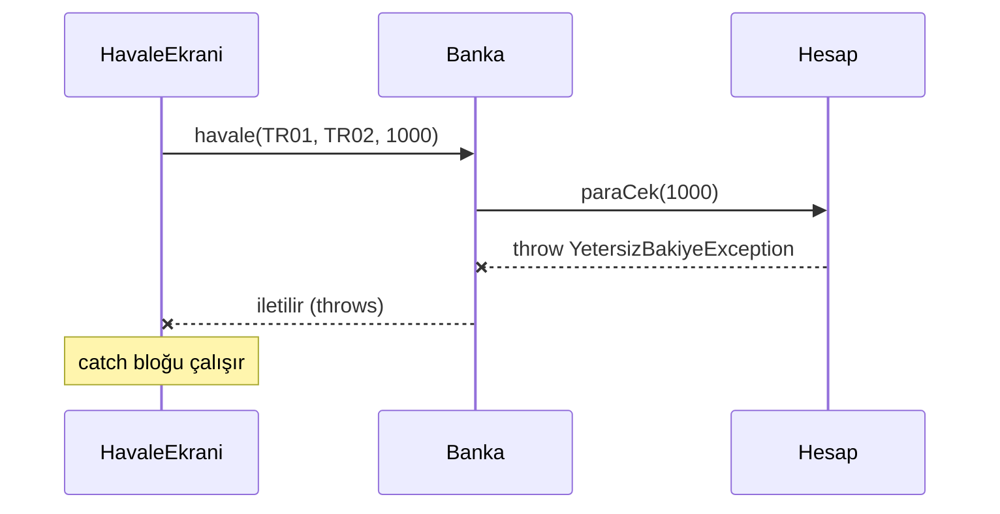
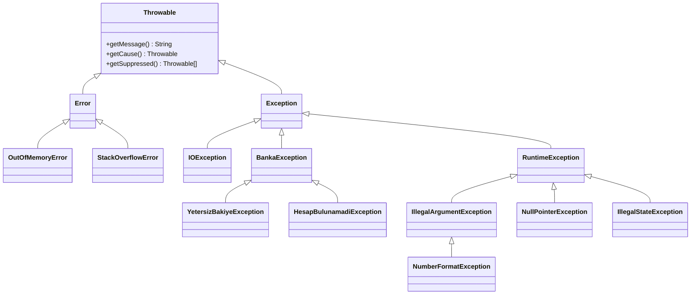
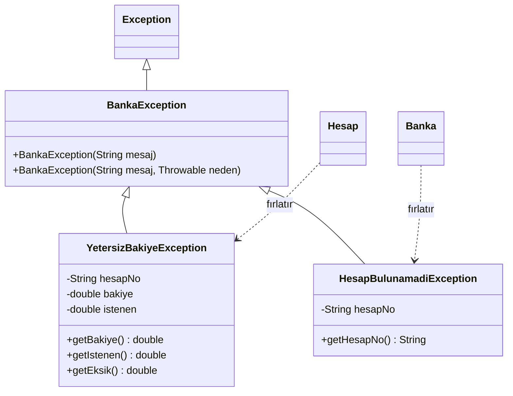
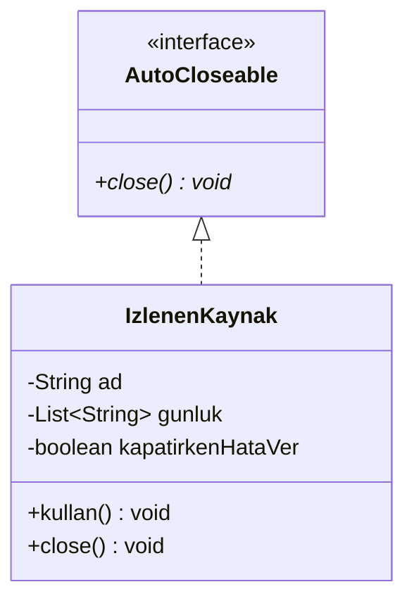

# 🚨 M8 - İstisna Yönetimi

<p align="center"><em>Hafta 9</em></p>

## ❔ Öğrenme hedefleri

Bu modülün sonunda öğrenci:

* Hata durumlarını istisnalarla bildirmek ve yakalamak
* Checked ve unchecked istisnaları ayırt etmek
* Alan kurallarına özgü istisna sınıfları yazmak
* İstisna fırlatan kodu JUnit ile test etmek

---

## 1. Hata yönetimi neden gerekli? { #1-neden }

M1'deki `Hesap.paraCek` metodu bakiye yetmediğinde `false` döndürüyordu. M3'te geçersiz bir değer
geldiğinde `IllegalArgumentException` fırlatmayı gördük. İkisi de "bir şeyler ters gitti" demenin
yollarıdır, ama çağıran koda çok farklı sorumluluklar yükler.

`boolean` dönüşün sorunu, dönüş değerinin **görmezden gelinebilmesidir**:

```java
hesap.paraCek(1000);                 // false döndü, kimse bakmadı
faturaOde();                         // para çekilmiş gibi devam ediyoruz
```

Derleyici bu satırda hiçbir uyarı vermez. Üstelik `false` yalnızca "olmadı" der; tutar mı negatif,
bakiye mi yetersiz, hesap mı kapalı, söylemez. Nedenini öğrenmek isteyen kod aynı kontrolleri
kendisi tekrar yapmak zorunda kalır.

**İstisna** (exception), bir metodun normal akışını sürdüremediğini bildiren nesnedir. Bir istisna
fırlatıldığında (throw) metot o noktada durur, sonraki satırlar çalışmaz ve istisna, onu yakalayan
(catch) bir kod bulunana kadar çağrı zincirinde yukarı doğru ilerler. Kimse yakalamazsa program
hata mesajıyla sonlanır. Yani hata **sessizce kaybolamaz**.

| Yaklaşım | Görmezden gelinebilir mi? | Neden bilgisi | Derleyici zorlar mı? |
|---|---|---|---|
| `boolean` dönüş (M1) | Evet | Yok, yalnızca `false` | Hayır |
| `IllegalArgumentException` (M3) | Hayır, program durur | Mesaj | Hayır |
| Kendi kontrollü istisnamız (bu modül) | Hayır | Mesaj + alan verisi (bakiye, istenen tutar) | Evet, yakala ya da bildir |

Bu modülde M1'deki banka örneğini istisnalarla yeniden yazıyoruz: `Hesap`, onu numarasıyla bulan
bir `Banka` ve kullanıcıya mesaj gösteren bir `HavaleEkrani`.

## 2. try, catch, finally { #2-try-catch-finally }

### 2.1 İstisna çağrı zincirinde nasıl ilerler?

`HavaleEkrani` bankadan havale ister, `Banka` kaynak hesaptan para çeker. Bakiye yetmezse istisna
`Hesap` içinde doğar; `Banka` onu yakalamaz, yalnızca yukarı iletir; `HavaleEkrani` yakalayıp
kullanıcıya uygun bir mesaj üretir:



İstisnayı **onunla anlamlı bir şey yapabilecek katmanda** yakalarız. `Hesap` kullanıcıya ne
söyleneceğini bilmez; ekran bilir.

### 2.2 Birden çok catch ve finally

```java
public String havaleYap(String kaynakNo, String hedefNo, double tutar) {
    try {                                                       // (1)!
        banka.havale(kaynakNo, hedefNo, tutar);
        return "Havale tamamlandı";
    } catch (YetersizBakiyeException e) {                       // (2)!
        return "Bakiye yetersiz, eksik tutar: " + e.getEksik();
    } catch (HesapBulunamadiException e) {
        return "Hesap bulunamadı: " + e.getHesapNo();
    } catch (IllegalArgumentException e) {
        return "Geçersiz tutar";
    } finally {                                                 // (3)!
        denemeSayisi++;
    }
}
```

1. `try` bloğu, istisna fırlatabilecek kodu içerir. İçerideki herhangi bir satır istisna fırlatırsa
   bloğun geri kalanı atlanır.
2. `catch` blokları **yukarıdan aşağı** denenir; istisnanın türüne uyan ilk blok çalışır. `e`,
   yakalanan istisna nesnesidir: mesajını ve alanlarını okuyabiliriz.
3. `finally` bloğu **her durumda** çalışır: `try` normal bittiğinde, bir `catch` çalıştığında, hatta
   `return` ile çıkıldığında bile. Sayaç, kilit bırakma, günlük yazma gibi "ne olursa olsun yapılacak"
   işler buraya konur.

!!! warning "Özel olan önce, genel olan sonra"

    Alt sınıf istisnayı üst sınıftan **önce** yakalamalısınız. `catch (BankaException e)` bloğunu
    `catch (YetersizBakiyeException e)` bloğunun üstüne yazarsanız ikinci blok hiçbir zaman
    çalışamaz ve program **derlenmez**: `exception YetersizBakiyeException has already been caught`.

### 2.3 Çoklu yakalama (multi-catch)

İki farklı istisnaya aynı tepkiyi vereceksek, Java 7'den beri türleri `|` ile birleştirebiliriz:

```java
try {
    banka.havale(kaynakNo, hedefNo, tutar);
    return "Havale tamamlandı";
} catch (YetersizBakiyeException | HesapBulunamadiException e) {
    return "İşlem başarısız: " + e.getMessage();
} finally {
    denemeSayisi++;
}
```

Bu blokta `e`'nin türü iki istisnanın ortak üst türüdür (`BankaException`), dolayısıyla yalnızca
ortak metotlar (`getMessage`) çağrılabilir. `|` ile birleştirilen türler birbirinin alt sınıfı
olamaz; `YetersizBakiyeException | BankaException` yazmak derleme hatasıdır, çünkü ikincisi
birincisini zaten kapsar.

!!! example "Kendinizi deneyin"

    TR02 hesabının bakiyesi 0 iken `ekran.havaleYap("TR02", "TR01", 50)` çağrılıyor. Hangi satırlar
    hangi sırayla çalışır, metot ne döndürür ve `denemeSayisi` kaç artar?

    ??? success "Cevap"

        `banka.havale` içinde `paraCek(50)` bir `YetersizBakiyeException` fırlatır; `return "Havale
        tamamlandı"` satırı **atlanır**. İlk `catch` bloğu eşleşir ve `"Bakiye yetersiz, eksik
        tutar: 50.0"` dönüş değeri hazırlanır. Metottan çıkmadan önce `finally` çalışır ve
        `denemeSayisi` **bir** artar. Diğer `catch` blokları çalışmaz.

## 3. İstisna hiyerarşisi: checked ve unchecked { #3-hiyerarsi }

Java'da fırlatılabilen her şey `Throwable` sınıfından türer. Hiyerarşinin kalıtım (M5) ağacı şöyle
özetlenebilir (ara sınıfların bir kısmı gösterilmedi):



Ağacın üç dalı üç farklı anlam taşır:

| Dal | Anlamı | Derleyici | Örnek |
|---|---|---|---|
| `Error` | JVM düzeyinde, genellikle kurtarılamaz sorun | Denetlemez | `OutOfMemoryError`, `StackOverflowError` |
| `RuntimeException` ve altları: **denetlenmeyen** (unchecked) | Programlama hatası: kodun kendisi yanlış | Denetlemez | `NullPointerException`, `IllegalArgumentException` |
| Diğer tüm `Exception` altları: **denetlenen** (checked) | Doğru yazılmış kodda bile olabilecek, kurtarılabilir durum | **Yakala ya da bildir** kuralını zorlar | `IOException`, `YetersizBakiyeException` |

Denetlenen bir istisna fırlatabilecek bir metodu çağıran kod iki şeyden birini yapmak **zorundadır**:
istisnayı `try`/`catch` ile yakalamak ya da kendi imzasına `throws` ekleyerek yukarı iletmek.
Aksi hâlde program derlenmez: `unreported exception YetersizBakiyeException; must be caught or
declared to be thrown`. Denetlenmeyen istisnalarda böyle bir zorunluluk yoktur.

### Ne zaman hangisi?

Joshua Bloch'un *Effective Java* kitabındaki kural (Madde 70, "Use checked exceptions for
recoverable conditions and runtime exceptions for programming errors") pratik bir ölçüt verir:
**çağıran kod bu durumdan makul biçimde kurtulabilir mi?**

* Bakiye yetersiz, aranan hesap yok, dosya bulunamadı: kullanıcıya haber verilip başka bir tutar ya da
  hesap denenebilir. Bunlar **kontrollü** istisna olmaya adaydır.
* Negatif tutar, `null` argüman, sınırların dışında bir dizi indisi: bunlar çağıran kodun bir
  hatasıdır, doğru yazılmış kodda hiç olmamalıdır. **Denetlenmeyen** istisna kullanılır.

Bu yüzden `Hesap.paraYatir(-5)` bir `IllegalArgumentException` fırlatır (M3'teki gibi), ama
`paraCek(1000)` bir `YetersizBakiyeException` fırlatır.

!!! tip "Kontrollü istisnayı gereksiz yere kullanmayın"

    Madde 71 ("Avoid unnecessary use of checked exceptions") öbür uca karşı uyarır: her çağrının
    `try`/`catch` ile sarılmasını gerektiren kontrollü istisnalar, çağıran kod zaten hiçbir şey
    yapamayacaksa yalnızca yük getirir. Uygun bir standart istisna varsa (`IllegalArgumentException`,
    `IllegalStateException`, `UnsupportedOperationException`) onu kullanmak da ayrı bir öneridir
    (Madde 72, "Favor the use of standard exceptions").

`Error` türlerini yakalamayın. Bellek bittiğinde ya da yığın taştığında programın yapabileceği
anlamlı bir şey genellikle yoktur.

## 4. throw ve throws { #4-throw-throws }

İki anahtar kelime birbirine benzese de farklı işler görür:

* **`throw`** bir **ifadedir** (statement): bir istisna nesnesini o anda fırlatır.
* **`throws`** bir metot **imzasının** parçasıdır: "bu metot şu kontrollü istisnaları fırlatabilir"
  diye bildirir.

```java
public void paraCek(double tutar) throws YetersizBakiyeException {   // (1)!
    tutariDenetle(tutar);                                             // (2)!
    if (tutar > bakiye) {
        throw new YetersizBakiyeException(hesapNo, bakiye, tutar);    // (3)!
    }
    bakiye = bakiye - tutar;                                          // (4)!
}

private static void tutariDenetle(double tutar) {
    if (tutar <= 0) {
        throw new IllegalArgumentException("Tutar pozitif olmalı: " + tutar);
    }
}
```

1. `throws` bildirimi metodun sözleşmesinin (contract) bir parçasıdır. Çağıran kod ne tür hatalara
   hazırlıklı olması gerektiğini imzadan okur.
2. `IllegalArgumentException` denetlenmeyen olduğu için `tutariDenetle` imzasında `throws` yoktur.
3. İstisna bir nesnedir; `new` ile oluşturulur ve `throw` ile fırlatılır. Bu satırdan sonrası
   çalışmaz.
4. Buraya ancak tüm kontroller geçildiyse gelinir. Hata durumunda bakiye **hiç değişmemiştir**.

`Banka.havale` istisnaları yakalamaz, yalnızca bildirir ve iletir:

```java
public void havale(String kaynakNo, String hedefNo, double tutar)
        throws HesapBulunamadiException, YetersizBakiyeException {
    Hesap kaynak = hesapBul(kaynakNo);
    Hesap hedef = hesapBul(hedefNo);
    kaynak.paraCek(tutar);
    hedef.paraYatir(tutar);
}
```

Satırların sırası bilinçlidir. Önce iki hesap da bulunur, sonra para çekilir. Hedef hesap yoksa
istisna, kaynaktan para **çekilmeden önce** fırlatılır. Bir işlem başarısız olduğunda nesneleri
işlemden önceki durumunda bırakmaya **hata atomikliği** (failure atomicity) denir (Madde 76, "Strive
for failure atomicity"). Sırayı ters çevirseydik, hedef bulunamadığında para kaynaktan çıkmış ama
hiçbir yere varmamış olurdu.

## 5. Kendi istisna sınıflarımız { #5-kendi-istisnalar }

### 5.1 Alan verisi taşıyan istisna

Standart istisnalar genel durumlar içindir. Alanımıza özgü bir durumu (yetersiz bakiye) adıyla
bildirmek için kendi istisna sınıfımızı yazarız. İstisnalar sıradan sınıflardır: alanları, kurucuları
ve metotları olabilir.



```java
public class YetersizBakiyeException extends BankaException {

    private final String hesapNo;
    private final double bakiye;
    private final double istenen;

    public YetersizBakiyeException(String hesapNo, double bakiye, double istenen) {
        super("Yetersiz bakiye: hesap " + hesapNo + ", bakiye " + bakiye   // (1)!
                + ", istenen " + istenen);
        this.hesapNo = hesapNo;
        this.bakiye = bakiye;
        this.istenen = istenen;
    }

    public double getEksik() {                                              // (2)!
        return istenen - bakiye;
    }
    // getHesapNo, getBakiye, getIstenen
}
```

1. Mesaj, hatayı anlamak için gereken tüm değerleri içerir: hangi hesap, ne kadar vardı, ne
   istendi (Madde 75, "Include failure-capture information in detail messages"). Günlükte yalnızca
   "Yetersiz bakiye" yazması hata ayıklarken işe yaramaz.
2. Aynı bilgi alan olarak da saklanır. `HavaleEkrani` eksik tutarı mesajı ayrıştırarak değil,
   `e.getEksik()` ile okur.

Ortak üst sınıf `BankaException`, çağıran koda seçim hakkı verir: tüm banka hatalarını tek
`catch (BankaException e)` ile ya da her türü ayrı ayrı yakalayabilir. Sınıf adı `Exception` ile
biter; bu Java'da yerleşik bir adlandırma geleneğidir.

### 5.2 Neden (cause) zinciri

Not dosyası okuyan bir sınıf düşünelim. Satırlar `Ayşe;85` biçiminde. `Integer.parseInt("yetmiş")`
bir `NumberFormatException` fırlatır. Bu istisnayı olduğu gibi yukarı iletirsek, çağıran kod
"For input string" mesajından hangi dosyanın hangi satırının hatalı olduğunu anlayamaz. Onu
**kendi soyutlama düzeyimize uygun** bir istisnaya çeviririz (Madde 73, "Throw exceptions appropriate
to the abstraction") ve asıl istisnayı **neden** (cause) olarak saklarız:

```java
String metin = parcalar[1].trim();
int not;
try {
    not = Integer.parseInt(metin);
} catch (NumberFormatException e) {
    throw new NotFormatException(satirNo, "Not bir tam sayı değil: " + metin, e);   // (1)!
}
```

1. Üçüncü argüman `e`, `NotFormatException` kurucusundan `super(mesaj, neden)` ile `Throwable`'a
   iletilir. Sonradan `hata.getCause()` asıl `NumberFormatException`'ı döndürür ve yığın izinde
   (stack trace) `Caused by:` satırı olarak görünür. Nedeni atmak, hata ayıklamak için gereken
   bilgiyi çöpe atmaktır.

## 6. try-with-resources { #6-try-with-resources }

### 6.1 Kaynakları kapatmak

Dosya, ağ bağlantısı, veritabanı bağlantısı gibi **kaynaklar** (resources) işletim sisteminden
ödünç alınır ve işimiz bitince kapatılmaları gerekir. Okuma sırasında bir istisna olsa bile.
Bunu `finally` ile yapabiliriz, ama kod hızla kalabalıklaşır ve `close()` da istisna fırlatabildiği
için doğru yazmak zordur (Madde 9, "Prefer try-with-resources to try-finally").

Java 7'den beri **try-with-resources** bu işi derleyiciye bırakır:

```java
public static double ortalama(Path dosya) throws IOException, NotFormatException {
    try (BufferedReader okuyucu = Files.newBufferedReader(dosya)) {   // (1)!
        List<Integer> notlar = notlariOku(okuyucu);
        if (notlar.isEmpty()) {
            throw new NotFormatException(0, "Dosyada hiç not yok");
        }
        int toplam = 0;
        for (int not : notlar) {
            toplam += not;
        }
        return (double) toplam / notlar.size();
    }                                                                  // (2)!
}
```

1. Parantez içinde tanımlanan değişken bir **kaynaktır**. Türü `AutoCloseable` arayüzünü (M7)
   gerçeklemek zorundadır; `BufferedReader` bunu gerçekler.
2. Blok nasıl biterse bitsin (normal, `return` ya da istisna ile) `okuyucu.close()` otomatik
   çağrılır. `catch` bloğu yazmadık: istisnalar `throws` ile yukarı iletilir, dosya yine kapanır.

`notlariOku` metodu dosya değil, bir `BufferedReader` alır. Böylece testte gerçek dosya yerine
`new BufferedReader(new StringReader("Ayşe;85"))` verebiliriz ([§8](#8-junit)).

### 6.2 Kendi AutoCloseable sınıfımız ve kapatma sırası

Kapatmanın **ne zaman** ve **hangi sırayla** olduğunu görmek için açılışını ve kapanışını bir
günlüğe yazan küçük bir kaynak sınıfı yazalım:



```java
public class IzlenenKaynak implements AutoCloseable {
    // alanlar ve kurucu: kurucu günlüğe "<ad> açıldı" yazar

    public void kullan() {
        gunluk.add(ad + " kullanıldı");
    }

    @Override
    public void close() {                          // (1)!
        gunluk.add(ad + " kapatıldı");
        if (kapatirkenHataVer) {
            throw new IllegalStateException(ad + " kapatılamadı");
        }
    }
}
```

1. `AutoCloseable.close()` imzasında `throws Exception` vardır. Ezen metot bu bildirimi daraltabilir
   ya da tamamen kaldırabilir; biz kaldırdık, böylece kullanan kod kontrollü istisna yakalamak
   zorunda kalmaz.

```java
List<String> gunluk = new ArrayList<>();
try (IzlenenKaynak a = new IzlenenKaynak("A", gunluk);
        IzlenenKaynak b = new IzlenenKaynak("B", gunluk)) {
    a.kullan();
    b.kullan();
}
System.out.println(gunluk);
```

```text
[A açıldı, B açıldı, A kullanıldı, B kullanıldı, B kapatıldı, A kapatıldı]
```

Kaynaklar **açılış sırasının tersiyle** kapatılır: en son açılan önce kapanır. Bu mantıklıdır,
çünkü sonra açılan kaynak (ör. dosyanın üstüne kurulmuş bir okuyucu) öncekine bağımlı olabilir.

!!! note "Bastırılmış (suppressed) istisnalar"

    Gövde bir istisna fırlatır, ardından `close()` da fırlatırsa hangisi kazanır? Asıl hata
    gövdedeki olduğu için o fırlatılır; `close()`'un istisnası kaybolmaz, asıl istisnaya
    **bastırılmış** olarak eklenir ve `getSuppressed()` ile okunur. `IzlenenKaynakTest` bu durumu
    `kapatirkenHataVer = true` ile dener. Elle yazılmış `try`/`finally` ise gövdenin istisnasını
    sessizce ezer; try-with-resources'ın üstünlüklerinden biri budur.

## 7. Yaygın kötü pratikler { #7-kotu-pratikler }

| Kötü pratik | Neden kötü? | Yerine |
|---|---|---|
| Boş `catch` bloğu: `catch (IOException e) { }` | Hata sessizce kaybolur, program yanlış veriyle devam eder (Madde 77, "Don't ignore exceptions") | Ele alın, yukarı iletin ya da en azından neden görmezden gelindiğini yorumla yazın |
| `catch (Exception e)` ile her şeyi yakalamak | `NullPointerException` gibi programlama hatalarını da yutar, gerçek hatayı gizler | Beklediğiniz türleri tek tek yakalayın |
| İstisnayı akış kontrolü için kullanmak | Okunaksız ve yavaştır; istisna "olağan dışı" durumlar içindir (Madde 69, "Use exceptions only for exceptional conditions") | Önceden kontrol edin: `if (i < dizi.length)` |
| Nedeni atmak: `throw new BankaException("hata")` | Asıl istisnanın yığın izi kaybolur | `throw new BankaException("hata", e)` |
| `e.printStackTrace()` yazıp devam etmek | Konsola yazılır ama program hatalı durumda ilerler | Hatayı ele alın ya da iletin |

Akış kontrolü için istisna kullanmanın tipik bir örneği:

```java
// Kötü: dizinin sonunu istisnayla bulmak
try {
    int i = 0;
    while (true) {
        toplam += notlar[i++];
    }
} catch (ArrayIndexOutOfBoundsException e) {
    // döngü bitti
}
```

Aynı iş `for (int not : notlar)` ile hem daha kısa hem daha doğru yapılır. Üstelik bu kalıp,
döngü gövdesinde **başka bir nedenle** oluşan bir `ArrayIndexOutOfBoundsException`'ı da "döngü
bitti" diye yorumlar ve gerçek hatayı gizler.

!!! example "Kendinizi deneyin"

    Aşağıdaki kodda kaç sorun görüyorsunuz?

    ```java
    try {
        banka.havale("TR01", "TR02", tutar);
    } catch (Exception e) {
    }
    ```

    ??? success "Cevap"

        İki sorun var. (1) `Exception` yakalandığı için bir `NullPointerException` (ör. `banka`
        `null` ise) da sessizce yutulur. (2) `catch` bloğu boş: yetersiz bakiye de, olmayan hesap da
        kullanıcıya hiç bildirilmez ve program havale yapılmış gibi devam eder. `HavaleEkrani`'ndaki
        gibi beklenen türleri ayrı ayrı yakalayıp her birine anlamlı bir tepki verin.

## 8. JUnit ile istisna testi { #8-junit }

Bir metodun doğru durumda istisna fırlattığını test etmek, doğru sonucu döndürdüğünü test etmek
kadar önemlidir. M3'te `assertThrows`'u gördük. Bu modülde onun **dönüş değerini** de kullanıyoruz:

```java
@Test
@DisplayName("Yetersiz bakiye: istisna alan verisini taşır, bakiye değişmez")
void yetersizBakiyeIstisnasi() {
    // Hazırla
    Hesap hesap = new Hesap("TR01", "Ayşe");
    hesap.paraYatir(100);
    // Çalıştır
    YetersizBakiyeException hata =
            assertThrows(YetersizBakiyeException.class, () -> hesap.paraCek(150));   // (1)!
    // Doğrula
    assertEquals("Yetersiz bakiye: hesap TR01, bakiye 100.0, istenen 150.0", hata.getMessage());
    assertEquals(50.0, hata.getEksik(), 1e-9);
    assertEquals(100.0, hesap.getBakiye(), 1e-9);                                    // (2)!
}
```

1. `assertThrows` ikinci argümandaki kodu çalıştırır. Beklenen türde bir istisna fırlatılmazsa test
   başarısız olur; fırlatılırsa **istisna nesnesini döndürür**. `() -> ...` yazımı bir lambda
   ifadesidir; ayrıntısını M10'da göreceğiz, şimdilik "çalıştırılacak kod parçası" diye okuyun.
2. Yalnızca istisnanın fırlatıldığını değil, **hata atomikliğini** de doğruluyoruz: bakiye değişmemiş
   olmalı.

Birkaç ayrıntı daha:

| Araç | Ne yapar? |
|---|---|
| `assertThrows(Tur.class, kod)` | `kod` `Tur` ya da onun bir **alt türünü** fırlatırsa geçer, istisnayı döndürür |
| `assertThrowsExactly(Tur.class, kod)` | Yalnızca tam olarak `Tur` fırlatılırsa geçer (alt tür kabul edilmez) |
| `assertDoesNotThrow(kod)` | `kod` hiçbir istisna fırlatmazsa geçer; "mutlu yol" testlerini açıkça ifade eder |
| `assertInstanceOf(Tur.class, nesne)` | Neden zincirini denetlemek için: `assertInstanceOf(NumberFormatException.class, hata.getCause())` |
| `void test() throws Exception` | Testin kendisi kontrollü istisna fırlatan kodu doğrudan çağırıyorsa imzaya `throws` eklenir; beklenmedik bir istisna testi başarısız yapar |

Dosya okuyan kodu test etmenin iki yolu var. Okuma mantığı `BufferedReader` aldığı için ilkinde
dosyaya hiç gerek yoktur:

```java
NotFormatException hata = assertThrows(NotFormatException.class,
        () -> NotOkuyucu.notlariOku(new BufferedReader(new StringReader("Ayşe;85\nZeynep;yetmiş\n"))));
assertEquals(2, hata.getSatirNo());
assertInstanceOf(NumberFormatException.class, hata.getCause());
```

Gerçek dosya gerektiğinde JUnit'in `@TempDir` özelliği her test için boş bir geçici klasör
oluşturur ve test bitince siler:

```java
@TempDir
Path geciciKlasor;

@Test
void dosyadanOrtalama() throws Exception {
    Path dosya = geciciKlasor.resolve("notlar.txt");
    Files.writeString(dosya, "Ayşe;85\nMehmet;70\nZeynep;90\n");

    assertEquals(81.666666666, NotOkuyucu.ortalama(dosya), 1e-6);
}
```

```bash
mvn -pl m8_istisnalar/exercise_files test
```

```text
[INFO] Tests run: 29, Failures: 0, Errors: 0, Skipped: 0
[INFO] BUILD SUCCESS
```

## 9. Alıştırmalar

1. **Çalıştır ve incele.** `mvn -pl m8_istisnalar/exercise_files test` ile testleri çalıştırın.
   `BankaUygulamasi`'nı çalıştırıp her çıktı satırının hangi `catch` bloğundan geldiğini bulun.
2. **Derleyiciyi deneyin.** `HavaleEkrani.havaleYap` içinde `catch (HesapBulunamadiException e)`
   bloğunu silin. Derleyici ne diyor? Sonra `catch (BankaException e)` bloğunu diğer iki bloğun
   **üstüne** ekleyin ve hata mesajını [§2.2](#2-try-catch-finally)'deki uyarıyla karşılaştırın.
3. **Kapalı hesap.** `Hesap` sınıfına `kapat()` metodu ve `HesapKapaliException extends
   BankaException` ekleyin: kapalı bir hesaptan para çekmek ya da yatırmak bu istisnayı fırlatsın.
   Kontrollü mü denetlenmeyen mi seçtiniz? Seçiminizi [§3](#3-hiyerarsi)'teki ölçütle bir cümleyle
   gerekçelendirin. En az üç test yazın (biri `assertThrows` dönüş değeriyle mesaj kontrolü).
4. **Günlük limiti.** Bir hesaptan bir günde en fazla 5000 TL çekilebilsin. Limit aşıldığında
   fırlatılan istisna, **kalan limiti** alan olarak taşısın. `HavaleEkrani` bu durumda "Günlük
   limit aşıldı, kalan: ..." mesajı döndürsün.
5. **Not dosyası.** `NotOkuyucu`'ya `enYuksek(Path dosya)` metodu ekleyin. `@TempDir` ile şu
   durumları test edin: normal dosya, tek satırlı dosya, hatalı satır içeren dosya (hangi satır
   olduğunu doğrulayın), olmayan dosya.
6. **Kapatma sırası.** `IzlenenKaynak` ile üç kaynak açın ve ikinci kaynağın **kurucusu** sırasında
   istisna fırlatıldığını düşünün (sınıfa bunu sağlayan bir kurucu parametresi ekleyin). Hangi
   kaynaklar kapatılır? Önce tahmin edin, sonra bir testle doğrulayın.

---

## Özet

İstisnalar, bir metodun işini yapamadığını görmezden gelinemeyecek biçimde bildirir. `try` bloğu
riskli kodu, `catch` blokları özelden genele doğru hata türlerini, `finally` ise her durumda
yapılacak işi içerir; aynı tepkiyi alacak türler `|` ile birleştirilebilir. `Throwable` ağacında
`Error` JVM sorunlarını, `RuntimeException` altları programlama hatalarını (denetlenmeyen), diğer
`Exception` altları ise kurtarılabilir durumları (denetlenen) temsil eder; denetlenen istisnalar
için derleyici "yakala ya da `throws` ile bildir" kuralını zorlar. Kendi istisna sınıflarımız alan
verisi taşır, anlamlı mesaj üretir ve alt düzey istisnayı neden olarak saklar. try-with-resources,
`AutoCloseable` kaynakları açılışın tersi sırayla ve her durumda kapatır. Boş `catch`, `Exception`
yakalamak ve istisnayla akış kontrolü kaçınılacak kalıplardır. JUnit'te `assertThrows` dönen
istisnanın mesajını ve alanlarını, `assertDoesNotThrow` ise mutlu yolu doğrular. Bir sonraki modülde
M3'ten beri yüzeysel kullandığımız `ArrayList`'i ve Java koleksiyonlarının geri kalanını, onları
tip güvenli yapan generics ile birlikte işliyoruz.

## İleri okuma

* [The Java Tutorials: Exceptions](https://docs.oracle.com/javase/tutorial/essential/exceptions/),
  Oracle. İstisnaların yakalanması, fırlatılması ve kontrollü/denetlenmeyen ayrımı üzerine resmî
  ders dizisi.
* [The Java Tutorials: The try-with-resources Statement](https://docs.oracle.com/javase/tutorial/essential/exceptions/tryResourceClose.html),
  Oracle. Bastırılmış istisnalar dahil try-with-resources'ın ayrıntıları.
* Joshua Bloch, *Effective Java*, 3. baskı, 2018, 10. bölüm ("Exceptions", Madde 69–77). Bu modülde
  alıntılanan önerilerin tamamı ve gerekçeleri.

## Kaynaklar

* [Java Language Specification, Java SE 21: Chapter 11, Exceptions](https://docs.oracle.com/javase/specs/jls/se21/html/jls-11.html).
  §3'teki kontrollü/denetlenmeyen istisna tanımının ve "yakala ya da bildir" kuralının kaynağı.
* [Java SE 21 API: `java.lang.Throwable`](https://docs.oracle.com/en/java/javase/21/docs/api/java.base/java/lang/Throwable.html).
  `getCause`, `getSuppressed` ve neden zinciri (§5.2, §6.2).
* [Java SE 21 API: `java.lang.AutoCloseable`](https://docs.oracle.com/en/java/javase/21/docs/api/java.base/java/lang/AutoCloseable.html).
  §6'daki `close()` sözleşmesi.
* [Java SE 21 API: `java.io.BufferedReader`](https://docs.oracle.com/en/java/javase/21/docs/api/java.base/java/io/BufferedReader.html).
  `NotOkuyucu`'daki satır satır okuma.
* Joshua Bloch, *Effective Java*, 3. baskı, Addison-Wesley, 2018. Madde 9 (try-with-resources),
  Madde 69–77 (istisnalar); §3–§7'deki öneriler.
* Cay S. Horstmann, *Core Java, Volume I: Fundamentals*, 12. baskı, Pearson, 2022, 7. bölüm
  ("Exceptions, Assertions, and Logging"). Konunun ders kitabı anlatımı.
* [JUnit 5 User Guide](https://junit.org/junit5/docs/current/user-guide/). §8'deki `assertThrows`,
  `assertThrowsExactly`, `assertDoesNotThrow` ve `@TempDir`.
