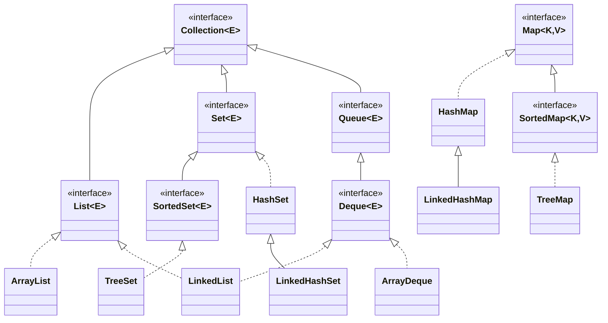
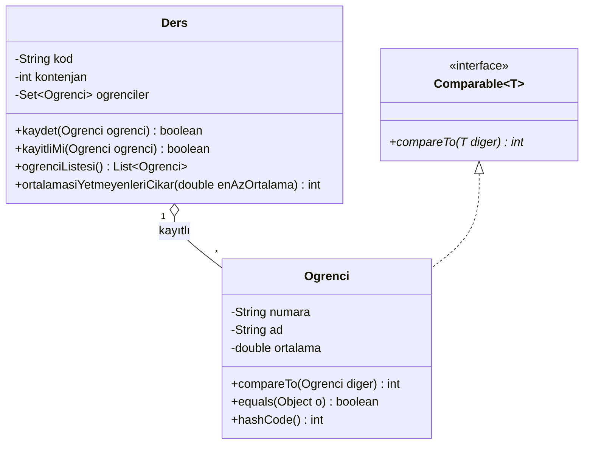
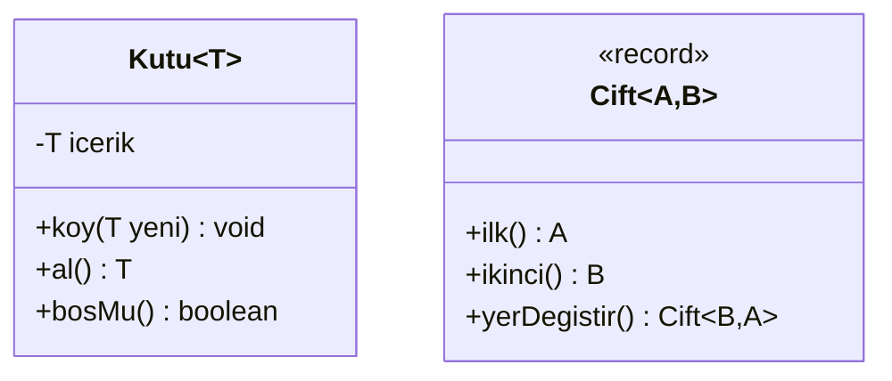

# 📦 M9 - Koleksiyonlar ve Generics

<p align="center"><em>Hafta 10</em></p>

## ❔ Öğrenme hedefleri

Bu modülün sonunda öğrenci:

* Probleme uygun koleksiyon türünü seçmek
* Generic bir sınıf ve metot yazmak
* Comparable ve Comparator ile nesneleri sıralamak
* equals/hashCode'un koleksiyonlardaki önemini açıklamak

---

## 1. Diziler ve koleksiyonlar { #1-diziler }

Bir dersin öğrencilerini dizide tutmak istediğimizi düşünelim:

```java
Ogrenci[] ogrenciler = new Ogrenci[40];
int sayi = 0;
ogrenciler[sayi++] = new Ogrenci("2024001", "Ece", 3.5);
```

Dizi basit ve hızlıdır, ama gerçek bir kayıt sisteminde çabuk yetersiz kalır:

* **Boyut sabittir.** 41. öğrenci geldiğinde daha büyük bir dizi açıp elemanları elle kopyalamak
  gerekir. Doluluk için ayrı bir `sayi` değişkeni tutmak zorundayız.
* **Tekrar denetimi yoktur.** Aynı öğrencinin iki kez kaydolmasını engellemek için her eklemede tüm
  diziyi dolaşmamız gerekir.
* **Anahtarla erişim yoktur.** "Numarası 2024001 olan öğrenci" sorusunun cevabı yine bir döngüdür.
* **Silmek zordur.** Ortadan bir eleman silinince arkadakileri birer sola kaydırmak bizim işimizdir.

Java'nın **koleksiyonlar çatısı** (Collections Framework, `java.util` paketi), bu işleri hazır ve
test edilmiş sınıflarla çözer. M3'ten beri "ayrıntısı M9'da" diyerek kullandığımız `ArrayList` bu
çatının bir parçasıdır. Çatı iki ayrı kökten oluşur: tek tek eleman tutan `Collection` ve
anahtar-değer çiftleri tutan `Map`. Aşağıdaki diyagramda arayüzler (M7) ve en sık kullanılan
gerçeklemeleri görülüyor (bazı ara arayüzler gösterilmedi):



Doğru koleksiyonu seçmek için üç soru sorulur: **sıra önemli mi, tekrar olabilir mi, elemana bir
anahtarla mı erişeceğim?**

| İhtiyaç | Arayüz | Tipik sınıf | Örnek |
|---|---|---|---|
| Sıralı, tekrara izin veren, indisle erişilen dizi | `List` | `ArrayList` | Bir öğrencinin aldığı notlar |
| Tekrarsız, sıra önemsiz | `Set` | `HashSet` | Bir derse kayıtlı öğrenciler |
| Tekrarsız, ekleme sırası korunur | `Set` | `LinkedHashSet` | Kayıt sırasıyla öğrenciler |
| Tekrarsız, hep sıralı | `Set` | `TreeSet` | Numaraya göre sıralı öğrenci listesi |
| Anahtarla hızlı erişim | `Map` | `HashMap` | Numara → öğrenci |
| Anahtarlar sıralı | `Map` | `TreeMap` | Kelime → geçiş sayısı, alfabetik |
| Sıraya giren, baştan çıkan (FIFO) | `Queue`/`Deque` | `ArrayDeque` | Danışman görüşme kuyruğu |

### Arayüz türüyle değişken tanımlamak

```java
List<Ogrenci> liste = new ArrayList<>();
Map<String, Ogrenci> numaraIle = new HashMap<>();
```

Değişkenin türü arayüz (`List`), nesnenin türü somut sınıftır (`ArrayList`). Bu, M6'daki çok
biçimliliğin doğrudan uygulamasıdır: kodun geri kalanı yalnızca `List` sözleşmesine güvenir.
İleride `LinkedList`'e geçmek istersek yalnızca `new` satırını değiştiririz. Metot parametrelerinde
ve dönüş türlerinde de arayüz türünü kullanmak, çağıran kodu belirli bir gerçeklemeye bağlamaz
(*Effective Java*, Madde 64, "Refer to objects by their interfaces"). `<>` işaretine **elmas**
(diamond) denir; tür argümanını derleyici soldan çıkarır ([§6](#6-generics)).

## 2. List ve ArrayList { #2-list }

`List`, elemanları eklendiği sırada tutan ve indisle erişim sağlayan koleksiyondur. Aynı eleman
birden çok kez bulunabilir. `ArrayList` içeride bir dizi tutar ve dolunca kendiliğinden büyütür.

| Metot | Ne yapar? | Not |
|---|---|---|
| `add(e)` / `add(i, e)` | Sona / `i` konumuna ekler | Ortaya eklemek arkadakileri kaydırır |
| `get(i)` / `set(i, e)` | `i`'deki elemanı okur / değiştirir | Geçersiz `i` için `IndexOutOfBoundsException` (M8) |
| `remove(i)` / `remove(o)` | İndisle / eşit olan ilk elemanı siler | `remove(o)` eşitliği `equals` ile arar |
| `contains(o)` / `indexOf(o)` | Var mı? / ilk konumu (yoksa `-1`) | Yine `equals` kullanır |
| `size()` / `isEmpty()` | Eleman sayısı / boş mu? | |

`contains`, `indexOf` ve `remove(o)` metotlarının hepsi `equals` ile karşılaştırır. `equals`'ı
ezmemiş bir sınıfta bu metotlar yalnızca **aynı nesneyi** bulur (M5).

**`LinkedList`** aynı `List` arayüzünü birbirine bağlı düğümlerle gerçekler. Başa ya da sona ekleyip
çıkarmak hızlıdır, ama `get(i)` için listeyi baştan dolaşması gerekir. Pratikte `ArrayList` çoğu
durumda daha hızlıdır; kuyruk gerektiğinde ise `ArrayDeque` tercih edilir.

!!! example "Kendinizi deneyin"

    ```java
    List<Integer> notlar = new ArrayList<>(List.of(10, 20, 30));
    notlar.remove(1);
    System.out.println(notlar);
    ```

    Çıktı `[20, 30]` mu, `[10, 30]` mu?

    ??? success "Cevap"

        `[10, 30]`. `remove(1)` çağrısında `1` bir `int`'tir ve derleyici **indis** alan
        `remove(int)` sürümünü seçer: 1. konumdaki `20` silinir. Değeri `1` olan elemanı silmek
        isteseydik `notlar.remove(Integer.valueOf(1))` yazmamız gerekirdi. Koleksiyonlar yalnızca
        nesne tuttuğu için `int` değerler `Integer`'a kutulanır (autoboxing); `List<int>` yazılamaz.

## 3. Set ve HashSet { #3-set }

### 3.1 Tekrarsız kayıt

Bir derse aynı öğrenci iki kez kaydolmamalı. Bu kuralı her seferinde döngüyle denetlemek yerine
kuralı zaten koruyan bir koleksiyon seçeriz: **küme** (`Set`).



```java
public class Ders {

    private final String kod;
    private final int kontenjan;
    private final Set<Ogrenci> ogrenciler = new LinkedHashSet<>();   // (1)!

    public boolean kaydet(Ogrenci ogrenci) {
        if (ogrenciler.contains(ogrenci)) {                           // (2)!
            return false;
        }
        if (ogrenciler.size() >= kontenjan) {
            throw new IllegalStateException("Kontenjan dolu: " + kod);
        }
        return ogrenciler.add(ogrenci);                               // (3)!
    }
}
```

1. `LinkedHashSet`, kümenin ekleme sırasını da hatırlar. Sınıf listesi kayıt sırasıyla basılabilir.
2. Önce "zaten kayıtlı mı?" diye bakıyoruz ki kontenjan doluyken kayıtlı bir öğrencinin tekrar
   denemesi istisna değil `false` üretsin. `HashSet`'te `contains`, eleman sayısından bağımsız olarak
   ortalamada sabit sürede çalışır; dizide ise tüm elemanlara bakmak gerekirdi.
3. `Set.add`, eleman zaten varsa kümeyi değiştirmez ve `false` döndürür.

Üç `Set` gerçeklemesinin farkı yalnızca **sıradadır**:

| Sınıf | Dolaşma sırası | Eşitliği neyle anlar? |
|---|---|---|
| `HashSet` | Belirsiz (hash değerine bağlı) | `hashCode` + `equals` |
| `LinkedHashSet` | Ekleme sırası | `hashCode` + `equals` |
| `TreeSet` | Sıralı (doğal sıra ya da verilen `Comparator`) | `compareTo` / `compare` sonucu `0` |

`List.of("muz", "elma", "kiraz", "elma")` listesinden oluşturulan `LinkedHashSet` `[muz, elma,
kiraz]`, `TreeSet` ise `[elma, kiraz, muz]` sırasını verir (`KoleksiyonDavranisiTest`).

### 3.2 equals ve hashCode'u ezmemenin bedeli { #3-2-equals-hashcode }

`HashSet` bir elemanı ararken önce `hashCode()` ile hangi "kovaya" (bucket) bakacağını bulur, sonra
o kovadaki elemanları `equals()` ile karşılaştırır. M5'te gördüğümüz kural burada somut bir anlam
kazanır: **eşit nesnelerin hash kodları da eşit olmalıdır.**

`EqualsizOgrenci` sınıfı bilerek `equals` ve `hashCode`'u ezmez; `Object`'ten gelen sürümler nesne
kimliğine bakar:

```java
@Test
@DisplayName("equals/hashCode ezilmezse HashSet aynı öğrenciyi iki kez tutar")
void equalsizOgrenciIkiKezEklenir() {
    Set<EqualsizOgrenci> kume = new HashSet<>();

    kume.add(new EqualsizOgrenci("2024001", "Ece"));
    kume.add(new EqualsizOgrenci("2024001", "Ece"));

    assertEquals(2, kume.size());                                               // (1)!
    assertFalse(kume.contains(new EqualsizOgrenci("2024001", "Ece")));          // (2)!
}
```

1. Aynı öğrenci **iki kez** kaydedildi. Tekrarı engellemek için seçtiğimiz koleksiyon işini yapamadı.
2. Üstelik "Ece kayıtlı mı?" sorusu `false` döner. Aynı sorun `HashMap`'te anahtar olarak
   kullanıldığında da çıkar: `put` ile konan değer, eşit ama yeni bir anahtar nesnesiyle `get`
   yapılınca `null` gelir (`OgrenciTest.equalsizAnahtarBulunamaz`).

`Ogrenci` ise numaraya göre `equals` ve `hashCode`'u birlikte ezer, aynı testlerde kümede tek eleman
kalır. Yalnızca `equals`'ı ezip `hashCode`'u unutmak da aynı derecede tehlikelidir: eşit iki nesne
büyük olasılıkla farklı kovalara düşer ve `HashSet` onları hiç karşılaştırmaz (*Effective Java*,
Madde 11, "Always override hashCode when you override equals"). `record` türleri (M3) bu iki metodu
bileşenlerine göre kendiliğinden üretir.

!!! warning "Kümedeki nesneyi değiştirmeyin"

    Bir nesne `HashSet`'e eklendikten sonra `hashCode`'unu etkileyen bir alanı değişirse, nesne
    yanlış kovada kalır ve bir daha bulunamaz. Bu yüzden `Ogrenci`'nin `numara` alanı `final`'dır.
    Küme elemanları ve map anahtarları için değişmez (immutable) nesneler tercih edin.

## 4. Map ve HashMap { #4-map }

`Map`, her **anahtarı** (key) bir **değere** (value) eşler. Anahtarlar tekrarsızdır (anahtarlar
kümesi bir `Set` gibi davranır), değerler tekrar edebilir. Bir metindeki kelimeleri sayan
`KelimeSayaci` bunun tipik bir örneğidir:

```java
public class KelimeSayaci {

    private static final Locale TURKCE = Locale.forLanguageTag("tr-TR");

    private final Map<String, Integer> sayimlar = new TreeMap<>();   // (1)!

    public void ekle(String metin) {
        for (String parca : metin.split("[^\\p{L}]+")) {              // (2)!
            if (parca.isEmpty()) {
                continue;
            }
            String kelime = parca.toLowerCase(TURKCE);                // (3)!
            int eski = sayimlar.getOrDefault(kelime, 0);              // (4)!
            sayimlar.put(kelime, eski + 1);
        }
    }
}
```

1. `TreeMap`, anahtarları sıralı tutar; sonuçlar alfabetik listelenir. Sıra önemli değilse `HashMap`
   biraz daha hızlıdır. Değişken türü yine arayüz: `Map`.
2. Harf olmayan her karakter dizisinden böler: boşluk, virgül, nokta, noktalı virgül.
3. Türkçe yerel ayarla küçültme: `"IŞIK"` → `"ışık"`. Yerel ayar verilmezse sonuç çalıştığı
   bilgisayarın ayarına bağlı olur.
4. Anahtar yoksa `get` `null` döndürür; `getOrDefault` ise verilen varsayılanı (`0`). Aynı anahtarla
   `put` eski değerin üzerine yazar ve eski değeri döndürür.

```java
KelimeSayaci sayac = new KelimeSayaci();
sayac.ekle("Bir elma, bir armut; iki elma.");
System.out.println(sayac.sayimlar());   // {armut=1, bir=2, elma=2, iki=1}
```

Bir `Map` üç biçimde dolaşılabilir: `keySet()` (anahtarlar), `values()` (değerler) ve `entrySet()`
(anahtar-değer çiftleri, `Map.Entry`). En sık kelimeyi bulmak için ikisine birden ihtiyacımız var:

```java
for (Map.Entry<String, Integer> giris : sayimlar.entrySet()) {
    if (giris.getValue() > enBuyukSayi) {
        enSik = giris.getKey();
        enBuyukSayi = giris.getValue();
    }
}
```

| Sınıf | Anahtar sırası | Not |
|---|---|---|
| `HashMap` | Belirsiz | En yaygın seçim; anahtarın `equals`/`hashCode`'u doğru olmalı |
| `LinkedHashMap` | Ekleme sırası | Sıra korunmalı ama sıralama gerekmiyorsa |
| `TreeMap` | Sıralı | Anahtar `Comparable` olmalı ya da `Comparator` verilmeli |

!!! note "TreeMap ve Türkçe harfler"

    `String.compareTo` karakterlerin Unicode kodlarını karşılaştırır. Bu yüzden `"çay"`, `"zeytin"`'den
    **sonra** gelir. Türkçe alfabe sırası gerekiyorsa `java.text.Collator` kullanılır; bu modülün
    kapsamı dışında.

`sayac.merge(kelime, 1, Integer::sum)` aynı sayma işini tek satırda yapar; `Integer::sum` yazımını
M10'da göreceğiz.

## 5. Dolaşma, silme ve değişmez koleksiyonlar { #5-dolasma }

### 5.1 Dolaşırken silme tuzağı

Tüm koleksiyonlar `for-each` ile dolaşılabilir. Ama dolaşırken koleksiyonu **doğrudan**
değiştirirseniz:

```java
List<String> liste = new ArrayList<>(List.of("a", "b", "c"));
for (String s : liste) {
    if (s.equals("a")) {
        liste.remove(s);          // ConcurrentModificationException
    }
}
```

`for-each` arka planda bir **yineleyici** (iterator) kullanır. Yineleyici, koleksiyonun kendisinden
habersiz değiştirildiğini fark eder ve `ConcurrentModificationException` fırlatır (fail-fast).
API belgesi bu davranışın **garanti edilmediğini**, yalnızca hataları erken yakalamaya yönelik
olduğunu söyler: bazı durumlarda (ör. sondan bir önceki eleman silinince) istisna oluşmaz ama döngü
son elemanı sessizce atlar. Her iki durumda da kod yanlıştır.

Doğru yol, silmeyi **yineleyicinin kendisine** yaptırmaktır:

```java
public int ortalamasiYetmeyenleriCikar(double enAzOrtalama) {
    int silinen = 0;
    Iterator<Ogrenci> it = ogrenciler.iterator();
    while (it.hasNext()) {                                  // (1)!
        Ogrenci ogrenci = it.next();
        if (ogrenci.getOrtalama() < enAzOrtalama) {
            it.remove();                                    // (2)!
            silinen++;
        }
    }
    return silinen;
}
```

1. `hasNext()` sırada eleman olup olmadığını söyler, `next()` o elemanı verir ve bir ilerler.
2. `it.remove()`, `next()` ile en son verilen elemanı siler ve yineleyiciyi tutarlı durumda bırakır.

Java 8'den beri aynı iş `ogrenciler.removeIf(o -> o.getOrtalama() < enAzOrtalama)` ile tek satırda
yapılabilir. Parantez içindeki lambda ifadesini M10'da ayrıntılı işleyeceğiz.

### 5.2 Değişmez koleksiyonlar

`List.of`, `Set.of` ve `Map.of` (Java 9+) **değiştirilemez** (unmodifiable) koleksiyonlar üretir.
`add`, `remove` ya da `put` çağrısı `UnsupportedOperationException` fırlatır; `null` eleman da
kabul etmezler.

```java
List<String> gunler = List.of("pzt", "sal");
Map<String, Integer> krediler = Map.of("NYP101", 6, "MAT101", 5);
gunler.add("car");                // UnsupportedOperationException
```

Bu özellik kapsülleme (M3) için değerlidir. `Ders.ogrenciListesi()` iç kümeyi değil
`List.copyOf(ogrenciler)` ile bir **kopyasını** döndürür; dışarıdaki kod listeyi değiştiremez,
değiştirmeye çalışırsa hemen istisna alır. `KelimeSayaci.sayimlar()` ise
`Collections.unmodifiableMap(sayimlar)` döndürür: bu bir kopya değil, iç haritanın **salt okunur
görünümüdür** (view). Sayaç yeni kelime ekledikçe görünüm de güncellenir.

| Yöntem | Kopya mı? | İç koleksiyon değişince |
|---|---|---|
| `List.copyOf(x)` / `Set.copyOf(x)` | Evet | Kopya değişmez |
| `Collections.unmodifiableList(x)` | Hayır, görünüm | Görünüm de değişir |

## 6. Generics { #6-generics }

### 6.1 Neden?

Generics (Java 5, 2004) öncesinde koleksiyonlar her şeyi `Object` olarak tutardı:

```java
ArrayList liste = new ArrayList();      // ham tür (raw type)
liste.add(new Ogrenci("2024001", "Ece", 3.5));
liste.add("yanlışlıkla bir metin");     // derleyici itiraz etmez
Ogrenci o = (Ogrenci) liste.get(1);     // çalışma zamanında ClassCastException
```

Hata yanlış elemanın **eklendiği** yerde değil, çok sonra **okunduğu** yerde ortaya çıkar. `List<Ogrenci>`
yazdığımızda ise derleyici listeye yalnızca `Ogrenci` eklenmesine izin verir ve `get` doğrudan
`Ogrenci` döndürür: **tip güvenliği** (type safety) derleme zamanına taşınır, cast gerekmez.
Yeni kodda ham tür kullanmayın (*Effective Java*, Madde 26, "Don't use raw types").

### 6.2 Generic sınıf: Kutu ve Cift

Kendi generic sınıflarımızı da yazabiliriz. Sınıf adının yanındaki `<T>` bir **tür parametresidir**
(type parameter): sınıfı kullanan kod `T` yerine gerçek bir tür verir.



```java
public class Kutu<T> {

    private T icerik;

    public Kutu(T icerik) {
        this.icerik = icerik;
    }

    public T al() {                                   // (1)!
        if (icerik == null) {
            throw new IllegalStateException("Kutu boş");
        }
        return icerik;
    }
    // boş kurucu, koy(T), bosMu()
}
```

1. Dönüş türü `T`'dir. `Kutu<String>` için `al()` `String`, `Kutu<Ogrenci>` için `Ogrenci` döndürür.

```java
Kutu<String> kalemKutusu = new Kutu<>("kalem");
String icerik = kalemKutusu.al();                     // cast yok
kalemKutusu.koy(42);                                  // derleme hatası: int, String değil
```

Birden çok tür parametresi de olabilir. `Cift<A, B>`, iki farklı türden değeri bir arada tutan
generic bir `record`'dur:

```java
public record Cift<A, B>(A ilk, B ikinci) {

    public Cift<B, A> yerDegistir() {
        return new Cift<>(ikinci, ilk);
    }
}
```

`new Cift<>("NYP101", 3)` bir `Cift<String, Integer>` oluşturur; `yerDegistir()` bir
`Cift<Integer, String>` döndürür. Tür parametreleri yalnızca referans türleri alabilir; `int` yerine
`Integer` kullanılır ve dönüşüm kendiliğinden yapılır.

### 6.3 Generic metot ve sınırlı tür parametresi

Tür parametresi yalnızca sınıfa değil, tek bir metoda da ait olabilir. `<T>` dönüş türünden önce
yazılır:

```java
public static <T> Cift<T, T> ilkVeSon(List<T> liste) {
    if (liste.isEmpty()) {
        throw new NoSuchElementException("Boş listenin ilk ve son elemanı yok");
    }
    return new Cift<>(liste.get(0), liste.get(liste.size() - 1));
}
```

Bir listenin en büyük elemanını bulan bir metot yazmak istersek, `T` hakkında daha fazlasını
bilmemiz gerekir: elemanları karşılaştırabilmeliyiz. **Sınırlı tür parametresi** (bounded type
parameter) bunu söyler:

```java
public static <T extends Comparable<T>> T enBuyuk(List<T> liste) {   // (1)!
    if (liste.isEmpty()) {
        throw new NoSuchElementException("Boş listenin en büyük elemanı yok");
    }
    T enBuyuk = liste.get(0);
    for (T eleman : liste) {
        if (eleman.compareTo(enBuyuk) > 0) {                          // (2)!
            enBuyuk = eleman;
        }
    }
    return enBuyuk;
}
```

1. "`T`, kendi türüyle karşılaştırılabilir herhangi bir tür olabilir." Burada `extends` hem sınıf
   kalıtımı hem arayüz gerçekleme anlamında kullanılır.
2. Sınır sayesinde derleyici `T`'nin `compareTo` metodu olduğunu bilir. Sınır olmasaydı bu satır
   derlenmezdi.

Aynı metot `List<Integer>`, `List<String>` ve `List<Ogrenci>` ile çalışır, çünkü üçü de
`Comparable`'dır. `Comparable` olmayan bir türün listesiyle çağırmak **derleme hatasıdır**.

### 6.4 Joker: `? extends`

`Integer`, `Number`'ın alt sınıfıdır, ama `List<Integer>` bir `List<Number>` **değildir**. Öyle
olsaydı, `List<Number>` türündeki bir değişken üzerinden bir `Integer` listesine `Double` eklenebilirdi.
Her türden sayı listesini kabul eden bir metot için **joker** (wildcard) kullanılır:

```java
public static double toplam(List<? extends Number> sayilar) {
    double toplam = 0;
    for (Number sayi : sayilar) {
        toplam += sayi.doubleValue();
    }
    return toplam;
}
```

`List<? extends Number>`, "elemanları `Number` ya da onun bir alt türü olan bir liste" demektir.
Bu listeden `Number` olarak **okuyabiliriz**, ama ona eleman **ekleyemeyiz** (hangi alt tür olduğunu
bilmiyoruz). Jokerlerin ayrıntısı (`? super`, "PECS" kuralı) için *Effective Java* Madde 31'e
("Use bounded wildcards to increase API flexibility") bakabilirsiniz.

## 7. Comparable ve Comparator { #7-siralama }

### 7.1 Doğal sıralama: Comparable

`Collections.sort(liste)` bir listeyi nasıl sıralayacağını nereden bilir? Elemanların **doğal
sıralaması** (natural ordering) olmalıdır: sınıf `Comparable<T>` arayüzünü gerçekler.

```java
public class Ogrenci implements Comparable<Ogrenci> {

    @Override
    public int compareTo(Ogrenci diger) {       // (1)!
        return numara.compareTo(diger.numara);
    }
}
```

1. Sözleşme: `this` küçükse **negatif**, eşitse **0**, büyükse **pozitif** bir sayı döndür. Sayının
   büyüklüğü önemli değildir, yalnızca işareti. Burada işi `String.compareTo`'ya devrediyoruz.

```java
List<Ogrenci> liste = new ArrayList<>();
liste.add(new Ogrenci("2024003", "Can", 2.8));
liste.add(new Ogrenci("2024001", "Ece", 3.5));
liste.add(new Ogrenci("2024002", "Ali", 3.5));
Collections.sort(liste);   // [Ece (2024001), Ali (2024002), Can (2024003)]
```

`TreeSet<Ogrenci>` ve `TreeMap<Ogrenci, ...>` da bu sıralamayı kullanır. `TreeSet`'te iki eleman
`compareTo` sonucu `0` ise **aynı** kabul edilir. Bu yüzden `compareTo`, `equals` ile tutarlı
olmalıdır: `Ogrenci`'de ikisi de numaraya bakar (*Effective Java*, Madde 14, "Consider implementing
Comparable").

### 7.2 Alternatif sıralamalar: Comparator

Bir sınıfın tek bir doğal sıralaması olur, ama öğrencileri bazen ada, bazen ortalamaya göre sıralamak
isteriz. `Comparator<T>` arayüzü sıralama ölçütünü sınıfın **dışına** taşır. İlk yol ayrı bir
sınıf yazmaktır:

```java
public class AdaGoreKarsilastirici implements Comparator<Ogrenci> {

    @Override
    public int compare(Ogrenci a, Ogrenci b) {
        return a.getAd().compareTo(b.getAd());
    }
}
```

Yalnızca bir yerde kullanılacak bir karşılaştırıcı için ayrı dosya açmak yerine **anonim sınıf**
(anonymous class) yazılabilir: adı olmayan, tanımlandığı yerde tek bir nesnesi oluşturulan sınıf.
`Ogrenci` sınıfında bir sabit olarak:

```java
public static final Comparator<Ogrenci> ORTALAMAYA_GORE_AZALAN = new Comparator<>() {
    @Override
    public int compare(Ogrenci a, Ogrenci b) {
        return Double.compare(b.ortalama, a.ortalama);   // (1)!
    }
};
```

1. `b` ile `a`'nın yeri değiştirildiği için sıralama **azalan** olur. `double` değerleri çıkarma ile
   değil `Double.compare` ile karşılaştırın; `(int) (a - b)` gibi bir ifade `0.5` farkını `0`'a
   yuvarlar.

Karşılaştırıcılar birleştirilebilir. `thenComparing`, ilk ölçüt eşitlik verdiğinde ikinciye
başvurur; `reversed()` sırayı tersine çevirir:

```java
liste.sort(Ogrenci.ORTALAMAYA_GORE_AZALAN.thenComparing(new AdaGoreKarsilastirici()));
// [Ali (2024002), Ece (2024001), Can (2024003)]  -> 3.5 eşit, ada göre: Ali, Ece
liste.sort(new AdaGoreKarsilastirici().reversed());
// [Ece (2024001), Can (2024003), Ali (2024002)]
```

`List.sort(karsilastirici)` ve `Collections.sort(liste, karsilastirici)` aynı işi yapar.

!!! tip "Aynı şey lambda ile (M10'da ayrıntılı)"

    Java 8'den beri tek soyut metodu olan arayüzler lambda ifadeleriyle çok daha kısa yazılır.
    Yukarıdaki birleşik sıralama şu satırla eşdeğerdir:

    ```java
    liste.sort(Comparator.comparingDouble(Ogrenci::getOrtalama)
            .reversed()
            .thenComparing(Ogrenci::getAd));
    ```

    `SiralamaTest.lambdaIleAyniSonuc` bu iki yazımın aynı sonucu verdiğini doğrular. Sözdizimini
    M10'da işleyeceğiz; şimdilik anonim sınıfın kısa yazımı olarak okuyun.

!!! example "Kendinizi deneyin"

    `TreeSet<Ogrenci> kume = new TreeSet<>(new AdaGoreKarsilastirici());` kümesine `Ece (2024001)`
    ve `Ece (2024005)` eklenirse küme kaç eleman tutar?

    ??? success "Cevap"

        **Bir.** `TreeSet` eşitliği `equals` ile değil, karşılaştırıcının `0` döndürmesiyle anlar.
        İki öğrencinin adı aynı olduğu için ikinci `add` `false` döner. Numaraları farklı iki kişiden
        biri kaybolmuştur. Karşılaştırıcıyı `.thenComparing(...)` ile numaraya göre de ayırt eder hâle
        getirmek bu sorunu çözer.

```bash
mvn -pl m9_koleksiyonlar_generics/exercise_files test
```

```text
[INFO] Tests run: 42, Failures: 0, Errors: 0, Skipped: 0
[INFO] BUILD SUCCESS
```

## 8. Alıştırmalar

1. **Çalıştır ve incele.** `mvn -pl m9_koleksiyonlar_generics/exercise_files test` ile testleri
   çalıştırın. `KayitUygulamasi`'nı çalıştırıp iki küme boyutunun neden farklı olduğunu
   [§3.2](#3-2-equals-hashcode)'ye dayanarak bir cümleyle açıklayın.
2. **hashCode'u unutun.** `Ogrenci.hashCode` metodunu geçici olarak yorum satırına alın. Hangi
   testler başarısız oluyor? Hangileri hâlâ geçiyor ve neden? Sonra metodu geri getirin.
3. **Envanter.** Bir kırtasiye için `Envanter` sınıfı yazın: `Map<String, Integer>` ile ürün adı →
   stok adedi tutsun. `ekle(urun, adet)`, `cikar(urun, adet)` (stok yetmezse M8'deki gibi bir
   istisna), `stokta(urun)` ve biten ürünleri `Iterator.remove` ile temizleyen `bitenleriSil()`
   metotları olsun. En az beş test yazın.
4. **Generic yığın.** `Yigin<T>` sınıfını içeride bir `ArrayList<T>` kullanarak yazın: `ekle(T)`,
   `cikar()` (boşsa `NoSuchElementException`), `ust()`, `bosMu()`. `Yigin<String>` ve
   `Yigin<Ogrenci>` ile test edin.
5. **enKucuk.** `GenericAraclar`'a `enBuyuk`'un eşi olan `enKucuk` metodunu ve bir
   `Comparator<T>` alan `enBuyuk(List<T> liste, Comparator<T> karsilastirici)` sürümünü ekleyin.
   İkincisiyle en yüksek ortalamalı öğrenciyi bulun.
6. **Sıralama.** Öğrencileri önce ada göre, ad aynıysa numaraya göre sıralayan bir karşılaştırıcıyı
   **anonim sınıf** olarak yazın ve `TreeSet` ile [§7.2](#7-siralama)'deki "Kendinizi deneyin"
   sorununun çözüldüğünü bir testle gösterin.

---

## Özet

Koleksiyonlar çatısı, dizilerin sabit boyut, tekrar denetimi ve anahtarla erişim eksiklerini hazır
sınıflarla giderir. `List` sıralı ve tekrara açık, `Set` tekrarsız, `Map` anahtar-değer eşlemelidir;
seçim sıra, tekrar ve anahtarla erişim sorularıyla yapılır. Değişkenleri arayüz türüyle tanımlamak
kodu belirli bir gerçeklemeye bağlamaz. `HashSet` ve `HashMap` `hashCode` ile kovayı, `equals` ile
elemanı bulur; ikisini birlikte ezmeyen bir sınıf bu koleksiyonlarda tekrarları engelleyemez ve
elemanlarını bulamaz. Dolaşırken silmek için `Iterator.remove` kullanılır; `List.of`, `Map.of` ve
`List.copyOf` değiştirilemez koleksiyonlar üretir. Generics, tür denetimini derleme zamanına taşır
ve cast'i ortadan kaldırır; `Kutu<T>` gibi generic sınıflar, `<T extends Comparable<T>>` gibi sınırlı
tür parametreleri ve `? extends` jokeri yazabiliriz. Nesnelerin doğal sıralaması `Comparable` ile,
alternatif sıralamalar `Comparator` ile tanımlanır ve `thenComparing`, `reversed` ile birleştirilir.
Bir sonraki modülde anonim sınıfların kısa yazımı olan lambda ifadelerini ve koleksiyonları bildirimsel
(declarative) biçimde işleyen Stream API'yi öğreniyoruz.

## İleri okuma

* [The Java Tutorials: Collections](https://docs.oracle.com/javase/tutorial/collections/), Oracle.
  Arayüzler, gerçeklemeler ve algoritmalar üzerine resmî ders dizisi.
* [The Java Tutorials: Generics](https://docs.oracle.com/javase/tutorial/java/generics/), Oracle.
  Sınırlı tür parametreleri, jokerler ve tür silme (type erasure).
* Joshua Bloch, *Effective Java*, 3. baskı, 2018, 5. bölüm ("Generics", Madde 26–33). Ham türler,
  generic metotlar ve jokerler üzerine ayrıntılı öneriler.

## Kaynaklar

* [Java SE 21 API: `java.util.Collection`](https://docs.oracle.com/en/java/javase/21/docs/api/java.base/java/util/Collection.html)
  ve [`java.util.Map`](https://docs.oracle.com/en/java/javase/21/docs/api/java.base/java/util/Map.html).
  §1'deki hiyerarşi ve §4'teki `getOrDefault`, `entrySet`.
* [Java SE 21 API: `java.util.List`](https://docs.oracle.com/en/java/javase/21/docs/api/java.base/java/util/List.html).
  §2'deki metotlar ve §5.2'deki değiştirilemez listeler (`List.of`, `List.copyOf`).
* [Java SE 21 API: `java.util.ConcurrentModificationException`](https://docs.oracle.com/en/java/javase/21/docs/api/java.base/java/util/ConcurrentModificationException.html).
  §5.1'deki fail-fast davranışının garanti edilmediği notu.
* [Java SE 21 API: `java.lang.Object`](https://docs.oracle.com/en/java/javase/21/docs/api/java.base/java/lang/Object.html).
  §3.2'deki `equals`/`hashCode` sözleşmesi.
* [Java SE 21 API: `java.lang.Comparable`](https://docs.oracle.com/en/java/javase/21/docs/api/java.base/java/lang/Comparable.html)
  ve [`java.util.Comparator`](https://docs.oracle.com/en/java/javase/21/docs/api/java.base/java/util/Comparator.html).
  §7'deki sözleşmeler, `thenComparing`, `reversed`.
* Joshua Bloch, *Effective Java*, 3. baskı, Addison-Wesley, 2018. Madde 11 (`hashCode`), Madde 14
  (`Comparable`), Madde 26 (ham türler), Madde 31 (jokerler), Madde 64 (arayüz türüyle referans).
* Cay S. Horstmann, *Core Java, Volume I: Fundamentals*, 12. baskı, Pearson, 2022, 8. bölüm
  ("Generic Programming") ve 9. bölüm ("Collections"). Konunun ders kitabı anlatımı.
