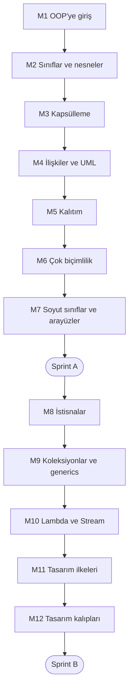

# Özet

Dersin konu akışı, tek bir sınıftan iyi tasarlanmış nesne sistemlerine doğru ilerler:

```mermaid
flowchart TD
    A["M1 OOP'ye giriş"] --> B["M2 Sınıflar ve nesneler"]
    B --> C["M3 Kapsülleme"]
    C --> D["M4 İlişkiler ve UML"]
    D --> E["M5 Kalıtım"]
    E --> F["M6 Çok biçimlilik"]
    F --> G["M7 Soyut sınıflar ve arayüzler"]
    G --> SA(["Sprint A"])
    SA --> H["M8 İstisnalar"]
    H --> I["M9 Koleksiyonlar ve generics"]
    I --> J["M10 Lambda ve Stream"]
    J --> K["M11 Tasarım ilkeleri"]
    K --> L["M12 Tasarım kalıpları"]
    L --> SB(["Sprint B"])
```

!!! info "Durum"

    Modüller tamamlandıkça her modülün kısa özeti buraya eklenecek.
